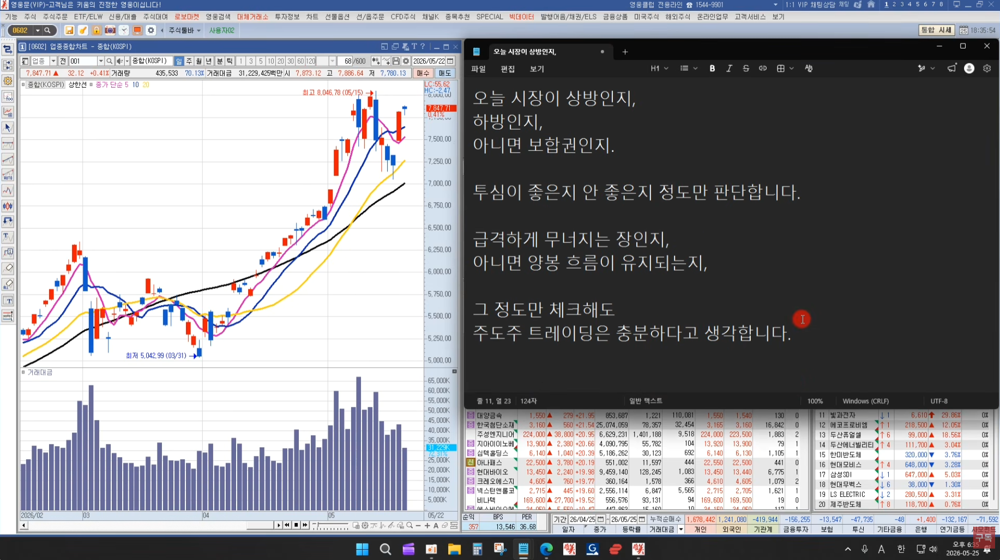
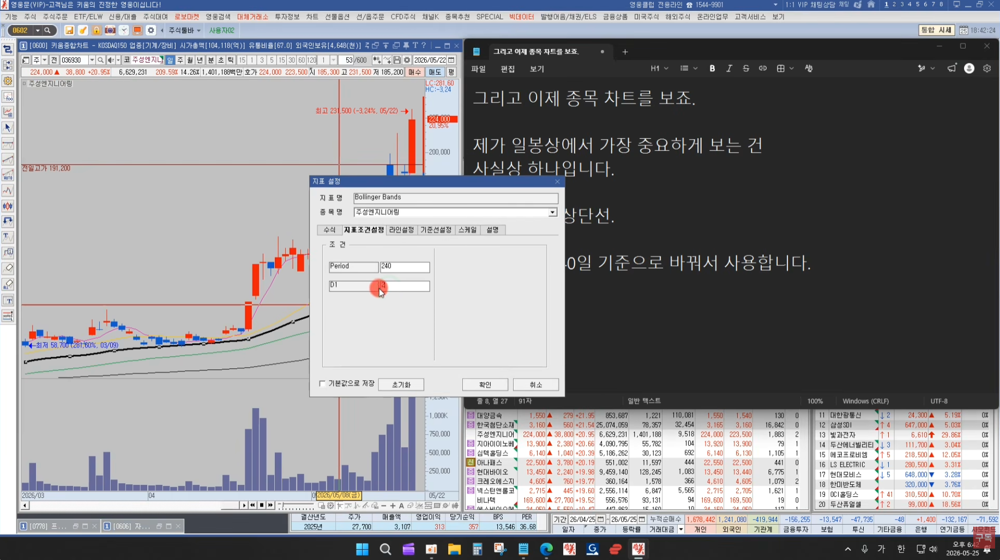
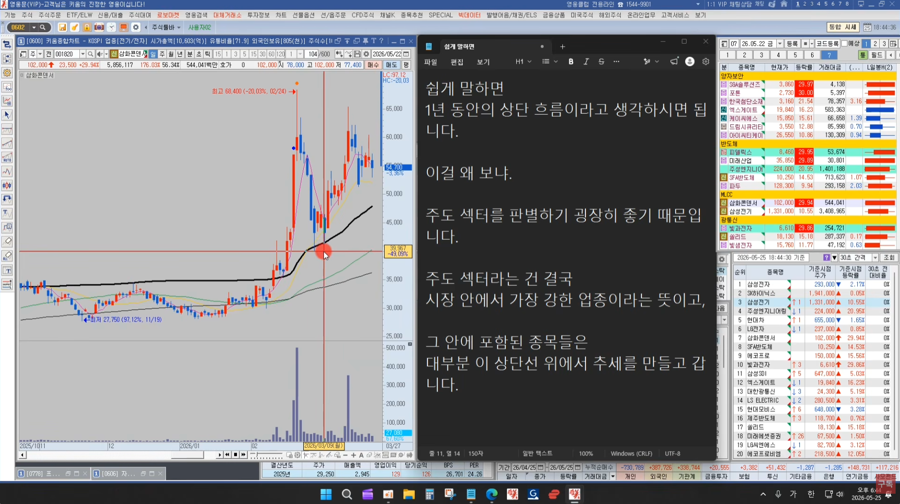
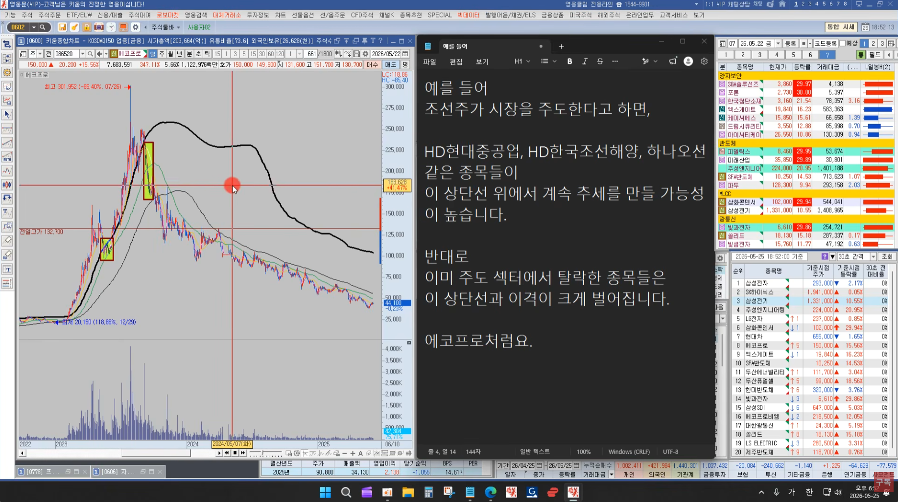
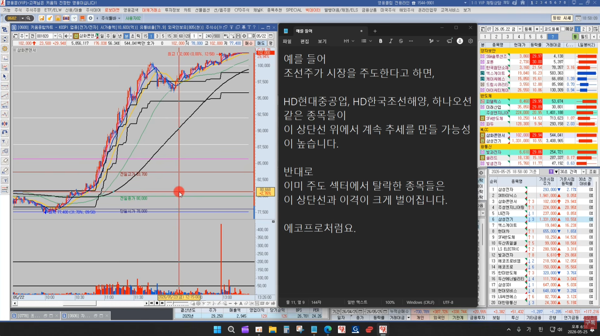
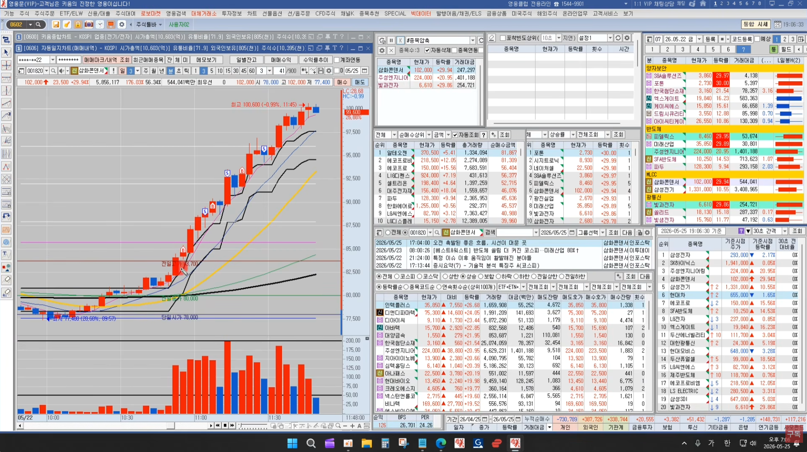
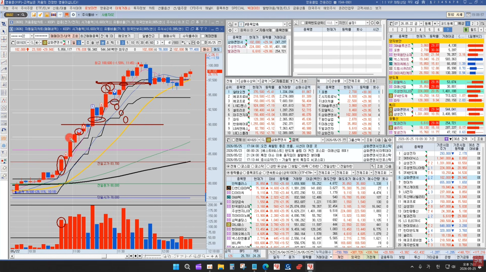
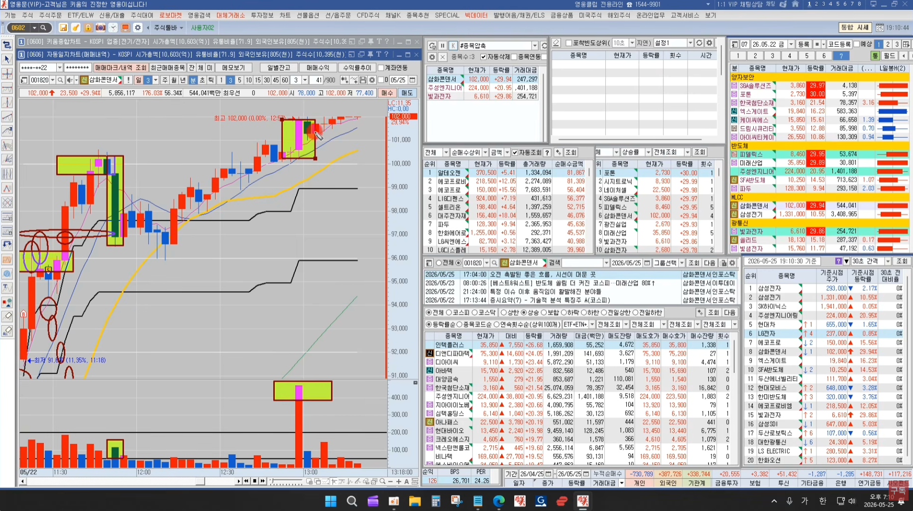

🏠 > [kostock](../../../../) > [experts](../../../) > [천리안주식](../../) > [리뉴얼](../) > `2026년 자료`

<table>
  <tr>
    <td><a href="../../">[천리안주식]</a></td>
    <td><a href="../../S0_INTRO_NEW">S0_INTRO</a></td>
    <td><a href="../../S1_시장보는기준">S1_시장보는기준</a></td>
    <td><a href="../../S2_단타의기본기">S2_단타의기본기</a></td>
    <td><a href="../../S3_쉬운매매구조">S3_쉬운매매구조</a></td>
    <td><a href="../../S4_주도종목실전">S4_주도종목실전</a></td>
    <td><a href="../../S5_유료강의압축">S5_유료강의압축</a></td>
  </tr>
</table>

### INDEX
- [시장지수를 먼저 체크](#시장지수를-먼저-체크)
- [시장주도주 종목차트 분석](#시장주도주-종목차트-분석)
- [차트예시](#차트예시)

---
# 2026년 자료 - 200억 트레이더에게 배운 주도주 매매

### 시장지수를 먼저 체크

- 지수차트를 짧게 보진 않는다
  - 즉, 코스피 분봉 하나하나에 흔들리지 않는다
  - 삼전닉스같은 지수대형주를 매매하는 방식이 아니라,
  - 그날 시장에서 실제로 거래대금이 몰리는 줃주 위주로 대응하기 때문이다
  - 지수는 큰 방향 정도만 참고한다
    - 오늘 시장이 상방인지, 하방인지, 아니면 보합권인지
    - 투심이 좋은지 안좋은지 정도만 판단한다
    - 급격하게 무너지는 장인지, 아니면 양봉 흐름이 유지되는지,
    - 그 정도만 체크해도 주도주 트레이닝은 충분하다

 

[[TOP]](#index)

---
### 시장주도주 종목차트 분석

- 일봉상에서 제일 중요하게 보는 건 사실상 하나이다
- 볼린저밴드 상단선 : 240일 기준으로 사용
  - 쉽게 말하면, 1년 동안의 상단흐름이라고 생각하면 된다
  - 이걸 보는 이유는 주도 섹터를 판별하기 굉장히 좋기 때문이다
  - 주도 섹터라는 건 결국 시장안에서 가장 강한 업종이라는 뜻이고, 
  - 그 안에 포함된 종목들은 대부분 이 상단선 위에서 추세를 만들고 간다
- 예를들어
  - 조선주가 시장을 주도한다고 하면
  - HD현대중공업, HD한국조선해양, 하나오션 같은 종목들이 이 상단선 위에서 계속 추세를 만들 가능성이 높다
  - 반대로 이미 주도 섹터에서 탈락한 종목들은 이 상단선과 이격이 크게 벌어진다
  - 에크프로처럼

<table>
  <tr><td></td></tr>
  <tr><td></td></tr>
  <tr><td></td></tr>
</table>

 

[[TOP]](#index)

---
### 차트예시

- 삼화콘덴서
  - 전일 고점을 돌파후 거래대금이 터진 캔들을 기준봉으로 본다
  - 기준봉 이후 종가상 5일선을 이탈하지 않고 올라가는 특징이 있다
  - (1차) 기준봉을 이탈하지 않고 상승추세에서 매수, 9만원 라운드피겨를 저항대로 보고 직전에 매도
  - (2차) 9만원돌파흐름이 나와서 다시 매수, 강한 급등이 나와서 매도
  - (3차) 다시 눌림후 마삼 터치후 상승 흐름에 매수, 전캔들의 저점을 이탈해서 매도
  - 3차매매에서 긴꼬리가 연속 두번이나 나와서 매매를 멈췄는데, 강한 상승으로 10만돌파까지 나옴
  - 결국 10만에서 크게 밀린후 마삼구간까지 밀렸다가 상한까지 들어감
- 볼벤 상한선을 위에서 노는 종목, 다른 섹터도 함께 본다
  - 여러 섹터가 같이 가는 종목이 주도섹터이다, 그중에서 대장주를 선택
    - 강한 종목은 3분봉 5이평 위를 타고 간다
    - 거래대금도 **1분봉 50억 이상, 3분봉 100억 이상**
    - 강한 주식은 **5이평을 이탈해도 금방 다시 강하게 돌파** 한다
  - 5이평을 다시 돌파한 캔들은 상승전환 기준봉으로 본다
    - 가는 주식은 기준봉의 저가를 훼손하지 않는다
    - 상승구간은 스캘핑의 영역, 즉 돌파봉의 저가를 깰때 칼같이 손절할 수 있는 사람만 매매
    - 전캔들의 저가를 이탈할때까지 계속 끌고간다

<table>
  <tr><td></td></tr>
  <tr><td></td></tr>
  <tr><td></td></tr>
  <tr><td></td></tr>
</table>

 

[[TOP]](#index)

---