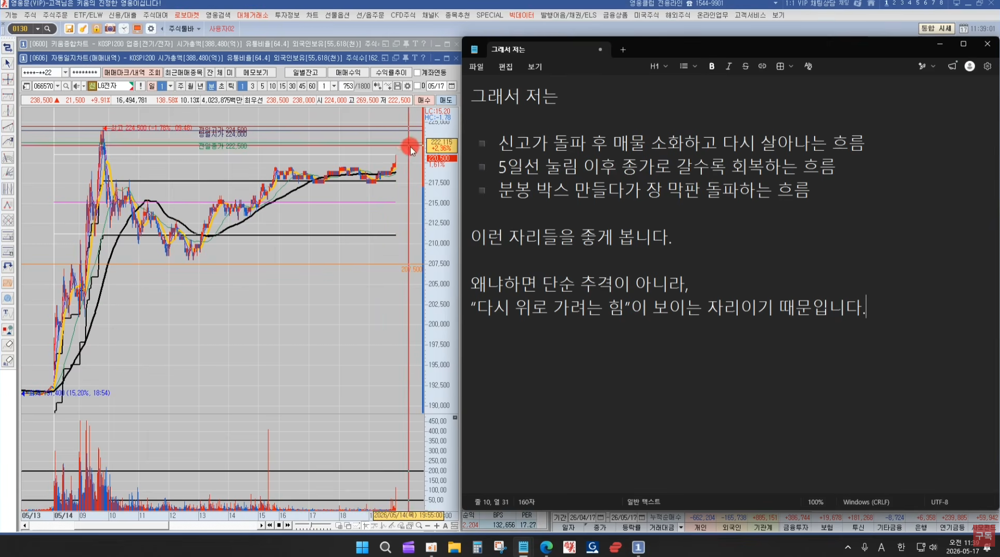
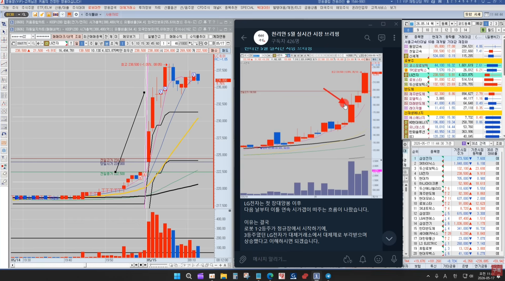

🏠 > [kostock](../../../../) > [experts](../../../) > [천리안주식](../../) > [리뉴얼](../) > `2026년 자료`

<table>
  <tr>
    <td><a href="../../">[천리안주식]</a></td>
    <td><a href="../../S0_INTRO_NEW">S0_INTRO</a></td>
    <td><a href="../../S1_시장보는기준">S1_시장보는기준</a></td>
    <td><a href="../../S2_단타의기본기">S2_단타의기본기</a></td>
    <td><a href="../../S3_쉬운매매구조">S3_쉬운매매구조</a></td>
    <td><a href="../../S4_주도종목실전">S4_주도종목실전</a></td>
    <td><a href="../../S5_유료강의압축">S5_유료강의압축</a></td>
  </tr>
</table>

### INDEX
- [종가베팅 성공 확률 높이는 기준](#종가베팅-성공-확률-높이는-기준)
- [종가배팅의 의미](#종가배팅의-의미)
- [종가배팅의 핵심](#종가배팅의-핵심)
- [종가배팅의 예시](#종가배탱의-예시)
- [상따의 개념](#상따의-개념)
- [대체거래소 매매전략](#대체거래소-매매전략)

---
# 종가베팅 성공 확률 높이는 기준

### 종가배팅의 의미
- 종가배팅을 너무 단순하게 생각하지 마라
  - "오늘 많이 올랐네?"
  - "장 막판 강하네?"
  - "내일 갭 뜰거 같은데?"
  - 이런 느낌으로 장막판 아무 종목이나 따라 들어간다
  - 그렇게 하면 다음날 갭하락 맞고 손절하는 경우가 굉장히 많다
  - 왜냐하면 종가배팅은 단순히 오를것 같은 종목을 사는 매매가 아니라, 
  - **"내일도 시장 자금이 이어질 가능성이 높은 종목"** 에 배팅하는 매매이기 때문이다

 

[[TOP]](#index)

---
### 종가배팅의 핵심
- 종가배팅은 강한종목에 해야 한다
  - 더 정확하게 말하면 **시장에서 인정받고 있는 주도주** 에 해야 한다
  - 최근 시장을 보면
    - AI반도체, 전력설비, 로봇, 현대차 그룹주처럼 
    - 거래대금이 특정 테마로 집중되면서 주도주가 계속 시세를 이어가는 흐름이 많이 나오고 있다
    - 이런 시장에서는 강한 종목이 계속 강한 경우가 많다
  - 반대로 
    - 거래대금 죽고, 시장 관심에서 밀리고, 주도주에서 탈락한 종목들은
    - 다음날 또 빠지는 경우가 굉장히 많다
    - 그래서 종가배팅할 때 딱 다섯가지만 먼저 본다
- **종가배팅 핵심기준 5가지**
  - [x] 시장의 핵심 테마인가
  - [x] 거래대금이 강한가
  - [x] 신고가 흐름인가
  - [x] 장 막판까지 매수세가 살아있는가
  - [x] 그 테마 안의 대장주인가
  - [ ] 이 조건들이 겹치는 종목들이 다음날도 강하게 움직일 확률이 높다
- 중요한게 하나 더 있다
  - 종가배팅은 무조건 장 막판 따라간다고 되는게 아니다
  - 어디에서 종가배팅하느냐가 굉장히 중요하다
  - 예를들어, 이미 20~25% 급등한 종목을 장 막판 무작정 추격하는 건 위험하다 
- **좋가배팅에 좋은 자리 3가지**
  - [x] 신고가 돌파 후 매물 소화하고 다시 살아나는 흐름 
  - [x] 5일선 눌림 이후 종가로 갈수록 회복하는 흐름
  - [x] 분봉 박스 만들다가 장 막판 돌파하는 흐름
  - [ ] 단순 추격이 아니라, **"다시 위로 가려는 힘"** 이 보이는 자리이기 때문이다

 

[[TOP]](#index)

---
### 종가배탱의 예시
- LG전자
  - 이날 신고가를 찍고
  - 눌림후에 회복하면서 막판에 거래대금까지 들어왔다
  - 다음날 보통 전일고가돌파매매를 많이 하는데, 
  - 전일고가랑 가까워지고 있다는 것은 돌파들이 들어오기 좋은 흐름을 만들어 주고 있다는 것이다. 
  - 실제 종배관점 정리 요약
    - 일봉상 역사적 신고가 구간
    - 분봉 추세 유지
    - 로봇,피지컬AI 시장 키워드 지속
    - 코스모로보틱스 상한가 흐름
    - 현대차 70만원 지지
    - 종가고가 종가배팅 수급 유입
  - 종가배팅은 "확정수익"이 아니라 **"다음날 추가 수급 가능성에 대한 선취매"** 관점이다
- 다음날 시가갭이 자연스릅게 떠주는 흐름이 나오는지가 중요하다
  - [x] 시가갭이 뜨지 않는다
  - [x] 전일 종가 아래에서 시작한다
  - [x] 전일 종가를 이탈한다
  - [ ] 이런 흐름이 나온다면, 종가배팅 실패흐름으로 보고 일단 매도 대응한다
  - 종가배팅은 "다음날 상승할 가능성이 높은 종목을 미리 진입하는 매매" 이기 때문이다

<table>
  <tr><td></td></tr>
  <tr><td></td></tr>
</table>

 

[[TOP]](#index)

--- 
### 상따의 개념
- 상따 또한 단순히 "상한가 갔으니깐 따라 산다" 개념이 아니라,
  - [x] 현재 시장에서 주도하는 테마인지
  - [x] 테마 1등주인지
  - [x] 일봉상 매물대가 없는 구간인지
  - [x] 다음 날 시가갭이 뜰 가능성이 높은지
  - [ ] 이런 부분을 종합적으로 봤을 때 **"내일도 시장 자금이 이어질 가능성이 높다"** 라는 확신이 들때 종가배팅 관점으로 진입하는 것이, 
  - 결국 상한가 따라잡기, 즉 상따 라고 이해하면 된다.
  - 그래서 상따도 결국 "강한 종목을 추격매수" 하는 개념보다는,
  - "다음날 추가 갭상승 가능성에 대한 기대감" 관점에 더 가깝다고 보면 된다

 

[[TOP]](#index)

---
### 대체거래소 매매전략
- 관심종목안에서 하락하는 종목은 과감하게 제외시키고,
- 상승하는 종목안에서 **전일고가 돌파매매** 나 **10% 길목구간 매매** 를 적용해 본다 
- 최근 10% 길목구간의 경우 단기고점이 되는 경우가 많았다는 점을 체크 할 것!
- 그래서, 진입할 때 가장 중요하게 봐야 하는 건 **결국은 거래대금** 이다 
  - [x] 최소 50억 이상 거래대금이 들어 오는 것 
  - [x] 100억 이상이 꾸준히 들어오며 돈이 쏠리는 지
  - [ ] 이 부분을 같이 체크해 보는 것이 중요하다 
- 만약에 진입한 이후 다음 분봉에서 거래대금이 급격히 줄어들면서 하락한다면
  - "아직 시장 자금이 완전히 붙은건 아니구나" 라고 판단해야 한다
  - 그런 경우 최근 시장 특성상 -3%까지 눌림이 나오는 경우도 많았기 때문에 
    - 빠르게 손절할 지
    - -3% 구간까지 눌림을 감안하고 길게 볼 지
  - 각자 리스크 성향에 맞게 잘 판단하고 대응하라
- 최근 시장은 고가권에서 욕심 부리기 보다는
  - [ ] 분할매도
  - [ ] 수익보호
  - [ ] 거래대금 둔화 체크
  - 이런 대응이 훨씬 중요해 보인다

 

[[TOP]](#index)

---