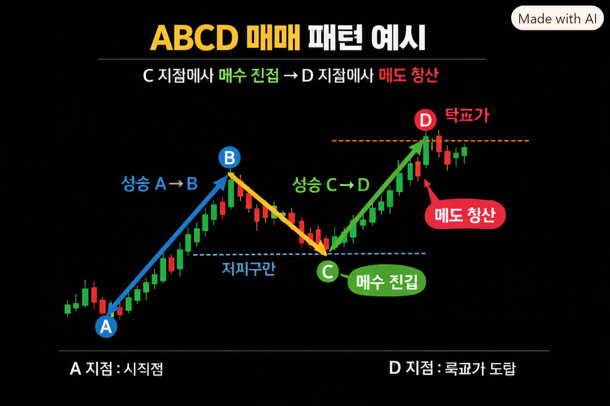

🏠 > [kostock](../../../../) > [experts](../../../) > [천리안주식](../../) > [리뉴얼](../) > `나주다 ABCD매매`

<table>
  <tr>
    <td><a href="../../">[천리안주식]</a></td>
    <td><a href="../../S0_INTRO_NEW">S0_INTRO</a></td>
    <td><a href="../../S1_시장보는기준">S1_시장보는기준</a></td>
    <td><a href="../../S2_단타의기본기">S2_단타의기본기</a></td>
    <td><a href="../../S3_쉬운매매구조">S3_쉬운매매구조</a></td>
    <td><a href="../../S4_주도종목실전">S4_주도종목실전</a></td>
    <td><a href="../../S5_유료강의압축">S5_유료강의압축</a></td>
  </tr>
</table>

### INDEX
- [ABCD 매매의 기본 개념](#abcd-매매의-기본-개념)
- [특징](#abcd-패턴의-특징)
- [장점](#장점)
- [주의할 점](#️주의할-점)
- [맥락](#나주다-카페-맥락)
- [정리](#wrapup)

---
## ABCD매매
> 주식·코인 투자자들 사이에서 널리 쓰이는 패턴 매매 기법으로,   
> 특정한 가격 움직임을 A-B-C-D 네 구간으로 나누어 매수·매도 타이밍을 잡는 방식   
> 나주다 카페에서 이 기법을 활용해 차트 분석과 매매 전략을 공유하고 있다

---
### ABCD 매매의 기본 개념
- A → B 구간: 상승(또는 하락) 추세의 첫 번째 움직임
- B → C 구간: 되돌림(조정) 구간
- C → D 구간: 다시 원래 방향으로 이어지는 추세 구간
- 핵심 포인트: C 지점에서 매수(상승 패턴일 경우) 또는 매도(하락 패턴일 경우)를 노려 D 구간의 확장까지 수익을 가져가는 전략

### 📊ABCD 패턴의 특징

구간 | 의미 | 투자자 행동
-----|-----|-----
A-B   | 초기 상승/하락    | 추세 확인
B-C   | 조정 구간        | 진입 준비
C-D   | 추세 재개        | 매수·매도 실행
D 이후 | 목표가 도달      |청산, 리스크 관리

### ✅장점
- 명확한 진입·청산 기준 제공
- 단순한 구조로 초보자도 이해하기 쉬움
- 다양한 시장(주식, 코인, 선물)에 적용 가능

### ⚠️주의할 점
- 패턴이 항상 완벽하게 성립하는 것은 아님 → 가짜 패턴에 속을 수 있음
- 리스크 관리(손절선 설정)가 필수
- 나주다 카페 같은 커뮤니티에서 공유되는 매매법은 개인 경험 기반이므로 맹신은 위험

### 📌나주다 카페 맥락
- 나주다 카페는 투자자들이 모여 차트 분석, 매매법, 실전 사례를 공유하는 커뮤니티
- ABCD 매매는 그중에서도 대표적인 기술적 분석 기법으로 자주 언급됨
- 실제로는 피보나치 되돌림 비율(예: 0.618, 1.272 등)과 함께 쓰여 매수·매도 구간을 더 정밀하게 잡기도 함
- 피보나치 비율 적용
    구간   | 일반적인 비율      | 의미
    ------|------------------|-------------------------
    B → C | 0.618 또는 0.786  | 되돌림 비율 (조정 깊이)
    C → D | 1.272 또는 1.618  | 확장 비율 (목표가)

### 👉WrapUp
- ABCD 매매는 차트의 파동을 네 구간으로 나누어 매수·매도 타이밍을 잡는 기술적 분석 기법이며, 
- 나주다 카페에서는 이를 활용한 다양한 실전 사례와 응용 전략을 공유하고 있다

 

[[TOP]](#index)

---