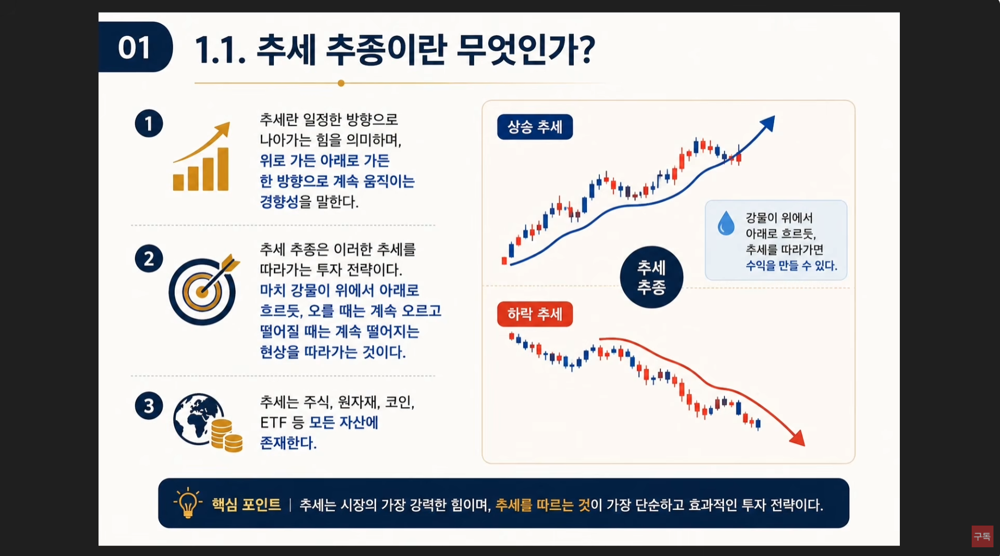
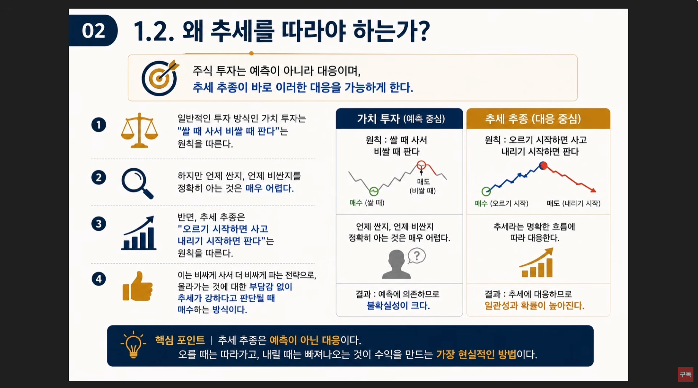
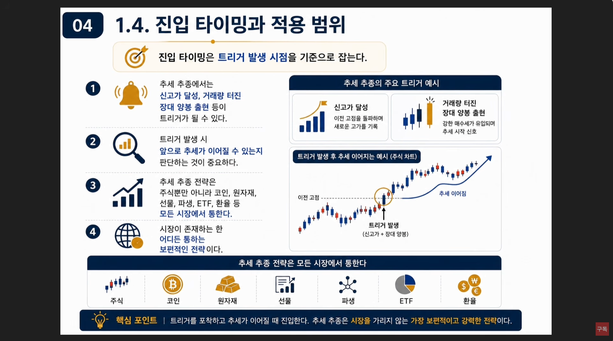
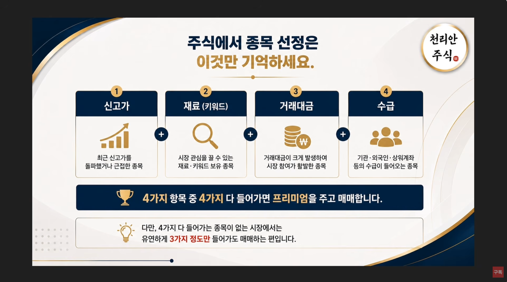
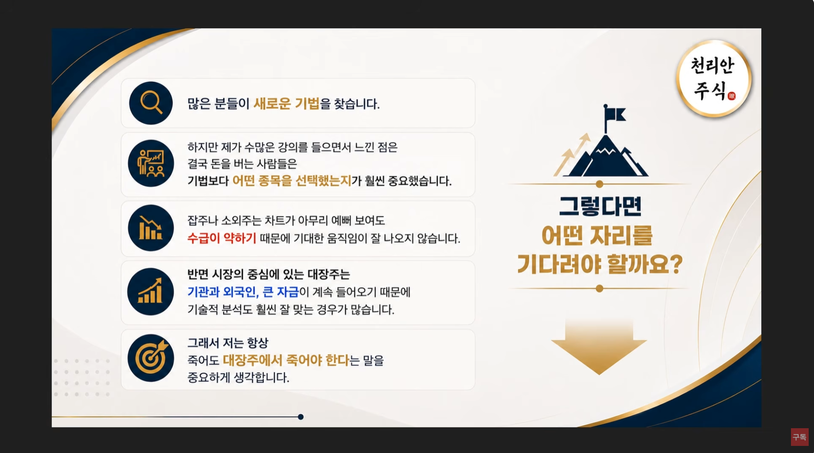
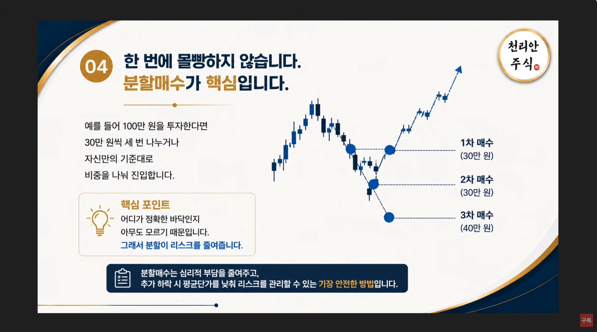
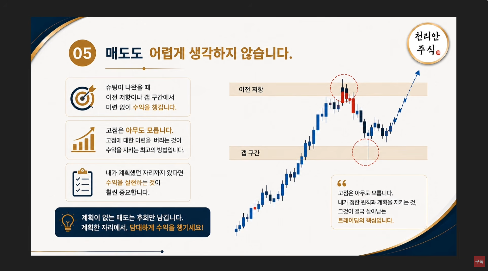

🏠 > [kostock](../../../) > [experts](../../) > [천리안주식](../) > [하반기리뉴얼](./) > `N05_추세추종눌림`

<table>
  <tr>
    <td><a href="../">[천리안주식]</a></td>
    <td><b href="../S0_INTRO_NEW">S0_INTRO</b></td>
    <td><a href="../S1_시장보는기준">S1_시장보는기준</a></td>
    <td><a href="../S2_단타의기본기">S2_단타의기본기</a></td>
    <td><a href="../S3_쉬운매매구조">S3_쉬운매매구조</a></td>
    <td><a href="../S4_주도종목실전">S4_주도종목실전</a></td>
    <td><a href="../S5_유료강의압축">S5_유료강의압축</a></td>
  </tr>
</table>

### INDEX
- [⭐ NEW [5강] 추세추종 눌림목 매매](#-new-5강-추세추종-눌림목-매매)
- [투자전략비교 : 가치투자 vs 추세추종](#투자전략비교--가치투자-vs-추세추종)
- [1️⃣ 추세추종이란 무엇인가?](#1️⃣-추세추종이란-무엇인가)
- [2️⃣ 왜 추세를 따라야 하는가?](#2️⃣-왜-추세를-따라야-하는가)
- [3️⃣ 추세추종과 심리 : 자기자신과의 싸움](#3️⃣-추세추종과-심리--자기자신과의-싸움)
- [4️⃣ 진입타이밍과 적용범위](#4️⃣-진입타이밍과-적용범위)
- [5️⃣ 추세와 함께 하는 투자](#5️⃣-추세와-함께-하는-투자)
- [6️⃣ 추세추종에서는 여러가지 매매법을 쓸 수 있다](#6️⃣-추세추종에서는-여러가지-매매법을-쓸-수-있다)
- [종목선정 및 기다려야 할 자리](#종목선정-및-기다려야-할-자리)
- [종목선정](#종목선정)
- [기다려야 할 자리](#기다려야-할-자리)
  - [1. 어떤 자리를 기다려야 할까요?](#1-어떤-자리를-기다려야-할까요)
  - [2. 박스권을 강하게 돌파하면서 거래량이 크게 터져야 한다](#2-박스권을-강하게-돌파하면서-거래량이-크게-터져야-한다)
  - [3. 강한 1차 상승이후, 반등없이 눌림목이 나오는 구간을 기다린다](#3-강한-1차-상승이후-반등없이-눌림목이-나오는-구간을-기다린다)
  - [4. 분할매수가 핵심이다](#4-분할매수가-핵심이다)
  - [5. 매도도 어렵게 생각하지 않는다](#5-매도도-어렵게-생각하지-않는다)
- 

---
## ⭐ NEW [5강] 추세추종 눌림목 매매

### 투자전략비교 : 가치투자 vs 추세추종

### 1️⃣ 추세추종이란 무엇인가?
- **추세란 일정한 방향으로 나아가는 힘**
- 이러한 추세를 따라가는 투자전략

 

[[TOP]](#index)

---
### 2️⃣ 왜 추세를 따라야 하는가?
- 주식투자는 **예측이 아니라 대응** 이며,
- 추세추종이 바로 이러한 대응을 가능하게 한다
- **원칙 : 오르기 시작하면 사고, 내리기 시작하면 판다**

 

[[TOP]](#index)

---
### 3️⃣ 추세추종과 심리 : 자기자신과의 싸움
- 추세추종은 인간의 본능을 이기는 전략으로, 
  - **심리가 매우 중요하다**
  - 주도주는 신고가 근처에서 계속 올라간다
- 자신의 본능을 이기고, **추세가 강할 때 과감하게 따라가는 것이 수익의 핵심** 이다

 

[[TOP]](#index)

---
### 4️⃣ 진입타이밍과 적용범위
- 진입 타이밍은 **트리거 발생 시점** 을 기준으로 한다
  - **신고가 달성**
  - **거래량터진 장대양봉 출현**

 

[[TOP]](#index)

---
### 5️⃣ 추세와 함께 하는 투자
- "내가사면 왜 떨어질까?" 라는 고민 대신,
- **"나는 지금 추세를 제대로 타고 있는가?"** 를 고민해야 한다
  - **추세가 강한 종목을 선택** 해야 수익 확률이 높아진다 

 

[[TOP]](#index)

---
### 6️⃣ 추세추종에서는 여러가지 매매법을 쓸 수 있다
- 돌파, 눌림, 종가배팅, 상따, 단기스윙 등 기법은 다르지만 ⇒ **모두 추세 추종의 일부**
  - 그래서, 차트상 역배열에 있는 것을 좋아하지 않는다
- 결국 중요한 것은 **시장 상황에 맞는 기법을 선택** 하는 것이다
- 추세추종은 **예측이 아니라 대응** 이다

 

[[TOP]](#index)

---
## 종목선정 및 기다려야 할 자리

### 종목선정
- **신고가** : 최근 신고가를 돌파했거나 근접한 종목
- **재료(키워드)** : 시장 관심을 끌수있는 재료,키워드 보유 종목
- **거래대금** : 거래대금이 크레 발생하여 시장참여가활발한 종목, 1천억이상
- **수급** : 기과, 외국인, 프로그램 등의 수급이 들어오는 종목
- 4가지가 다 들어가면 프리미엄을 주고 매매한다   ⇒ 유연하게 **3가지 정도만** 들어가도 매매한다

 

[[TOP]](#index)

---
### 기다려야 할 자리
- 기법보다는 종목선택이 훨씬 중요하다
- 주도섹터안에서 대장주에서 매매한다 ⇒ **죽어도 대장주에서 죽어야 한다**

 

[[TOP]](#index)

---
### 1. 어떤 자리를 기다려야 할까요?
- 주도주 매매는 타점보다
- **흐름을 읽고 기다리는 것** 이 핵심이다

 

[[TOP]](#index)

---
### 2. 박스권을 강하게 돌파하면서 거래량이 크게 터져야 한다
- 이 종목이 **시장의 주도주** 라고 인정 받는 것
  - 박스권 상단을 강하게 돌파하고, 거래량이 급증하는 종목
  - 거래량이 동반되지 않은 돌파는 가짜일 확률이 높다   ⇒  **거래량은 시장의 인정** 이다 

 

[[TOP]](#index)

---
### 3. 강한 1차 상승이후, 반등없이 눌림목이 나오는 구간을 기다린다
- **절대 추격매수를 하지 않는다**
- 주도주는 보통 크게 상승 후 눌림을 거친 뒤, 다시 상승하는 패턴이 많다
- 장대양봉의 마삼눌림목은 **주도주장세에서 주도섹터의 1등주에서 매매** 하는게 가장 확률이 놓다  ⇒ **비중매매가 가능**
- 시소타기장세나 순환매장세에서는 비중을 약하게 들어간다

 

[[TOP]](#index)

---
### 4. 분할매수가 핵심이다
- 어디가 정확한 바닥인지 아무도 모르기 때문이다
- 그래서 **분할이 리스크를 줄여준다**
  - 분할매수는 심리적 부담을 줄여주고,
  - 추가 하락시 평균단가를 낮춰 리스크를 관리할 수 있는 가장 안전한 방법이다

 

[[TOP]](#index)

---
### 5. 매도도 어렵게 생각하지 않는다
- 슈팅이 나왔을때 이전 저항이나 갭구간에서 **미련없이 수익을 챙긴다**
- **고점은 아무도 모른다** 
  - 고점에 대한 미련을 버리는 것이 수익을 지키는 최고의 방법이다
- 내가 **계획했던 자리까지 왔다면 수익을 실현** 하는 것이 훨씬 중요하다
- **"고점은 아무도 모른다. 내가 정한 원칙과 계획을 지키는 것"**
  ⇒ 이것이 결국 살아남는 트레이딩의 핵심이다

 

[[TOP]](#index)

---
### 차트예시

 

[[TOP]](#index)

---
### 실전 예시

 

[[TOP]](#index)

---
