🏠 > [kostock](../../../) > [experts](../../) > [천리안주식](../) > [하반기리뉴얼](./) > `N07_코스피변곡점`

<table>
  <tr>
    <td><a href="../">[천리안주식]</a></td>
    <td><b href="../S0_INTRO_NEW">S0_INTRO</b></td>
    <td><a href="../S1_시장보는기준">S1_시장보는기준</a></td>
    <td><a href="../S2_단타의기본기">S2_단타의기본기</a></td>
    <td><a href="../S3_쉬운매매구조">S3_쉬운매매구조</a></td>
    <td><a href="../S4_주도종목실전">S4_주도종목실전</a></td>
    <td><a href="../S5_유료강의압축">S5_유료강의압축</a></td>
  </tr>
</table>

### INDEX
- [⭐ NEW [7강] 코스피 변곡점 파악하는 방법](#-new-7강-코스피-변곡점-파악하는-방법)
- [월봉차트 기준](#월봉차트-기준)
- [주봉차트 기준](#주봉차트-기준)
- [종가배팅 관점](#종가배팅-관점)
- [거래량 기준](#거래량-기준)

---
## ⭐ NEW [7강] 코스피 변곡점 파악하는 방법

- **종목을 보기전에 섹터를 먼저 보고,**
- **섹터를 보기전에 지수를 먼저 본다**
- 어떤 지수 상황이냐에 따라서 주도섹터가 만들어지고
- 그 주도섹터 안에서 대장주와 후발주로 나뉜다
- **일단 지수를 볼때는 연봉으로 본다** 
  - 현재의 연봉은 어떤가?
  - 최근 10년,20년 박스권을 다 돌파하고 신고가로 가고 있는 구간에서의 조정이다
  - 연봉으로 봤을때는 상승의 흐름은 맞다

**[2026년 7월 현재 연봉차트]**
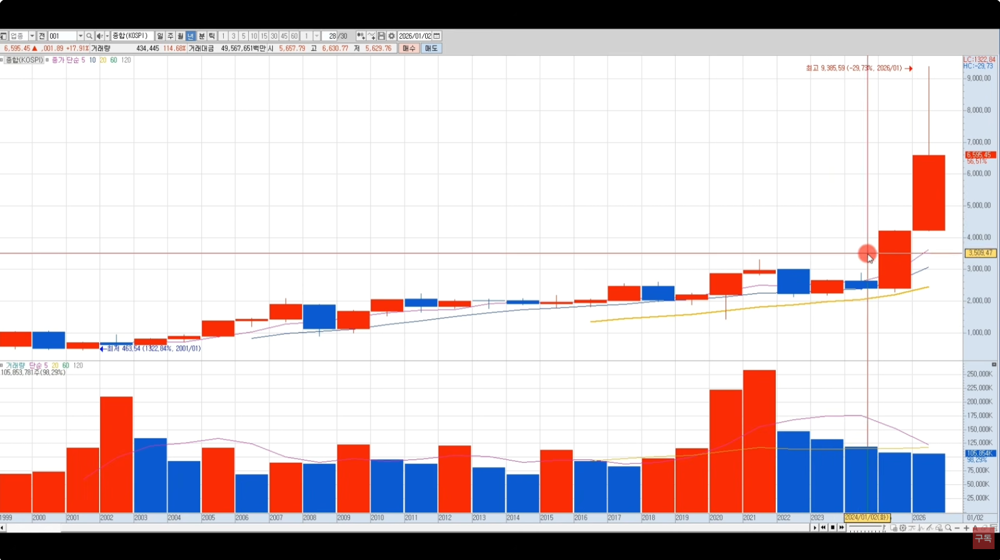

 

[[TOP]](#index)

---
### 월봉차트 기준  

- 월봉으로 봤을때도 상승의 흐름은 맞고,
  - 하지만 상승의 과정에서 하락 조정이 나온 것이다
  - 즉 긴추세에서는 대상승이 맞는데, 대상승에서 하락조정이 나온거다
- **2021년의 전고점을 돌파한 최초의 캔들** ⇒ 여기가 **'기준봉'**
  - 이후에 5일선을 타고 상승하며, 5일선을 종가상으로 깬적이 없다가,
  - 이번에 5일선을 처음 깬것이다
  - 월봉상 주가가 올라갈때 전 캔들의 저가를 훼손하지 않고 항상 올라가다가,
- 이번에 **전저점을 처음으로 훼손** 했다. ⇒ 여기가 **'변곡점'** (= 7,394.46 포인트)
  - 이후에 빠졌다가 올라올때에도 여기 구간에서 저항받을 가능성이 높다

**[2026년 7월 현재 월봉차트]**
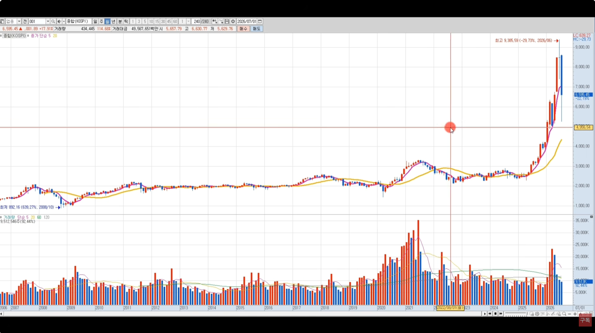

<table>
  <tr>
    <td>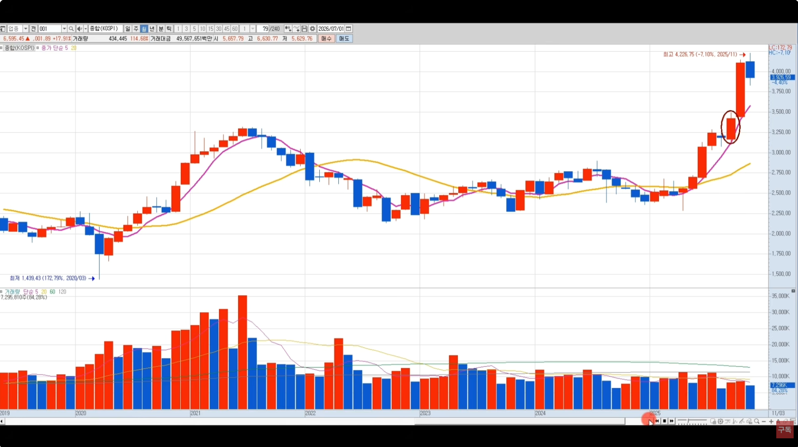</td>
    <td></td>
  </tr>
  <tr>
    <td>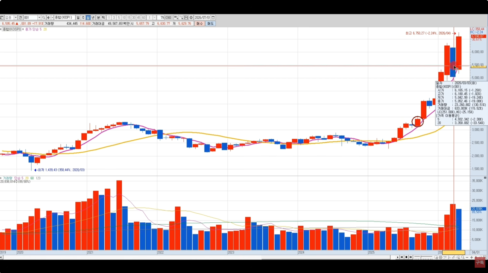</td>
    <td>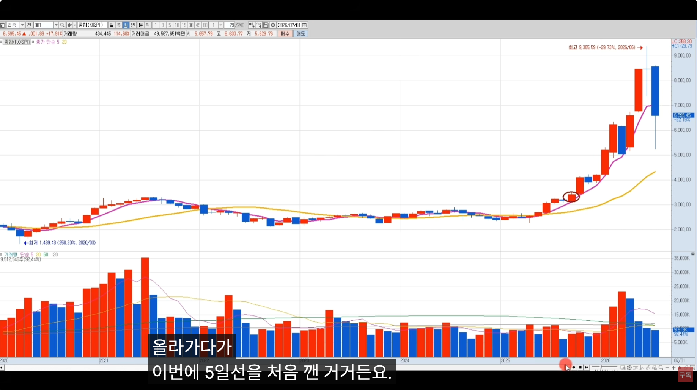</td>
  </tr>
  <tr>
    <td>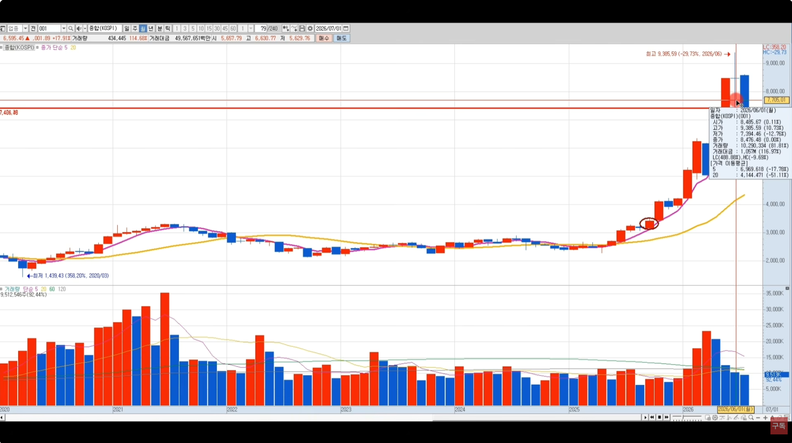</td>
    <td>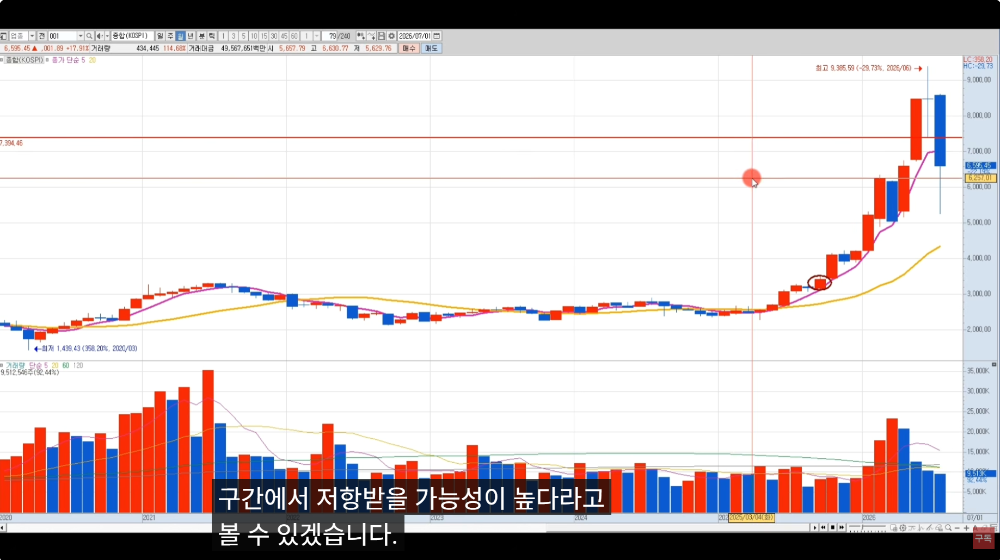</td>
  </tr>
</table>

 

[[TOP]](#index)

---
### 주봉차트 기준

- 주봉으로 봤을때도 추세는 **대상승장에서의 하락조정 중** 이라 볼 수 있다
- **주봉에서도 전고점을 돌파한 캔들**  ⇒ 여기가 **'기준봉'**
  - 5일선을 이탈 안하고 가다가, 
  - 5일선을 처음 이탈했다가 5일/10일선 중간에서 바로 반등이 나왔다
  - 다시 앞전고점인 저항대를 돌파하면서 다시 ⇒ 여기가 '기준봉'
  - 다시 올라가다가 5일선과 10일선을 이탈하고, 갭하락이 나오고 -5% 밀렸다가 반등이 나옴
- **주가가 올라갈때는 전캔들의 저점을 훼손하지 않고 올라가다가,** 
- **전 캔들의 저가를 훼손하는 순간 거기가 변곡점이 되는 것이다**
  - 다시 반등이 나와도 변곡점을 돌파하는지 봐야하고, 돌파하면 또 앞전고점을 돌파하러 가는지 봐야한다
  - 또 다시 돌파하면 그 캔들이 다시 기준봉이 되는 것이다
  - 상승하다가 5일을 깨고, 10일선을 깼다면 앞전 저점인 지지선을 이탈하는지 봐야 한다
  - 다시 밀려서 20선까지 이탈했다. 
  - 그리고 쭈욱 밀렸다가 앞서의 변곡점이 저항대가 되고, 이 변곡점들을 돌파여부를 지켜봐야 한다
  - 즉, **기술적으로 앞서 변곡점까지는 반등이 나올 수 있겠다고 볼 수 있다**
- **이 구간을 종가상 확실하게 돌파하고 올라갈 때 전고점을 돌파하러 가는 흐름인가 그때 알 수 있는거다 ⇒ 신고가 도전**
  - 현재 구간에서는 전고가 즉 신고가를 뚫으러 간다는 확신을 할 수 없다. 저항대에서 다시 내려갈 수도 있다
  - 그리고 여기가 5이평, 10이평, 20이평이 모이는 구간이기도 하다  ⇒  저항
- 월봉상으로는 7,394포인트, 주봉상으로 7,371 포인트
- 월봉상,주봉상으로 보나 대략 라운드피겨값인 7,400 을 둘다의 변곡점으로 본다

**[2026년 7월 현재 주봉차트]**
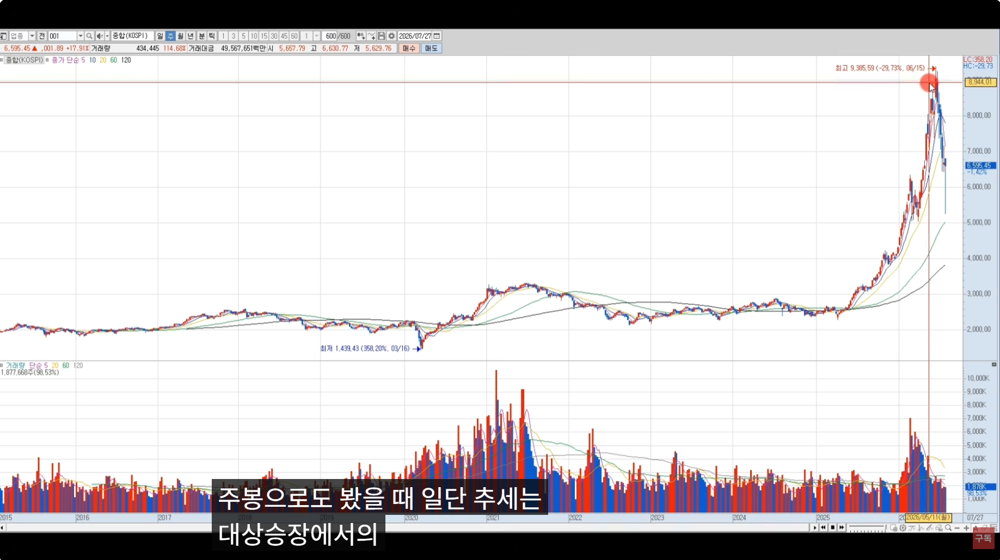

<table>
  <tr>
    <td>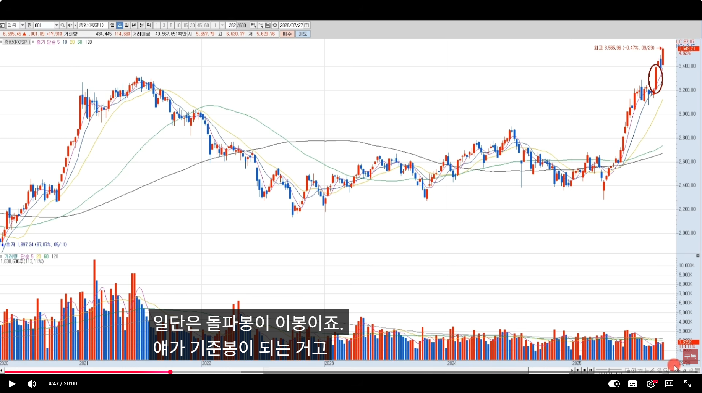</td>
    <td>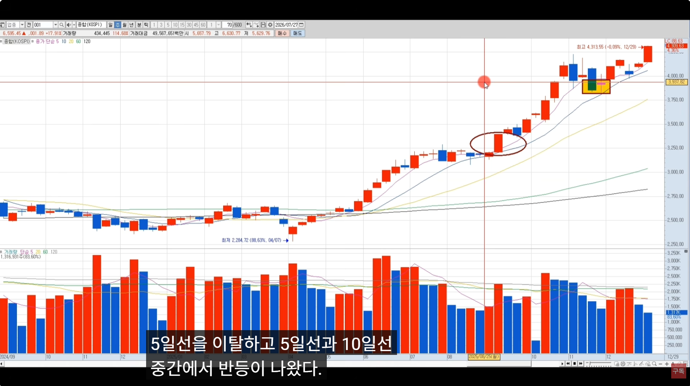</td>
  </tr>
  <tr>
    <td>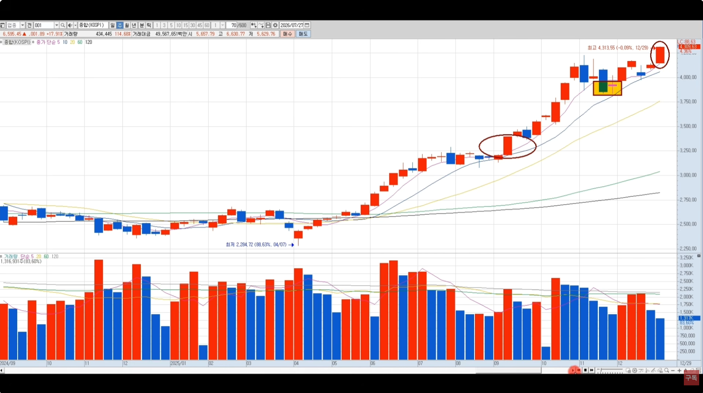</td>
    <td>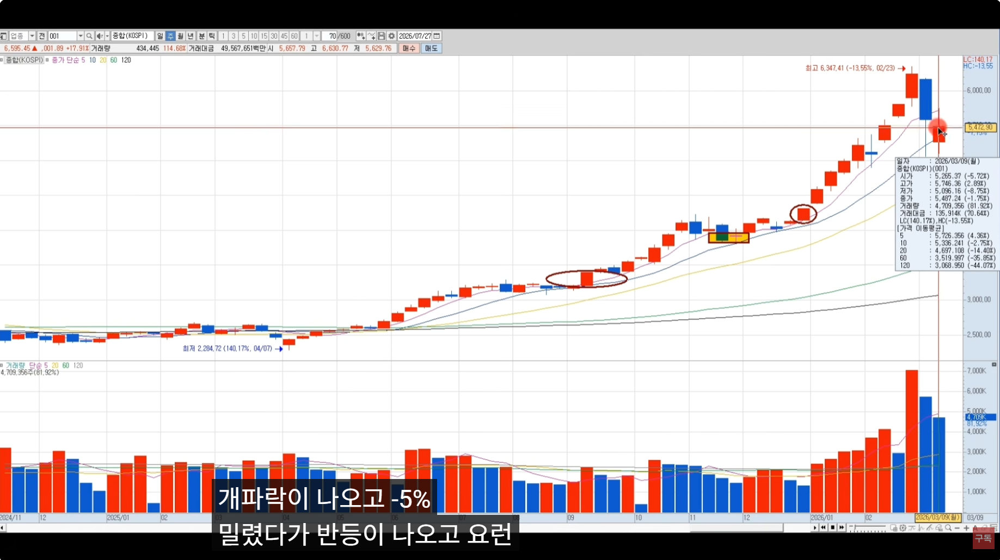</td>
  </tr>
  <tr>
    <td>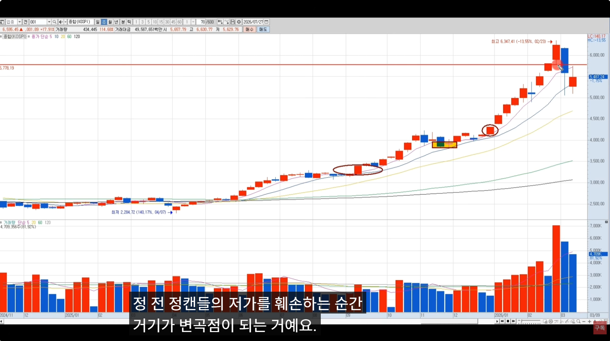</td>
    <td>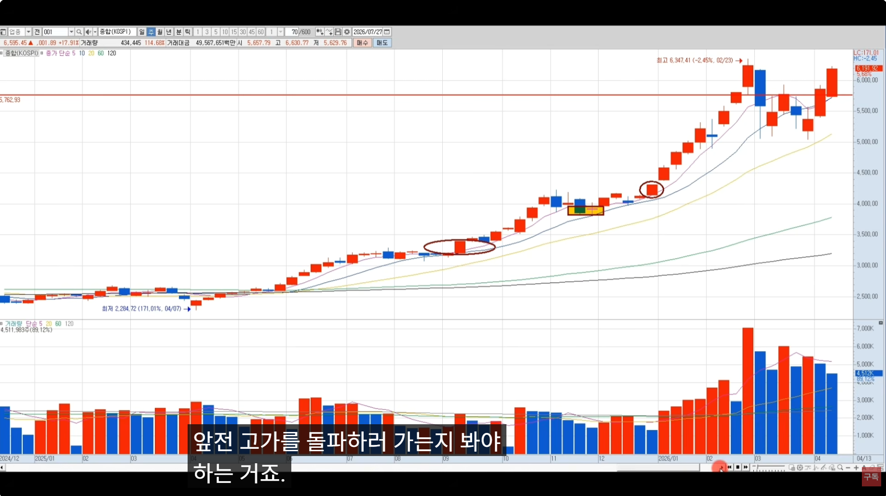</td>
  </tr>
  <tr>
    <td>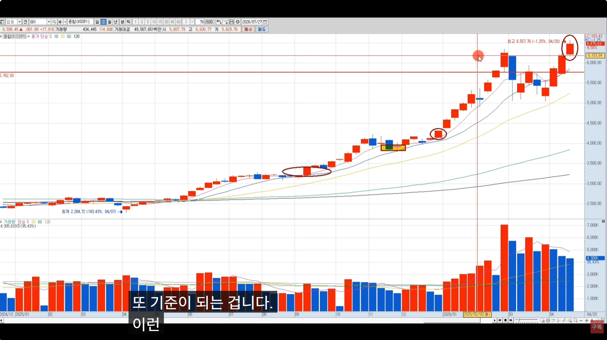</td>
    <td>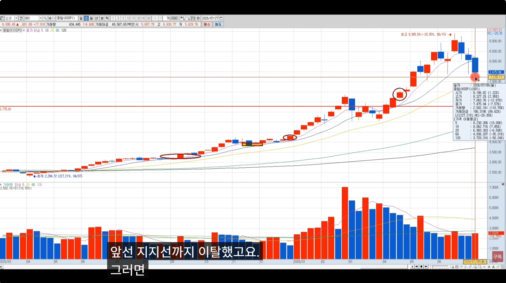</td>
  </tr>
</table>

 

[[TOP]](#index)

---
### 종가배팅 관점  

- SK하이닉스와 삼성전자를 매매할때, **지수가 7300에서 7400 사이 구간을 저항대로 작용할 가능성이 높다**
  - 현재 코스피는 6,595
  - 그래서 아직은 상승여력이 남아 있다고 판단하여 종가배팅을 했다
  - 만약 지수가 아래로 내려간다면 매수기회로 볼 것이고,
  - 지수가 위로 올라간다면 보유분량만 끌고 가다가 변곡점 부근에서 익절할 생각이다
- 전고점까지는 끌고간다는 보장은 없다. 
  - 가는척하다가 밀릴수 도 있다
  - 상승할 때는 20이평을 지지하고 계속 반등이 나왔는데, 최근 20이평을 깼기때문에 다시 밀릴 수도 있다고 생각한다
- 그래서, **지금의 코스피의 승부처** 는 **변곡점인 이 구간(7400포인트)** 이 될 것라고 볼 수 있다

<table>
  <tr>
    <td>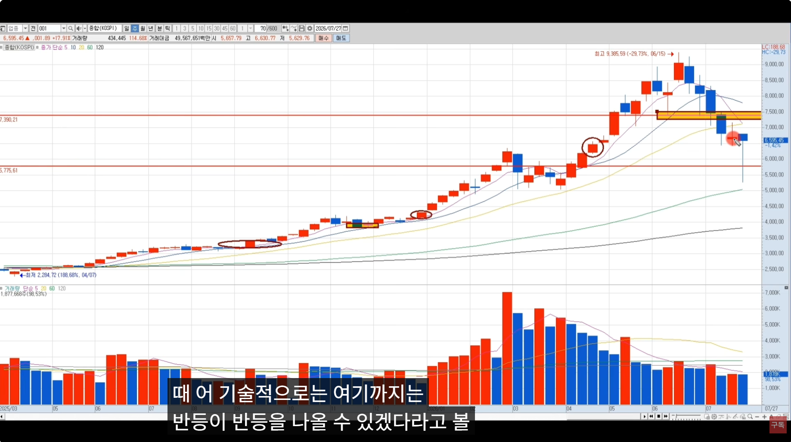</td>
  </tr>
  <tr>
    <td>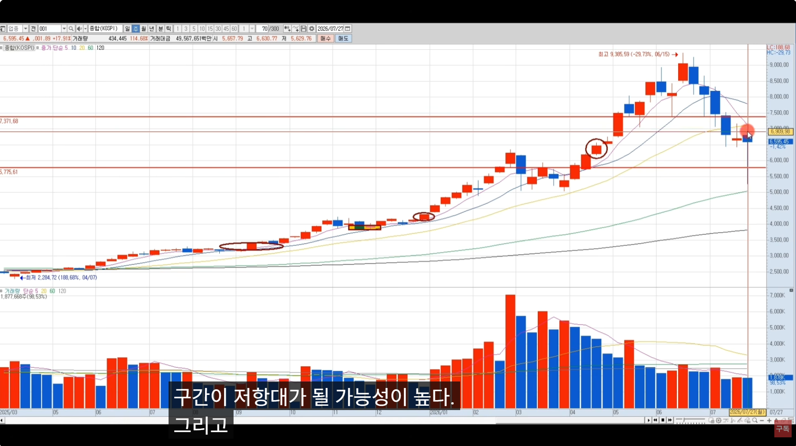</td>
  </tr>
</table>

 

[[TOP]](#index)

---

### 거래량 기준

- 거래량으로 봤을때 2026년 2월,3월,4월 이때 가격대에서 많이 터졌다
  - 주가가 상승할 때는 거래량이 확 줄어 들었다
  - 여기에서 매물 소화를 하고 물량을 잠근 것이다
- 그래서 **코스피의 적정주가** 는 **거래량이 가장 많이 터진 구간** 이 밴드일 가능성이 높다
  - 현재도 이 박스권안에서 반등이 나온 것이다
  - **코스피를 이끄는 주체의 평균 단가는  밴드안에 박혀있을 가능성이 높다**
- 현재 박스 바깥으로 올라갔기때문에 다시 내려올 수도 있다 
  - 내려오면 다시 매수를 받을 것이고
  - 올라가면 보유한 비중은 7300과 7400 이 구간에서 익절할 것이다
  - 거기서 더 올라가려면...
    - 미국 이란 전쟁이 완전 종식 되고
    - 금리 인상 가능성도 줄어들고
    - 유가도 빠지고
    - 그러면서 계속 호재가 계속 나오면서
    - 메모리 사용량도 계속 늘어갈거라는 뉴스와 투심이 좋아져야 전고점까지 끌고갈 만하다
  - 무작정 전고점 돌파할 거라는 생각은 홀짝게임을 하는 것과 같다
- 백억트레이더들은 차트를 단순하게 설정하고 매매한다
  - 주식은 단순하게 **캔들, 거래량, 거래대금, 이동평균선** 만 보고 매매한다
  - 백억트레이더 중에서 볼벤, 스토케스틱 이런 이상한거 넣는 사람을 본적이 없다

<table>
  <tr>
    <td>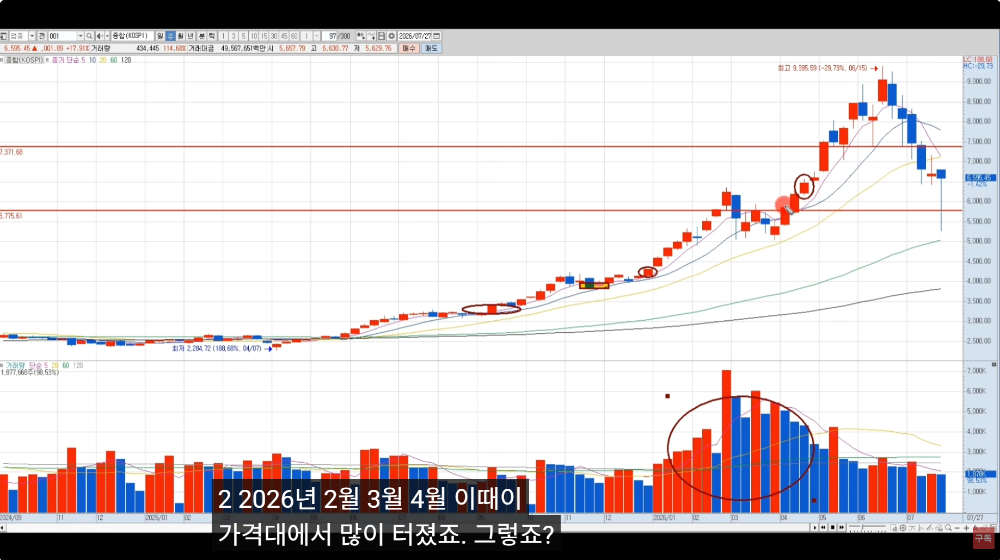</td>
  </tr>
  <tr>
    <td>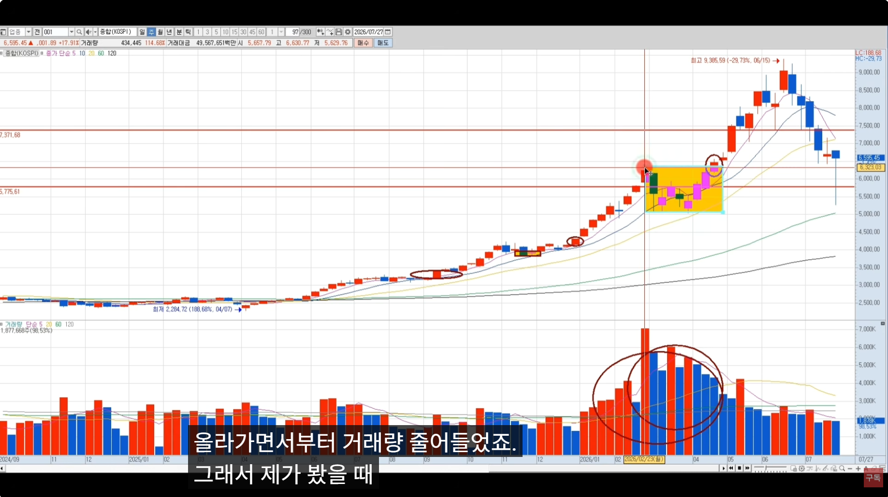</td>
  </tr>
</table>

 

[[TOP]](#index)

---
