🏠 > [kostock](../../../) > [experts](../../) > [천리안주식](../) > [하반기리뉴얼](./) > `N08_종가배팅정복`

<table>
  <tr>
    <td><a href="../">[천리안주식]</a></td>
    <td><b href="../S0_INTRO_NEW">S0_INTRO</b></td>
    <td><a href="../S1_시장보는기준">S1_시장보는기준</a></td>
    <td><a href="../S2_단타의기본기">S2_단타의기본기</a></td>
    <td><a href="../S3_쉬운매매구조">S3_쉬운매매구조</a></td>
    <td><a href="../S4_주도종목실전">S4_주도종목실전</a></td>
    <td><a href="../S5_유료강의압축">S5_유료강의압축</a></td>
  </tr>
</table>

### INDEX
- [⭐ NEW [8강] 종가배팅 완전정복](#-new-8강-종가배팅-완전정복)
- [종가배팅이란?](#종가배팅이란)
- [종가배팅이 잘 먹히는 시장](#종가배팅이-잘-먹히는-시장)
- [종목선정 조건](#종목선정-조건)
- [요약 정리](#요약-정리)
- [계좌를 부풀리는 비법](#계좌를-부풀리는-비법)
- [신고가장세에서의 종가배팅](#신고가장세에서의-종가배팅)
- [종가배팅 예시 사례1](#종가배팅-예시-사례1)
- [종가배팅 예시 사례2](#종가배팅-예시-사례2)
- [종가배팅 예시 사례3](#종가배팅-예시-사례3)
- [종가배팅 예시 사례4](#종가배팅-예시-사례4)
- [마무리](#마무리)

---
## ⭐ NEW [8강] 종가배팅 완전정복


### 종가배팅이란?
> 다음날 오를 가능성이 높은 종목을 종가에 미리 매수하는 전략

- 다음날 오늘 가능성이 높은 종목기법을 배우기전에 시황부터 봐야한다
  - 시장
  - 주도섹터
  - 종목압축
  - 타점적용  ⇒  이 순서대로 봐야한다
- 종가배팅이 잘 먹히는 시장은 언제일까?
  - 매수만 하면은 다음날 갭이 뜰 가능성이 높은 구간
  - 다음날 갭이 잘 뜨는 시장 ⇒ **지수가 맨날 신고가를 찍고 올라가는 시장** 이다 
  - 반대로 갭하락이 높은 시장 ⇒ 당연히 하락장
- **상승장에서 주도주들이 출현** 을 한다
  - 주도주 돌파매매
  - 주도주 눌림매매
  - 주도주 종가배팅
  - 주도주 상한가 따라잡기
  - 주도주 단기스윙
  - 기법이 잘 먹히는 시장
  - 하락장이 되면 귀신같이 안먹힌다 ⇒ 주도주가 안나온다
- **주도주는 결국 큰손이 만드는 것**
  - 아무리 뉴스가 좋아도, 아무리 회사가 좋아도, 
  - 주가를 컨트롤하는 세력이 없으면 주가는 오르지 않는다
- 큰손들이 매매하기 좋은 환경 = 신고가 장세
  - 100억 이상 버신 분들이 강조하는게 신고가를 강조
- 역사적 신고가 강조
  - 특정 세력이 좌지우지 하지 못한다
  - 100억 이상 개인, 수천억 수조 외국인, 기관
  - 여러 세력이 모여서 주가를 만든다
  - 한쪽에서 대량매도를 한다고해서 주가가 세력주처럼 과도하게 밀리지 않는다
  - 내 물량을 받아줄 주체가 많다. 
  - 신고가에서는 누구나 사고 싶어하는 구간
- 요즘은 주도주가 없다
  - 당일날 장대양봉 나오는 주도주
  - 삼전닉스에 수급이 몰빵되서 잡주들만 움직인다
  - 큰손들이 모두 삼전닉스에만 가 있개 때문이다
  - 지수를 보면 현재는 긴 상승장이후에 하락조정
- 언제 주도주가 많이 출현할까?
  - 전고점 부근까지 와야 된다
  - 주도주가 많이 출현하면 주도주에서 돌파,눌림,종배,상따를 하는 것이다
  - 지금의 이런 구간에서 종배나 상따의 확률이 낮다
  - 긴 추세에서 하락추세이기 때문이다
- 하락추세에서는 
  - 과도하게 밀렸을 때 분할로 사서 반등에 팔고 이런 매매가 잘먹힌다
  - 장대양봉 나왔을 때 종가배팅 하는게 잘 안먹힌다
  - 시장마다 잘 먹히는 기법들이 있다
  - 상승장에서는 
    - 백억트레이더들도 삼전닉스보다 다 주도주매매만 한다
  - 하락장에서는 
    - 기존의 주도주매매를 하자니 호가창에서 내 물량을 받아주지도 않고
    - 나혼자 소외된 종목에서 매매를 하자니 확률이 떨어지는 거다
    - 그러니깐 큰손들이 있는 삼성전자, SK하이닉스로 모여드는 거다

**종가배팅이 잘 먹히는 시장은 언제일까?**
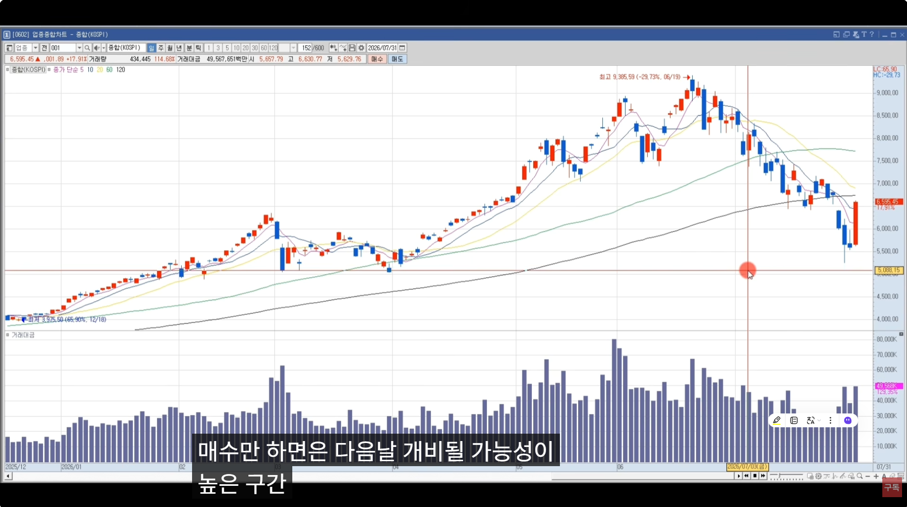

<!-- 
<table>
  <tr>
    <td></td>
    <td>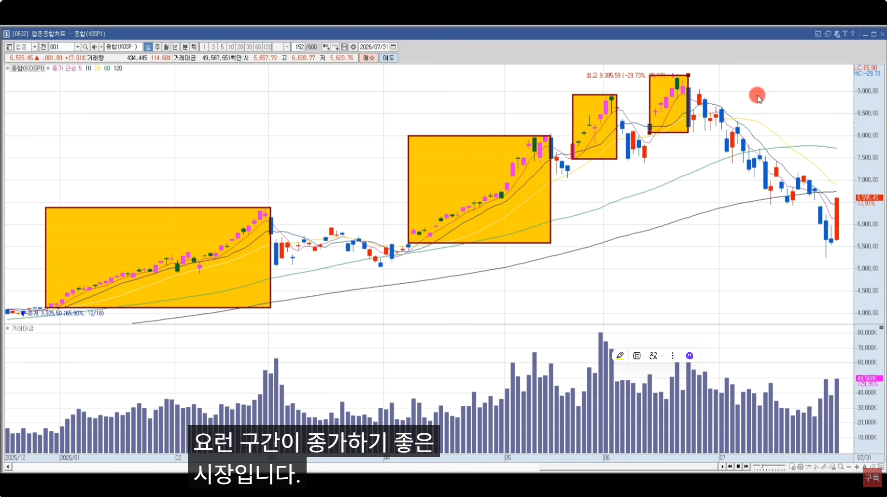</td>
  </tr>
</table> 
-->

<br/>

[[TOP]](#index)

---
### 종가배팅이 잘 먹히는 시장

- 코스피 신고가 갈때 주도주가 많이 출현한다
  - 이때 어떤 기법을 써도 잘 먹히는 거다
- 신고가 갈 때 종가배팅을 어떻게 하는지
  - **종가배팅에서 확률 높은 시장 상황이 '신고가'**
    - 억대트레이더들은 미수까지 써서 크게 들어간다
  - 신고가를 벗어났다. 하락조정장이다
    - 그러면 관망하거나 
    - 종가배팅을 거의 안한다 라고 봐도 무방

**종가배팅이 잘 먹히는 시장**


<br/>

[[TOP]](#index)

---
### 종목선정 조건

- 시장에 맞는 주도섹터에서 하면 된다
  - 재건주 **등락률 1등** 을 보통 우리가 **1등주** 라고 한다
  - 보통 1등주는 거래량이 약하고 등락률은 세다
  - **거래대금 동반 등락률 높은 주식** 을 우리는 **대장주** 라고 한다
- 50억,100억 이상 번 사람들은 보통 1등주보다는 대장주에서 매매를 하고,
- 몇천만원으로 매매하는 사람들은 1등주에서 매매하는게 확률이 높다
- 수십억 이상의 억대트레이더 입장에서는..
  - 주도 대장주에서 매매한다
  - 1등주는 호가창이 비교적 얇기 때문에 손절할때 자기물량을 받아주는 주체가 약하다. 손익비 x
  - 무조건 거래대금을 더 중요하게 본다.
  - 그들의 관점에서는 이것이 맞다
- 3억미만으로 매매하는 개미들 입장에서는..
  - 1등주를 매매하는게 훨씬 확률이 높다
  - 금요일 삼성전기가 1등주였고, SK하이닉스가 3등주 ⇒ 등락률 기준
  - 삼성전기에서 매매하는게 확률이 높고, 
  - SK하이닉스에서 매매하는 사람들은 몇십억~몇백억 
    - 장중 장대양봉 트레이딩에서 매매할 때는 거래대금을 더 중요하게 본다
  - 근데, **우리는 거래대금도 봐야하지만 등락률 1등이 최고다 !**
- 스캘핑하다가 주도주매매로 갈아타면서 계좌가 커진 것
  - 만쥬, 디앤서, 동주, 모카, 미모사, 트레이더김씨, 리버스패스, 천이요, T98, 날좋은날에...
- 돌파매매고수들
  - 스캘핑 월천 월3천 찍다가 자기의 비중을 받아줄만한 종목이 없다
  - 잡주를 버리고 주도주로 간것이다
- 한줄 요약하면
  - **당일 가장 강한 주도주 '1등주' 혹은 '대장주' 에서 종가배팅** 하는 것이다
  - 이게 전부
  - 다음날 오전장까지 강할 가능성이 높다
  - 모든 트레이더들이 보는 종목이고, 다음날 상승출발하면 다 달라붙어 더 추가상승이 나온다
  - 현재는 하락조정장이라 주도주가 안나온다 ⇒ 그래서 주도주 종가배팅을 할 수가 없다
  - 이벤트성 종가배팅 ⇒ 낙폭과대 단기스윙, 물려도 130만원대에서 한달 갖고 있으면 최소 본전 탈출은 한다

<br/>

[[TOP]](#index)

---
### 요약 정리
- 종가배팅이란?
  - 다음날 오를 주식을 종가에 미리 들어간다
- 손절은?
  - 다음날 올라갈 줄 알았는데 반대로 하락하면 손절
- **지수가 신고가를 찍으면서 올라갈때는 종가배팅** 을 하면 다음날 상승할 가능성이 높다
  - 신고가 장세에서 비중배팅해서 다 백억대 이상 간 것이다
  - 만약 반대로 하락 조정장에서 비중배팅했다면 어떻게 되었을까? 안된다
- 금요일날 왜 SK하이닉스를 종가배팅했냐?
  - 우리나라 증시에서는 금요일날 주도주가 반도체
  - 반도체섹터를 매매하거나 관망하는게 낫다
  - 다른섹터 건들바에 반도체하는게 확률이 낫다
  - 왜냐면 반도체가 빠지면 다같이 빠지고,
  - 반도체가 오르면 반도체 오르는 폭만큼 올라주지 않는다
  - 금요일시장에서 코스피가 17% 상승
    - 삼성전기 상한가
    - SK스퀘어 상한가
    - SK하이닉스 상한가
    - 삼성전자 25%      <br/> ⇒  코스피지수가 17%인데 더 강했다
    - 반면 현대차 9%
    - 두산에너빌리티 8%  <br/> ⇒ 코스피 대비 약했다. 반도체 대비해서도 당연히 약했다
  - **지수가 다시 신고가 가는 흐름으로 턴 하기 전까지는 다른섹터는 왠만하면 안 건드는게 낫다**

<br/>

[[TOP]](#index)

---
### 계좌를 부풀리는 비법

- 백억이상 버신분들이 계좌를 지키면서 계좌를 부풀려 나가는 비법이 뭐냐면
- **기다릴줄 알아서 그렇다**
- **중목압축이 타이트하다**
  - 신고가 이면서 
  - 주도주 이면서 대장주 이면서 
  - 외인기관 수급이 좋으면서 
  - 재료가 지속적이면서
- 50억 100억 200억 배팅
  - 한달에 이런 매매 5~10번만 해도 수익이 몇억에서 몇십억이 찍힌다
  - ~잡주매매를 하면 안된다~
  - **확실한 주도주가 나왔을때만 매매**
  - 돌파든, 눌림이든, 상따든, 종가배팅든
  - **신고가 장세에서 많이 나온다** 

<br/>

[[TOP]](#index)

---
### 신고가장세에서의 종가배팅

- 신고가장세에서 **'종가고가 종가배팅'** 을 많이 한다 
  - 주가가 고가에서 마감될 때 종가배팅
  - 주가가 윗꼬리 길게 달리고 마감했는데 다음날 다시 올라가더라
  - 다음날에도 순환매가 돈거다
  - 과도하게 밀렸는데 다시 올라가려면 순환매가 돌아야 된다
  - 차익실현, 즉 윗꼬리가 길게 달리면서 밀림
- 윗꼬리가 길게달리면서 몸통이 살짝 짧은걸로 마감이면 다음날 둘중에 하나다
  - 다시 대우건설이 부각받으면 수급이 대우건설로 몰리면서 다시 상승해준다
  - 만약에 다음날 대우건설로 수급이 집중되지 않으면 대우건설은 밀리겠죠
    - 실망매물 출회이든, 손절이든
    - 로봇, 송배전, 신재생 등 순환매로 다른 섹터종목이 올라간다 ⇒ 시소타기
- 한가지 기법을 99점 100점 맞을려고 노력하기 보다는
- 여러가지 기법을 70점 정도만 끌어올려라
- 어차피 수익은 시장이 준다
- 여러가지 기법을 알아야 된다고 생각했기 때문에, 유료강의에 3천만원을 쓴것이다
- 종가배팅에도
  - **[상승장]** 에서는 **종가고가 종가배팅** 이 잘 먹히고
  - **[횡보장]** 에서는 **섹터간의 순환매** 가 잘 나오고
  - **[낙폭과대장]** 에서는 특정종목으로 수급쏠림에 의해서 그 종목이 빠지면 빠질수록 **반등저점매수세** 로 계속 들어오면서 반등이 잘 나온다
  - 그래서 그 반등 먹으려고 **낙폭과대매매** 를 하는 것이다 
- 시장에 맞게 여러가지 기법을 활용할 줄 알아야 한다

<br/>

[[TOP]](#index)

---
### 종가배팅 예시 사례1

- 요즘 7월 시장에서는 종가배팅이 잘 안먹힌다
  - 주도주가 없다
  - 삼전닉스 시장 주도주 말고
  - 당일 장대양봉 나오면서 주도주로 올라오는 종목
- 2026/04/18 등락률로 보면..
  - 대우건설, GS건설 둘다 상한가이지만.. 
    - 대우건설이 상한가를 먼저 갔다
    - 먼저 들어간 종목이 대장주이다
    - 거래대금도 대우건설이 1조9천억으로 가장 많다
    - 상지건설도 상한가 먼저 가긴 했지만, 
      - 일봉상 역배열이다
      - 또 시가총액도 700억 <br/> ⇒  억대트레이드들은 이런 종목 매매 X
  - 시가총액이 낮은애가 먼저 상한가를 간 경우
    - 같은 섹터내애서 거래대금이 터지면서 올라가는 애들이 투심이 좋아진다
    - 그래서 1% 갈것도 2% 가고, 100억 들어 올것도 200억 300억 이렇게 들어온다
  - 이때 재건주에서 대장주는 대우건설과 GS건설인데, 특징이 있다
    - 뉴스를 검색해보면 미국-이란 2주동안 휴전 소식
    - 휴전 소식에 재건주들이 미쳐 날뛰었던 것이다
    - 대우건설도 역사적인 신고가를 갱신했다
    - 이런 종목에서 종가배팅을 한다
    - 외국인도 900만주, 기관도 200만주 들어왔다 
    - 이런 경우 프로그램도 프로그램도 순매수 급증했을것이다. ⇒  프로그램 순매수 978만
    - 외국인이 프로그램으로 거의 순매수 했다고 봐도 무방하다
    - 프로그램이 장중에 계속 순매수 순매수 하면서 주가를 끌고 갔다
    - 거래량이 많이 터진다는 것은 매도수량도 그만큼 많은 것이다
    - 상승나오다가 눌렀다가 재돌파할때, 즉 20000원이 넘어서 들어가도 늦지 않다는 것이다
    - 일봉상 역사적 신고가 라운드피겨 2만원 돌파할때 돌파매매 했을 것이다
    - 쭉쭉 올라갈때 불타기매매하는 사람도 있었을거고, 
    - 조금 밀려도 눌림매매하는 사람도 다 들어오고, 
    - 시황이 좋으면 돌파든, 눌림이든, 종배나 상따든 어떤 매매를 해도 좋다
  - 근데, 다음날(04/09) -4% 갭하락으로 시작했다
    - 투자자별 매매동향을 보면, 매수주체가 빠져나가지는 않았다
    - 2등주였던 GS건설은 2% 갭떴다가 장중에 밀려 전날 종가를 회복해 주지 못하고 마감됐다
    - 1등주였던 대구건설은 전날의 종가이자 상한가를 돌파하고 더 올라갔다
    - 왜 이런 현상이 일어났냐면? <br/> ⇒  트럼프가 휴전 얘기를 꺼냈다가 다시 검토해보겠다 말바꾼 뉴스가 떳다
  - 그래서, **종가배팅은 그날 주도섹터중 대장주를 하는게 맞다!**
  - **지수가 신고가를 가는 구간에서는 지수도 갭이 잘 뜬다**
  - 즉, 이럴때 종가배팅도 갭이 잘 될 가능성이 높다

<table>
  <tr>
    <td>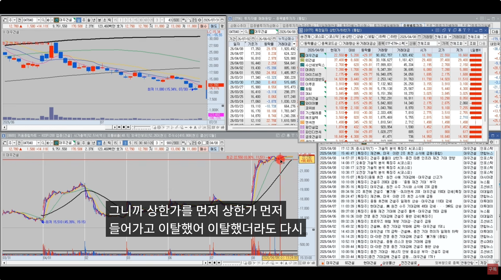</td>
    <td>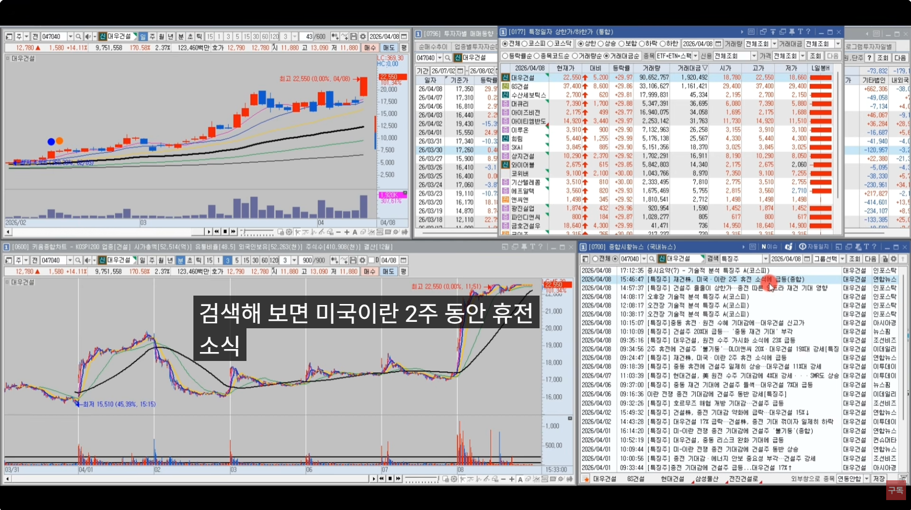</td>
  </tr>
  <tr>
    <td>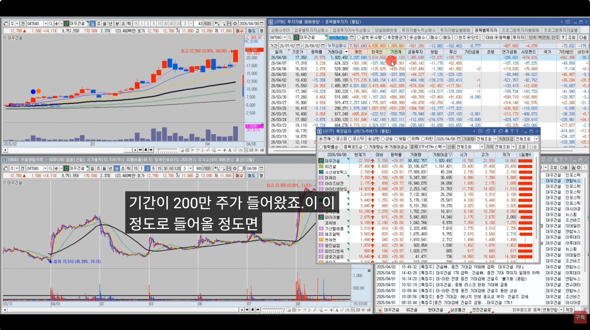</td>
    <td>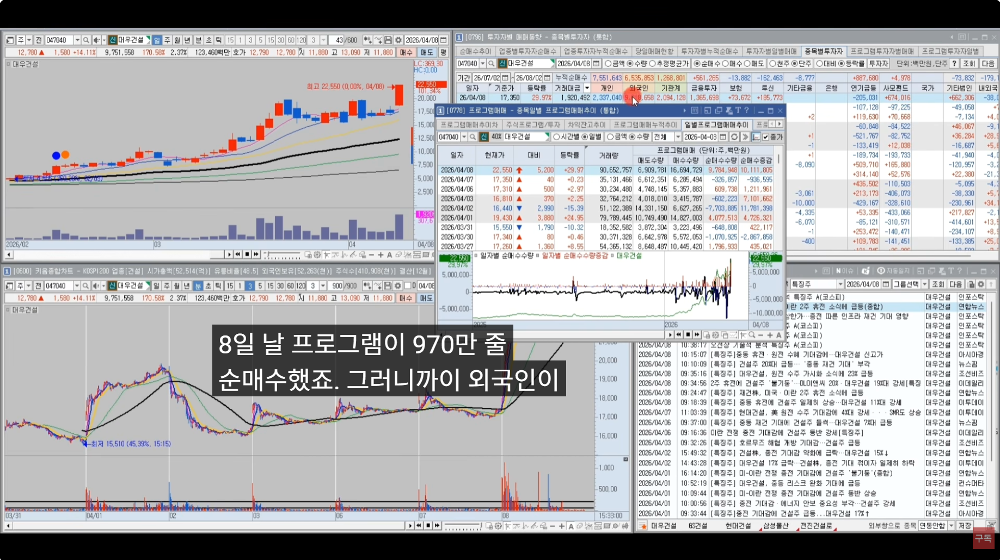</td>
  </tr>
</table>

<br/>

[[TOP]](#index)

---
### 종가배팅 예시 사례2
- 2026/04/19 일의 주도주는...
  - 광전자, 빛과전자 상한가... 광통신주 섹터
  - 부국철강, 금강철강 상한가... 철강주 섹터
  - 이날 지수는 음봉 마감
  - 즉, 거래대금이 좀 약하고 잡주성의 종목들이 강했다
  - 지수상황에 맞게 올라가는 주식들이 계속 순환이 된다
  - 지수상승장(양봉) : 거래대금 잘터지는 주도주들이 막 나온다. 1등주 대장주에서 눌림,돌파,종배 하면 되고...
  - 지수약세장(음봉) : 그전에 강했던 종목들이 좀 약세고, 새로운 테메가 순환이 돌면서 올라온다. 광통신 철강 처럼...
  - 이렇게 시장에 맞게 적용하면 된다
- 시소타기장세
  - 줄때 먹고 나온다 ⇒ 약세장에서는 전고가 돌파시도해도 욕심부리지 않는다. 
  - 강한주식은 갭하락해도 탈출기회를 준다
  - 종가배팅은 대장주에서만 해야 하는 이유다
  - 갭하락 해도 보통 30분 정도는 지켜본다
- 장초반에 저점을 만들었다면... 즉, 도지캔들...
  - 도지의 저가를 훼손하면 우하향할 가능성이 높고, 
  - 도지의 고가를 돌파하면 다시 종가까지 올라갈 가능성이 높다
  - 즉, 도지 고가를 돌파하면 본전까지 올수 있겠다 생각하고 버틸수가 있다  ⇒  본전오면 탈출, 욕심부리지 않는다
- 정말 강한종목은 갭하락 시작해도 반등이 나온다
  - 첫봉의 저가를 지켜주면 강한 반등이 나온다
  - 대신 첫봉의 저가를 이탈하면 과감하게 판다
  - 반등없이 계속 밀리면 손실이 눈떵이 처럼 커진다.
  - 강한종목은 보통 탈출할 기회를 한번은 준다

<table>
  <tr>
    <td>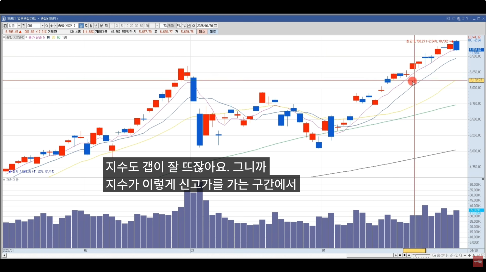</td>
    <td>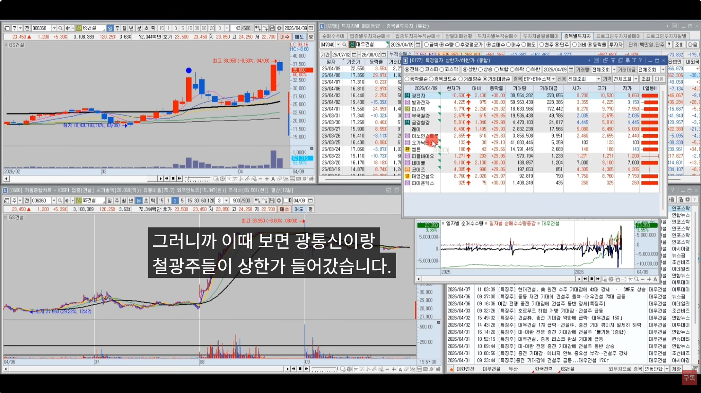</td>
  </tr>
  <tr>
    <td>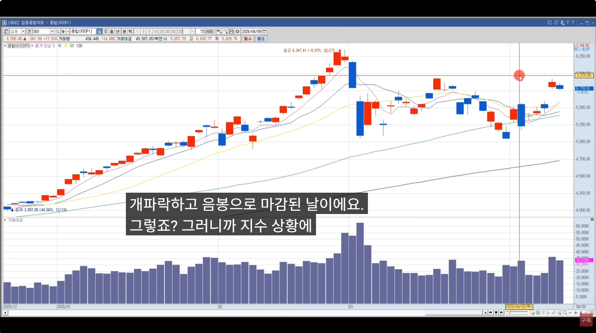</td>
    <td>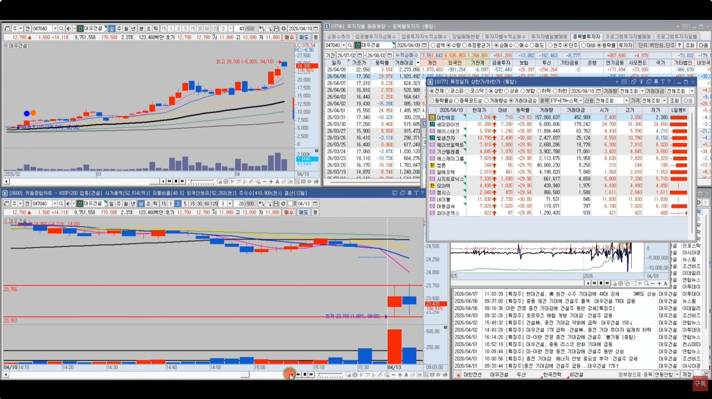</td>
  </tr>
  <tr>
    <td>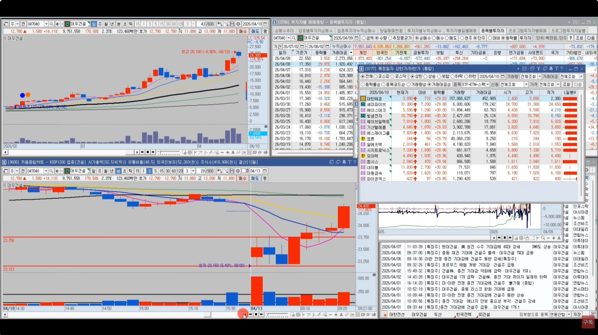</td>
    <td>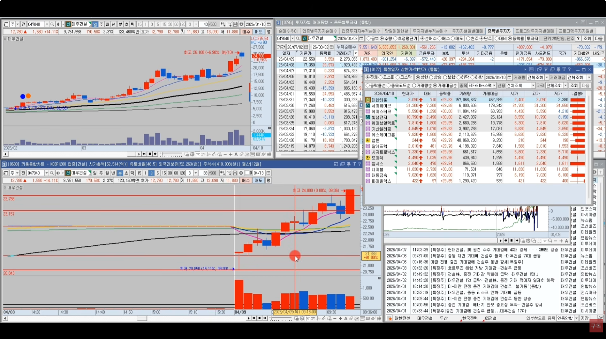</td>
  </tr>
</table>

<br/>

[[TOP]](#index)

---
### 종가배팅 예시 사례3
- 주성엔지니어링
  - 거래대금도 좋아
  - 외국인 기관 양매수
  - 거래대금 상위에 반이상이 반도체 섹터
  - 이런 종목은 상따 종가매수 한다  ⇒  보통 갭이 뜬다
  - 프로그램 순매수가 있는 종목은 차트가 매끄럽게 우상향 하지만,
  - 프로그램 수급이 안받쳐주면 가다가 밀리고 가다가 밀리고를 반복한다
  - 다음날 갭뜨고, 또 상한가를 갔다
  - 다음날 외인과 개인이 팔았고, 기관이 들어왔다 ⇒ 투신, 연기금, 사모펀드, 기타법인 등 
  - 다음날 분봉차트를 보면, 갭이 떳다가 아랫꼬리..
  - 즉, 차익실현매물후 시가회복해줄때 시가재돌파매매로 돌파가 들어오고,
  - 당일 고가 돌파하면 또 돌파들이 들어오고,
  - 또 올라가다가 밀렸을때 고점대비 3% 밀리면 마삼구간 눌림목 사는 사람들이 또 들어오고, 
  - 앞전고가 돌파할때 돌파들 또 들어오고, 
  - 눌렸을때 마삼 마륙 눌림목하는 사람들이 또 들어오고, 
  - 그러면서 주가가 반등을 하면서 계속 올라가는 것이다
  - 그래서, 돌파든 눌림이든 상따든 종배를 하든.. **그날 주도주에서 해야 된다**
  - **그날 주도주는 코스피지수가 신고가를 갈 때 나온다** 
  - 현재는 하락조정장이어서 안나온다. ⇒ 지금은 종가배팅 하지마라 
  - 최근 삼전닉스가 급등하면 모든 돈이 여기에 몰렸기 때문에 신고가를 가는 종목이 거의 없다
  - 금요일 SK하이닉스 종배를 한이유?
    - 나스닥 반도체 주가 좋았고, 애플이 급락했었다

<table>
  <tr>
    <td>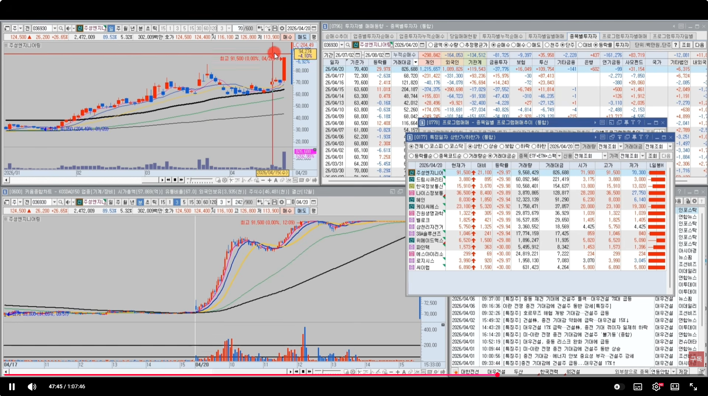</td>
    <td>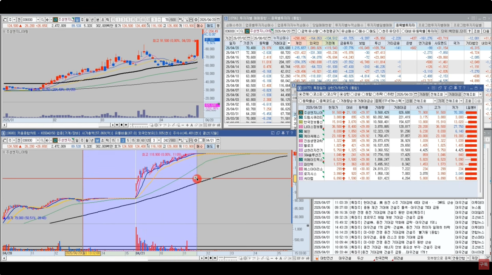</td>
  </tr>
  <tr>
    <td>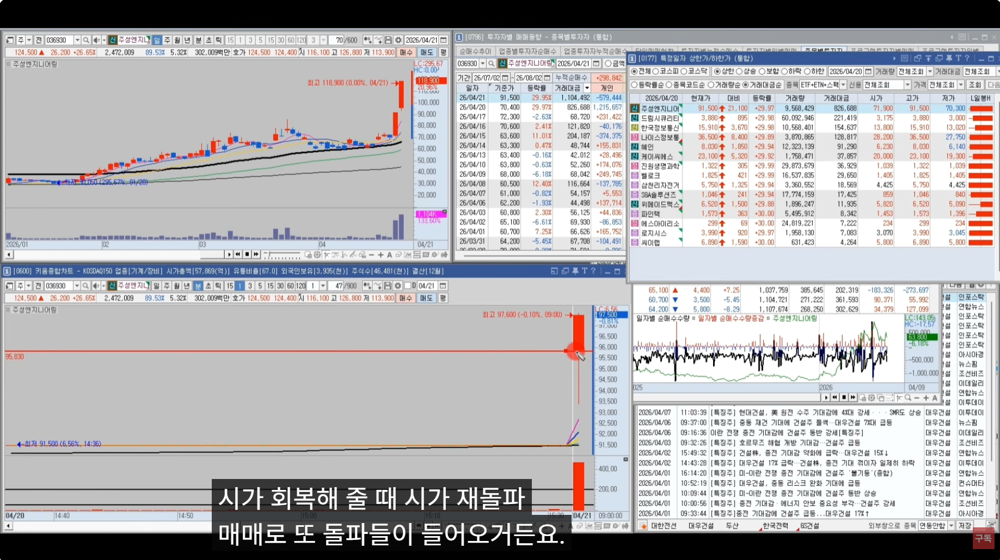</td>
    <td>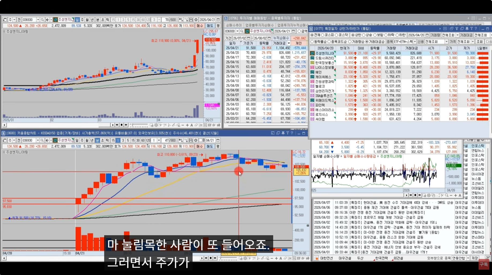</td>
  </tr>
  <tr>
    <td>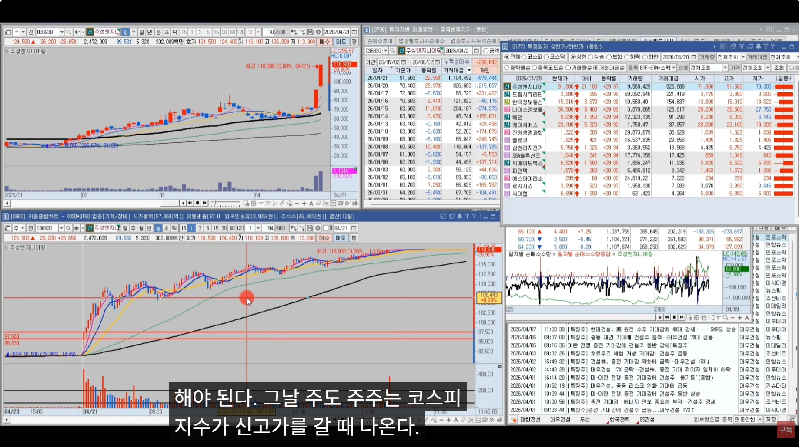</td>
    <td>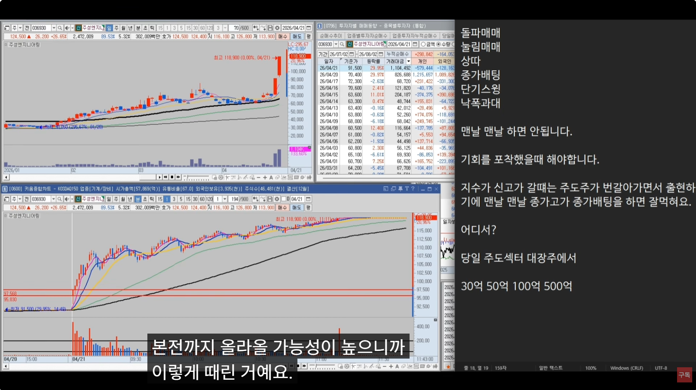</td>
  </tr>
</table>

<br/>

[[TOP]](#index)

---
### 종가배팅 예시 사례4    
- 종가배팅은 매일매일 하는게 아니다
  - 기회를 포착했을 때 해야 한다
  - 지수가 신고가 갈때는 주도주가 번갈아 가면서 출현하기에 맨날 맨날 **종가고가 종가배팅** 을 하면 잘 먹힌다
  - 당일 주도섹터 대장주에서...
  - 그래서 억대트레이더들이 지수상승장에서 막 500억 이렇게 종가배팅으로 때리는거다
    - 다음날 갭이 뜰 가능성이 높고
    - 갭이 하락하더라도 본전까지 올 가능성이 높다
  - 지금은 똑같은 기법을 사용해도 시장에 안먹힌다
    - 왜냐? 일단 당일 장대양봉 나오는 주도주가 없다
    - 시장이 하락조정장 기법도 시황에 맞게 적용
    - 신고가 구간에서 주도주 대장주가 출현하면 그 1종목에서 비중배팅해서 먹거 나오면 매매 끝
    - 이렇게 계좌를 불려 나간다
  - 초보들의 문제점이 이종목 저종목 다 건드린다
    - 스캘퍼들이 그렇게 매매하니깐
    - 좋은 종목에서 스캘핑 치면 모르겠는데
    - 아무 종목이 돌파 타점에 스캘핑
    - 그날 주도주를 잘 선정했는가?
    - 이게 더 중요하다
  - 그날 주도주를 잘 선정했으면 돌파든, 눌림이든, 종가배팅이든, 상따든 잘 먹힌다
    - 거래대금도 터지고 등락률도 좋아지는거다
    - 오늘 종가배팅은 매매원리시장기법
    - 이해와 원리 느낌
- 종가배팅 2편
  - 상승장에서 잘먹히는 종가배팅 = 종가고가 종가배팅
  - 횡보장에서 잘먹히는 종가배팅
  - 횡보장에서 잘먹히는 종가배팅

<br/>

[[TOP]](#index)

---
### 마무리
- 달달달 외워라 이런 느낌으로 가면 안된다
- 이런 흐름이구나. 머릿속으로 이해하는게 더 좋다
- 외우지말고 몸소 느껴라
- 소액으로 최소 몇개월은 훈련해야 한다
- **자기것으로 만드는 과정이 필요하다**
- 강의만  들어서는 수익 X
- **피나는 노력이 필요하다**
  - **잠잘때 빼고 하루 왠종일 주식 생각만 했다**
  - 친구 가족 다끊고
  - 그러니깐 이제 생태계를 알겠더라고
  - 여행 다닐거 다 다니고, 애인 만나고, 놀거 다 놀면서 주식으로 돈 벌고 싶다?
  - 미모사님만 보더라도 150억 가까이 버셨는데 **하루에 복기만 3~4시간**
- **주식에서 단계가 있다**
  - 1단계 : 월 300만 벌어보자
  - 2단계 : 월 1000만 벌어보자
  - 3단계 : 월 2000~3000만
  - 4단계 : 월 5000만
  - 5단계 : 월 1억
  - 앞에 단계를 뛰어넘지 못하면 나는 불가능하다
  - 하루종일 죽어라 주식만 파다보면 월 2,3천까지는 간다
- 아버님의 경우
  ```
  주식경력은 20년이 넘었다
  누적손실은 5억정도
  근데 26년 3월부터 수익이 나기 시작
  2월 19일부터 텔레그램 운영
  신고가일때 주도주를 텔레그램에서 언급하면 그 종목만 매매하고 다른종목 매매하지 마라.
  하루에 1종목에서 많아야 3종목 이것만 매매해라.
  -3% 물려도 버티고, +5% 나도 안팔고 버텨요
  바로바로 대응을 못하셔.
  좋은 종목을 진입하면 -3% -5% 순간 찍혀도 버티면 올라오더라는 거다
  상승하락 상승하락을 다 버티고 고점에서 팔더라
  타점도 잘 모르시는데..?
  ```
- 타저은 후순위
- **중요한게 종목선정**
- 텔레그램 주도주매매
  ```
  2월~5월까지는 매일 주도주가 나와서 브리핑을 매일 잘 드렸는데
  개별종목 ETF가 5월27일 인가 나왔는데, 6월부터 시장이 급격히 안좋아졌다.
  삼전닉스 안갈때는 큰손들이 장대양봉을 만들어서 주도주매매를 할 수 있게 시장환경을 조성.
  큰손들이 무리하게 장대양봉을 안만들고, 삼전닉스에서만 매매를 한다
  그래서, 6월부터 손실이 나더라
  ```
- 시장이 좋을때만 매매하고, 
- 시장이 안좋을때는 매매를 안하거나 비중을 낮춰서 매매를 한다
- 기법은 아는데 수익이 안난다
  - 종목 선정에 문제가 있거나 
  - 현재 시장 체크
  - 현재 사징에서 매매할만한 시장읹, 아닌지 객관적
  - 관망을 하거나 비중을 낮춰서 매매
- 다음주에는 종가배팅 2편으로 돌아오겠다

<br/>

[[TOP]](#index)

---
