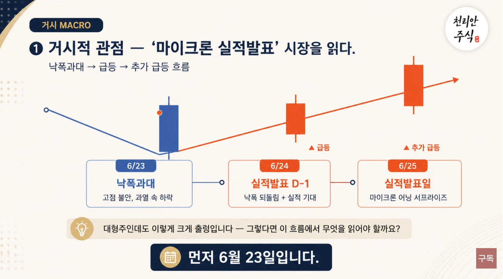
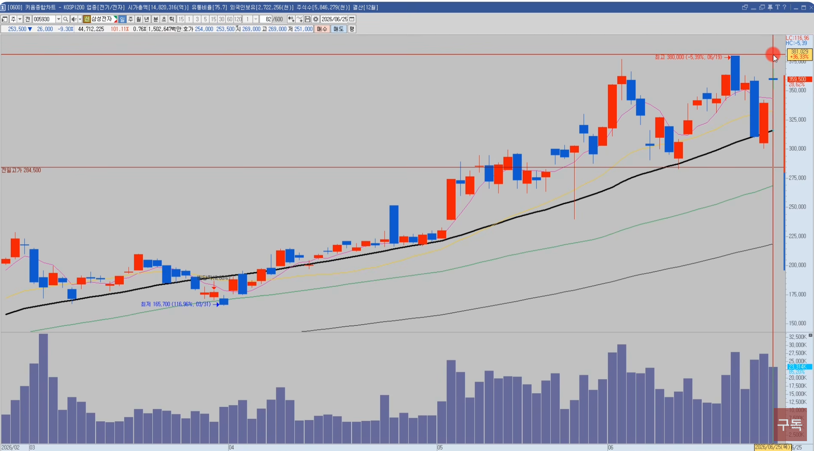

🏠 > [kostock](../../../) > [experts](../../) > [천리안주식](../) > [하반기리뉴얼](./) > `02.낙폭과대매매`

<table>
  <tr>
    <td><a href="../">[천리안주식]</a></td>
    <td><b href="../S0_INTRO_NEW">S0_INTRO</b></td>
    <td><a href="../S1_시장보는기준">S1_시장보는기준</a></td>
    <td><a href="../S2_단타의기본기">S2_단타의기본기</a></td>
    <td><a href="../S3_쉬운매매구조">S3_쉬운매매구조</a></td>
    <td><a href="../S4_주도종목실전">S4_주도종목실전</a></td>
    <td><a href="../S5_유료강의압축">S5_유료강의압축</a></td>
  </tr>
</table>

### INDEX
- [[1강] 시장을 먼저 읽는 트레이딩](#-new-1강-시장을-먼저-읽는-트레이딩)
- [[2강] 주도주 장세와 시소타기 장세의 원리](#-new-2강-주도주-장세와-시소타기-장세의-원리)
- [[3강] 장세 파악 및 종목 선정 실전편](#-new-3강-장세-파악-및-종목-선정-실전편)

---

# INTRO. 시장을 먼저 읽는 트레이딩

재생시간 | 강의제목 
------:|--------- 
  30:58 | ⭐ NEW [1강] 시장을 먼저 읽는 트레이딩
1:04:07 | ⭐ NEW [2강] 주도주 장세와 시소타기 장세의 원리
  42:47 | ⭐ NEW [3강] 장세 파악 및 종목 선정 실전편

 

---
## ⭐ NEW [2강] 낙폭과대 매매의 핵심 타이밍

### 이번 복기의 흐름
> 거시로 읽고, 일정에서 명분을 찾고, 기술적 근거로 타점을 잡는 3단계

단계 | 핵심 | 내용
:---:|-----|-----
1단계 | 거시적관점  | MACRO, 시장 흐름 읽기
2단계 | 일정       | SCHEDULE, 상승 명분 찾기
3단계 | 기술적타점  | TECHNICAL, 근거로 타점 만들기

<h4>[예시] 상따</h4>
<table>
  <tr>
    <td></td>
    <td></td>
  </tr>
  <tr>
    <td>SK하이닉스</td>
    <td>삼성전자</td>
  </tr>
</table>

