🏠 > [kostock](../../../) > [experts](../../) > [천리안주식](../) > `S1_시장보는기준`

<table>
  <tr>
    <td><a href="../">[천리안주식]</a></td>
    <td><a href="../S0_INTRO_NEW">S0_INTRO</a></td>
    <td><b href="../S1_시장보는기준">S1_시장보는기준</b></td>
    <td><a href="../S2_단타의기본기">S2_단타의기본기</a></td>
    <td><a href="../S3_쉬운매매구조">S3_쉬운매매구조</a></td>
    <td><a href="../S4_주도종목실전">S4_주도종목실전</a></td>
    <td><a href="../S5_유료강의압축">S5_유료강의압축</a></td>
  </tr>
</table> 

### INDEX
- [[S1-1강] 기법은 시장에 맞춰야 합니다](#s1-1강-기법은-시장에-맞춰야-합니다)
- [[S1-2강] 주도주는 시장이 만듭니다](#s1-2강-주도주는-시장이-만듭니다)
- [[S1-3강] 다음 주 시장은 미리 준비한다](#s1-3강-다음-주-시장은-미리-준비한다)
- [[S1-4강] 시장 중심주 복기는 이렇게 하세요](#s1-4강-시장-중심주-복기는-이렇게-하세요)
- [[S1-5강] 하나를 보면 열을 알 수 있습니다](#s1-5강-하나를-보면-열을-알-수-있습니다)
- [[S1-6강] 시장에 맞는 기법, 이제는 스스로 찾으셔야 합니다](#s1-6강-시장에-맞는-기법-이제는-스스로-찾으셔야-합니다)
- [[S1-7강] 종목 압축의 요령](#s1-7강-종목-압축의-요령)
- [[S1-8강] 이제는 운용입니다](#s1-8강-이제는-운용입니다)

---

# S1. 시장을 보는 기준
> - 이 재생목록은 모든 매매의 출발점인 ‘시장’을 다룹니다.  
> - 기법보다 먼저 시장의 방향과 흐름을 읽는 법, 주도주가 만들어지는 구조, 다음 주 시장을 준비하는 기준까지 단기 매매의 큰 틀을 정리합니다.  
> - 시장에 맞지 않는 기법은 아무 의미가 없습니다. 이 1주차는 이후 모든 강의의 기초가 됩니다.

재생시간 | 강의제목 
:------:|---------
07:36 | [1주차 1강] 기법은 시장에 맞춰야 합니다
23:47 | [1주차 2강] 주도주는 시장이 만듭니다
12:13 | [1주차 3강] 다음 주 시장은 미리 준비한다
17:00 | [1주차 4강] 시장 중심주 복기는 이렇게 하세요
21:43 | [1주차 5강] 하나를 보면 열을 알 수 있습니다
14:57 | [1주차 6강] 시장에 맞는 기법, 이제는 스스로 찾으셔야 합니다
22:38 | [1주차 7강] 종목 압축의 요령
15:55 | [1주차 8강] 이제는 운용입니다

 

---
## [S1-1강] 기법은 시장에 맞춰야 합니다

- **'시장 중심주' 복기를 통해 시장에 맞는 기법을 적용하라**
  - 아무리 고수로부터 좋은 기법을 배웠다고 해도, 시장이 안받쳐주면 말짱 도루묵
  - 상따가 잘먹힐땐 언제? 갭이 높게 뜰때
  - 상따가 안먹힐땐 언제? 갭이 낮게 뜰때 혹은 갭하락할때 혹은 상한가가 자주 깨질때
- 기술이 뛰어나서 돈을 버는게 아니고, **시장에 맞는 기법이라 돈을 버는 구조**
  - 결국 돌파, 눌림, 상따, 종가, 시가, 시간외, 일봉눌림 다 할줄 알아야 한다.
  - 기법이 계속 순환
- 물고기 잡는법
  - 시장 중심주 안에서 장중 돌파매매를 하던, 장중 눌림매매를 하던, 종가매매를 하던, 상따를 하던, 시가매매를 하던 **시장 중심주**
  - 이것을 **주도주** 라고 부르고 매주 **복기를 통해서 매수가 매도가 손절가를 조절** 한다.
  - **유연하게 시장에 맞게 변형** 을 시켜야 된다. => 쉽다    
  - 3개월 통계 : 얼추 80%~90%는 도움
- 유명강의의 맹점  
  - 보통 억대트레이드들은 자기만의 강점 그 한가지 매매법만 알려준다.
  - 여기까진 좋은데, 대신에 **시장이 바뀌면 그 기법이 잘 안먹힌다.**
  - 근데 억대트레이더인 강사는 강의가 끝나면 사라져버린다. 
  - 수강생만 개고생, 시장에 맞는 기법이 아닌데...
- 한줄 요약
  - **시장중심주에서** 돌파자리가 오면 돌파, 눌림자리가 오면 눌림, 상한가를 가면 상따, 종가베팅 자리가 오면 종베를 하고, 다음날 시가갭이 뜨면 시가매매를 하고 이렇게 하는게 **확률 높은 매매법** 이다.
  - 아무 종목이나 이자리 오면 사세요 이런 강의들은 쓰레기 강의라고 보면 된다.
  - ~보통 증권 전문가들~ 

 

[[TOP]](#index)

---
## [S1-2강] 주도주는 시장이 만듭니다

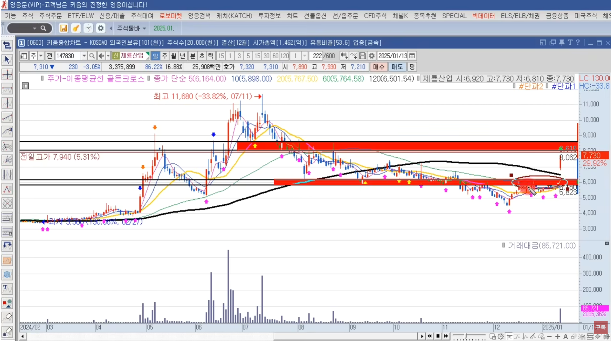
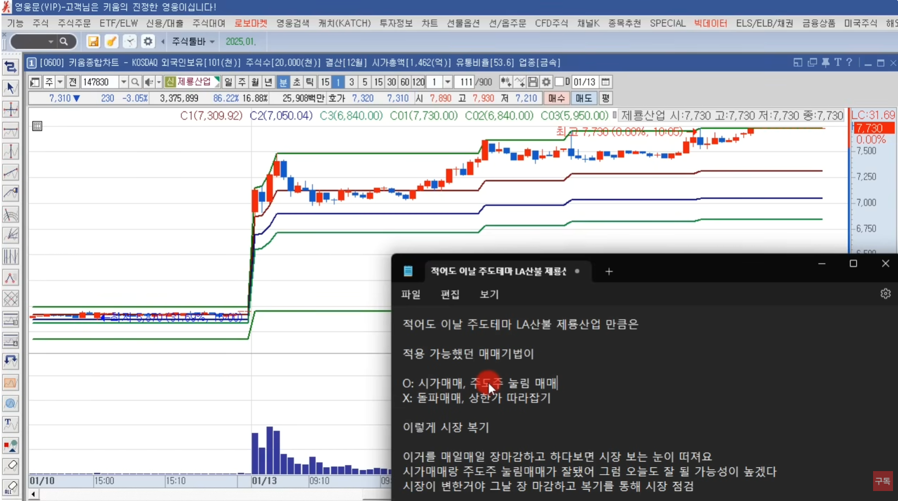

- 일봉상에서 **지지를 받던자리(저점이탈)** 가 상승할 때 **저항** 으로 본다
  - 120이평이 하락이면 상승추세는 아닌데, 상한가를 갔다.
  - 무엇인가 중요한 뉴스나 재료가 터졌다.
- 분봉상에서 맥점은
  - [x] 갭상승으로 뜬 시가
  - [x] 고점을 찍고 눌림자리
  - [ ] 돌파자리는 바로 밀렸으므로 아님
    - 돌파수급은 들어왔지만 후속수급이 들어오지 않아 바로 밀리고...
- 적어도 이날 주도테마 LA산불 제룡산업 만큼은 적용했던 매매기법이
  - [x] : 시가매매, 주도주 눌림매매(C1 눌림매매)
  - [ ] : 돌파매매, 상한가 따라잡기
- 일봉상 악성 저항대를 돌파하는지 쳌
- 분봉상 피보나치 C1,C2,C3(중심) 눌림체크, Q1,Q2,Q3 라인 체크

 

[[TOP]](#index)

---
## [S1-3강] 다음 주 시장은 미리 준비한다

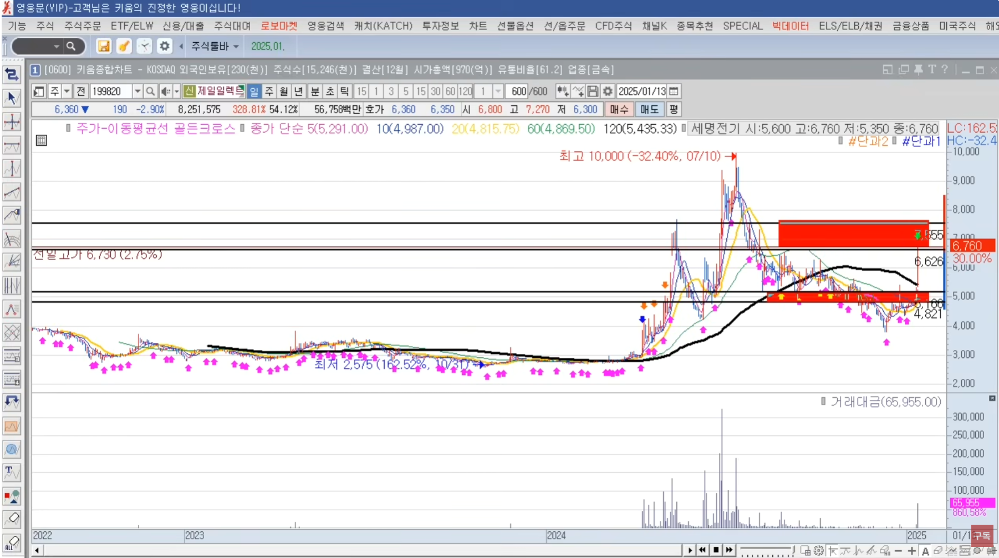
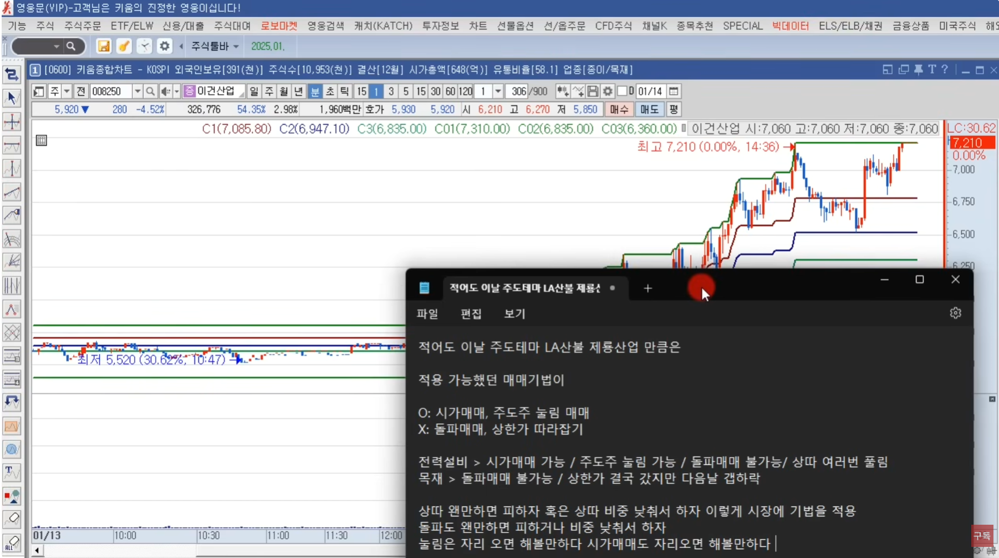
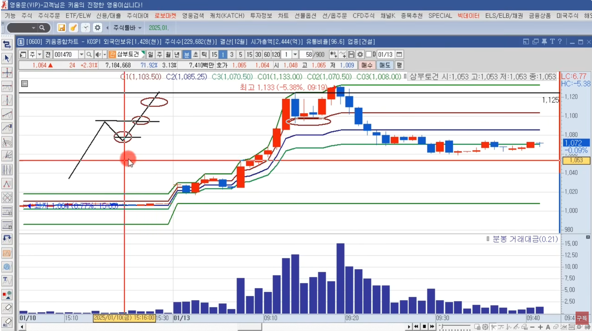
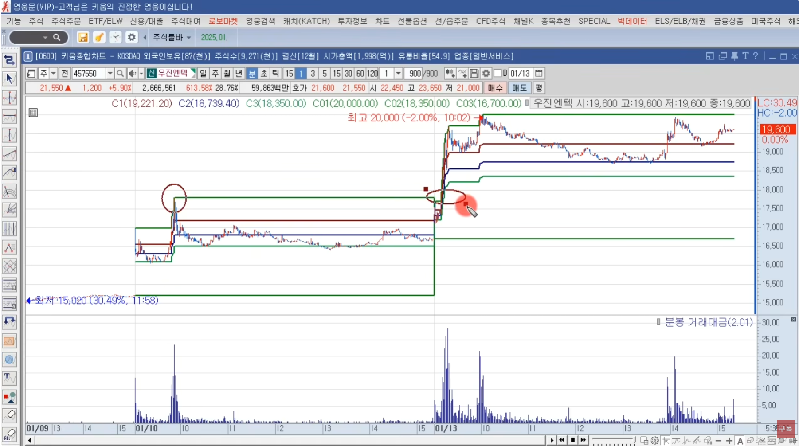

- 과거 주도주였던 적이 없었던 종목들은 보지 않는다.
- 이슈도 없이 갑작스레 올라간 종목들도 보지 않는다. (피뢰침)
- 돌파만하면 -2~3% 짱똘이 나오는것은 돌파매매하지 않는다.
- 첫눌림과 두번째 눌림은 반등이 잘 나오는 편이다.
- 시초,시베로 돌파자리를 먹을수 있는 사람은 미리 시나리오를 세운 사람들뿐이다.
- 주도주눌림 : 돌파는 수익내기 힘들고, 눌림은 익절자리를 주더라

 

[[TOP]](#index)

---
## [S1-4강] 시장 중심주 복기는 이렇게 하세요

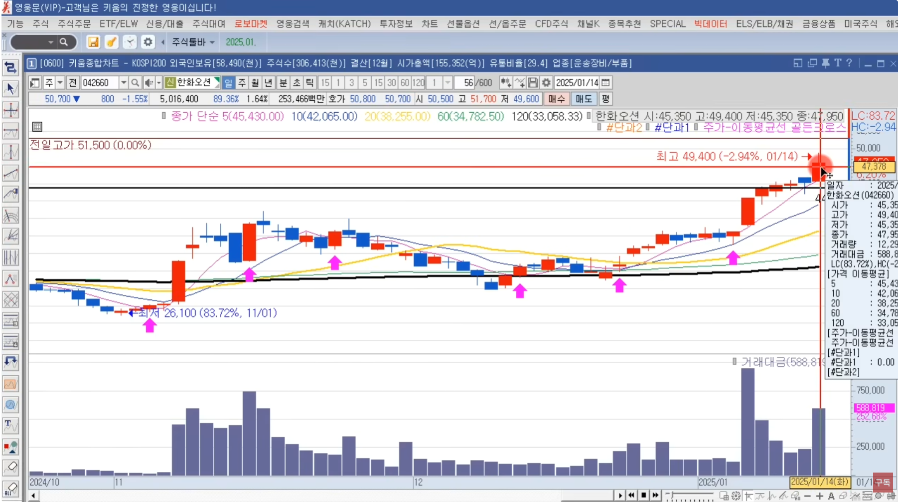
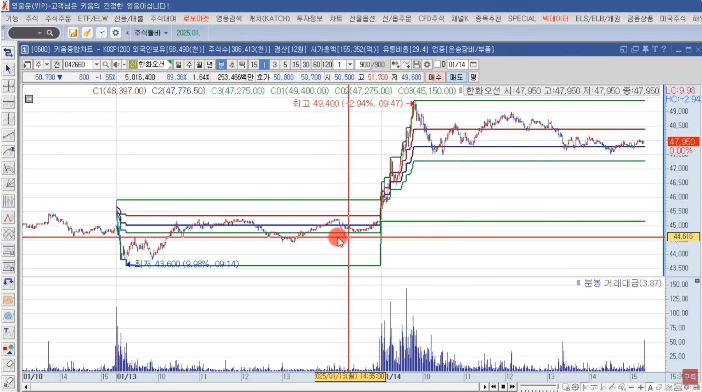
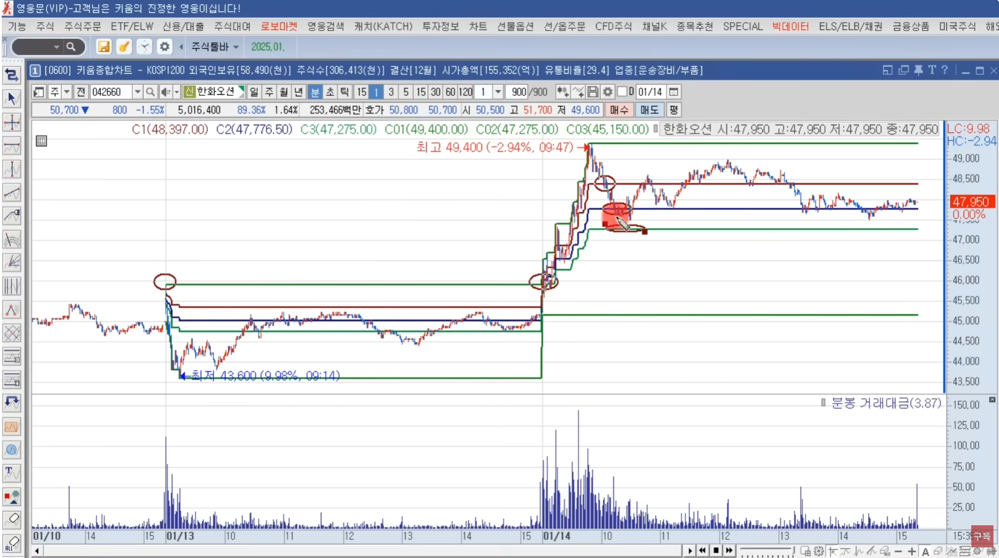
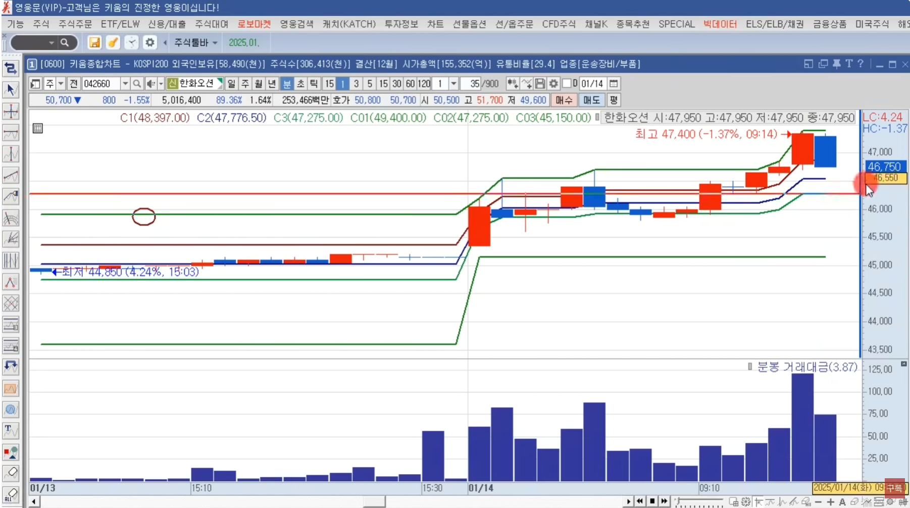
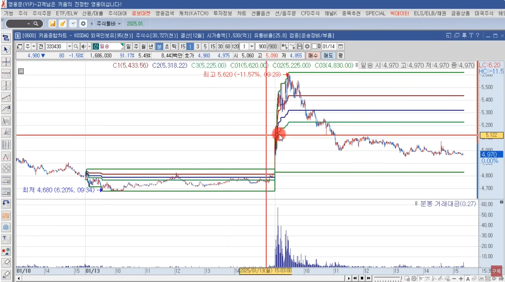
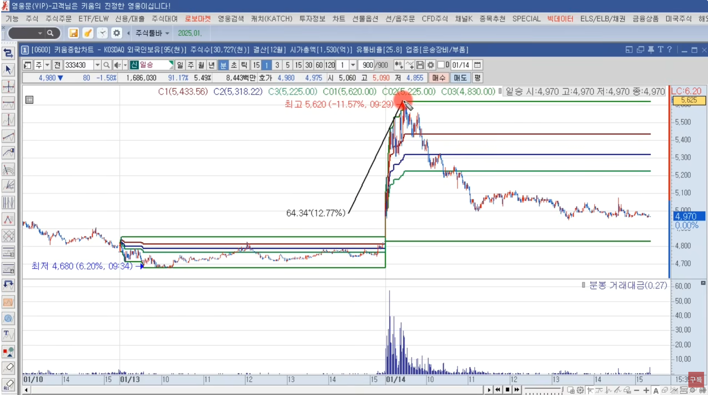
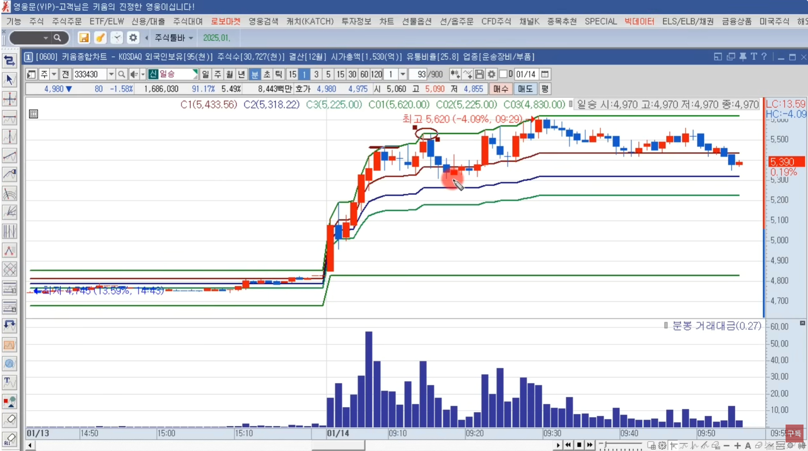

- 장초부터 돌파만 하면 윗꼬리 달고 내려온다. 
- 뒤에도 유사한 패턴이 계속 이어짐
- 돌파매매가 안되는 장세임
- 분봉을 확대해서 보면 알수 있다.
- 일승도 돌파후 잘 올라간거 같지만, 분봉상 자세히 보면 돌푸후 계속 매수가를 깨는 아랫꼬리가 계속 달린다.
- 오히려 눌림이 더 나은 장이다.
- **매일 복기를 해보다보면, 주마다/일마다 매매트랜드가 있다.**
- 돌파는 본전아래로 떨어지면 손절, C1/C2에서 눌림자리 주고 C3까지는 가지 않았다.
- 눌림은 C1에서 3번이나 반등이 나왔지만, 돌파는 단한번도 나오지 않았다.
- 첫눌림에 대한 반등 확률은 높다. C1/C2 자리. 
- 1번째 2번째 반등은 잘 나왔지만, 3번째 눌림은 잘하지 않는다. 보면 계속 하락!
- **돌파가 안되는 장이면 눌림을 해야겠다. 이렇게 생각하라!**

 

[[TOP]](#index)

---
## [S1-5강] 하나를 보면 열을 알 수 있습니다

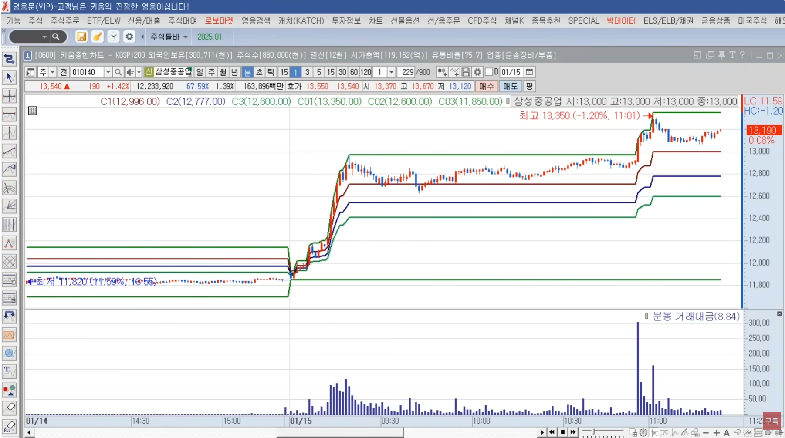
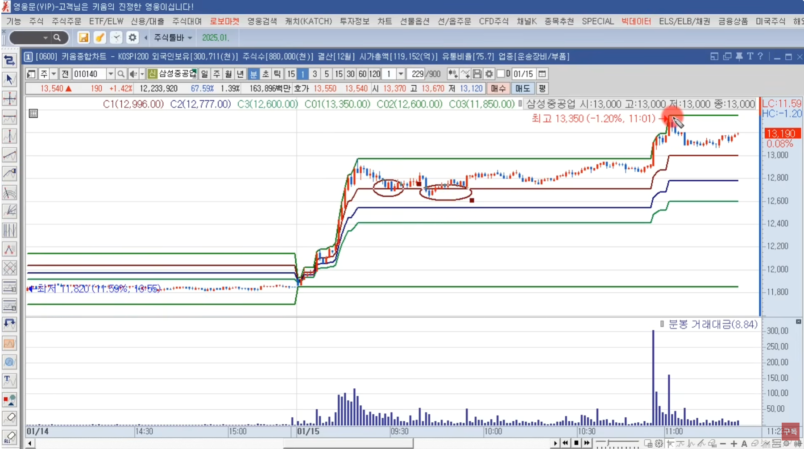
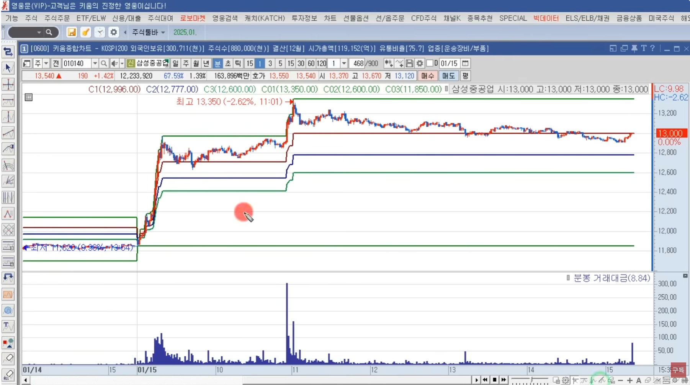
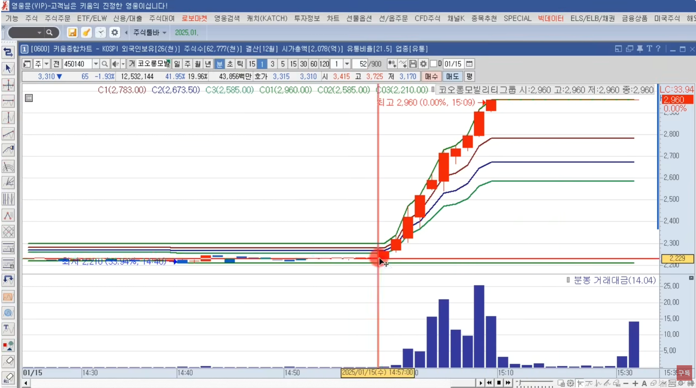

- 가야할 자리에서 안가면 손절한다. 초보가 아닌 이상.
- 돌파하고나서 바로 안가는 경우가 많다. 
- 크게 보면 많이 간거 같아도, 확대해서 보면 손절컷이 너무 많다. 
- 눌림매매 트레이더는, 돌파 트레이더의 손절자리에서 물량을 받아 먹고 올리간다.
- 장초에 미리 관종에 등록해놓고 보고 있던 사람들 말구는 돌파자리에서 매매하기 어렵다.
- 당일 눌림자리를 안줘도, 다음날 갭하락으로 눌림자리 준다.
- 전고돌파는 많이 먹어야 1~2%라면, 굳이 돌파매매를 할 필요가 없다.
- 반등눌림은 대략 4.5% 익절
- 돌파에서 재매수 할경우는, 오직 동적 VI
- 결과론적으로 계속 끌고가면 수익이지만, 장중에 쉽지 끌고가지 않는다.
- 스스로 소액으로 결정을 진단한다.
- C3를 이탈하면 손절한다.
- C3아래에서 물타기하는 사람은 뇌동이나 물타기 하는 사람이 되부분.

 

[[TOP]](#index)

---
## [S1-6강] 시장에 맞는 기법, 이제는 스스로 찾으셔야 합니다

 

[[TOP]](#index)

---
## [S1-7강] 종목 압축의 요령

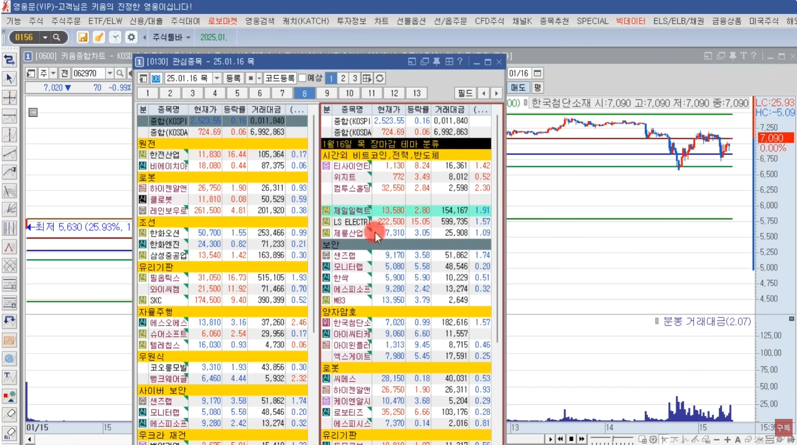
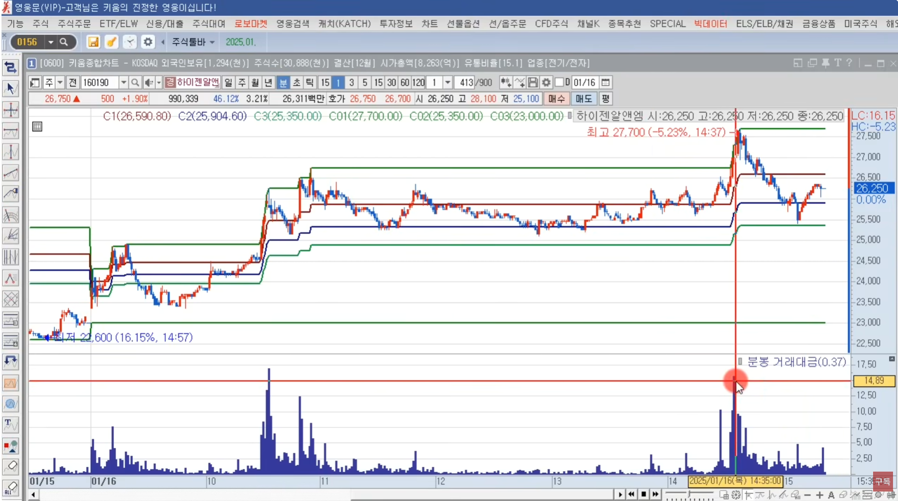
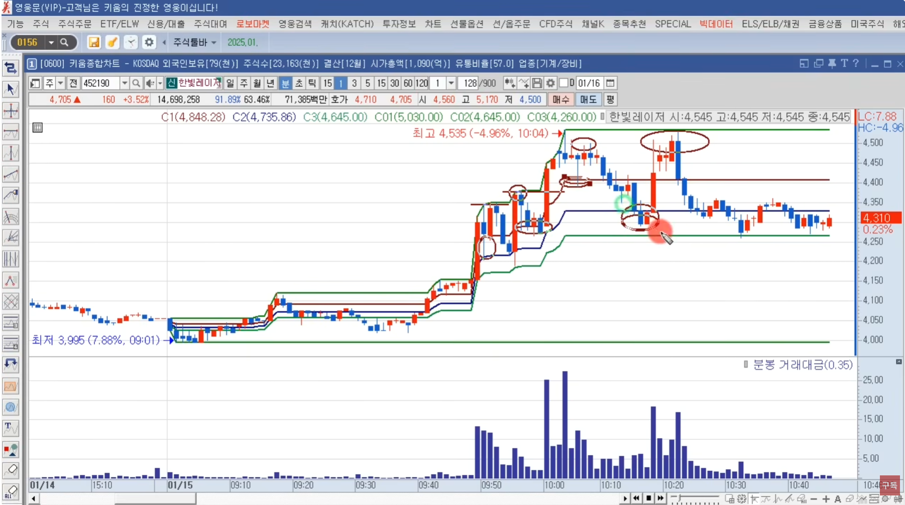

- 그날의 대장주는 15%까지는 상승한 종목중에서 타점을 노린다.
  - C1, C2 눌림자리에서 쫄지말고 매수, C3 이탈하면 손절
  - 당일주도주는 C3를 벗어나지 않는다. 보통 C1,C2자리에서 반등
  - 돌파시 거래량이 터지는지 확인
  - 돌파후 계속가면 돌파장세, 돌파하자마자 밀리면 눌림장세
  - 돌파도 눌림도 처음과 두번째가 잘먹힌다.
- **종목압축**
  - **눌림자리는 15%이상 상승한 종목중, 돌파후에 C1,C2자리** 에 50%씩 분할로 들어간다.
  - **전고를 돌파하면 익절하고, C3를 이탈하면 손절** 한다.
  - **돌파후 첫번째와 두번째에서 매매** 하고, 세번째 이후는 관망 => 이것이 **종목압축** 의 핵심!!
  - **대장주만 공략** 하는 이유 
    - 당일 대장주는 C3를 이탈하지 않지만, C1, C2 눌림자리는 준다!!!
    - 가장 확률높은 매매법이다. 
    - 단, **대장주가 상한가를 갔을때, 계속해서 돈이 들어온다면... 2등주 공략도 가능!!**
- 돌파장세는 거래량과 함께 강한 돌파후, 계속 양봉이 빵빵 터지고,
- 눌림장세는 박스권상단 터치 혹은 신고가를 갱신후, 윗꼬리 물고 빠진다. 

 

[[TOP]](#index)

---
## [S1-8강] 이제는 운용입니다

 

[[TOP]](#index)

---
