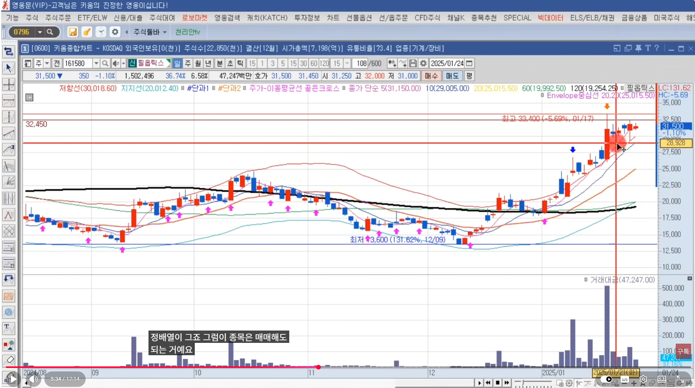
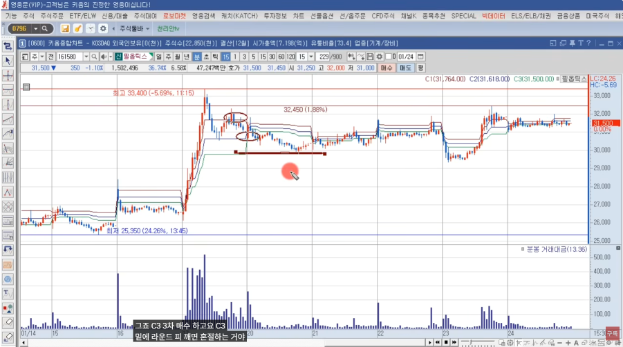

🏠 > [kostock](../../../) > [experts](../../) > [천리안주식](../) > `S2_단타의기본기`

<table>
  <tr>
    <td><a href="../">[천리안주식]</a></td>
    <td><a href="../S0_INTRO_NEW">S0_INTRO</a></td>
    <td><a href="../S1_시장보는기준">S1_시장보는기준</a></td>
    <td><b href="../S2_단타의기본기">S2_단타의기본기</b></td>
    <td><a href="../S3_쉬운매매구조">S3_쉬운매매구조</a></td>
    <td><a href="../S4_주도종목실전">S4_주도종목실전</a></td>
    <td><a href="../S5_유료강의압축">S5_유료강의압축</a></td>
  </tr>
</table> 

### INDEX
- [[S2-1강] 이동평균선 눌림매매의 기준](S2_단타1.md#s2-1강-이동평균선-눌림매매의-기준)
- [[S2-2강] 이동평균선 눌림매매의 핵심](S2_단타1.md#s2-2강-이동평균선-눌림매매의-핵심)
- [[S2-3강] 수급매매의 상승 원리](S2_단타1.md#s2-3강-수급매매의-상승-원리)
- [[S2-4강] 종목 압축하는 방법](S2_단타1.md#s2-4강-종목-압축하는-방법)
- [[S2-5강] 확률 높은 대형주 눌림목](S2_단타1.md#s2-5강-확률-높은-대형주-눌림목)
- [[S2-6강] 역사적 신고가 매매](S2_단타1.md#s2-6강-역사적-신고가-매매)
- [[S2-7강] 신고가 매매의 원리와 이해](S2_단타1.md#s2-7강-신고가-매매의-원리와-이해)
- [[S2-8강] 신고가 매매 수강생들이 헤맸던 이유와 해결법](S2_단타1.md#s2-8강-신고가-매매-수강생들이-헤맸던-이유와-해결법)
- [[S2-9강] 주도주 눌림매매](S2_단타1.md#s2-9강-주도주-눌림매매)
- [[S2-10강] 주도주 눌림매매 실전 사례](S2_단타1.md#s2-10강-주도주-눌림매매-실전-사례)
- [[S2-11강] 신규주 매매 조건값 3가지](S2_단타1.md#s2-11강-신규주-매매-조건값-3가지)
- [[S2-12강] 신규주 매매 주의사항 3가지](S2_단타1.md#s2-12강-신규주-매매-주의사항-3가지)
- [[S2-13강] 방향을 정하는 자리는 총 3번 나옵니다](S2_단타1.md#s2-13강-방향을-정하는-자리는-총-3번-나옵니다)
- [[S2-14강] 시장 보는 눈 키우기](S2_단타1.md#s2-14강-시장-보는-눈-키우기)
- [[S2-15강] 돈의 흐름 원리와 이해](S2_단타1.md#s2-15강-돈의-흐름-원리와-이해)
- [[S2-16강] 뉴스 및 재료의 해석](S2_단타1.md#s2-16강-뉴스-및-재료의-해석)
- [[S2-17강] 시크릿 강의](S2_단타1.md#s2-17강-시크릿-강의)
- [[S2-18강] 프로그램 매매 원리와 이해](S2_단타1.md#s2-18강-프로그램-매매-원리와-이해)
- [[S2-19강] 단기 스윙 원리와 이해](S2_단타1.md#s2-19강-단기-스윙-원리와-이해)
- [[S2-20강] 단기 스윙 원리와 이해 2](S2_단타1.md#s2-20강-단기-스윙-원리와-이해-2)
- [[S2-21강] 주봉 매매 원리와 이해](S2_단타1.md#s2-21강-주봉-매매-원리와-이해)
- [[S2-22강] 미국 주식의 종목 선정부터 매매 기법까지](S2_단타1.md#s2-22강-미국-주식의-종목-선정부터-매매-기법까지)
- [[S2-23강] 미국 주식의 모든 것](S2_단타1.md#s2-23강-미국-주식의-모든-것)
- [[S2-24강] 물고기 스스로 잡는 방법](S2_단타1.md#s2-24강-물고기-스스로-잡는-방법)
- [[S2-25강] 짝꿍매매 원리와 이해](S2_단타1.md#s2-25강-짝꿍매매-원리와-이해)
- [[S2-26강] 호가창의 모든 것](S2_단타1.md#s2-26강-호가창의-모든-것)

---

# S2. 단타의 기본기 (유료강의 핵심 압축)
> - 유료 강의를 수십 개 이상 들어도 결국 반복되던 단타 매매의 기본 구조를 한 번에 정리한 재생목록입니다.  
> - 이동평균선 매매, 수급 매매, 종목 압축을 비롯해 대형주 매매, 신규주 매매, 역사적 신고가 매매, 그리고 호가창까지 단타 매매에 필요한 핵심 요소를 총 26개의 영상으로 체계적으로 정리했습니다.  
> - 단타 매매를 오래 해왔음에도 계좌가 안정되지 않는 이유는 대부분 기본기가 정리되지 않았기 때문입니다.  
> - 이 재생목록은 기법을 늘리기 위한 강의가 아니라, 단타 매매에 반드시 필요한 기준을 정리하는 데 목적이 있습니다.

재생시간 | 강의제목 
:------:|---------
12:15 | [2주차 1강] 이동평균선 눌림매매의 기준
43:21 | [2주차 2강] 이동평균선 눌림매매의 핵심
21:24 | [2주차 3강] 수급매매의 상승 원리
38:00 | [2주차 4강] 종목 압축하는 방법
23:56 | [2주차 5강] 확률 높은 대형주 눌림목
21:10 | [2주차 6강] 역사적 신고가 매매
22:57 | [2주차 7강] 신고가 매매의 원리와 이해
14:16 | [2주차 8강] 신고가 매매 수강생들이 헤맸던 이유와 해결법
24:53 | [2주차 9강] 주도주 눌림매매
27:56 | [2주차 10강] 주도주 눌림매매 실전 사례
32:09 | [2주차 11강] 신규주 매매 조건값 3가지
21:13 | [2주차 12강] 신규주 매매 주의사항 3가지
31:35 | [2주차 13강] 방향을 정하는 자리는 총 3번 나옵니다
20:25 | [2주차 14강] 시장 보는 눈 키우기
20:50 | [2주차 15강] 돈의 흐름 원리와 이해
41:05 | [2주차 16강] 뉴스 및 재료의 해석
29:10 | [2주차 17강] 시크릿 강의
31:18 | [2주차 18강] 프로그램 매매 원리와 이해
15:15 | [2주차 19강] 단기 스윙 원리와 이해
13:07 | [2주차 20강] 단기 스윙 원리와 이해 2
14:01 | [2주차 21강] 주봉 매매 원리와 이해
23:20 | [2주차 22강] 미국 주식의 종목 선정부터 매매 기법까지
18:45 | [2주차 23강] 미국 주식의 모든 것
14:03 | [2주차 24강] 물고기 스스로 잡는 방법
22:05 | [2주차 25강] 짝꿍매매 원리와 이해
16:56 | [2주차 26강] 호가창의 모든 것


<br/>

---
## [S2-1강] 이동평균선 눌림매매의 기준
> 직장인 유료강의 이니셜 E, 이니셜 J 

- **정형화된 매매틀만 가지고는 안되고, 응용을 할줄 알아야 한다.**
- **종목 조건값**
```
1. 섹터/개별
2. 거래대금 300억이상 터졌냐
3. 정배열이냐 역배열이냐
4. 재료 지속적이냐 일시적이냐
```




- 일봉상 기준봉 포착후 C1,C2,C3에서 분할매수, 5일선 이탈하면 손절
- 매수후 반등나오면 수익, 아니면 손실
- 예시. 필옵틱스
  - 섹터, 거래대금 300억이상, 정배열 => OK
  - 첫번째 눌림 C1,C2 자리에서 분할 매수
  - 반등하면 매도, C3이탈 or 5일선깨지면 손절

<br/>

[[TOP]](#index)

---
## [S2-2강] 이동평균선 눌림매매의 핵심

- 대형주장세에서는 프로그램을 많이 본다.
- 주식이 상승하는 이유와 하락하는 이유도 알아야 한다.
  - 지수가 빠질때는 아무리 좋은 종목도 거의 대부분 같이 빠진다.
  - 업황도 봐야하고, 뉴스에서 [특징주]에서 근거가 충분하면 오를수밖에 없다.
- 매물대 확인
  - 매물대 아래에 있더라도, 지수가 반등하면 올라간다.
  - 이평선은 저항선역할을 한다.
  - 뚫고 올라가면 스윙으로 끌고가는게 수익이 더 클수 있다.
- 외인과 기관
  - **투신/사모펀드/연기금등** 은 **스마트머니** ⇒ 왜냐면 투신에서 매수결정을 하려면 팩트체크를 하기때문이다 
  - 소위 찌라시를 만드는 사람
  - 바닥권에서 **투신/사모펀드/연기금** 이 20일,30일 계속 매수한다. 
  - 이 3개 기관은 한세트이다. 한꺼번에 3개기관이 순매수하면 뭔가가 있다. 
  - 예를들어, 200만주던 300만주던 모을꺼면 꾸준하게 모아간다.
  - 꾸준하게 사모았다가 어느순간 대량매도를 한다면, 고점이 거의 다 왔다는 의미 ⇒ 단타로 대응 
- 단기스윙
  - 매일 아침 주도주 시가베팅은 피곤하다.
  - 마인드
    - 좋은종목 << 이종목을 들고 있을때 조급함이 없어야 된다
    - 장세에 맞는 섹터안의 종목
    - 전력설비, AI반도체, 유리기판, 로봇, 자율주행, 전후재건
    - 주도테마를 자유자재로 특징주를 띄울수 있다?
    - 이게 최고의 매매
    - 잠잠할때 몇일 모아가다가 몇십억 모아서 특징주 띄워서 팔아먹기 << 최고의 매매
    - 우리는 이걸 못한다. ⇒ 우리 색깔에 맞게 옷을 입을수 밖에 없는 것이다.
  - 단기스윙은 대형주 지수가 빠져도 얼마안빠지고 지수가 올라도 얼마 안오르는
  - 타점이 중요한게 아니고 방향성이 중요하다
  - 과거의 끼, 거래대금, 섹터 재료의 크기, 수급의 연속성
  - 이게 맞아도 무조건 다 올라가는것은 아니지만, 올라갈 확률은 높다.
  - 한편의 영화를 보고 끝나는 느낌이고, 
  - 시청자가 스스로 물고기를 잡을 줄 알아야 한다.
  - 두산에너빌리티
    - 미국시장 뉴스케일 파워 << 원전 대장 역사적신고가 주가도 바닥대비 엄청 몇배 이상
    - 수급의 연속성
    - 과거의 끼
    - 거래대금도 받쳐주고
    - 두산에너빌리티는 전형적인 수급주
    - 신고가 영역에서 개인들이 막들어오기 시작 ⇒ 신고가돌파 강의를 들은 사람이 많다.
  - 에코프로
    - 고점임에도 개인들이 꾸준하게 파는데, 프로그램이 계속 샀다
    - 역사적 신고가 갱신
    - 세력이 들어오면 주가는 펌핑이 된다.
    - 이때 스마트머니가 들어왔다고 얘기함. 
    - 1000원대의 주식이 수십만원 넘게 갔었다.
    - 개인과 세력의 손바뀜
    - 공매도 하다가 계속 올라가면 공매수로 리스크관리
- 외인,기관이 산다고 주가가 무조건 올라가는 것은 아니다.
  - 쌍끌이 매수가 들어왔을때, 주가의 움직임을 봐야 한다.
  - 세력이 파는데도 주가가 올라간다면, 사는데도 내려간다면 손바뀜이 일어나고 있다.
  - 주가를 끌어올린 주체가 누구인지 확인하라
  - 외인,세력이 아무리 물량을 많이 모아도, 개인이 받아줘야 주가가 올라가는데... 
  - 안받아주면 주가는 계속 떨어진다.
  - **주가가 올라가려면 누군가와 손바뀜이 있어야 한다.** 


<br/>

[[TOP]](#index)

---
## [S2-3강] 수급매매의 상승 원리

- **기관보유수량 외국인보유수량, 개인보유수량** 을 거래량차트에서 표시
- 주가를 올리는 주체가 누구인지 확인을 하고, 주가를 끌고가는 주체의 순매수를 체크한다.
- **주체가 던지는데 주가가 올라가면 손바뀜, 던지는데 주가가 내려가면 고점**
- **주체가 대량매수한 다음날 매매동향을 확인** 하라.
  - 주체가 팔지않으면 스윙으로 끌고 갈 수 있는 것이다.
  - 프로그램 특성이 순매수로 장대양봉을 만들어 놓고, 다음날 바로 파는 패턴도 있다.
  - 주가를 올린주체가 팔기시작하면 대응조치를 해야 한다.
  - 손바뀜으로 끌고 갈수 있는지, 어제 판거 오늘 다팔수도 있겠구나~ 판단해야 한다.
  - 주체가 파는데 주가가 유지되면, 누군가 방어하고 있는것이고..주가가 하락하면 주체가 그냥 던지는거다.
- 스윙으로 끌고갈지, 눌림으로 대응할지..
- **피보나치**
  - 주가가 피보나치 위에 있으면 눌림
  - **피보나치 다 깨고 내려가면, 최소 C3에서 손절** 해야 한다.
  - 하락을 멈추고, **반등이 나와도 C3에서는 일단 팔아야 한다.**
  - **C1,C2,C3는 매물대다.** 물타기 한사람도 있고..
  - 이사람들은 본전만 와도 팔아버린다.
  - 기준봉날의 C3를 보고 대응
  - **피보나치는 심리적인 저항대** 이다.  
  - 전날 갭상승을 했으면, 갭을 다 메꿀수도 있다. 
  - 5일선 깨지면 무조건 팔아야한다. 전날보다 5일선이 더 올라와서 빨리 깨질수 있다.
- 주식은 누군가에게 떠넘겨야 한다.
  - **주가를 팔아먹기 위해서 끌어올리는 경우가 많다.**
  - 끌어올린다음 던지면, 개인이 눌리자리에서 좋다고 매수하고 있다.
  - 결국 제자리까지 내려오기 때문에.. 
  - 손절을 못하면 계좌도 박살나고, 시간도 박살난다.
- 전고점을 돌파하고, 신고가까지 거리가 가까워도...
  - 매수주체가 던지고 빠져나가면, 다음날 급락


<br/>

[[TOP]](#index)

---
## [S2-4강] 종목 압축하는 방법

<br/>

[[TOP]](#index)

---
## [S2-5강] 확률 높은 대형주 눌림목

<br/>

[[TOP]](#index)

---
## [S2-6강] 역사적 신고가 매매

<br/>

[[TOP]](#index)

---
## [S2-7강] 신고가 매매의 원리와 이해

<br/>

[[TOP]](#index)

---
## [S2-8강] 신고가 매매 수강생들이 헤맸던 이유와 해결법

<br/>

[[TOP]](#index)

---
## [S2-9강] 주도주 눌림매매

<br/>

[[TOP]](#index)

---
## [S2-10강] 주도주 눌림매매 실전 사례

<br/>

[[TOP]](#index)

---
## [S2-11강] 신규주 매매 조건값 3가지

<br/>

[[TOP]](#index)

---
## [S2-12강] 신규주 매매 주의사항 3가지

<br/>

[[TOP]](#index)

---
## [S2-13강] 방향을 정하는 자리는 총 3번 나옵니다

<br/>

[[TOP]](#index)

---
## [S2-14강] 시장 보는 눈 키우기

<br/>

[[TOP]](#index)

---
## [S2-15강] 돈의 흐름 원리와 이해

<br/>

[[TOP]](#index)

---
## [S2-16강] 뉴스 및 재료의 해석

<br/>

[[TOP]](#index)

---
## [S2-17강] 시크릿 강의

<br/>

[[TOP]](#index)

---
## [S2-18강] 프로그램 매매 원리와 이해

<br/>

[[TOP]](#index)

---
## [S2-19강] 단기 스윙 원리와 이해

<br/>

[[TOP]](#index)

---
## [S2-20강] 단기 스윙 원리와 이해 2

<br/>

[[TOP]](#index)

---
## [S2-21강] 주봉 매매 원리와 이해

<br/>

[[TOP]](#index)

---
## [S2-22강] 미국 주식의 종목 선정부터 매매 기법까지

<br/>

[[TOP]](#index)

---
## [S2-23강] 미국 주식의 모든 것

<br/>

[[TOP]](#index)

---
## [S2-24강] 물고기 스스로 잡는 방법

<br/>

[[TOP]](#index)

---
## [S2-25강] 짝꿍매매 원리와 이해

<br/>

[[TOP]](#index)

---
## [S2-26강] 호가창의 모든 것

<br/>

[[TOP]](#index)

---


<br/>

[[TOP]](#index)

---
