🏠 > [kostock](../../../) > [experts](../../) > [천리안주식](../) > `S2_단타의기본기`

<table>
  <tr>
    <td><a href="../">[천리안주식]</a></td>
    <td><a href="../S0_INTRO_NEW">S0_INTRO</a></td>
    <td><a href="../S1_시장보는기준">S1_시장보는기준</a></td>
    <td><a href="../S2_단타의기본기">S2_단타의기본기</a></td>
    <td><a href="../S3_쉬운매매구조">S3_쉬운매매구조</a></td>
    <td><a href="../S4_주도종목실전">S4_주도종목실전</a></td>
    <td><a href="../S5_유료강의압축">S5_유료강의압축</a></td>
  </tr>
  <tr>
    <td colspan="7" align="center"> 
      <a href="S2_단타1.md">단타1</a> 🟥  
      <b href="S2_단타2.md">단타2</b> 🟧 
      <a href="S2_단타3.md">단타3</a> 🟨 
      <a href="S2_단타4.md">단타4</a> 🟩 
      <a href="S2_단타5.md">단타5</a> 🟦 
      <a href="S2_단타6.md">단타6</a> 🟪 
      <a href="S2_단타7.md">단타7</a>  
    </td>
  </tr>
</table> 

### INDEX

#### 단타2.
- [[S2-5강] 확률 높은 대형주 눌림목](S2_단타2.md#s2-5강-확률-높은-대형주-눌림목)
- [[S2-6강] 역사적 신고가 매매](S2_단타2.md#s2-6강-역사적-신고가-매매)
- [[S2-7강] 신고가 매매의 원리와 이해](S2_단타2.md#s2-7강-신고가-매매의-원리와-이해)
- [[S2-8강] 신고가 매매 수강생들이 헤맸던 이유와 해결법](S2_단타2.md#s2-8강-신고가-매매-수강생들이-헤맸던-이유와-해결법)
- [[S2-9강] 주도주 눌림매매](S2_단타2.md#s2-9강-주도주-눌림매매)
- [[S2-10강] 주도주 눌림매매 실전 사례](S2_단타2.md#s2-10강-주도주-눌림매매-실전-사례)

---

# S2. 단타의 기본기 (유료강의 핵심 압축)
> - 대형주 눌림목
> - 역사적 신고가 매매
> - 주도주 눌림매매

재생시간 | 강의제목 
:------:|---------
23:56 | [2주차 5강] 확률 높은 대형주 눌림목
21:10 | [2주차 6강] 역사적 신고가 매매
22:57 | [2주차 7강] 신고가 매매의 원리와 이해
14:16 | [2주차 8강] 신고가 매매 수강생들이 헤맸던 이유와 해결법
24:53 | [2주차 9강] 주도주 눌림매매
27:56 | [2주차 10강] 주도주 눌림매매 실전 사례

 

---

## [S2-5강] 확률 높은 대형주 눌림목

- 트레이드김씨 라이브, 매매의 공통점
  - 역사적신고가 매매
  - 시초에서도 매매하고, 종베에서 매매
- **대형주 -10% 이론**
  - **대형주는 고점대비 -10%** 정도 빠지면, **눌림타점** 이다.
  - 보통 통계상 그렇다.
  - **전제조건 : 이평선 정배열, 역사적신고가 근접, 섹터확인, 악재X**
  - 타이트하게 매매할 경우, -15% -20%에서 **분할매수 ⇒ 반등은 아무도 모른다!**
  - 단순한 이 기법으로 미수몰빵하는 억대트레이더가 있다.
  - 단, 지수가 떨어지면 더 떨어질수 있다. **지수를 이기는 종목은 없다!**
  - 가장 좋은 것은 지수가 떨어졌을때 같이 떨어진 좋은 종목을 매수하는 방법이 최고!!
  - 종목마다 특성이 있다. 
  - **분할매수후 3~5%에서 일단 절반 매도후, 나머지는 고점까지 끌고간다.**
- 종목압축을 미리 해놓았기때문에 시나리오대로 매매할 수 있다.
  - 눌림매매도 신고가로 가는 종목에서 매매
  - 유연하게 응용도 가능
- 대형주 수급매매는 이것이 전부다! 굳이 100만원 내고 들을 필요없다!

 

[[TOP]](#index)

---
## [S2-6강] 역사적 신고가 매매
> **신고가** 정의 = **52주 최고 가격을 돌파한 종목**

- **신고가 매매를 왜 좋게 보는가?**
  - [ ] 1. 악성 매물대가 없다.
  - [ ] 2. 누구나 수익인 구간
  - [ ] 3. 어디까지 올라갈지 알 수 없는 구간
  - [ ] 4. 누구나 관심 갖는 구간
  - [ ] 5. 사고 싶어도 너무 높아서 사지 못하는 구간
  - [ ] 6. 호가창 빵빵하고 거래대금도 잘 터져주는 구간
- 보유자가 매도를 해도 분할매도를 한다.
- 높은 가격이지만, "에라 모르겠다" 사는 사람이 많은 **광기의 영역**

 

### 역사적 신고가매매
> 역사적 신고가를 갱신하고 마감한 종목

- **종목선정조건**
  - [x] 1. 역사적 신고가 종목
  - [x] 2. 거래대금이 최소 500억은 터져야 돼
  - [x] 3. 등락률 10% 이상 종가 마감
  - [x] 4. 피보나치 C3 이탈 안하면 가산점
  - [x] 5. 섹터/테마 형성 되어 있으면 가산점
  - [x] 6. 재료가 좋으면 가산점
- 예시1
  - 나스닥의 원전 종목, '뉴스케일파워' 역사적 신고가
  - 두산에너빌리티, 비에이치아이 << 역사적신고가
- 예시2.
  - 지앤씨에너지
  - 역사적 신고가를 종가로 마감하면, 다음날 C1 C2 자리에서 매수, C3 이탈하면 손절
  - 손절이 일어나더라도 다시 신고가를 갱신하면 똑같이 C1 C2 매매
  - 특히, **신고가후 첫번째 눌림자리는 확률이 높다. ⇒ 비중배팅**
    - 1번째와 2번째 눌림자리는 반등할 확률이 높다.  
    - 억대트레이더는 이런자리에서 비중배팅을 한다.

 [일봉] 신고가 포착 
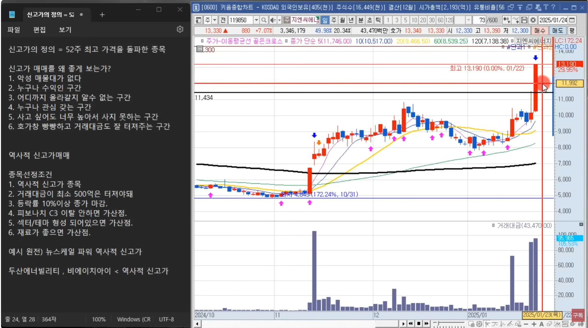
 [분봉] 신고가 눌림매매 
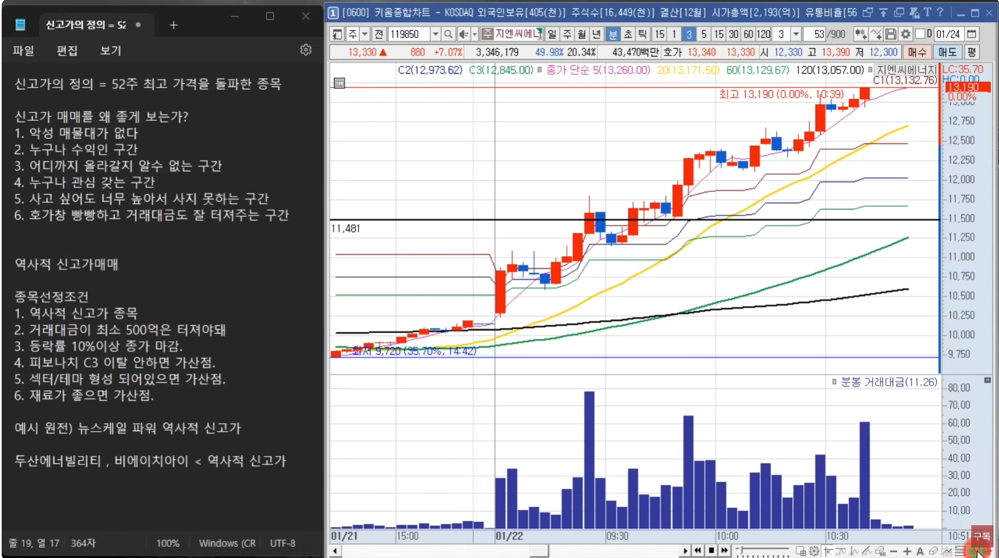
 [분봉] 신고가 C3 이탈 
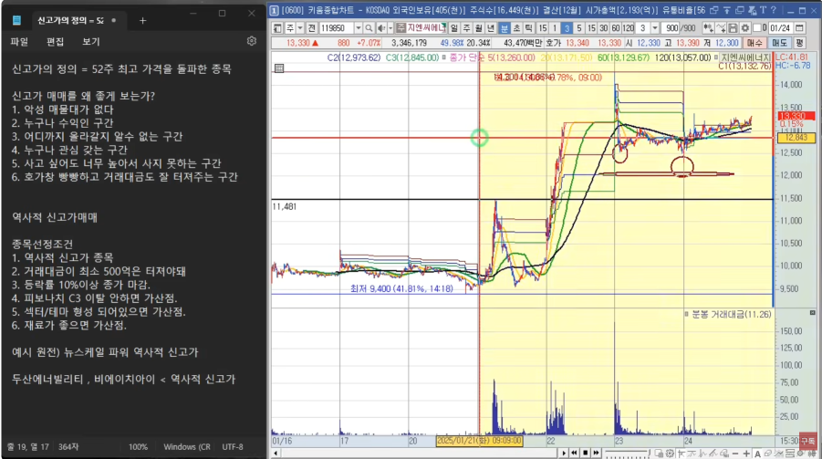
 [일봉] 반등 확인 
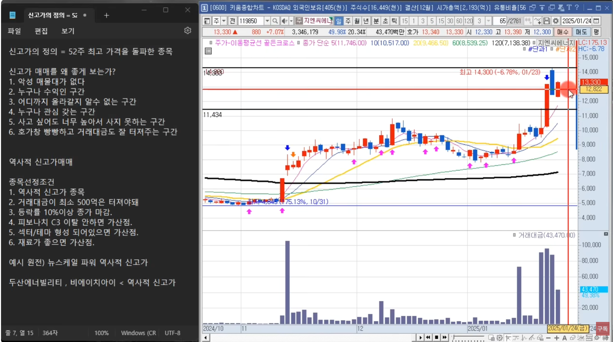
 [분봉] 전고 돌파하면 다시 눌림매매 
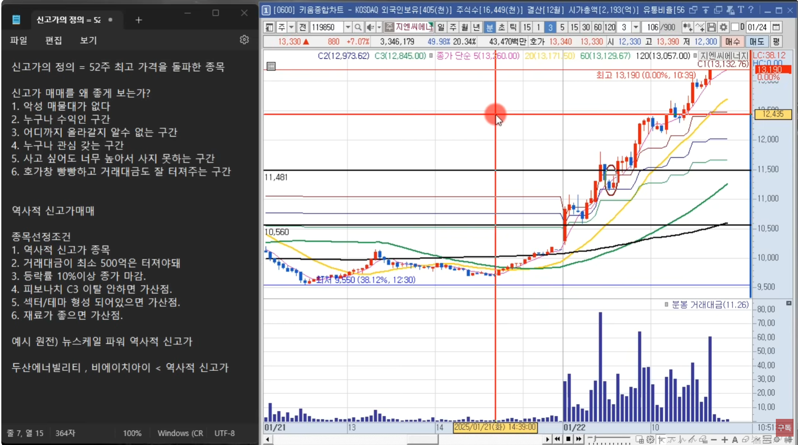

 

[[TOP]](#index)

---
## [S2-7강] 신고가 매매의 원리와 이해

- **역사적 신고가 종목압축을 먼저** 했다.
- 개별종목이었지만 같은 섹터들이 주루룩 같이 상승하면서 테마가 형성
- 매매타점 : 
  - **종목을 압축했으면 매매타점은 그렇게 중요하진 않다.**
  - 단기적인 상승으로 나오는 개별종목에서는 매매타점이 중요하다.
- 손절남은 **"신고가 가기전 종가고가 종가베팅"** 을 좋아하더라. 
  - 다음날 갭상승이나 첫상승구간에서 매도, 5~7% 정도

#### 종가베팅 
- 신고가를 뚫어주고 눌리고, **C3만 이탈안하면 종가베팅이 가능** 하다.
  - C3 이탈 안하면, 재료가 살아있으면, 테마가 형성되면 가산점
- 또다른 눌림자리  
  - 15분상으로 크게 보면서, 전저점 즉 기계적인 손절자리
  - 지지를 받고 눌림반등이 나오면 타점
  - **신고가를 만들고 고점에서 횡보하는 자리는 비중베팅을 할 수 있는 자리다.**
- 억대트레이더는 
  - 당일의 이슈로 올라오는 종목은 안좋아한다.
  - **역사적신고가를 만들고 거래대금이 빵빵 터진 종목** 을 좋아한다.
  - 즉, 급등주 사팔사팔보다, 역사적신고가 종목에서 1~2% 짤짤이 매매가 좋다. 
  - **손실을 보던 수익을 보던 좋은 종목에서 매매한다.**
  - 종목이 선정된 매매는 떨어지면 분할로 물타기, 올라가면 불타기 비중베팅을 하더라!
- 종가베팅 꺼려지는 자리
  - 신고가 눌림자리에서 타점이 나오고 
  - **C3를 이탈하고 다시 회복했지만 신고가 돌파를 못하면 애매하다.**
  - 왜냐면 회복했지만 **고점은 낮아졌으므로 단기하락** 관점으로 본다.
  - 크게는 장기이평은 정배열이지만, **단기이평 5이평 20이평이 하락**
- 좋은 종목은 
  - 떨어지더라도 반등자리는 반드시 준다.
  - 어디까지 떨어질지 모르기때문에 분할매수를 해야한다.

 종가베팅 자리 
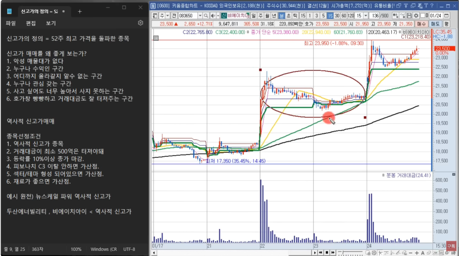
 부연설명 
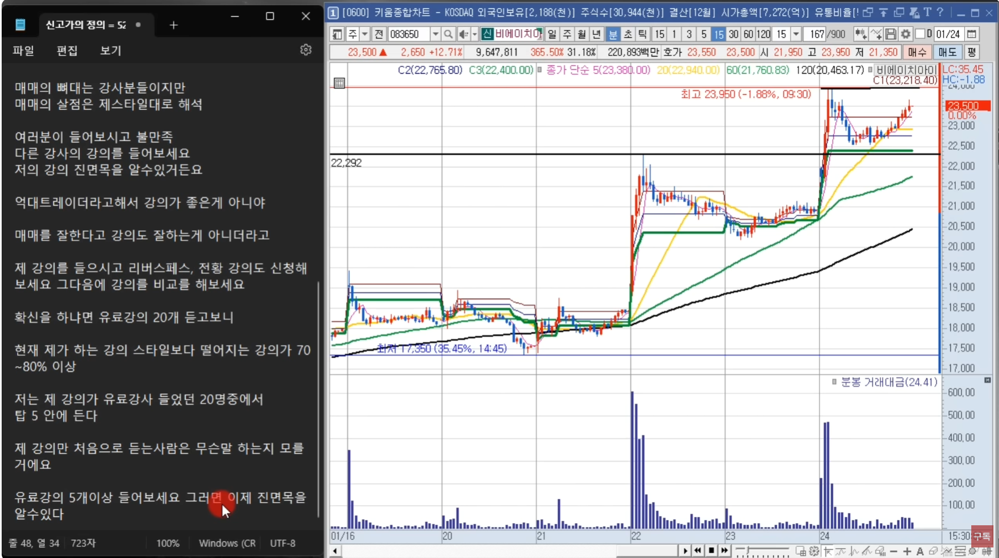

 

[[TOP]](#index)

---
## [S2-8강] 신고가 매매 수강생들이 헤맸던 이유와 해결법

- 초보들의 패턴
  - 종목 압축을 하지 않고, 타점만 오면 하루에 수십 종목에 들어간다.
  - 소액으로 경험을 쌓기 위해 아무거나 막 매수한다.
  - 하락하는 자리에서 몰빵했다는것은 욕심이 들어간것이다. 
    - 반등을하면 크게 먹으려고는 하는데,
    - 떨어지는 것에 대한 대비는 없다.
  - 즉, 비중조절로 들어갔으면 더 떨어질 때 물타기가 가능한데...
- 고수들의 패턴
  - 종목 압축을 10개 내외로 한다.
  - 압축된 종목중에서 확실한 자리에서만 들어간다.  
  - 트레이더김은 장초고점에서 매수하고 c3를 이탈해도 계속 분할매수
    - 역사적신고가를 향해가고, 재료를 확인했고, 테마가 형성됐고..
    - 올라간다는 확신이 있으니깐..
    - 이미 종목압축을 했다.
- **타점이 중요한게 아니고, 종목압축 더 중요하다!**
  - 좋은 종목에서 좋은 타점에서 사면 왠만하면 수익이 난다.
  - 억대트레이더는 이미 압축된 종목에서 손절선이 깨지더라도 계속 비중을 태우고, 반등이 나올때 1~2%만 먹어도 억대 수익
- 역사적인 신고가매매
  - 종목압축만 되면 눌림이던, 불타기를 하던, 종베를 하던... 모든게 가능!

 트레이더김 실전타점: 손절선 이탈해도 계속매수 
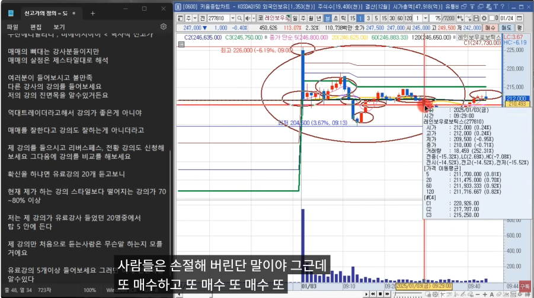
 일봉상 신고가자리 
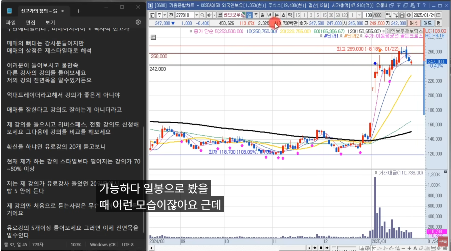
 분봉상 신고가자리 
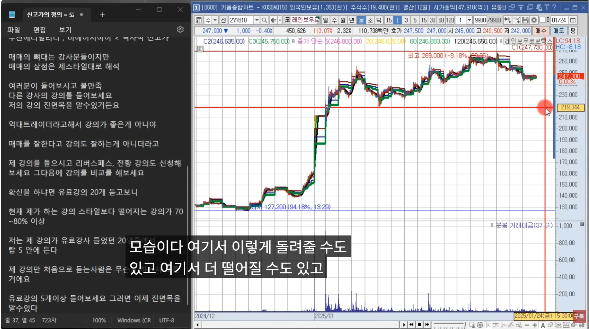
 비중조절 중요성 
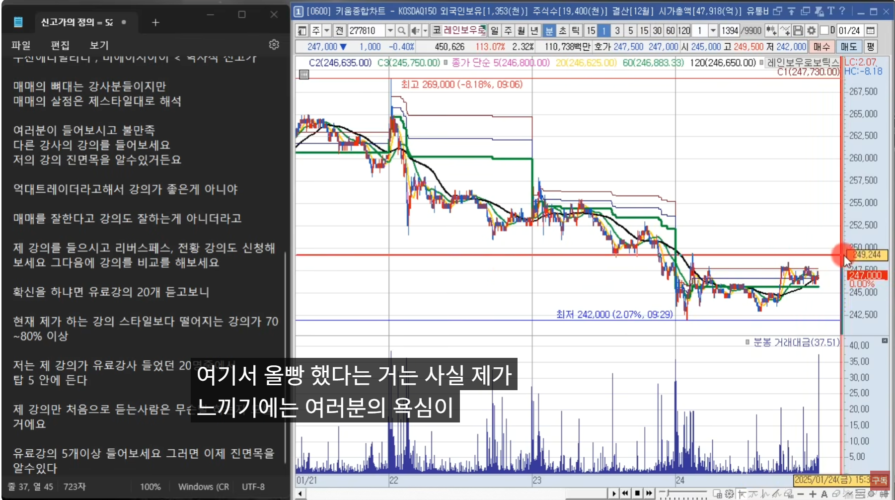

 

[[TOP]](#index)

---
## [S2-9강] 주도주 눌림매매

- **주도주 눌림매매의 장점**
  - 당일 5% 이상 올라가는 종목은 많지만, 
  - 대부분 5% 상승 나오고 꼬꾸라지고, 10% 상승 나오고 꼬꾸라진다.
  - **극소수만 15% 부근을 올라간다. 10개~15개**
  - **종목이 압축**
    - 평소에 종목 테마 분류 잘 해놨다면 종목이름만 봐도 어떤 테마인지 알 수 있다.
    - **보통 대장주는 20~25%까지는 간다.** 
- 매수하는 전략 << B강사
  - 15%까지 오는 종목은 일단 1억 시장가 매수
    - 주도주를 확인하는 능력이 있던 사람이었다.
    - 그날의 주도주인거 같다면 일단 매수
    - 15%부근에서 10%부근까지 조저을 받으면 2차 매수 -5%
  - **딱 몇% 수익,몇% 손절이 정해져 있는게 아니라, 시장분위기에 따라 대응** 해야한다.
    - 후발주가 잘 따라오고 있는가
    - 다른 테마가 새롭게 올라오는가
    - 기존에 강한 테마가 상한가에 들어가려고 하는가
    - 20%부근에서 25%부근까지 끌고갈지
    - 아니면 5% 수익실현할지 고려한다.  
  - **후발주는 상따를 안하는것을 원칙** 으로 한다.
    - 대부분 맞다.
    - **예외적 상황은, 새로운 재료 등장**
      - 예를들면 대왕고래, 초전도체, 최근에 양자암호에서 5개이상 종목이 우루루 광기로 상승
      - 재료의 크기를 2배 5배 10배 다양해 미지의 세계다
- **주도주 눌림 종목선정 조건**
  - [x] 1. 전일종가대비 <u>15%이상 상승</u>한 종목
  - [x] 2. 섹터/개별중 <u>섹터가 있는 종목</u>이면 가산점
  - [x] 3. <u>거래대금 15분상 200억 이상</u>터지면 가산점

- [ ] **1. 전일종가대비 15%이상 상승** 한 종목
  - 15%까지 올라갔따가 -5%가는 종목이던 10%
  - 20%까지 올라갔따가 -5%가는 종목이던 15%
  - **당일 장대양봉 << 변동성이 있을수 밖에 없다.**
  - 시총낮은 개잡주 아닌이상 하락할때 다시 반등나오려는 매수세가 들어올수밖에 없다.
  - 단 섹터 대장주일때만...
  - **분할매수하라.** 
    - 미수몰빵하면 손실만큼 회복해도 마이너스이다.
    - 복구심리때문에 뇌동안할수가 없지만, 멈춰야 한다.

- [ ] **2. 섹터/개별중 섹터가 있는 종목** 이면 가산점
  - 섹터/테마 **최소 3종목 이상의 무리**

- [ ] **3. 거래대금 15분상 200억 이상** 터지면 가산점
  - **주의사항**
    - 시가 **갭이 10%이상 뜨면 매매하지 않는다.**
    - 전일 장대양봉 **20%이상 뽑아준 종목은 12시 이후 조심**
    - 분봉상 **전고점을 돌파후 눌림만** 한다. ⇒ 전고돌파않고 눌림(고점하락)
    - **첫번째 눌림과 두번째 눌림이 성공확률이 높다.**
    - 대장주 매매가 우선이나 **2등주가 치고 올라오면 눌릴때 매매하지 않는다.** 
      - 즉, 1등자리를 내어주면 더이상 대장주가 아니다.

 주도주눌림매매 장점 

 억데트레이더 주도주눌림매매 

 고영 일봉차트, 고가 27.5% 
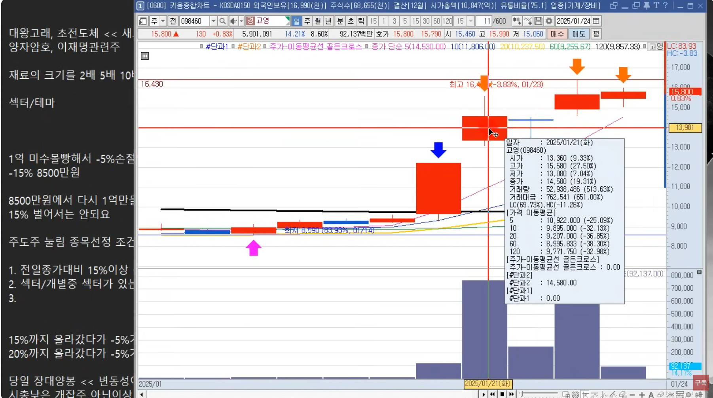
 고영 분봉차트, 시가 9.33% 
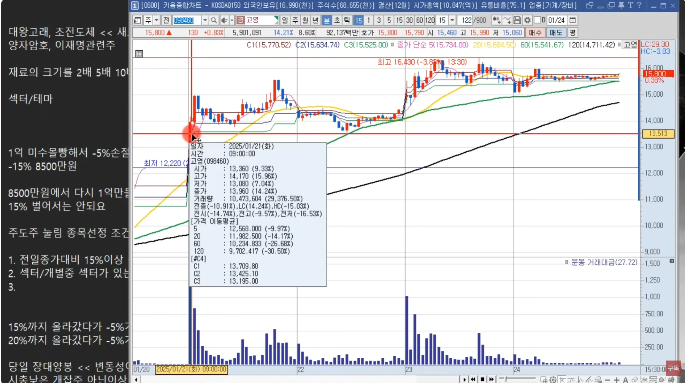
 주도주눌림 종목선정조건 및 주의사항 
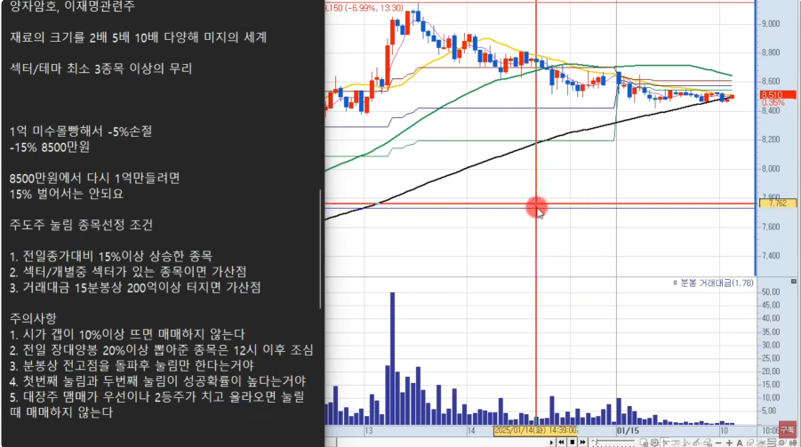

 

[[TOP]](#index)

---
## [S2-10강] 주도주 눌림매매 실전 사례

- 검색기 : 당일 15%이상 상승한 종목 포착
- 2~3% 먹는것을 목표 ⇒ 승률 7,80% 나온다
- 전고돌파하지 않고 떨어지면 매매하지 않는다
- 전고돌파하고 다시 떨어져도 3번째이면 매매하지 않는다
- 욕심부리면 손절도 잘안된다. 돌파도 1~2% 먹는게 7,80%이다.
- 눌림은 미리 걸어놔야 한다.
- 요즘 트랜드도 2% 먹는게 최선이다. 3% 먹기도 힘들다.
- 눌림매수후에 전고돌파못하고 떨어지면 반드시 손절지켜라. 
- 손절하지않으면 수익낸것의 2배 3배이상 손실로 마감한다
- 눌림은 C1 C2 C3 어디에서 반등나올지 알수가 없다
- 눌림타점이 오지 않으면 다음날에도 눌림타점에서 살수있다
- 매매는 유연하게.. 경험이 중요..!
- 주식은 손실최소화가 우선이다.
  - 특히 수익냈다가 손실나면 손절을 잘 하지 못한다.
  - 손절라인을 하향으로 조절하면 안된다. 
- **[쩜상]** 으로 가는 종목도 눌림에서 매매한다. ⇒ 흔한 케이스는 아님!
- **[상한가]** 간종목이 눌림자리 안주고 갔다면, 연장선상으로 다음날 눌림매매를 할수 있다.  
- 전날상한가 종목이 당일 20%이상 올라갔다가 눌림자리 온것은 매매하지 않는다 ⇒ 30%+20% 즉 하루만에 50%이상 상승

 주도주 15%상승후 눌림매매 
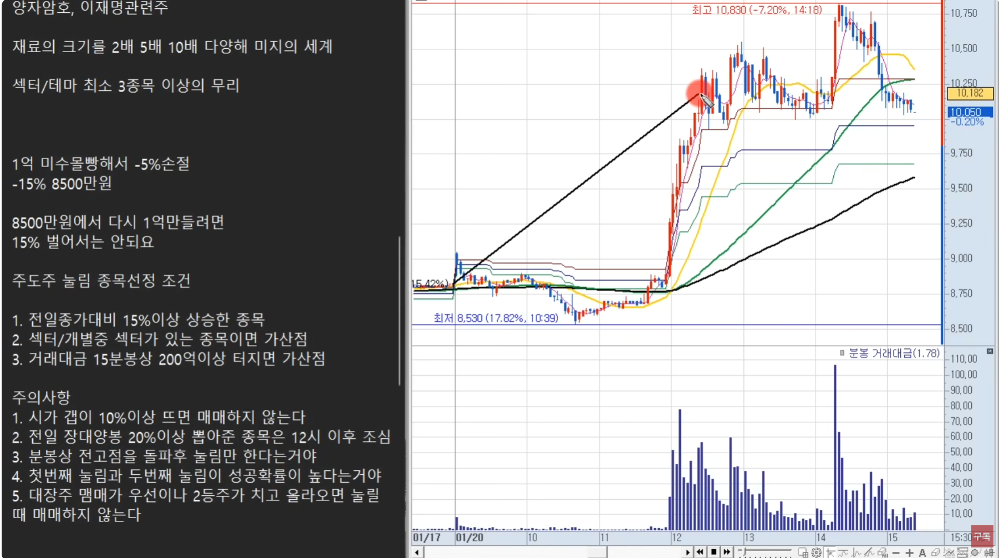
 눌림타점: 1번째, 2번째 매수, 그러나 돌파못한 눌림이나 3번째이후는 매매X 
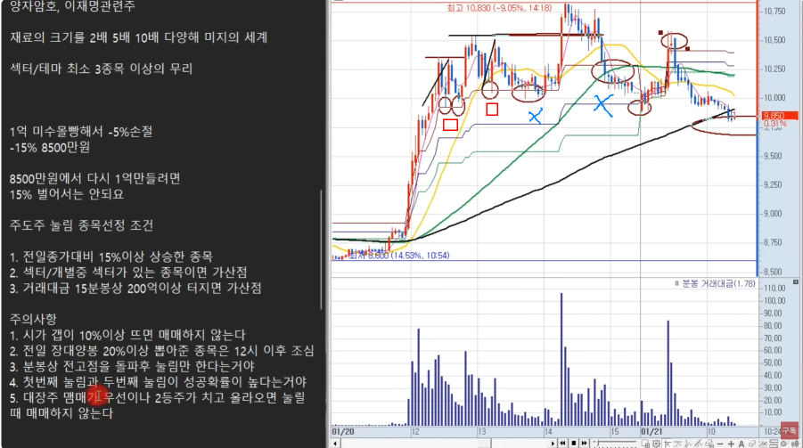
 시가갭 큰종목 매매안함 
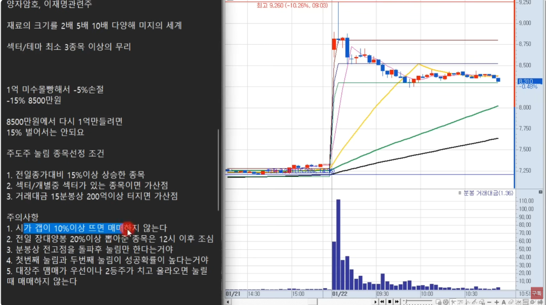
 BS타점 분봉 
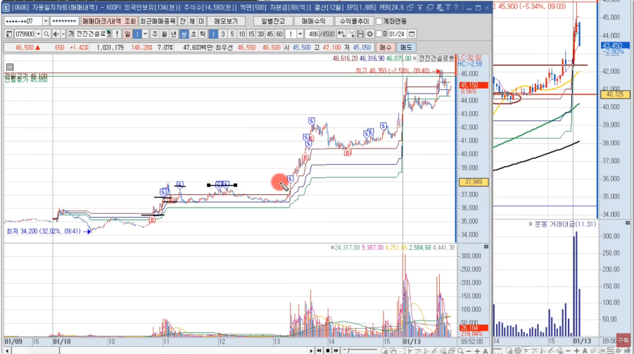
 BS타점 일봉, 역사적신고가 돌파확인 
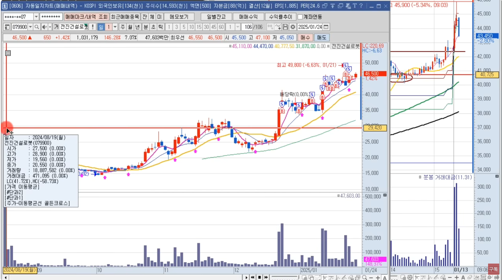 

 

[[TOP]](#index)

---