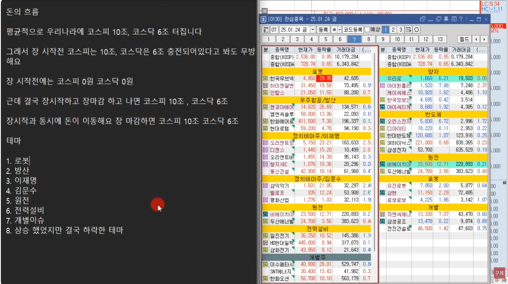
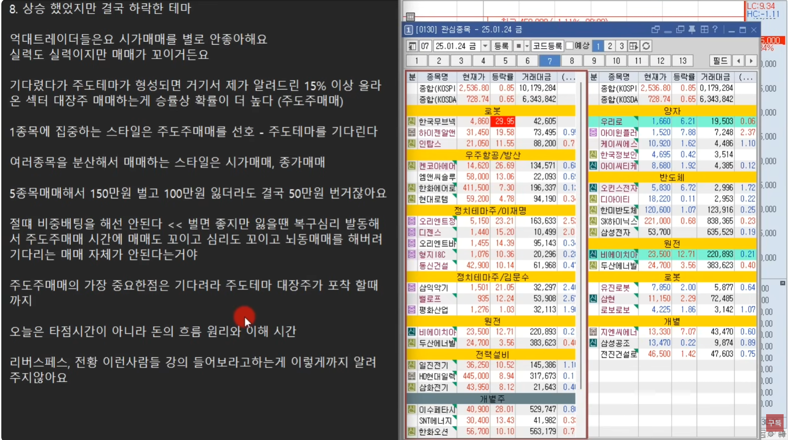
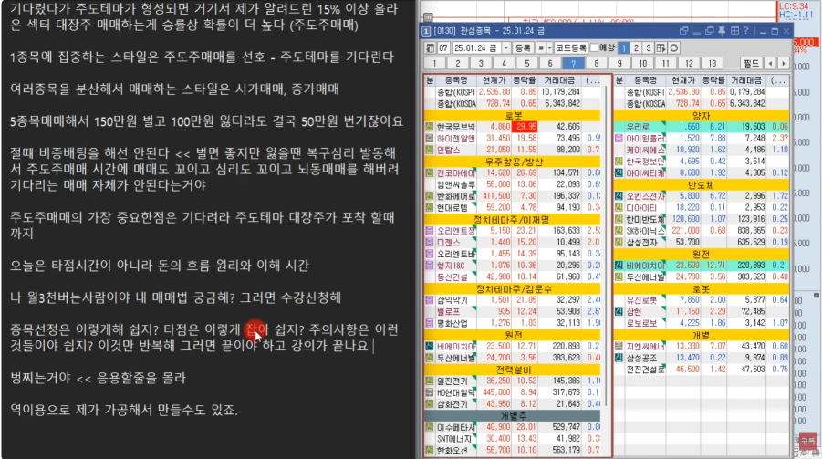
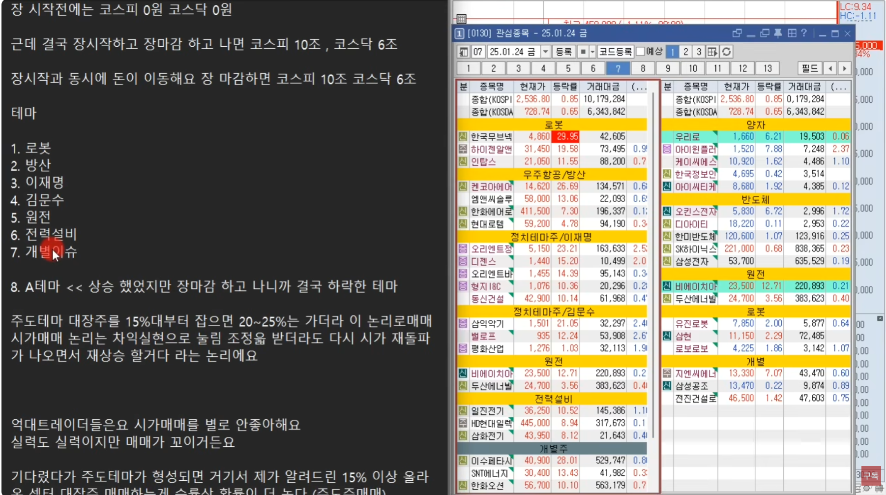
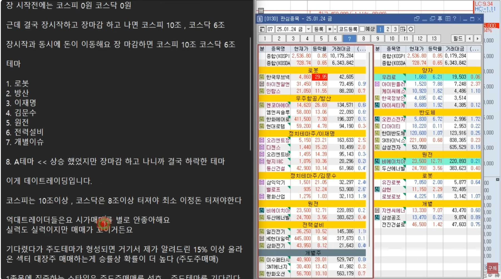
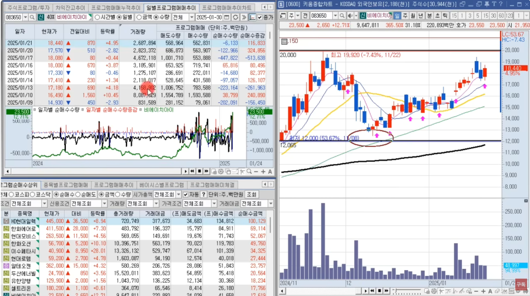
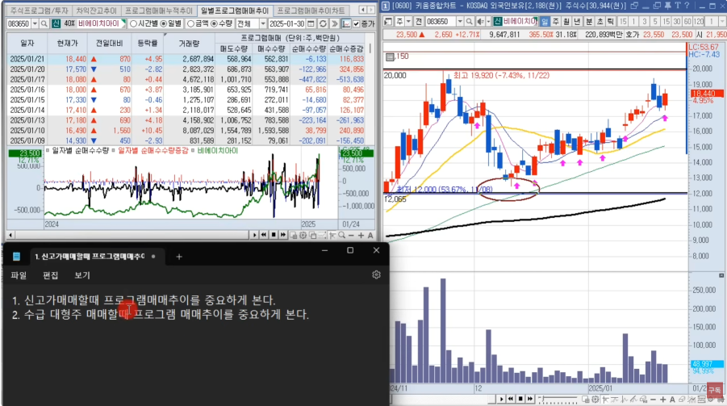
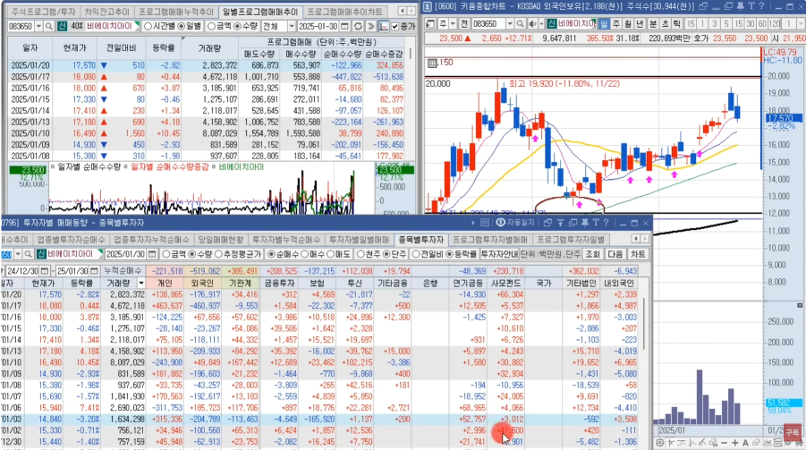
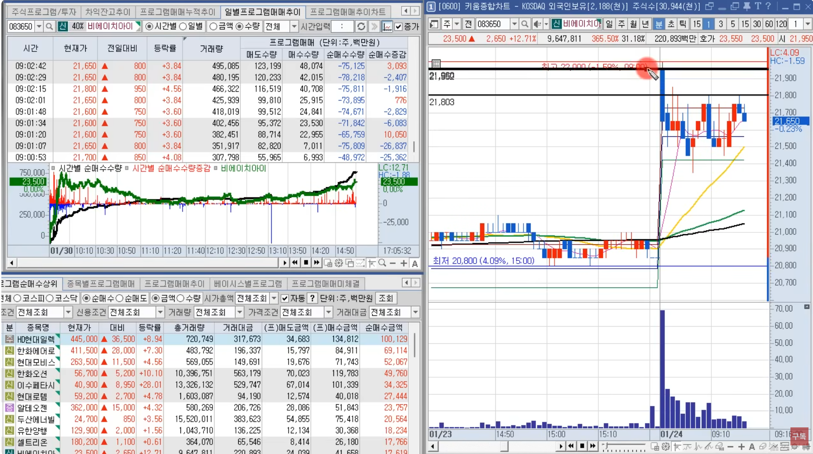
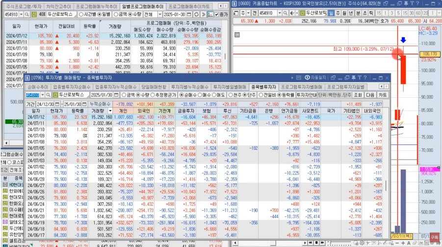

🏠 > [kostock](../../../) > [experts](../../) > [천리안주식](../) > `S2_단타의기본기`

<table>
  <tr>
    <td><a href="../">[천리안주식]</a></td>
    <td><a href="../S0_INTRO_NEW">S0_INTRO</a></td>
    <td><a href="../S1_시장보는기준">S1_시장보는기준</a></td>
    <td><a href="../S2_단타의기본기">S2_단타의기본기</a></td>
    <td><a href="../S3_쉬운매매구조">S3_쉬운매매구조</a></td>
    <td><a href="../S4_주도종목실전">S4_주도종목실전</a></td>
    <td><a href="../S5_유료강의압축">S5_유료강의압축</a></td>
  </tr>
  <tr>
    <td colspan="7" align="center"> 
      <a href="S2_단타1.md">단타1</a> 🟥  
      <a href="S2_단타2.md">단타2</a> 🟧 
      <a href="S2_단타3.md">단타3</a> 🟨 
      <b href="S2_단타4.md">단타4</b> 🟩 
      <a href="S2_단타5.md">단타5</a> 🟦 
      <a href="S2_단타6.md">단타6</a> 🟪 
      <a href="S2_단타7.md">단타7</a>  
    </td>
  </tr>
</table> 

### INDEX

#### 단타4.
- [[S2-15강] 돈의 흐름 원리와 이해](S2_단타4.md#s2-15강-돈의-흐름-원리와-이해)
- [[S2-16강] 뉴스 및 재료의 해석](S2_단타4.md#s2-16강-뉴스-및-재료의-해석)
- [[S2-17강] 시크릿 강의](S2_단타4.md#s2-17강-시크릿-강의)
- [[S2-18강] 프로그램 매매 원리와 이해](S2_단타4.md#s2-18강-프로그램-매매-원리와-이해)

---

# S2. 단타의 기본기 (4)
> - 돈의 흐름 원리와 이해
> - 뉴스 및 재료의 해석
> - 매수 전 체크리스트
> - 프로그램 매매 원리와 이해

재생시간 | 강의제목 
:------:|---------
20:50 | [2주차 15강] 돈의 흐름 원리와 이해
41:05 | [2주차 16강] 뉴스 및 재료의 해석
29:10 | [2주차 17강] 시크릿 강의
31:18 | [2주차 18강] 프로그램 매매 원리와 이해

 

---
## [S2-15강] 돈의 흐름 원리와 이해

- **돈의 흐름**
  - 평균적으로 우리나라에 **코스피 10조, 코스닥 6조** 터진다.
  - 그래서 장 시작전 코스피는 10조, 코스닥은 6조 충전되어 있다고 봐도 무방하다.
  - 장 시작전에는 코스피 0원, 코스닥 0원
  - 근데 결국 장시작하고 장마감하고 나면 코스피 10조, 코스닥 6조
  - 장시작과 동시에 돈이 이동한다. 장마감하면 코스피 10조, 코스닥 6조
- 테마 
  - [ ] 1.로봇
  - [ ] 2.방산
  - [ ] 3.이재명
  - [ ] 4.김문수
  - [ ] 5.원전
  - [ ] 6.전력설비
  - [ ] 7.개별이슈
  - [ ] 8.A테마 << 상승 했었지만 장마감 하고 나니깐 결국 하락한 테마

 

- **억대트레이더들은 시가매매를 별로 안좋아한다.**
  - 실력도 실력이지만 매매가 꼬이거든요
  - 기다렸다가 주도테마가 형성되면 거기서 제가 알려드린 **15% 이상 올라온 섹터 대장주 매매** 하는게 승률상 확률이 더 높다. **(주도주매매)**

- **주도주 대장테마** 
  - 대왕개미 홍인기 
  - 1종목에 집중하는 스타일은 주도주매매를 선호 ⇒ 주도테마를 기다린다
  - 여러종목을 분산해서 매매하는 스타일은 시가매매, 종가매매 ⇒ 5종목 매매해서 3승, 150만원 벌고 100만원 잃더라도 50만원 번거다.
  - 절대 비중배팅을 해선 안된다 << 벌면 좋지만 잃을땐 복구심리 발동해서 주도주매매 시간에 매매도 꼬이고 심리되 꼬이고 뇌동매매를 해버려 기다리는 매매 자체가 안된다
  - **주도주매매의 가장 중요한 점은 기다려라 ⇒ 주도테마 대장주가 포착될 때 까지**
  - **주도테마 대장주** 를 **"15%대부터 잡으면 20~25%는 가더라" 이 논리** 로 매매
  - **시가매매** 논리는 차익실현으로 눌림 조정을 받더라도 **"다시 시가 재돌파가 나오면서 재상승 할거다" 라는 논리** 이다.   
  
- 오늘은 타점시간이 아니라 돈의 흐름 원리와 이해 시간
- 나 월3천버는 사람이야 내 매매법 궁금해? 그러면 수강 신청해
  - 종목선정은 이렇게 해 쉽지? 
  - 타점은 이렇게해 쉽지?
  - 주의사항은 이런것들이야 쉽지?
  - 이것만 반복해 그러면 끝이야 하고 강의가 끝난다
  - 벙찌는거야 << 응용할줄을 몰라
  - 역이용으로 가공해서 만들수도 있다.

- 데이트레이딩
  - 데이트레이더가 많아야 거래대금이 터진다
  - 한 테마에 돈이 들어가고 잠기면 거래대금이 터질수가 없다.
  - 코스피는 10조이상, 코스닥은 8조이상 최소 이정도는 터져야 한다.

 

[[TOP]](#index)

---
## [S2-16강] 뉴스 및 재료의 해석

### **돈은 어떻게 이동하는가?**
> - [ ] 돈이 이동하려면 첫번째 요소가 뭐냐? **뉴스와 재료**
> - [ ] **뉴스랑 재료를 통해서 돈들이 종목에 들어가게 되는거다**
> - [ ] 들어가는 과정에서 당연히 거래량이 만들어질것이고, **거래량이 만들어지면서 차트랑 호가창에 변화** 가 일어나게 된다.
>   - 대다수 사람들은 장초에 10%이상 급등한 종목은 너무 높다고 생각하고, 같은 섹터에서 다른 종목을 살펴본다.
>   - HD현대일렉은 장초 대장주였지만, 삼화전기와 일진전기가 장후반에 올라오며.. 일진전기로 대장주로 바뀜!

### **종목의 상승요소**
> - [ ] 1. **뉴스랑 재료 (+미국장 상승테마)** : 상승의 **'명분'** 이 있어야 한다. 
> - [ ] 2. **거래량(거래대금)**
> - [ ] 3.**차트위치(호가창분위기)**

 

### 1️⃣ **뉴스랑 재료 (+미국장 상승테마)** : 상승의 **'명분'** 이 있어야 한다. 

- **키맞추기** 로 이만큼 올라야 하는거 아니냐 << 이런 원리
  - 강남집값이 작년에 비해 5억이 뛰었다고?
  - 송파나 서초는 아직 1억 밖에 안뛰었네 하면서 송파랑 서초에 돈들이 들어가는거다.
  - 서초랑 송파가 오러면 그 옆으로 서초 왼쪽 동작구, 송파 옆에 강동구 하남
  - 수도권이 키맞추기
  - 갭띄기 전세가 2억5천 매매가 2억7천 갭2천이면 사니까
  - 자기가 2억있다. 갭2천으로 8채 사는거다. 1억6천, 4천은 부가비용
  - 3천 곱하기 8채 2억4천 >> 세금 50% 55% 내더라도 1억2천
- **누군가가 오르면 옆에 있는 다른 누군가에게도 돈이 들어간다는 원리**
  - 미국장의 양자암호가 오르면, 우리나의 양자암호도 올라간다
  - 억데트레이더들은 1종목에 최소 1억에서 5억 10억 때리는데 1~3%를 먹더라도 안전한곳에서 먹을려고 한다.
  - 잡주를 굳이 10억사서 30% 50% 먹으려고 하지 않는다. ⇒ 반대로 갈수도 있기 때문에...
- 뉴스와 재료를 중요하게 생각하는 사람
  - 예수금이 큰사람 즉, **비중배팅 하는 사람 << 혹은 단기 스윙, 일정매매**
  - 장마감하고 관심종목 등록하면서 뉴스까지 보면서 정리해야 한다. 
  - 뉴스는 너무 깊게 안봐도 된다. 아~ 이런걸루 올라갔구나. [특징주] 정도는 체크

### 2️⃣ 거래량(거래대금)
- 재료 혹은 미국상승테마로 인해 **상승의 명분이 만들어지면**
- 그다음에 그래서 들어가면 거래량이 **거래대금이 터지게 된다**
- 그러면서 **차트가 만들어진다.**
  - 일정패턴의 차트, 상승패턴의 차트, 시가매매 패턴의 차트, 
  - 주도주 매매의 차트, 상따 차트

### 3️⃣ 차트위치(호가창분위기)
- **억대트레이더들은 호가창을 중요하게 본다.** 
  - 한 호가에 1억이상 걸려있는 종목, 100만원 걸려있는 종목
  - 내가 1억 사려는데 한호가에 20억씩 걸려있으면 상관없다.
- 얇은 대장주보다 빵빵한 후속주를 선호한다.
  - 호가가 얇으면 사는건 되는데 팔수가 없다. 
  - 1억 사서 1% 먹는게 낫다. 500만원으로 5% 먹는것보다..

#### 미국장 이야기 
- 미국 상승테마를 많이 타서
- 세계 증시 트랜드가 미국대통령 이게 중요하다
- 대통령 후보 해리스와 트럼프
  - 해리스 관련해서는 대마 관련주 올라가고, 트럼프 관련해서는 재건 관련주가 올라갔다
  - 대마랑 재건이 시소타기 하다가, 트럼프가 되면서 대마는 폭락하고 우크라이나 전쟁이 아직 해결된 건 아니기 때문에 그래도 중간중간에 테마성으로 올라왔다.
- 트럼프랑 언론에서 친하게 나오는 사람. 머스크
  - 테슬라는 로봇을 만들고, 전기차 만들고, 자율주행 이런 키워드가 따라 온다
  - 테슬라가 상승하면 로봇테마, 자율주행테마, 2차천지테마가 상승을 할수 있는 명분이 된다. 
  - 2차전지는 관세때문에 못알라갔었다. 관세가 좀 나아지거나 세력이 들어오면 올라간다.
- 엔빈디아 젠슨황
  - 무슨 CS나가서 양자컴퓨터 상용화 되려면 최소 30년아라고 말하자, 미국 양자관련주 대부분이 고점대비 50% 이상 폭락 >> 우리나라 양자관련주도 같이 폭락
  - 젠슨이 유리기판을 좋게 본다 하니깐 유리기판이 올라가고, 양자암호 안좋게 본다고 하니깐 양자암호가 떨어지고
- **미국장도 테마가 있지만, 테마주를 하면 안된다.**
  - 왜냐면 **테마주를 하려면 시가총액 시총100위권을 해야 한다**
  - 미국은 테마주 하면 1달러 짜리가 300달러 간종목, 하루만에 90% 하락하기도 한다. 
  - 미국주식도 쉬운게 아니다. 욕심을 절제하고 나오거나, 이런종목 안하고 대형주만 하면 된다.
  - 미국주식도 시총 300억짜리 많다. 우리나라만 있는게 아니다. 
  - 올라가는 종목은 끝없이 올라가다가, 3조짜리가 천억까지 떨어지기도 한다.
  - 미국은 하따 이런 개념이 없고, 저점 매수가 안들어온다. 끝도없이 떨어진다.
  - **세력이 없고, 세력이 있더라도 시총 1천억대 개잡주가 아니라 엔비디아나 테슬라 이런 대형주에 있다.**
  - 우리나라랑 다르다. 우리는 1년에 한번 장대양봉 나오기도 하지만, 미국은 그런게 없다.
  - 우리나라에서 주도주매매 대장주매매 시총 5조 이하를 선호 최소 1000억에서 1조 사이 선호
  - 미국은 1000조~3000조 터지는 종목에서 매매를 하더라
  - 엔비디아, 테슬라 이런애들이 변동성이 좋다. 하루에 3~5% 왔다갔다 잘해준다. 매일 해주진 않지만..
  - 시가총액 천장을 안막아놓는다. 거품 자체의 개념이 없다.
  - 엔비디아가 전세게 1등이니깐 어디까지 갈지 모르는거다.
  - 엔비디아 주가가 150달러 목표가 175달러, 주가가 175달러가 되면 목표가가 갑자기 200달러 올라간다.
  - 그러면서 계속 올라간다 끝도 없이 올라가... 그걸 학습한 사람들이 엔비디아만 매매
- **뉴스와 재료는 너무 깊이 들어가지 마라.** 머리 아픔!!
  - 당일 주도주매매 혹은 당일시가매매 이게 더 낫다
  - 뉴스보고 몇달 끌고 가는 매매는 진짜 고수 아닌 이상 쉽지 않다고 본다.
  - 목표가 잡는것도 어렵고 
  - 미국은 대형주가 올라갈때는 거래량이 작은데, 떨어질때마다 거래량이 터진다. 저점매수

[[TOP]](#index)

---
## [S2-17강] 시크릿 강의

### 매수 전 체크리스트
> - [ ] 1. 장세에 맞는 종목인가? (시장 트랜드에 맞는가? 이차전지가 현재시장에 맞진 않다. 자동차 관련주도 맞지 않다.)
> - [ ] 2. 지수는 밀리는가? 과열권 장세인가? 섹터끼리 움직이는가? 개별주로 움직이는가?
> - [ ] 3. 차트는 이쁜가? (정배열이냐 역배열이냐, 전고점을 돌파했나, 신고가인가)

- 지수가 밀릴때 테마주들은 날뛴다.
- 과열권 장세에서 끝도 없이 올라간다. 23년에 이차전지

### 1. 지수가 불안정하다. 즉 시장 참여자들도 심리가 좋지 않다. 그것 또한 주포(세력)도 참고한다. 
- 그러니 상때 매매는 연속 상한가를 가는 급등주 패턴의 상한가 말고는 주도주 상따는 어렵고 오히려 상한가 다음날 매매가 리스크가 적다.
- 이재명 테마주, 오린엔트정공
- 상따나 종베보다 시가매매가 리스크가 좋다. 

### 2. 지수가 자리를 잡고 상따 갭이 잘뜨면 그때 다시 상따로 접근하면 된다. 
- 상따 장세가 뭐냐면 별거 없다. 상한가 다음날 갭이 잘뜬다. 그러면 상따장세이다.
  - 10종목이 상한가 갔는데, 다음날 8명정도가 9% 갭 뜬다. 그러면 상때 해볼만한다.
  - 묻지마 상따장세 시장을 유연하게 봐야 한다. 시장은 변한다.
- **응용하면 된다.** 주도주매매도 현재 돌파장세 아니다. 
  - 그러니깐 사람들이 돌파장세 오기전까지는 주도주눌림을 하면된다.
  - 주도주는 20% 이상 상한가 갈 만한 종목 = 주도주
  - 그래서 15% 부근부터 길목에서 기다리는 것이다.
  - 5% 10%도 보면 수십종목을 봐야 된다. 30~50 종목
- **종목압축을 위해서 15% 부근에서 길목에서 기다리는 것이다.**
  - 어떤길목? 주도주가 20%이상 상한가도 갈수 있어 그러면
  - 현재 15% 부근 올라왔지만, 최소 5%~15% 더 갈수 있겠네 이렇게 이해하면 된다.
  - 주도주매매할거면 대장주를 해라. 대장주가 떠오른거다.
- **팁이 있는데 15% 기준**
  - 테마가 20%까지 올라갔다가 조정을 받아요 그럴때 우리는 눌림매매한다. 
    - 근데 15%부근을 깼다 그러면 조심할때이다.
    - 주도주는 뭐다 저한테는 15%를 기준으로 15% 위에 있냐 혹은 아래에 있냐
    - 이 종목이 현재 살아있냐 죽었냐를 본단말이죠
  - **주가가 20% 부근에서 15% 부근까지 떨어졌다가 반등나오는건 정상**
    - 충분히 **시장 상황만 잘 맞으면 상한가도 갈만** 하다
  - **주가가 20% 부근에서 10%까지 떨어졌다가 반등 나오는 건 죽었다고 본다.**
    - 그래서 반등나올때 **손실최소화하고 탈출** 한다. 
  - 조정의 깊이가 **상승률 15% 지켜주면 신뢰도가 높다.**
  - **대장주가 갭이 너무 높게 뜨면 후발주나 다른섹터를 매매한다.**
    - 10%이상 갭상승 종목은 부담
    - 짝꿍매매나 눌림매매

### 종목선정의 노하우  
- **큰 카테고리 즉 시장의 중심 키워드에서만 매매하라.**
  - 없으면 하지마라
  - 그 기준안에서만 매매하라
- 시가매매는 기술적인 부분이 들어간거고, **주도주매매가 진짜 꽃이다 ⇒ 주식의 꽃**
  - 15%가 상한가 인때 상한가가 주식의 꽃
  - 30%로 바뀌고 나서 주도주가 주식의 꽃
  - 만약 상한가 60%로 바뀌면, 40% 50% 대에서는 매매를 못한다.
  - 앞으로 상한가 없어질수도 있다. 그래도 30%만 올라도 많이 올라갔다고 느낀다.
- **단타 종목 선정**
  - 전일상한가, 당일 거래대금 주도주 첫봉이나 조정후 2차 상승봉에서 매매 그게 방향성 캔들매매
    - **주도주눌림** : C1 C2 매수, C3 이탈하면 손절 (주도주가 아님, 될거라 예측하고 미리 들어감) ⇒ 예측매매
    - **방향성매매** : 방향을 돌려주고 반등의 고가를 돌파 ⇒ 반반
    - **주도주돌파** : 전고가를 수급과 함께 강한 돌파 (주도주를 확인하고 들어감) ⇒ 확인매매

 

[[TOP]](#index)

---
## [S2-18강] 프로그램 매매 원리와 이해
> - [ ] 1. **신고가 매매할때** 프로그램매매추이를 중요하게 본다
> - [ ] 2. **수급 대형주 매매할때** 프로그램매매추이를 중요하게 본다. 

- **시장은 대다수의 개인과 반대로 간다.**
  - 고점에서 기존에 주가를 올리는 주체가 매도를 했는데도 떨어지지 않으면 손바뀜을 했다는 것이다.
  - 프로그램이나 외국인은 바로전날 산만큼 다음날 팔수할 수 도 있으므로 조심해야 한다.
  - 도지의 저가를 깨고 내려가면 손절, 고가를 돌파하면 돌파매수
- **프로그램의 순매수수량이 +이면 적극적으로 매매** 하고, -이면 그종목은 매매하지 않는다.
  - 프로그램 순매수가 -이면, 하루종일 계속 내리 꽂을수도 있다.
  - 전날대비 프로그램 순매도량이 적으면 매매해 볼만하다. 
- **주가를 올리던 주체가 누군지 파악** 하고 
  - 다음날 시초부터 주체가 팔고 있다면 신규매수는 하면 안된다.
  - 주체가 파는데 버텨주거나 상승해준다면 손바뀜 후에 더 올라갈 수 있다.
  - 외인과 기관이 쌍끌이로 순매수 했더라도, 다음날 갭하락에 하루종일 하락할 수도 있다.
- **수급매매할때 주가를 끌어올린 주체의 이탈여부만 체크** 하면 된다.

 

[[TOP]](#index)

---
