🏠 > [kostock](../../../) > [experts](../../) > [천리안주식](../) > `S3_쉬운매매구조`

<table>
  <tr>
    <td><a href="../">[천리안주식]</a></td>
    <td><a href="../S0_INTRO_NEW">S0_INTRO</a></td>
    <td><a href="../S1_시장보는기준">S1_시장보는기준</a></td>
    <td><a href="../S2_단타의기본기">S2_단타의기본기</a></td>
    <td><a href="../S3_쉬운매매구조">S3_쉬운매매구조</a></td>
    <td><a href="../S4_주도종목실전">S4_주도종목실전</a></td>
    <td><a href="../S5_유료강의압축">S5_유료강의압축</a></td>
  </tr>
  <tr>
    <td colspan="7" align="center"> 
      <a href="S3_구조1.md">주도주 돌파/눌림</a>  | 
      <b href="S3_구조2.md">주도주 종가베팅</b> 
    </td>
  </tr>
</table> 

### INDEX

#### 구조2. 주도주 종가베팅
- [[S3-8강] 종가베팅의 기준](#s3-8강-종가베팅의-기준)
- [[S3-9강] 종가베팅 확률 구조](#s3-9강-종가베팅-확률-구조)

---
# S3. 매매를 쉽게 만드는 구조 (1)
> - 3주차는 매매를 복잡하게 만드는 요소를 덜어내고, 기준을 압축하는 단계입니다.  
> - 많은 기법을 아는 것보다 시장 흐름을 이해하고, 가야 할 종목만 남기고, 확률이 쌓이는 자리에서만 접근하는 구조가 더 중요합니다.  
> - 이 과정에서는 시황 해석, 주도주 압축, 진입 근거 정리, 비중과 심리 관리까지 실전에서 바로 적용할 수 있도록 정리합니다.  
> - 매매를 더 배우는 단계가 아니라, 매매를 단순하게 만드는 단계입니다.

재생시간 | 강의제목 
:------:|---------
24:38 | [3주차 1강] C4 피보나치 활용 구조
15:18 | [3주차 2강] 타점보다 시황이 먼저입니다
51:04 | [3주차 3강] 주도주 눌림의 기준
13:42 | [3주차 4강] 원숭이 기법 구조 정리
27:40 | [3주차 5강] 우끼기 매매의 기준
22:25 | [3주차 6강] 주식은 심리입니다
03:38 | [3주차 7강] 원숭이 기법 실전 적용
33:34 | [3주차 8강] 종가베팅의 기준
13:21 | [3주차 9강] 종가베팅 확률 구조


<br/>

---
## [S3-1강] C4 피보나치 활용 구조
> 분봉차트 지표추가
>  - 분봉거래대금
>  - 피보나치라인

### js[거래대금(억).분봉]

[수식]

```js
억원 = 100 * 1000 * 1000;
기준가격 = (H+O+C+L)/4
분봉대금 = V * 기준가격 / 억원;
```

---
### ln[피보나치.분봉]
> - 당일의 최고가 최저가의 피보나치 라인
> - 가격 되돌림(조정)이나 반등을 멈출 가능성이 높은 지지,저항 구간을 표시하는 도구 
> - 주요 되돌림비율 : 23.6%🟧, 38.2%🟥, 5.00%🟩, 61.8%🟦, 78.6%⬛️
> - 특히 0.618(황금비율) 
> - 확장 비율 : 127.2%, 161.8%, 261.8%

- 되돌림 해석
  - [x] 23.6% : 강세장에서 자주 반응하는 얕은 조정 구간1
  - [x] 38.2% : 강세장에서 자주 반응하는 얕은 조정 구간2
  - [x] 50.0% : 심리적 반 토막 구간,   매수/매도 세력 모두 주목
  - [x] 61.8% : 황금비율, 가장 강력한 지지/저항 구간
  - [x] 78.6% : 거의 원래 가격까지 되돌린 깊은 조정, 추세 약화 신호

<br/>

[수식]

```js
DH = dayhigh();
DL1 = daylow();
DL2 = PreDayClose();
DL = min(DL1, DL2);
BH = DH-DL;

F1 = DH - (BH*조정대1/1000); 
F2 = DH - (BH*조정대2/1000); 
F3 = DH - (BH*조정대3/1000); 
F4 = DH - (BH*조정대4/1000); 
F5 = DH - (BH*조정대5/1000); 

F1
```

[지표조건설정]
```js
조정대 = [236, 382, 500,  618, 764]
```

---
### ln[피보나치.기간]
> - 기간내 최고가 최저가의 피보나치 라인

<br/>

[수식]

```js
DH = highest(H, 기간, 이전);
DL = lowest(L, 기간, 이전);
BH = DH-DL;

F1 = DH - (BH*조정대1/1000); 
F2 = DH - (BH*조정대2/1000); 
F3 = DH - (BH*조정대3/1000); 
F4 = DH - (BH*조정대4/1000); 
F5 = DH - (BH*조정대5/1000); 

F1
```

[지표조건설정]
```js
조정대 = [236, 382, 500,  618, 764]
기간 = 240
이전 = 1
```

<br/>

[[TOP]](#index)

---
## [S3-2강] 타점보다 시황이 먼저입니다

- 주식에는 정답이 없다
- **일반적으로 많이 보는것 : 차트, 거래대금, 재료**
- **실제로 가장 중요한 것**
  - **그날의 시장 분위기**
  - 주도섹터 종목의 등락률 : 대장주와 후속주
  - 거래대금
  - 테마의 연속성
- **시장에 맞게 유연하게 대응**
  - 지수가 좋을때는 조금 높은 타점 : 눌림에 사려는 사람이 많음 
  - 지수가 안좋으면 조금 낮은 타점 : 보수적으로 보려는 사람이 많음
  - **눌림매매는 반등나올것 같은 느낌이 들때** : 정형회된 수치보다는 **감각 ⇒ 메사끼**

<br/>

[[TOP]](#index)

---
## [S3-3강] 주도주 눌림의 기준
> - **"타점보다 시황이 중요"** ⇒ 팩트 임!!
> - 정형회된 매매보다는 **감각적인 매매** 에 가깝다
> - 짬밥 최소 3년에서 5년이상 차면 감각적인 매매, 즉 시황에 맞게 매매 이게 정답이라는 것을 알게 된다 

- **종목 선정 기준**
  - [x] ❶ 당일 **10~15% 올라오는 종목** 을 기다린다 (욕심절제, 올라가는거에 현혹되면 안된다)
  - [x] ❷ **종목압축** 많이 매수해봤자 하루에 2~3개 매매한다는 마인드
  - [x] ❸ 섹터/테마가 있는 종목인지, 개별주인지, 잡주인지, 수급주인지 캐치해야 한다 
  - [x] ❹ **섹터/테마 대장주인지 확인**. 그날의 그 **섹터/테마의 등락률 1위 = 대장주** 
  - [x] ❺ 비중은 예수금의 10%로 제한한다
  - [x] ❻ 매매 시나리오 (손절, 익절)
    - 1차 매수 되고 반등이 나오면 목표 익절가 2~3% 부근
    - 1차,2차 매수 되고 반등이 나오면 목표 익절가 1~2% 부근
    - 1차,2차,3차 매수 되고 반등이 나오면 목표 익절가 보합에서 절반매도, 1% 전량익절
  - [x] ❼ **숙련도가 쌓이면 비중** 을 10%에서 20~50% 올려도 되고, 익절가를 더 높게 봐도 된다 **(시황에 맞게)**
  - [x] ❽ 손절은 C3를 이탈하면 손절이 원칙이다 (손실최소화) 

<br/>

- **주도주 눌림 매매**
  - 종목압축과 검색식을 통해 올라가는 종목들이 보인다. 많이 보이는 섹터
  - 장중에 장대양봉을 만들었어도, 상한가에서 밀리고 또 시간외에서 하락을 한다면 ⇒ 좋은 종목 아님!
  - 대장주라도 그 섹터의 2,3등주가 하락하면 하면 좋지않다 
  - **손절 익절 시나리오**
    - 1차 1000만원 2-3% 익절 20~30만원
    - 1차-2차 각 천만 총 2000만원, 1-2% 익절 20~40만원
    - 1차-3차 각 천만 총 3000만원, 본전에 절반매도 1% 전량 익절 15만원
  - 주도주 눌림매매 경험 및 통계
    - 주도주 눌림매매 경허가 1차만 닿고 올라가는 케이스가 많다
    - 1차 닿고 2차까지 살짝 이탈시키고 올라가는 케이스도 많다
    - 3차까지 터치하러 온다? 이거 뭔가 이상해진거다. ⇒ 세력 이탈의 가능성, 매집하려고 손절물량 받아먹으려고 (골파기)
    - C1에서 반등하면 고가 돌파도 가능하지만, C2에서 반등하면 고가까지는 가기 힘들다.
    - **C3까지 가면 손실최소화** 전략으로 한다
  - 대부분 외국인 수급을 보고 매매를 많이 한다
    - 외국인 순매수가 증가한다고 정답이 아니다.
    - 즉, 외국인 수급이 들어와도 떨어질 수 있다
    - 다만 **수급테마주에서 외국인이 순매수하면 좋다**
  - 시가매매에서 눌림매매가 응용 가능하다
  - **주도주 눌림매매도 신규주매매처럼 20이평이 중요** 하다
    - 20이평 위에서 매수하고, 조정이 나오더라도 20이평 위에 있으면 지켜본다.
    - 단 20이평 이탈하면 위험한 신호이다 (손실최소화)

<br/>

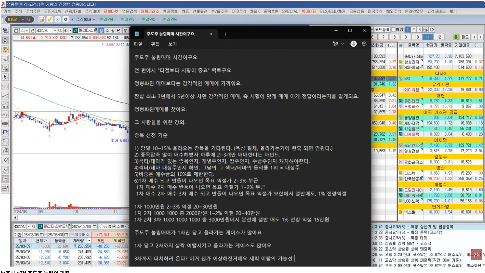
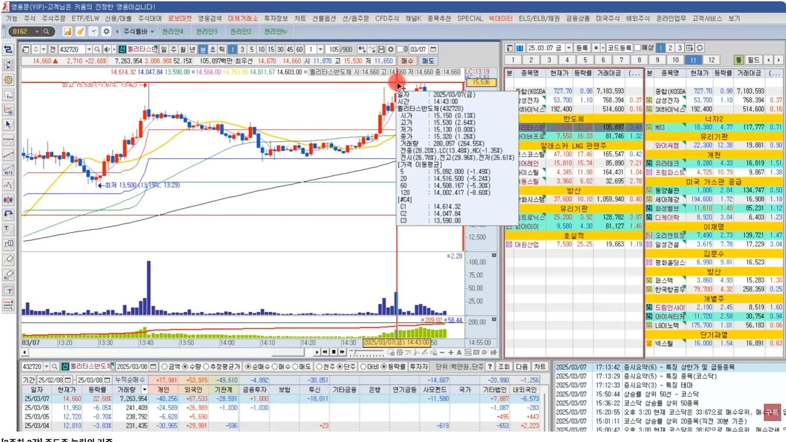
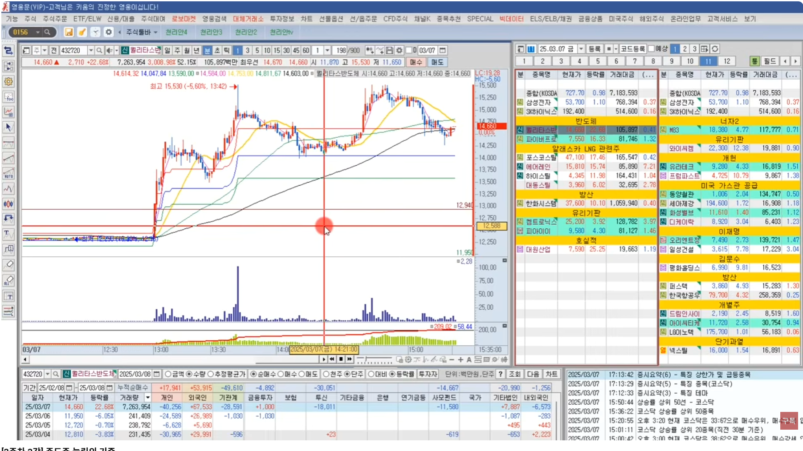
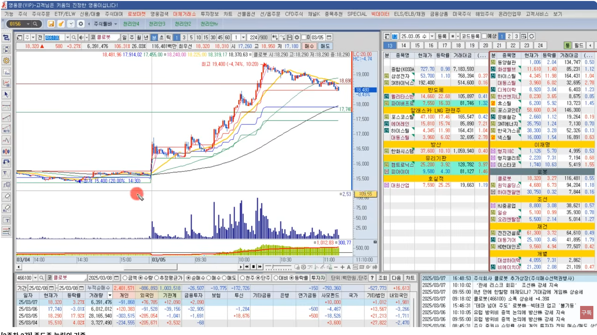
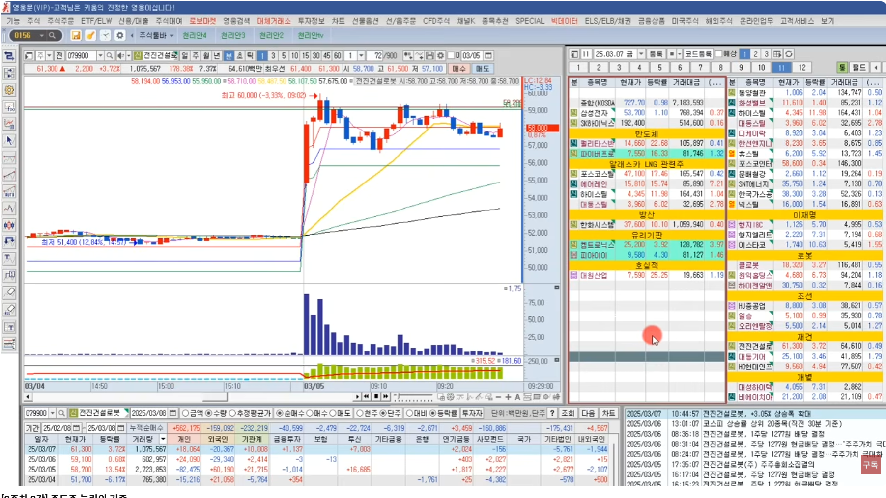

<br/> 

[[TOP]](#index)

---
## [S3-4강] 원숭이 기법 구조 정리
> - 주도주돌파매매 : 당일 5% 이상 상승한 종목
> - 주도주눌림매매 : 당일 10~15% 상승한 종목

### 주도주 돌파매매 
> 당일 5%이상에서 전고를 돌파하는 종목을 공략

- **상승의 연속성 있는 종목을 대상**
  - 대부분의 종목들은 5% 상승후 꼬꾸라지는 종목들이 많다. 
  - **5% 위에서 계속 상승하는 종목은 상승의 연속성이 있다고 본다**
  - 7~8% 까지 올라갔다가 5% 아래로 떨어지면 매매를 안한다
- **돌파매매하는 사람은 눌림을 절대 안한다**
  - 일단 눌림과 돌파의 타점은 완전 다르다 (정반대)
  - 분봉상 전고 돌파할때 매수
  - 일봉상 전고 혹은 부근 라운드피켜값을 돌파할 때 매수
  - 돌파봉의 저가를 깨면 손절
  - 돌파매매에서 1~2% 줄때 안먹으면 내려오더라 ⇒ 결코 쉽지가 않다
  - 돌파장세일때 돌파는 한번먹으면 크게 먹고, 손절은 짧다
- **눌림이던 돌파던 한가지만 숙련될때까지 하라!**
  - 돌파와 눌림매매의 타점은 완전 다르다
  - 돌파의 매수자리가 눌림의 매도자리 : 전고 돌파할때 매수 
  - 돌파의 손절자리가 눌림의 매수자리 : 매수봉(전고돌파) 저가이탈시 손절
  - 돌파의 매도자리가 눌림의 매수자리 : 높은산 꺾임 자리 (5이평 이탈, 고점과 저점 하락)
- **눌림매매는 심법이 전부다!**
  - 높은자리 하락에서 매수하기 때문...
  - 1분봉상 20이평은 중요
  - 5이평과 20이평을 동시에 깨도 120선이 올라오기 때문에 매수가 가능
  - 오후장에 20이평 아래로 내려오면 그 종목은 절대 매매하지 않는다
  - 120이평까지 내려오면 그 종목은 끝났다고 본다
- **돌파매매 vs 눌림매매 타점** : 🔴 매수, 🟢 익절, 🔵 손절

주도주돌파 매매 | 돌파타점 | 눌림타점 | 주도주눌림 매매 
--------|:------:|:------:|--------
📈 돌파매수타점 : 대부분 신고가 영역        | ♠️ | ♥️ | 📉 눌림매수타점 : 신고가 이후 조정자리 
📈 돌파종목선정 : 당일 5% 이상 상승한 종목  | ♣️ | ♦️ | 📉 눌림종목선정 : 당일 10~15% 상승한 종목
🔴 전고 돌파할때 진입 (분할 매수)          | 매수 | 매도 | 🟢 보유중이면 수익실현 (분할 매도)
🟢 전고돌파후 상승추세 꺾임 자리 전량청산 (높은산) <br/>⚪️ 고점&저점 하락, 5/20이평 이탈,  (추세전환 징후) | 매도 | ☺️ | 🔴 전고돌파후에 조정이므로 관심 (당일신고가 첫눌림) <br/>⚪️ 호가창 열고 매수대기
🔵 매수봉(전고돌파) 저가이탈시 손절           | 매도 | 매수 | 🔴 전고돌파 후 조정 C1, C2에서 매수
⚫️ 고점대비 중심아래 관심없음 (일봉상 긴윗꼬리) | ☹️  | 매도 | 🔵 전고돌파 후 조정 C3 이탈시 손절

- **돌파매매 vs 눌림매매 차이**

구분 | 주도주돌파 매매 | 주도주눌림 매매 
--------|--------|--------
**종목선정** | 당일 **5% 이상** 상승한 종목 | 당일 **10~15%** 상승한 종목 **(길목구간)**
**매매횟수** | 비교적 많다             | 해당종목 15개 내외이고, 하루 2~3개 종목만 집중 공략
**매매속도** | 아주 빠름 (1분~5분)     | 비교적 느림 (몇십분~몇시간)
**매매시간** | 장초에서 10시까지       | 9시30분에서 12시  
**장점**    | **돌파장세에서 수익이 극대화** (손익비 크다)     | 비교적 **당일주도주 공략하면 수익날 확률이 높음**
**단점**    | 수익날 확률이 높지않다. 줄때 안먹으면 손실   | 매매횟수가 많지 않다
**공통**    | 손절원칙 없으면 큰손실    | 손절원칙 없으면 큰손실 
**주요지표** | **신고가라인, 거래대금, 이평배열** | **피보나치라인, 수급주체, 이평추세**

<br/>

[[TOP]](#index)

---
## [S3-5강] 우끼기 매매의 기준
> 돌파매매 혹은 눌림매매 숙련될 때까지 한가지를 먼저 마스터하라 

### 주도주 눌림매매 
- 초보자일수록 눌림매매를 하라 ⇒ 제일 쉽다
- 고수들은 눌림매매를 하지말라고 한다
  - 손절남, 만쥬, 수급단타왕 등
  - ~이미 추세가 하락인 종목에서 눌림매매 하지말라~ 는 소리다
    - 고점과 저점이 하락, 20이평 아래에 있고 이평추세가 하락 ⇒ 이런 종목은 절매매매 금지
  - 추세가 우상향이어도 5이평을 이탈하는 자리에서도 하면 안된다
    - 즉, **5이평 위에서 거래대금이 들어오는 자리** 에서 하면 된다 
- **눌림매매 종목선정**
  - 거래량 터져서 올라오는 캔들
  - [x] 당일 **10~15% 상승한 종목** 에서 눌림매매를 한다 ⇒ 확률이 높다
    - C1 C2 분할매수하고, C3 부근 라운드피겨값 이탈하면 손절 
    - 반등시 2~3%정도 익절을 목표로 하되, 시장상황에 맞게 조정 ⇒ 시장분위기, 주도테마변경, 뉴스 등
    - 1번째와 2번째 눌림에서만 매매하라 
  - [x] 개별 이슈보다 테마로 올라오는 종목이 좋다
  - [x] 그 시간대에 섹터의 대장주를 공략한다. 
    - 등락률순으로 **주도섹터의 대장주** 가 누구인지를 알아야 한다
    - 당일 주도테마가 반도체라면 반도체의 대장을 등락률로 1등인 종목 ⇒ 주도주 대장주
    - 테마 후발주보다 대장주가 확률이 훨씬 더 높다
  - 심법관리
    - 종목만 보고 테마가 뭔지 알 수 있어야 한다. ⇒ 기존 전제 조건    
    - 돌매매매 금지
    - 하루에 2~3종목 매매하고 수익이든 손실이든 종료한다는 마인드
    - 익절은 2~3% 만 기계적으로 매도하고, 숙련되면 시장에 맞게 조정하면 된다.
- **Wrap Up**
  - [ ] **1. 당일 등락률 10~15% 길목에서 기다려라**
  - [ ] **2. 테마 대장주** 
  - [ ] **3. 타점에 일단 무지성으로 원숭이처럼 매수 걸어두자 (C1, C2 분할매수)**
  - [ ] **4. 익절은 1차매수 2-3% 반등에 매도, 2차매수 1-2% 반등에 매도, 3차매수 본전탈출**
  - [ ] **5. 하락시 C3 에 닿으면 그 밑에 라운드피겨 00으로 끊어지는 가격깰 때 손절**

  ```
  C3가 4840이면    4800 깨면 손절  ⇒ 복기하다보면 4810터치하고 반등하는 경우가 엄청 많다
      18470이면   18400 깨면 손절 
     122800이면  122000 깨면 손절
  ```
  
<br/>

<br/>주도주 눌림매매 <br/>

<br/>눌림매매하면 안되는 자리 : 하락추세 지속<br/>
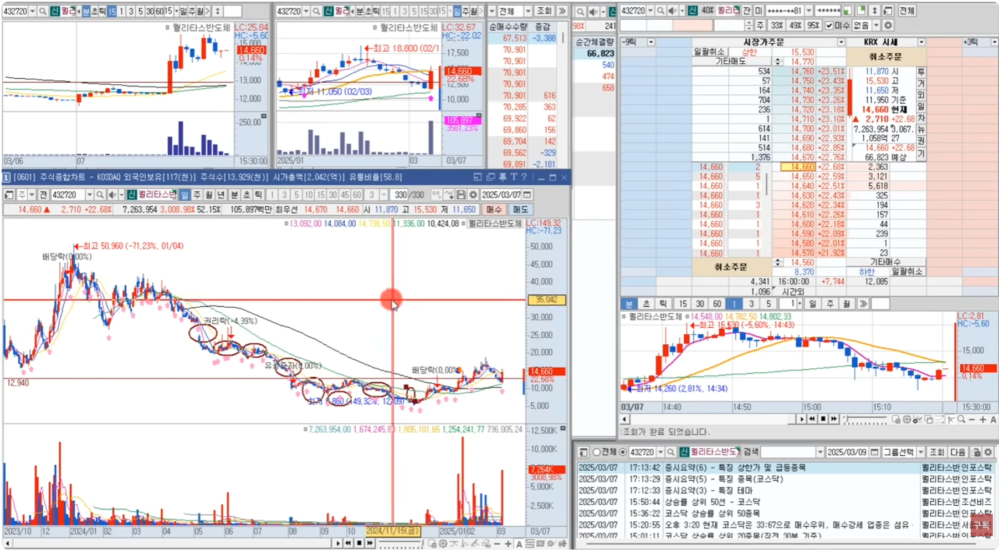
<br/>눌림매매하면 안되는 자리 : 상승추세에서 5이평 이탈<br/>
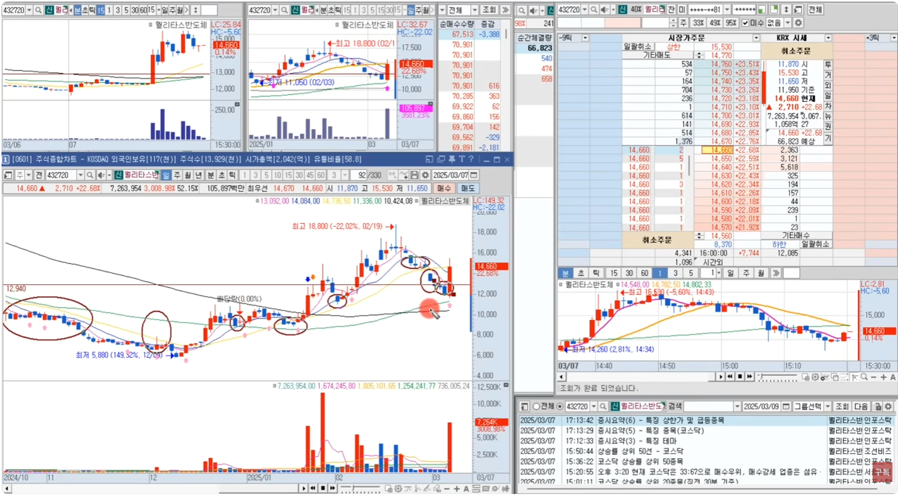
<br/>눌림매매자리 : 5이평 위 돌파양봉 첫눌림<br/>
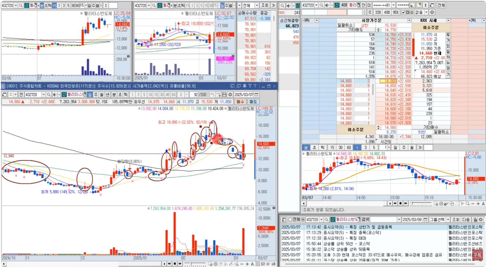
<br/>눌림종목선정 : 등락률 15%이상+주도섹터, 검색기[#등락률] <br/>
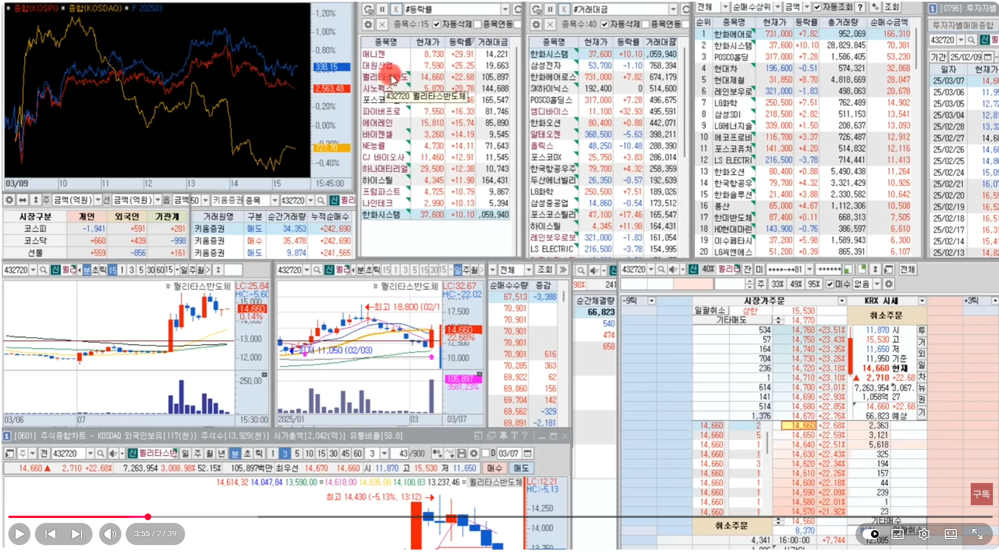
<br/>눌림종목선정 : 등락률 15%이상+주도섹터, 상한가/하한가[0162]  <br/>
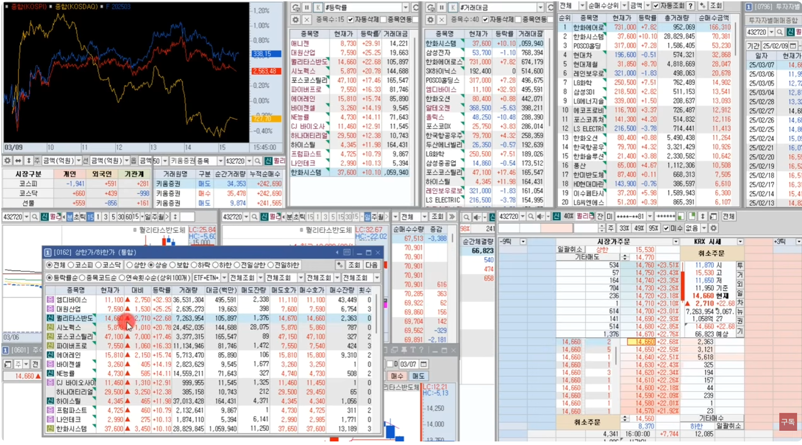
<br/>돌파후 눌림 C1 C2 분할매수<br/>
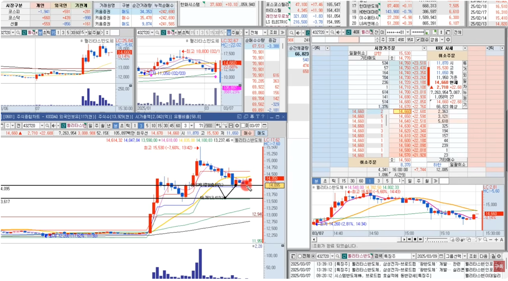
<br/>C3 아래 라운드피겨 이탈시 손절<br/>
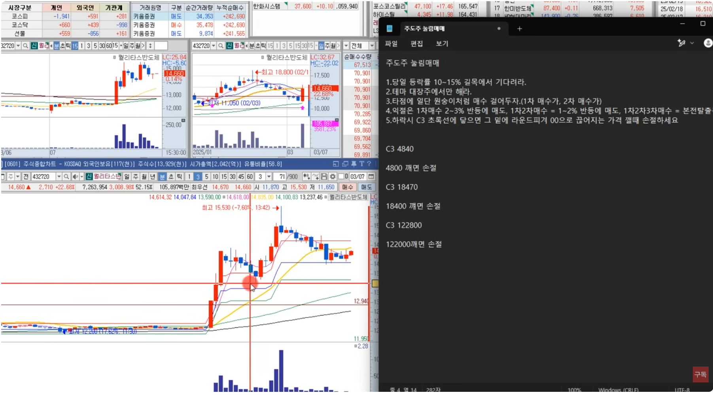

<br/>

[[TOP]](#index)  

---
## [S3-6강] 주식은 심리입니다
> 리버스패스님의 **이평선눌림매매** 연습중

- 주식은 심리가 전부
  - 비중조절만 잘해도 어떤시장을 만나도 무섭지가 않다
  - 최근 리버스패스가 눌림매매를 많이 하더라 ⇒ 그래서 파봤다
  - 15분봉 차트에서 120선과의 이격이 벌어졌을때 **이평선눌림 매매** 를 한다
- 15분봉 차트에서 가격 이동평균선 설정
  - [15분봉] 120선 : 일봉상  5이평
  - [15분봉] 240선 : 일봉상 10이평
  - [15분봉] 480선 : 일봉상 20이평
- 이평선간의 간격을 4등분선
  - 돌파한 고점과 120선을 4등분선으로 긋는다
  - 시장이 좋으면 Q1
  - 시장이 별로면 Q2
  - 시장이 쐬하면 Q3
  - 시장의 분위기에 따라 좀 다를수 있다
- 이평선눌림매매
  - 전고점을 돌파하고 조정구간에서 이평선눌림을 해볼만하다 
  - 고점과 120선과 이격이 최대한 벌어졌을때 한다
  - 120선을 이탈하면 매도 ⇒ 추세상 일봉5일선 위에 있어야 한다 
- 눌림매매를 많이 하는 곳
  - 120선과 이격이 많이 벌어진 자리 ⇒ 최근 돌파나 급등이 나왔다는 의미 
  - 시장의 분위기에 따라 좀 다를수 있다
  - 시장이 좋고 주도테마종목이면 5이평을 이탈해도 산다
- 시장에 따른 비중조절
  - 시장이 좋으면 (코스닥 +1.5% 이상) : 1천만~2천만
  - 시장이 별로면 (코스닥 +1.5% 이하) : 5백만~1천만
  - 시장이 쐬하면 (코스닥 -0.0% 이하) : 3백만~5백만
- 눌림매매의 기본
  - 120선이랑 이격이 벌어졌다가 내려오면 매수의 근거가 된다
    - 이격이 벌어졌다는것은 최근 급등이나 돌파 가능성
    - 15분봉상 120선 위에 있어야 추세가 살아있다고 볼 수 있다
    - 120선 아래 라운드피겨를 이탈하면 손절한다
    - 상승구간에 누군가 돈을 썼기때문에 그런 바보같은 짓은 안한다
  - 매수타점 예측
    - 매수타점1 : 고점대비 -10% 하락하면 매수
    - 매수타점2 : 20선과  60선의 중간
    - 매수타점3 : 60선과 120선의 중간
    - 120선 이탈하면 손절
  - 현재 이것을 **되돌림 파동** 이라고 보고 눌림에서 매매한다 
    - 내려간다고 한들 120선 이탈하면 손절한다
    - 하락하다가 120선을 돌파하고 이탈하지 않으면 되돌림 파동으로 본다
    - 고점대비 -10% 내려오면 사볼만하다
  - 전형적인 매집 
    - 고가 올리면서 눌리는데 저가도 올라간다

<br/>

[[TOP]](#index)

---
## [S3-7강] 원숭이 기법 실전 적용

- 주도주 눌림매매
  - 위에서 산사람의 손절물량을 받아먹는 매매
  - 최근 반등시 라운드피겨값을 깨고 반등나오는 경우가 많다
  - 고가대비 -5% 이상 빠지면 고가까지 바라보기 힘들다

<br/>

[[TOP]](#index)

---
## [S3-8강] 종가베팅의 기준

- **종가베팅은 각자 스타일이 다르다**
  - 그냥 느낌대로 하는 사람
  - 정형화 시켜서 하는 사람 ⇒ 수치
  - 이평선 눌림으로 하는 사람
  - 프로그램 수급으로 하는 사람
  - 기간 외인 수급 찍히면 하는 사람
  - 분봉 차트를 보고 하는 사람
  - **공통점은 시장주도주를 종가베팅한다**
- 종가베팅은 무조건 시장 주도주 중심에서 한다
  - 종가베팅이 다음날 올라갈 만한거 종베
  - 다음날 수급이 연속 될만한 종목
  - 오늘 강했지만 내일도 강할 종목
  - 매매근거
  - 가장 어려운 종가베팅이 차트 일봉보고 거래량도 안늘었는데 종가베팅
    - 이건 선취매 세력이 아닌이상 말이 안된다
    - 다음날 어떻게 올라갈지 아나?
  - 많은 고수들은 이평선눌림 안좋아한다. ⇒ 수급이 들어왔는지가 중요
- **종가베팅**
  - 급등후에 **3분봉상 120선을 처음으로 깬자리** 를 좋아한다
    - 이자리에 오면 최소 1천만원 정도는 한다
  - 이날의 주도주는? 
    - 2차전지에서 필에너지는 장초반에 올라갔고, 엠오피는 오후장에 올라갔다
    - 등락률상 대장은 엠오티
    - 차트상으로는 필에너지를 하는건데, 만약 필에너지가 등락률이 가장 높으면 필에너지를 한다
    - 근데 필에너지보다 등락률이 높은 종목이 있거나 상한가 종목이 있으면 필에너지는 안한다
    - 엠오티가 상한가를 깨고 내려왔지만 필에너지보다 등락률이 높으면 엠오티를 종베한다 
  - **종베는 무조건 1등주인 대장주를 한다**
    - 사람들에게도 엠오티가 대장주로 인식되어 있어, 다음날도 대장주될 확률이 높다
    - 다음날 후발주와 대장주가 바뀌면, 그날의 대장주를 해야 한다
    - 전날 종베자는 장초에 엠오티가 필에너지를 따라올라가면, 엠오티를 팔고 필에너지로 갈아타야 한다
    - 뉴스가 없으면 가장 최근의 뉴스를 본다. 
    - 가장 최근의 뉴스가 있으면 좋다. ⇒ **뉴스가 상승의 명분이 된다**
  - **세력의 손바뀜** : 상승의 연속성
    - 장초에 급등을 시킨사람은 VI 근처에서 판다
    - 근데 VI이후에도 거래량과 함께 상승이 이어진다면, 세력손바뀜이라고 볼수 있다.
    - 다음날도 상승의 연속성이 있을 가능성이 높다고 본다
- 종베종목 사례
  - 종베종목1. 대동스틸
    - 철강, 대동스틸이 3분봉상 120선 이탈 ⇒ 처음이랑 두번째 이탈을 가장 좋아함
    - 세번째 이탈은 보통 우상향 하다가 횡보하다가 우하향할 때가 세번째이다
    - 앞에서 첫번째 이탈이 나왔고 현재는 두번째 ⇒ 올라갈 확률이 높다
    - 첫번째 이탈에서는 다음날 바로 상한가 직행 했음
    - 올라갈 확률이 높은 이유?
      - 앞에서 누군가가 돈을 썼기 때문에
      - 그래서 최소 전날의 고가까지는 올라갈 수 있는 힘이 있다
      - 전날 물린사람들의 물량인 매물대를 다 탈출시켜준다 ⇒ 매집으로 본다
      - 어차피 내리면 다 손절할텐데,
      - 굳이 다 팔게하고 주가를 높힐 이유가 있는가? 그래서 매집으로 본다
      - 돈이 들어왔고 다음날 바로 상한가를 보내거임
      - 상한가 찍고 풀렸는데, 상한가에 상따로 들어온 사람들에 설겆이로 넘겼을수도 있고
      - 고점의 횡보구간에 물려 있는 사람들이 많은데, 내일까지 지켜볼 만하다
      - 그래서 오늘 종가베팅을 들어갔다
    - 다음날 예상과 달리 하락한다면 손절라인은?
      - 15분봉상 120선 혹은 
      - 일봉상 5이평선을 깨면 손절
      - 다음날 살짝 -2~3%밀렸다가 올라갈 수 있으므로 손절구간을 크게 본다
      - 아직 세력이 나간 흔적이 없다
    - 세번째 눌림은 하지 않는다
      - 첫번째 두번째는 상승했지만, 세번째는 쭉하락한다
      - 세력이 다시 방향을 돌려주기 전까지  ⇒ 되돌림파동이 나오기전까지 
  - 종베종목2. 티로보틱스
    - 연속상한가 2번
    - 둘째날 장마감때 3분봉상 120선을 깼어야 됐는데, 깨질 못했다
    - 거의 3일전대비 60% 상승자리이다
    - 아무리 대장주라 하지만 부담스러운 자리이다
    - 그런데, 다음날 장초에 3분봉 120선을 이탈했고 장마감까지 횡보
    - 그 다음날 결국 반등
- **3분봉 120선 이탈후 반등 패턴 ⇒ 이런 패턴이 정말 많이 나온다**
- 수많은 강사한테 수업을 듣고 이러한 패턴을 적용한것이다.
- 외국인 수급이 찍혀 있고, 프로그램이 순매수이면 좋다
  - 전날 보합이거나 마이너스인데, 다음날 갭이 뜬다면 팔아먹어려고 띄운것이다.
  - 장초반에 다 팔아먹고, 오후에 다시 사들인거 프로그램매매추이를 보면 흔적이 보인다
  - 개인들도 외국인이 3일동안 모은거 턴다고 생각하고 같이 판다
  - 18만주까지 팔았다가 다시 사모으기 시작 장끝날때 20만주까지 다시 사모았다
  - 프로그램도 개인들이 따라 사고파는걸 아니깐, 더 똑똑해졌다.
  - 프로그램이 아닌 다른 거래원으로 받아먹고..
  - 이걸 다시 사려면 고점에 따라들어갈수 밖에 없다.
  - 기관은 분할로 사는 반면, 외국인은 개인처럼 산다
    - 기관은 매수결제가 떨어져야지 매수를 할 수 있다. 
    - 어떤 종목을 10만주 사야된다면, 시간단위로 2만주씩 사모은다
    - 기관은 가격이 아니라, 물량수가 더 중요하다
- 종가베팅 자리
  - 원래 엠오티는 종가베팅자리는 아니었다
    - 하지만 돌파후에 첫눌림 C1 자리여서 매수했지, 안닿았으면 종베 안했다
  - 종가베팅은 필에너같은 **3분봉120이탈 자리** 가 좋은 자리이다
    - 상승이 있고 눌림이 있으면 반등이 있다
    - 그걸 먹는게 **눌림종가베팅** 이다 
    - 승률이 80% 이상 나온 좋은 종가베팅임!
    - 근데, 나머지 20% 에서 전부 반납하는 경우가 있으므로 손절은 필수!
    - 앞에서 짤짤이로 번거 10번이상을 한방에 날린다
    - 그래서 주도주 대장주를 해야한다
  - 티로보틱스, **종가고가종가베팅**
    - 다음날 이 윗꼬리를 잡아먹으러 갈꺼야
    - 그 기대감이 있을때 종가베팅 한다
    - 다음날 갭하락하면 쭉밀릴수도 있다 ⇒ 갭하락으로 시작하면 일단 손절
    - 1%던 2%던 갭하락하면 쭉 빠지는 경우가 많았다 (무조건 전날 상승치 반납)
    - 사람들이 손절을 못하게 만들고, 물타기물량에 던지고 나가는 거다


<br/>

[[TOP]](#index)

---
## [S3-9강] 종가베팅 확률 구조

<br/>

[[TOP]](#index)

---
