🏠 > [kostock](../../../) > [experts](../../) > [천리안주식](../) > `S4_주도종목실전 - (1)종목선정기준`

<table>
  <tr>
    <td><a href="../">[천리안주식]</a></td>
    <td><a href="../S0_INTRO_NEW">S0_INTRO</a></td>
    <td><a href="../S1_시장보는기준">S1_시장보는기준</a></td>
    <td><a href="../S2_단타의기본기">S2_단타의기본기</a></td>
    <td><a href="../S3_쉬운매매구조">S3_쉬운매매구조</a></td>
    <td><a href="../S4_주도종목실전">S4_주도종목실전</a></td>
    <td><a href="../S5_유료강의압축">S5_유료강의압축</a></td>
  </tr>
  <tr>
    <td colspan="7" align="right"> 
      <b href="S4_실전1.md">1️⃣ 종목선정기준</b>  | 
      <a href="S4_실전2.md">2️⃣ 주도주매매 </a>  | 
      <a href="S4_실전3.md">3️⃣ 데이트레이딩</a>  | 
      <a href="S4_실전4.md">4️⃣ 종목선정심화</a>  | 
      <a href="S4_실전5.md">5️⃣ 장대양봉단타</a>  | 
      <a href="S4_실전6.md">6️⃣ 매매기법특강</a>      
    </td>
  </tr>
</table> 

### INDEX
- [[S4-1강] 종목 선정의 기준](#s4-1강-종목-선정의-기준)
  - [CH1. 왜 종목 선정부터 시작해야 하나?](#ch1-왜-종목-선정부터-시작해야-하나)
  - [CH2. '광기'는 어디서 시작하는가?](#ch2-광기는-어디서-시작하는가)
  - [CH3. 신고가란 무엇인가?](#ch3-신고가란-무엇인가)
  - [CH4. 왜 그 순간부터 시작인가?](#ch4-왜-그-순간부터-시작인가)
- [[S4-2강] 종목 선정 실전 사례](#s4-2강-종목-선정-실전-사례)
  - [CH5. 실전 사례 예시](#ch5-실전-사례-예시)
  - [CH6. 결론 - 왜 이것부터 배워야 하나?](#ch6-결론---왜-이것부터-배워야-하나)

---
# S4. 주도주 실전 완성 (1) 종목 선정 기준

재생시간 | 강의제목 
:------:|---------
10:26 | [4주차 1강] 종목 선정의 기준
17:27 | [4주차 2강] 종목 선정 실전 사례

 

[[TOP]](#index)

---
## [S4-1강] 종목 선정의 기준
> - 종목선정이 전부입니다
> - 시작은 신고가에서

### CH1. 왜 종목 선정부터 시작해야 하나?

- 가장 기본으로 잡아야 할것이 종목선정
- 이것을 모르면 돌파매매, 종가매매, 눌림매매 이런것들은 의미가 없다
- 아무리 좋은 매매기술을 배워도 어떤 종목을 잡느냐에 따라서 결과가 갈린다
- 같은기술, 같은방식으로 매매해도 결국 좋은 종목이냐 아니냐에 따라 수익률은 하늘과 땅 차이다
- **종목선정은 시장에서 살아남은 기준점** 이 될것이다

 

[[TOP]](#index)

---
### CH2. '광기'는 어디서 시작하는가?

- 시장에서 어떤 종목들은 두배, 세배, 네배 혹은 열배씩 올라가기도 한다
- 저건 도대체 어디서부터 시작됐는가?
- 꾸준히 차트를 복기하면서 한가지 공통점을 발견했다
- 답은 단순했다 
- 바로 **'역사적 신고가 돌파'** 에서부터 시작된다

 

[[TOP]](#index)

---
### CH3. 신고가란 무엇인가?

- 신고가란 "상장이후 처음으로 최고가를 넘어서는 순간" 이다 
- 보통은 52주 신고가를 말하지만, 
- 내가 말하는 것은 더 강력한 **'역사적 신고가'** 이다
  - 예를들어, 어떤 종목이 2020년에 상장했는데 계속흘러서 1,000원까지 내려왔다
  - 그리고 오랜시간이 흐른뒤에 2025년에 다시 상장가 최고점을 돌파했다
  - 그 순간이 바로 역사적 신고가 이다

 

[[TOP]](#index)

---
### CH4. 왜 그 순간부터 시작인가?

- **모든 악성 매물대가 해소된다**
  - 역사적신고가를 갔다는것은 그전에 저항대 구간을 다 돌파하고 올라간 것이다. 그죠?
  - 그런 이전 저항대 구간이 악성매물대인데 그런 구간을 다 돌파하고 올라갔기 때문에 
  - 물린 사람들이 대부분 본전 이상에서 매도하고 떠난다
  - 그래서 거기가 보통 다 저항대로 만들어지는건데 
  - 그 구간을 돌파 했다는건 이제는 그위에 **매물대가 없는 구간** 이라는 거다
  - 그래서 이제 **'본격적으로 시세가 시작될 수 있는 구간'** 이라고 생각하면 된다
- **일반 투자자들은 겁내고 못 산다**
  - 이미 많이 올랐다고 생각해서 못들어온다
  - 그 **심리를 역이용**해서 큰 자금이 더 밀어 올린다
- **거래대금이 폭발하며 유동성이 살아난다**
  - 거래대금이 늘어난다는 것은 시장관심이 몰린다는 것을 의미한다
  - 이 구간부터는 **본격적인 주도주의 조건** 이 갖춰진다
- **호가창이 빵빵해진다**
  - 비중을 크게 실을수 있는 구간이기 때문에 큰자금이 들어오기도 한다

 

[[TOP]](#index)

---
### 이전고가 자리
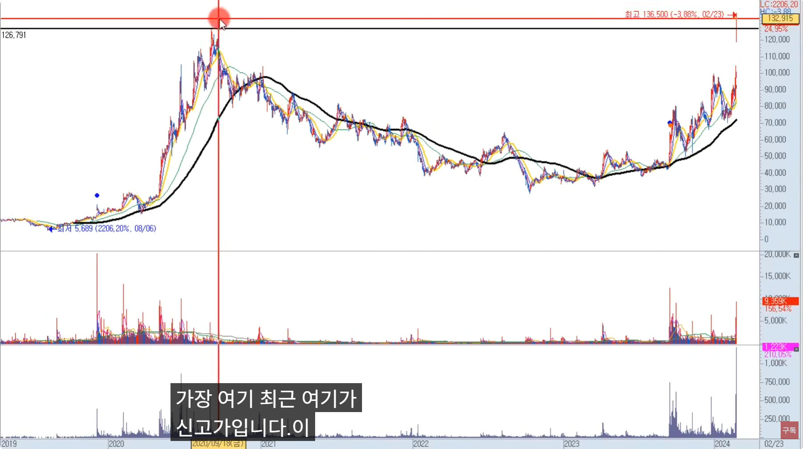
- 이전고가 자리 

[[TOP]](#index)

---
### 신고가돌파 자리
> 역사적인 신고가, 역사적인 거래대금

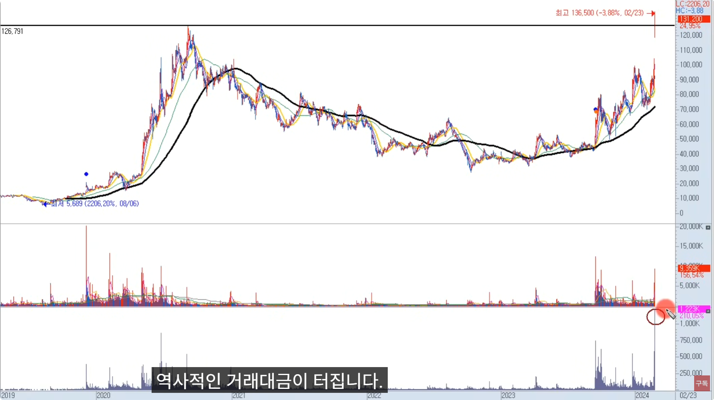
- 최근 신고가 어디?
- 여기를 갭으로 돌파하면서 
- **역사적인 거래대금이 터졌다**
  - 거래대금은 시장에 관심이 몰린다는 뜻이다
  - 즉, 많은 매수와 매도가 이루어졌다는 뜻이다
  - 샀다 팔았다 샀다 팔았다... 즉 유동성을 이야기 하는거다
- 근데, 역사적 신고가를 돌파했는 거래대금이 약하다
  - 그러면 시장에 관심이 부족하다는 것이다
  - 유동성이 별로 안좋은 종목인거다

[[TOP]](#index)

---
### 신고가 돌파의 의미
> 모든 악성매물대 소화

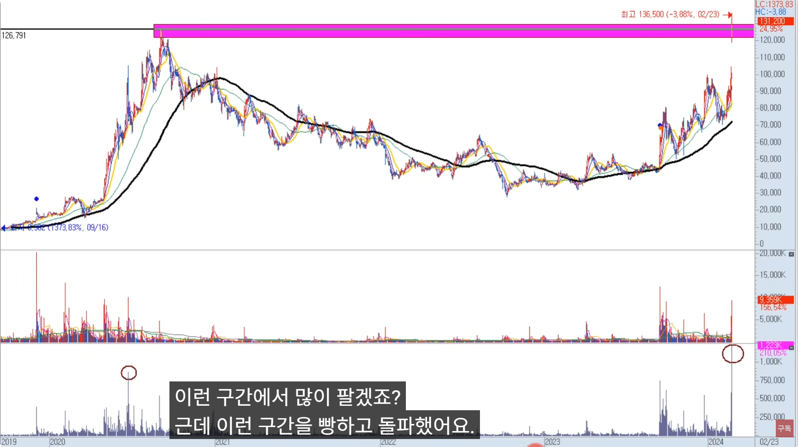
- 전고점에 물린사람들이 있을거다
  - 그리고 이구간에서 물량을 스윙으로 끌고 오는 사람들이 어디서 많이 팔겠어요?
  - 전고점을 저항으로 보고 이런 구간에서 많이 팔겠죠
- 그런데 이 구간을 돌파했다
  - 장중에 돌파할 때 밑에서 들고있던 사람들은 다 매도하겠죠
  - 매도 매도 매도 매도 매도 그죠? 하겠죠
- 결국에는 이 구간을 **돌파해서 종가로 마감** 했다
  - 매도세가 이겼으면 주가가 떨어지는게 맞는데 
  - 강력한 매도세에도 불구하고 종가가 전에 신고가를 돌파해서 마감했다
  - 그러면 **매수세가 이긴거라고 볼수있다**

[[TOP]](#index)

---
### 신고가돌파 이후
> 종목선정기준은 역사적신고가 돌파이후 유동성 폭발하는 종목

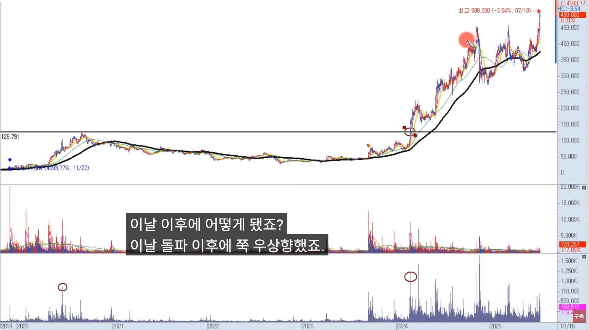
- **신고가 돌파이후** 어떻게 됐나?
  - 이날 돌파 이후에 쭉 우상향 했다
  - 13만원 대비 엄청나게 많이 올라갔다. 최고 50만8천원
  - 그러니까 이때 당시에 **한번도 본적없는 가격을 찍고 거래대금이 폭발 그리고 장대양봉** 이 일어났다
  - 그 이후에 이만큼 폭등을 한거다
- 그러면 이제와서 알수있는건 이 가격대가 **시작을 알리는 구간** 이었다
  - 왜냐면 결국에는 **시장중심주** 라고 하는것들을 보면은 다 역사적신고가를 돌파하고 
  - 두배 세베 다섯배 막 열배까지 가는 종목들이 나온다
  - 그런 종목들을 이제 시장중심주라고 하는거다
- **제 매매는 항상 이 구간에서부터 시작된다 ⇒ 역사적신고가**
  - 20년 30년 이 뒤에도 다 보는건 아니다
  - **현재 기준으로 과거5년의 고점을 돌파** 하는 캔들이 떴다고 하면 **역사적신고가** 라고 한다
  - 이것을 모르면 앞으로 배우게 될 돌파매매, 종가매매, 눌림매매 이 모든 전략이 헛수고가 된다
  - 준비된 종목은 여기서부터 출발하는 것이다
- **종목선정기준은 역사적신고가 돌파이후 유동성 폭발하는 종목**
  - 역사적신고가를 돌파하고 유동성 즉 거래대금이 폭발하는 종목
  - 거래량이 폭발했다는 것은 이 구간에 있는 투자자들의 물량 매물을 소화하고 있는 과정이다
  - 역사적인 구간을 돌파하면서 역사적인 거래대금까지 터졌다
  - 이것을 확실히 기억해야 한다
- 모든것은 여기를 기준으로 흘러갈것이다

 

[[TOP]](#index)

---
## [S4-2강] 종목 선정 실전 사례
> 역사적신고가 실전사례

### CH5. 실전 사례 예시

### 이전 요약

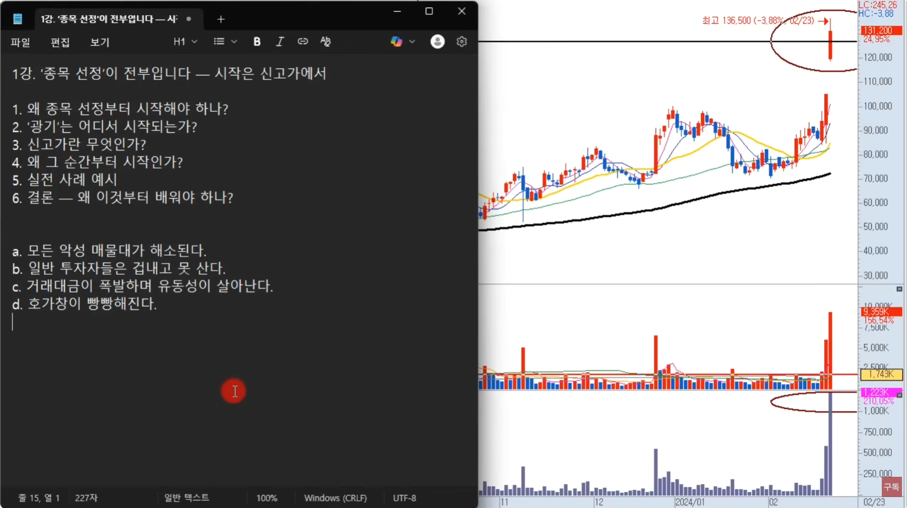

- 역사적인 신고가를 장대양봉으로 뚫었다
  - 뚫을때 특징? 
  - 역사적인 거래량, 역사적인 거래대금
- 왜 역사적인 거래량과 거래대금이 터질까?
  - 그전에 산사람들의 모든 물량을 가장 높은 구간에서 매집이 들어온거라 볼 수 있다
- 역사적인 고점에서 장대양봉 캔들이 뜨면서 역사적인 거래량 거래대금이 터진다
  - 이것은 상승의 끝자락이 아니라 상승의 초입부분이다

---
### 사례1. 
> 레인보우로보틱스

<table>
  <tr>
    <td>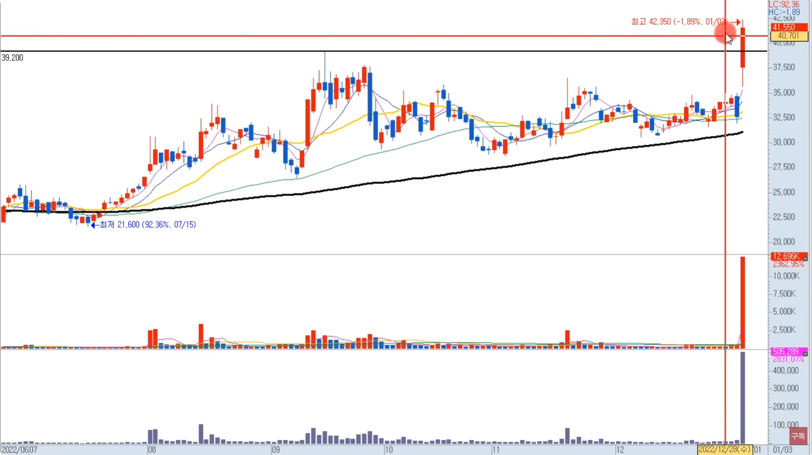</td>
    <td>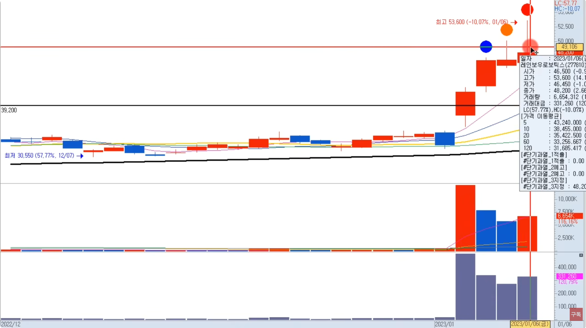</td>
  </tr>
  <tr>
    <td>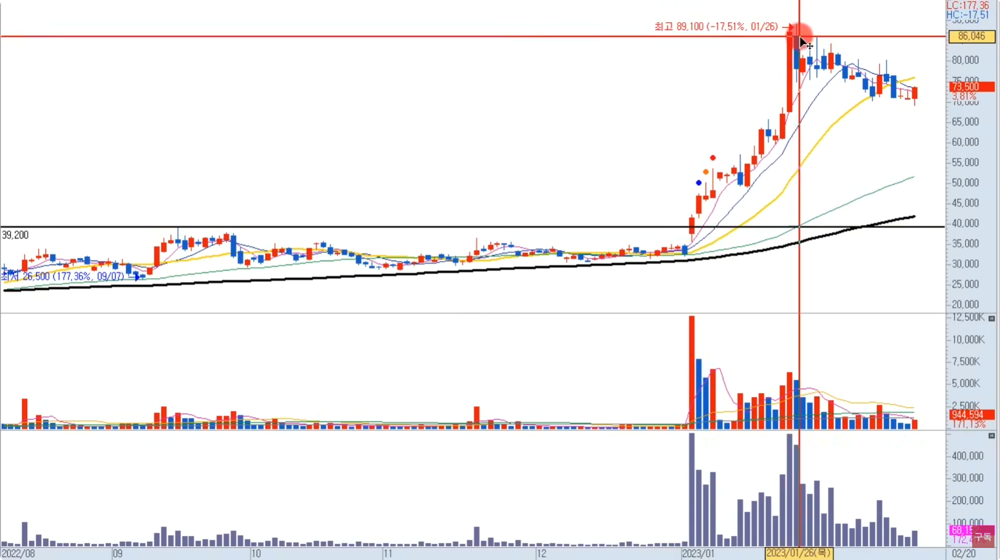</td>
    <td>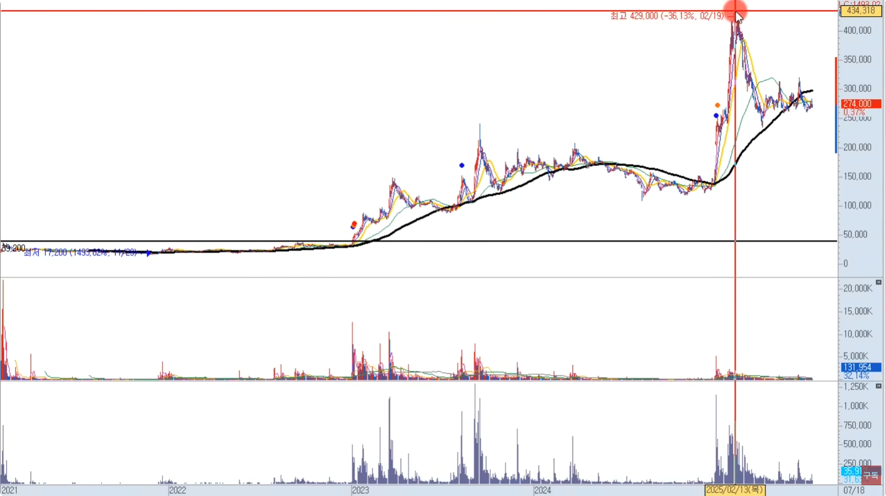</td>
  </tr>
</table>

- 당시에 삼성전자가 레인보우로보틱스를 인수한다는 이슈로 급등
  - 이날 기점으로 시세가 어떻게 흘러갔나?
  - 4만원 대비 두배 올라갔고
  - 이후에 계속 올라가서 최고점 42만9천원
  - 역사적신고가돌파 가격대비 최고가로 따지면 열배를 올라갔다 ⇒ **텐베거(Tenbagger)**, 대박주식
  - 2025년 현대대비도 7배이다
- **역사적신고가를 돌파하는 날이 시세의 시작점** 이 되는거다
  - 매일 사고팔고는 잡기술에 불과하고
  - 진짜는 이런 돈이 들어오는 종목, 
  - **고래들이 춤추는 종목에서 스윙을 하는게 진짜** 가 아닌가 그런 생각을 한다
- **"스윙안에 단타있다"** 는 얘기가 있다
  - 남들이 이런구간에서 스윙할때 전문 억대트레이더들은 장대양봉이 나오는 출연한 날에서 데이트레이딩을 한다
  - 이날도 29% 상한가 간 날은 데이트레이더들이 다 총 집합했겠죠
  - 다음날도 그다음날도..
- 우리 **데이트레이더들도 큰물에서 놀아야 된다**
  - 그냥 장중에 막 올라오는 시가총액 낮은 개잡주에서 돌파매매 하다가는 발전이 없다
  - 한달에 매매를 다섯번 열번만 하더라도 이런데서 매매를 해야한다
  - 이때 스윙으로 종가베팅을 안했다고 한들, 단타칠 수는 있어야 한다

[[TOP]](#index)

---
### 사례2. 
> 

<table>
  <tr>
    <td>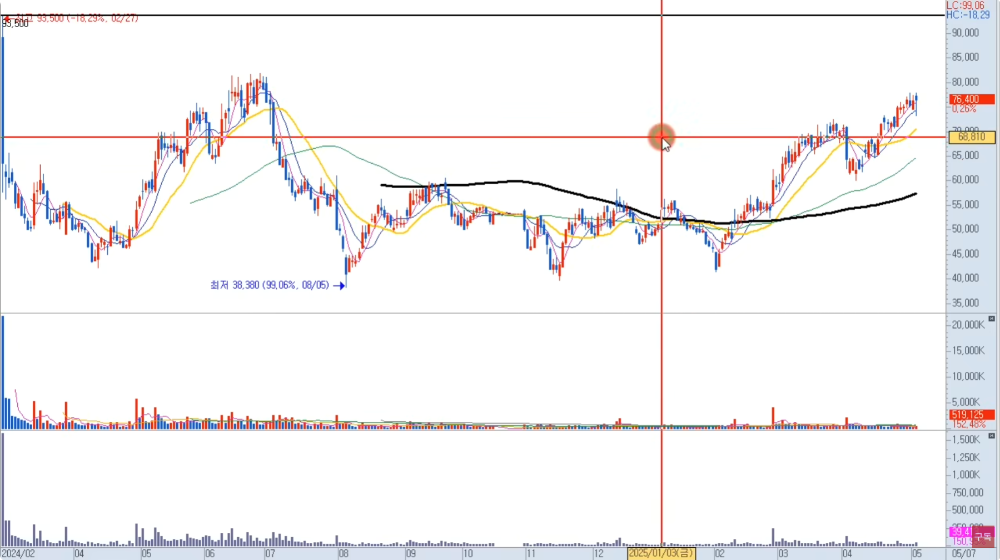</td>
    <td>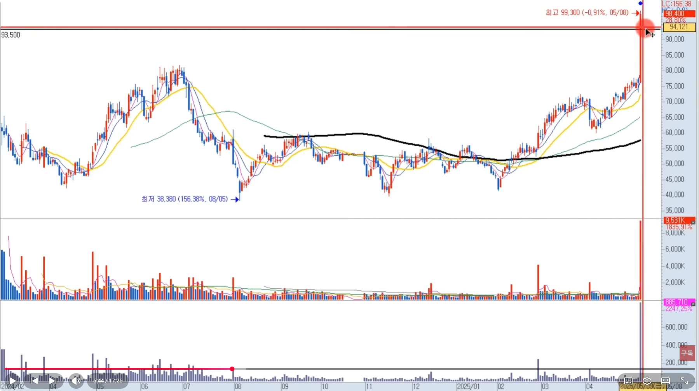</td>
  </tr>
  <tr>
    <td>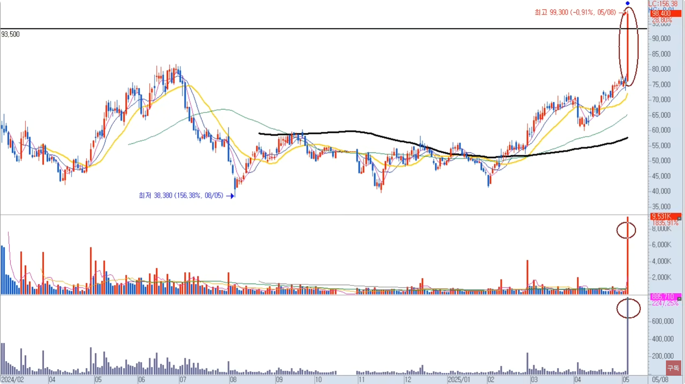</td>
    <td>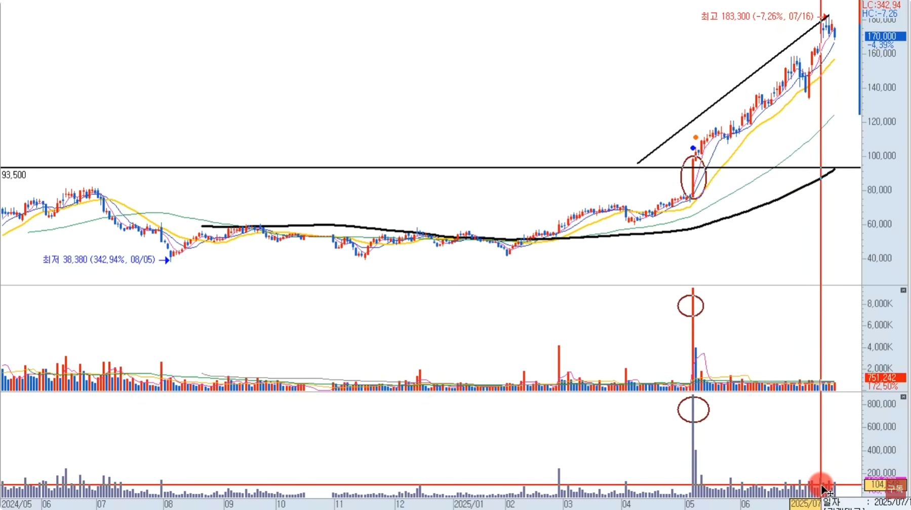</td>
  </tr>
</table>

- 어디서 돌파했나? 
  - 이종목의 전고가 93,500원
  - 바로 전고가를 돌파할때 장대양봉이 출현
  - **돌파기준이 장대양봉 출현**
- **보통 10~15% 이상의 장대양봉이 출현하면 데이트레이더들이 총집합** 을 한다
  - 왜냐면 억데트레이더들 특히 데이트레이더들은 10~15% 이상 올라간 종목에서의 매수매도하는걸 좋아한다
  - 어째떤 10~15% 이상의 장대양봉 이 종목은 이날 상한가를 갔다
- 역사적인 거래량 거래대금이 터지면서 어떻게 됐나?
  - 그전까지는 뭐 찔끔찔끔 올라가던 주가의 움직임이 돌파이후 시원하게 우상향을 했다
  - **역사적신고가 이후에 탄력이 더 붙는다** 는것을 보여준다
- 이때 가격대비 최고가 91%, 엄청 올라갔다
  - 이때 이후로 주가는 올라가지만 거래량과 거래대금은 줄어든다
  - 그러니까 **이때 그전 앞에 있는 매물대를 소화하고 물량을 잠궜다** 는 뜻으로 해석할 수 있다
- 어떤 느낌인지 알겠나?

[[TOP]](#index)

---
### 사례3. 
> 

<table>
  <tr>
    <td>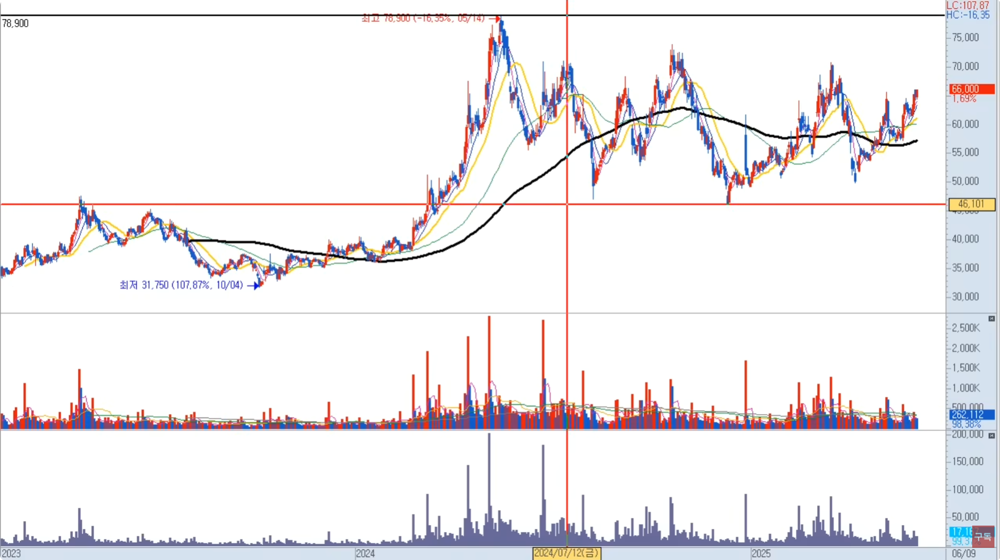</td>
    <td>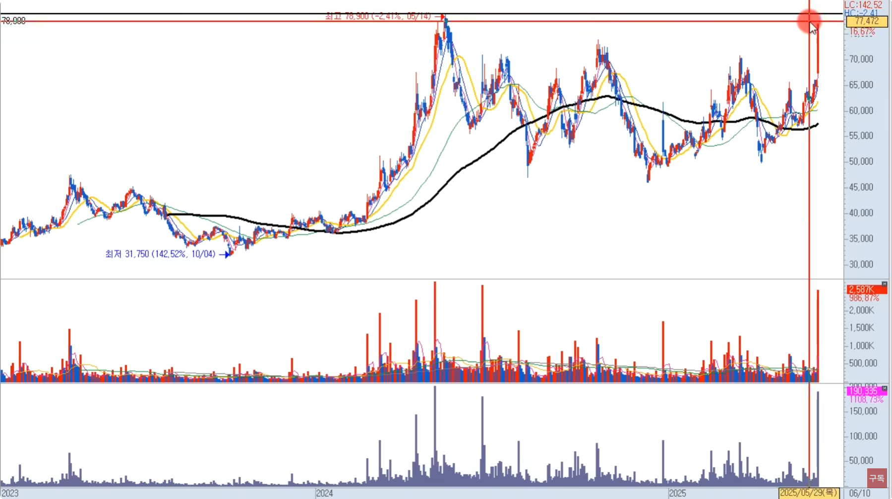</td>
  </tr>
</table>

- 이종목의 이전신고가는 78,900원
  - 이 구간을 장대양봉으로 갖다붙였다. 돌파하지는 못했지만
  - 보통 **이 정도로 갖다 붙이면 여기를 돌파하러 가겠다는 소리** 다
  - 그럼 이런데서 종가배팅도 가능하다
  - 그래서 사람들이 종가에 종가로 막 들어오니까 **종가고가종베** 가 되는거다

---
<table>
  <tr>
    <td>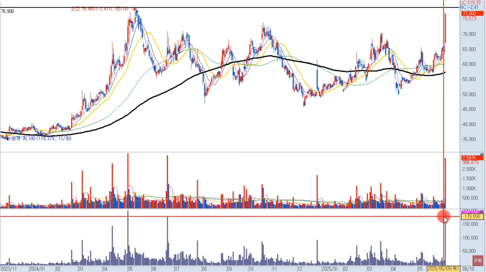</td>
    <td>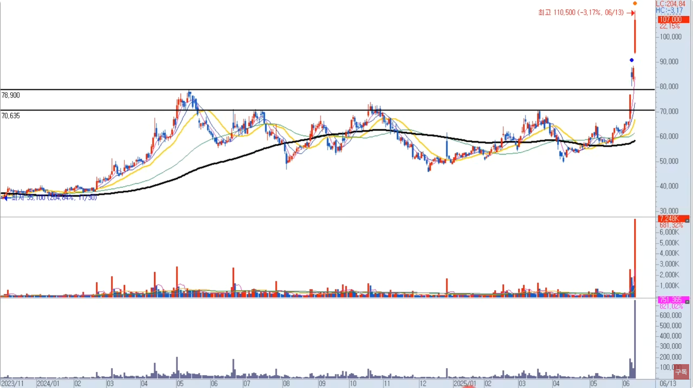</td>
  </tr>
</table>

- 누가나 아는 이런 저항대도 돌파했고
  - 다음날 아싸리 갭으로 떠가지고 시작을 했고, 상승형음봉으로 마감
  - 그럼 여기서 종가배팅한 사람들만 이득을 본거겠죠?
  - 이렇게 갭으로 떴을때 거래량 거래대금도 잘 터져줬다

---
<table>
  <tr>
    <td>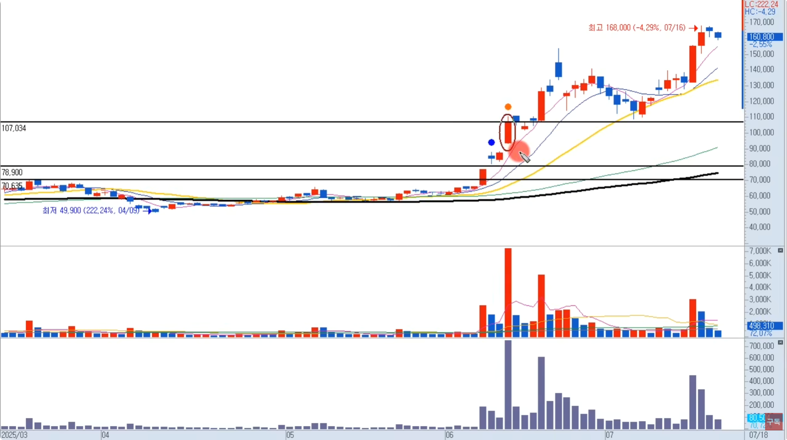</td>
    <td>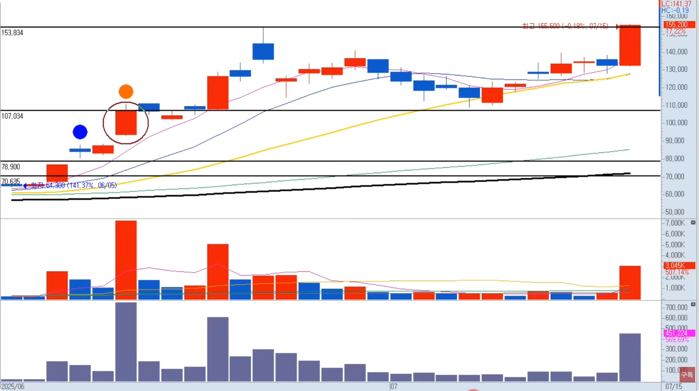</td>
  </tr>
</table>

- 이후에 어떻게 됐나?
  - 다음날 역사적인 거래량 거래대금이 터졌다. 7,500억
  - 이때 26%까지 올라가는 장대양봉이 출현
  - **최고가에서 역사적 거래량이 터졌다는 것은 그 앞에 있는 매물을 이 가격대에서 소화를 하고 있다** 는 것이다
  - 그러니까 이 가격대에서 매수와 매도가 많이 일어났다.
- 만약에 세력이 아 가격대에서 세력이 물량을 털었다면 주가는 빠지는게 정상이다
  - 왜냐하면? 이 가격대에서 세력이 턴다면 그 물량을 누가 받아 주겠어?
  - 근데 이 구간에서 그 앞전의 장기투자가든 단타든 스윙이든 그 사람들의 물량을 여기서 세력이 싹 다 흡수했다
  - 그러면 **이제 이게 기준가가 되고 여기서부터 올라가기 시작** 하는 것이다

---
<table>
  <tr>
    <td>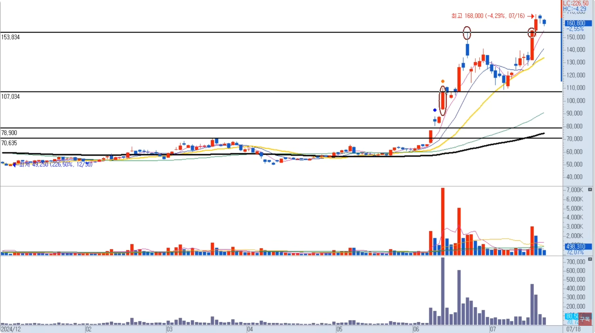</td>
  </tr>
</table>

- **스윙안에 단타있다** 이런말이 많다
  - 그게 **역사적신고가에서 다음 캔들에서 이런데서 눌림** 을 할 수도 있는거고
  - **역사적신고가를 다시한번 갱신하는 장대양봉에서 데이트레이딩** 을 할 수도 있는거고
  - 이날 이후로 갭이 뜨잖아요. 다음날 2.6%, 그다음날 14%
  - **사람들의 기대감이 높은 상태니까** 다음날 갭이 뜨는것이다
- **주가가 빠지더라도 기준가의 종가를 훼손하지는 않는다**
  - 밀리더라도 다시 이 가격대를 갱신하러 간다
  - 갈때 거래량과 거래대금이 터진다
- 근데 앞전보다는 덜터진다. 왜 덜 터지냐?
  - 여기서(이전 돌파자리) 물량을 어느정도 잠궜다고 생각해보자
  - 주가는 더 올라가지만 거래량은 앞전보다는 덜터지는거다
- 예를들어 
  - 100만주가 유통되고 있다. 100만주 중에 한 60~70만주를 잠갔다고 쳐보자
  - 그러면 주가는 더 올라가더라도 거래량과 거래대금은 앞전보다는 덜 터지는거다
  - 그리고 주가는 이렇게 올라가는거지
- 어떤 느낌인이 알겠나?

[[TOP]](#index)

---
### 사례4. 
> 풍산, 두산에너빌리티, 한화에어로스페이스

<table>
  <tr>
    <td>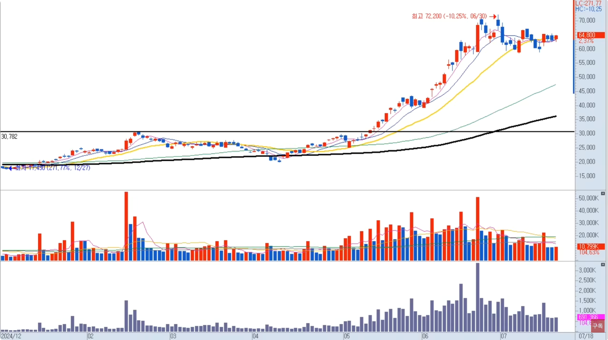</td>
  </tr>
</table>

- 풍산, 장대양봉 출현
  - 이후 올랐다 내려오더라도 기준봉종가를 훼손하지는 않는다
  - 그래서 중목선정이 중요하다
  - 종목선정도 역사적신고가를 가는 종목에서 정해야 된다는 것이다
- 두산에너빌리티도 신고가를 돌파하고 역사적신고가를 가고 있다
  - 두산에너빌리티도 이 저점을 훼손하지 않으면 다시 장대양봉 쏘고 올라갈 수 있다. 충분히
- 한화에어로스페이스
  - 이 안에서 매매하는 것이, 
  - 시장의 중심주를 매매하는 것이다

[[TOP]](#index)

---
### 사례5. 
> 포스코퓨처엠

<table>
  <tr>
    <td>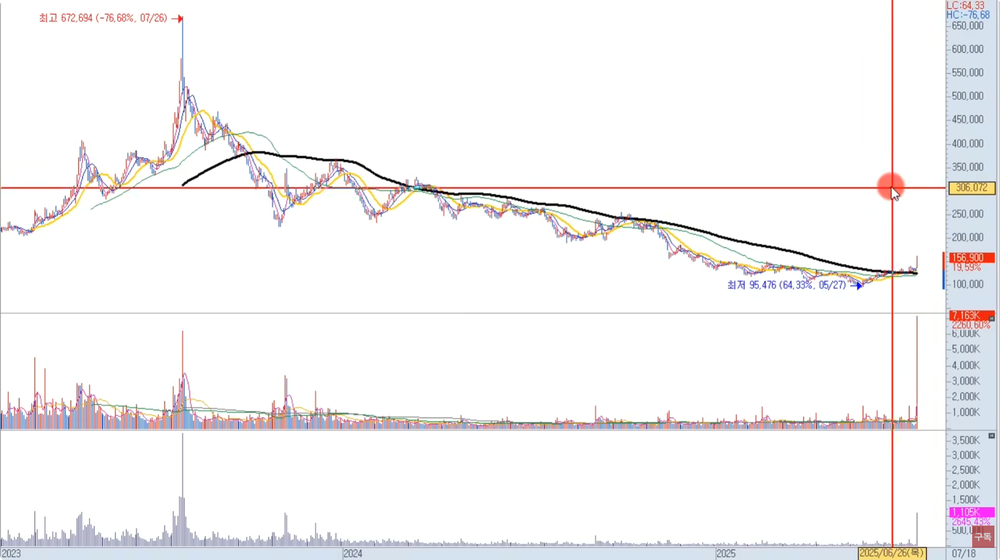</td>
    <td>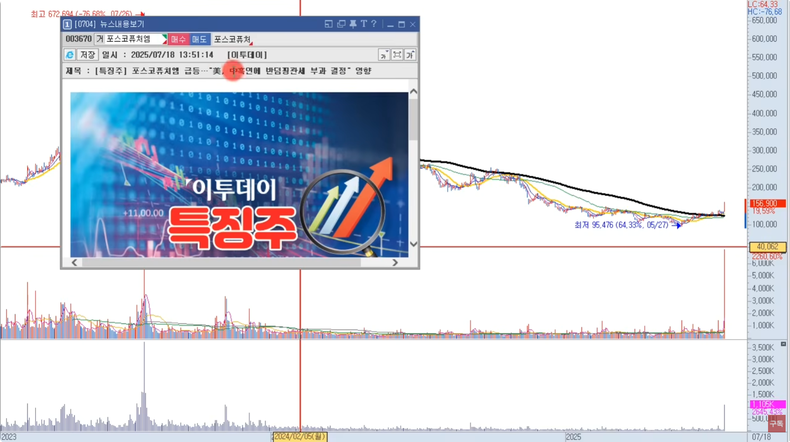</td>
  </tr>
</table>

- **바닥권에서 상승** 한 이런애들은 시장의 중심주라기 보다는 
  - 시장의 중심주가 고가권에서 더이상 올라가지 못하고 횡보를 하고 있으니까
  - **순환섹터가 올라온다고 보면 된다**
- 그리고 이 종목은 오늘 뉴스까지 있었다. 
  - 리튬가격이 3개월 이내 고점을 돌파해서 올라가고 있다
  - 중국 흑연 관련 뉴스도 있었다

---
<table>
  <tr>
    <td>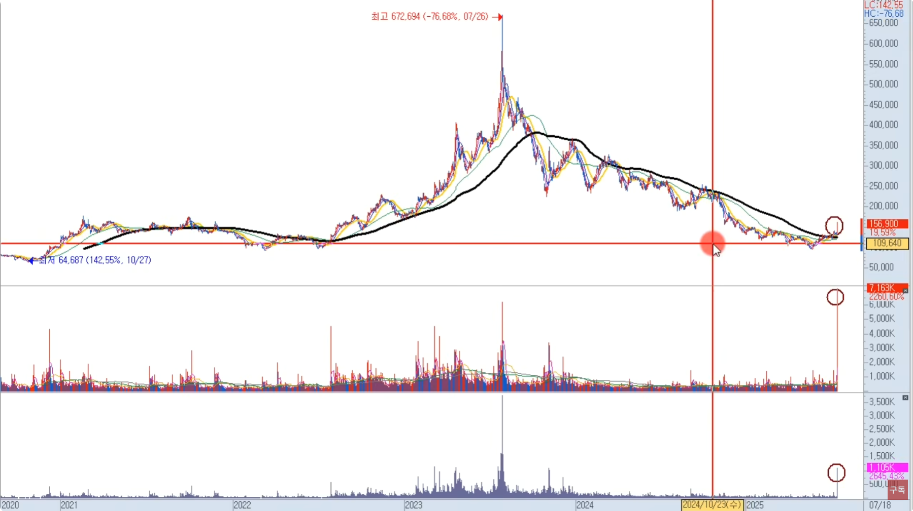</td>
    <td>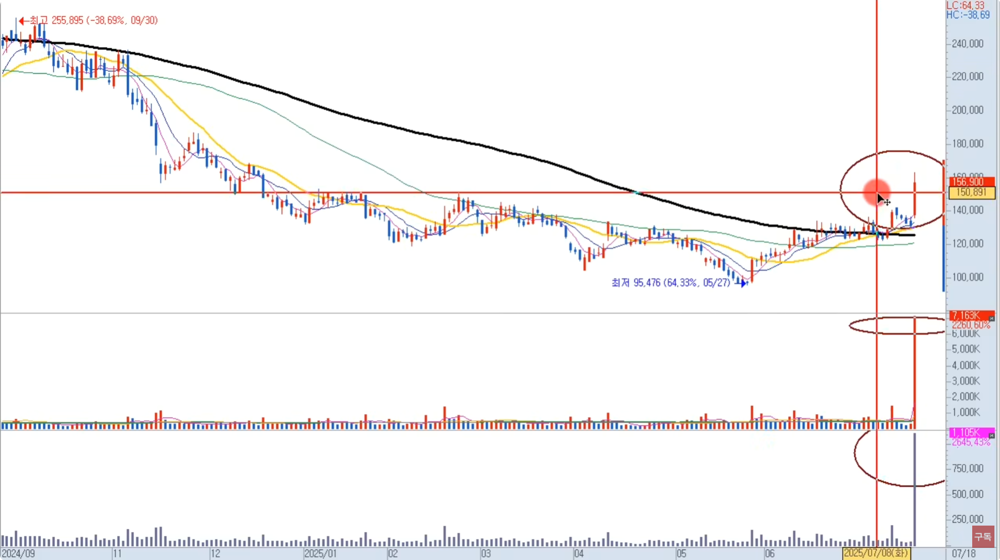</td>
  </tr>
</table>

- 포스코퓨처엠은 현재 가격대에서 역사적인 거래량을 터트렸다
  - 거래대금은 낮으나 역사적인 거래량을 터트렸기 때문에 앞으로 추이를 지켜볼 만하다
- **바닥권** 에서는 봐야될 게 **역사적인 '거래량'이 터지는지 봐야되고,**
- **신고가** 에서는 봐야될 게 **역사적인 '거래대금'이 터지는지 봐야된다**
- 이 종목은 바닥권에서 역사적인 거래량이 터진것이다
  - 재료가 아무것도 없이 이런 상승을 보였다면 상승의 명분이 없는거고 그냥 뭐 수급만 들어온거밖에 없다
  - 근데 얘는 재료까지 있다. 
  - 리튬 가격 상승, 흑연 관련해서 또 재료가 있고 
  - 그러니까 미국이 중국흑연의 160% 폭탄관세를 적용해서 우리나라가 수혜를 받는거다

[[TOP]](#index)

---
### CH6. 결론 - 왜 이것부터 배워야 하나?

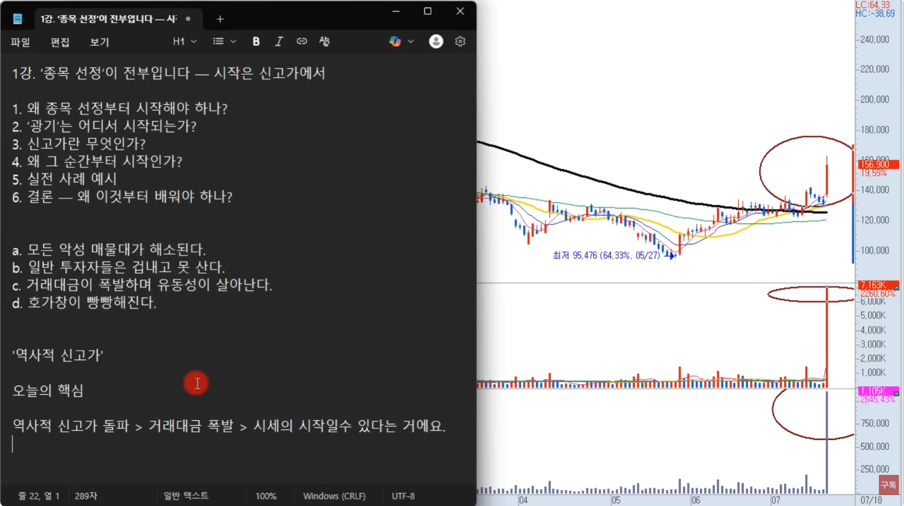

- **역사적 신고가 돌파 > 거래대금 폭발 > 시세의 시작** 일 수 있다
- 거래량보다는 거래대금을 봐라
- **이것을 모르면 앞으로 배울 모든 매매가 무용지물이다**

 

[[TOP]](#index)

---
