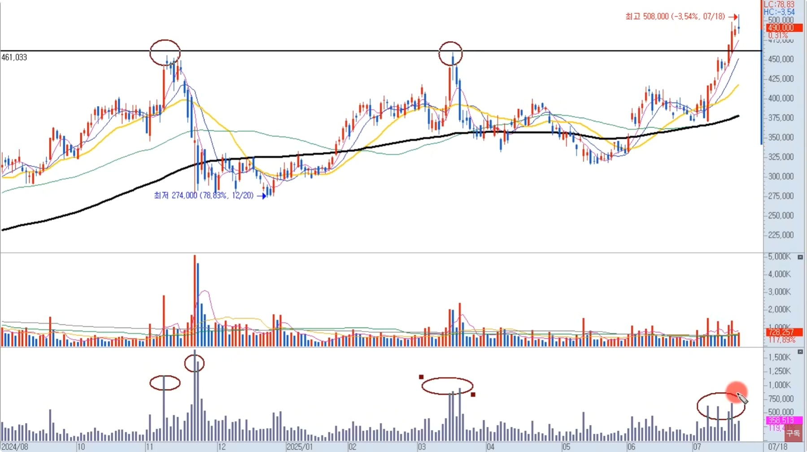
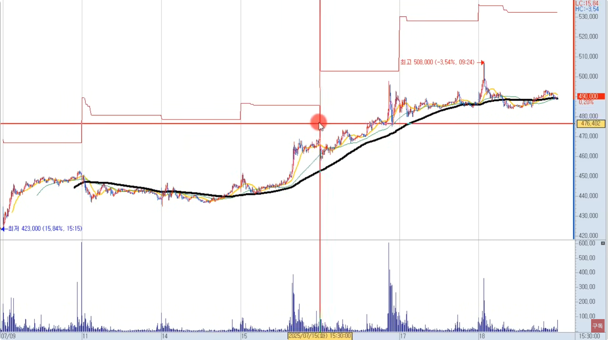
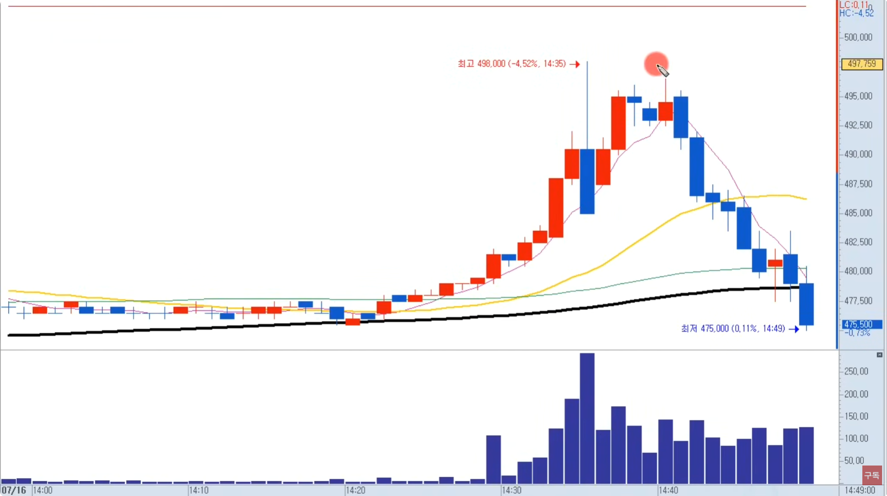
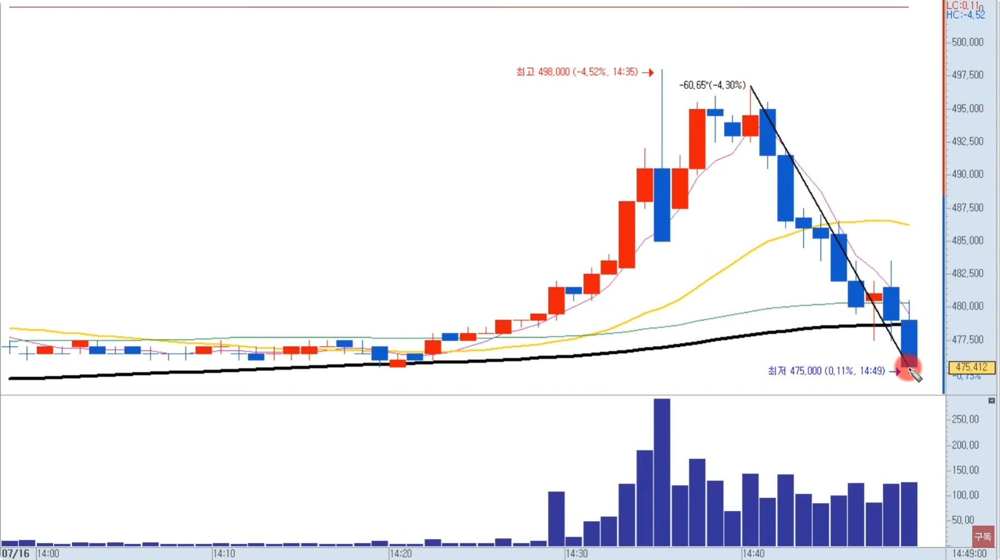
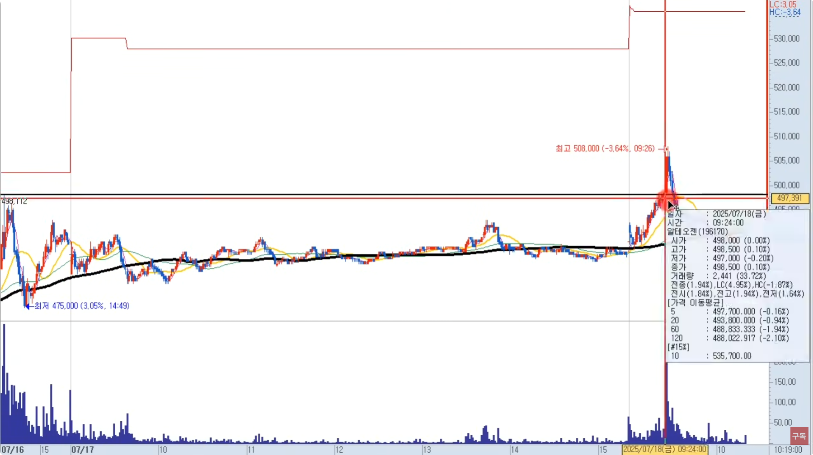
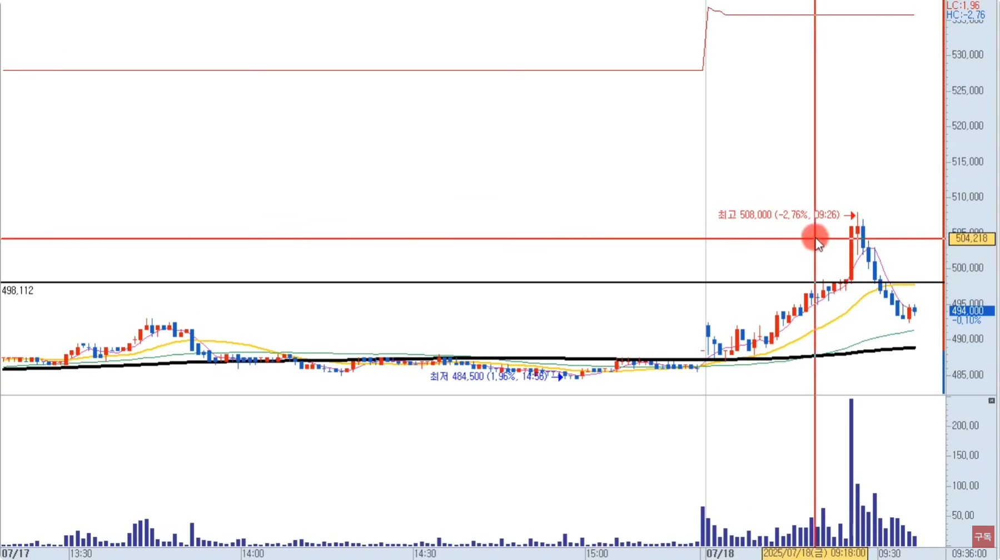
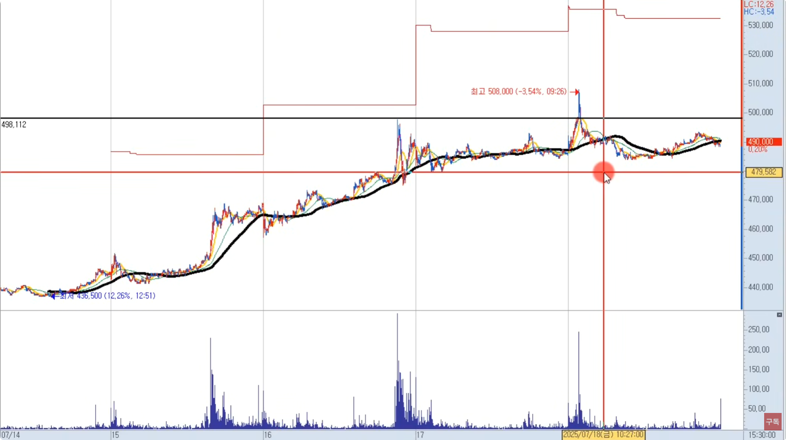
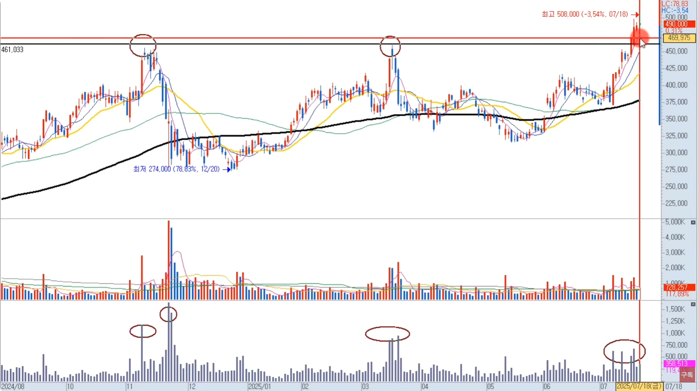

🏠 > [kostock](../../../) > [experts](../../) > [천리안주식](../) > `S4_주도종목실전 - (2)주도주매매`

<table>
  <tr>
    <td><a href="../">[천리안주식]</a></td>
    <td><a href="../S0_INTRO_NEW">S0_INTRO</a></td>
    <td><a href="../S1_시장보는기준">S1_시장보는기준</a></td>
    <td><a href="../S2_단타의기본기">S2_단타의기본기</a></td>
    <td><a href="../S3_쉬운매매구조">S3_쉬운매매구조</a></td>
    <td><a href="../S4_주도종목실전">S4_주도종목실전</a></td>
    <td><a href="../S5_유료강의압축">S5_유료강의압축</a></td>
  </tr>
  <tr>
    <td colspan="7" align="right"> 
      <a href="S4_실전1.md">주도종목실전1</a>  | 
      <b href="S4_실전2.md">주도종목실전2</b>  | 
      <a href="S4_실전3.md">주도종목실전3</a> 
    </td>
  </tr>
</table> 

### INDEX
- [[S4-3강] 주도주 매매의 핵심](#s4-3강-주도주-매매의-핵심)
  - [주도주 매매의 핵심](#주도주-매매의-핵심은-oo-이다)
  - [10%구간은 대시세의 초입구간](#10구간은-대시세의-초입구간이라고-본다)
  - [길목의 의미](#길목의-의미)
  - [Tip. 한가지 더 추가](#tip-여기서-한가지-더-추가를-했다)
- [[S4-4강] 주도주 실전 적용 사례](#s4-4강-주도주-실전-적용-사례)
- [[S4-5강] 주도주 매매 길목잡는 수식](#s4-5강-주도주-매매-길목잡는-수식)
- [[S4-6강] 데이트레이딩 구조 정리](#s4-6강-데이트레이딩-구조-정리)
- [[S4-7강] 거래대금보다 중요한 기준](#s4-7강-거래대금보다-중요한-기준)
- [[S4-8강] 키워드 없이는 종목 못 고릅니다](#s4-8강-키워드-없이는-종목-못-고릅니다)
- [[S4-9강] 지금 시장, 어디에 집중해야 할까?](#s4-9강-지금-시장-어디에-집중해야-할까)
- [[S4-10강] 당일 수익, 이 순서로 보세요](#s4-10강-당일-수익-이-순서로-보세요)
- [[S4-11강] 데이 트레이딩, 결국 이 구간에서 사야 먹힙니다](#s4-11강-데이-트레이딩-결국-이-구간에서-사야-먹힙니다)
- [[S4-12강] 단타, 여기서 안 사면 평생 힘듭니다](#s4-12강-단타-여기서-안-사면-평생-힘듭니다)

---

# S4. 주도주 실전 완성 (2) 주도주 매매

재생시간 | 강의제목 
:------:|---------
14:03 | [4주차 3강] 주도주 매매의 핵심
22:13 | [4주차 4강] 주도주 실전 적용 사례
11:45 | [4주차 5강] 주도주 매매 길목잡는 수식
50:48 | [4주차 6강] 데이트레이딩 구조 정리
16:30 | [4주차 7강] 거래대금보다 중요한 기준
31:03 | [4주차 8강] 키워드 없이는 종목 못 고릅니다
20:09 | [4주차 9강] 지금 시장, 어디에 집중해야 할까?
22:03 | [4주차 10강] 당일 수익, 이 순서로 보세요
21:27 | [4주차 11강] 데이 트레이딩, 결국 이 구간에서 사야 먹힙니다
17:25 | [4주차 12강] 단타, 여기서 안 사면 평생 힘듭니다

 

[[TOP]](#index)

---
## [S4-3강] 주도주 매매의 핵심

### **주도주 매매의 핵심은 OO 이다.** 
>  - 10% 구간입니다
>  - **10% 구간 = 길목**

- 길목에서 왜 기다리냐? = 속임수가 많다
  - 1차 VI 아래는 가짜 구간
  - 일반적으로 1차 VI, 즉 **10% 전후 등락률에서는 세력의 테스트 구간** 이다
    - 3~5% 등략률에서 매수진입을 했어. 근데 잘 올라가 10% 이상 올라갔어
    - 3~5% 등략률에서 매수진입을 했어. 어떤 종목에선 안돼. 시행착오를 겪는거다.
- 일단 10%까지 올라왔다는 것은 
  - 이전 매물대 구간을 대부분 소화했다는 의미
    - 전날 고점에 물렸던 사람들
    - 전날 종가배팅 했던 사람들 
    - 전날 눌림목했던 사람들 
    - 당일 시가배팅 사람들

 

[[TOP]](#index)

---
### 10%구간은 대시세의 초입구간이라고 본다 

- 10%구간이 길목이고 충분히 15~20% 갈 수 있다는 거다
- 초보자들은 
  - 3-5% 상승 할 때 혹은 거래대금 50억~100억 이상 터질때 "오~ 주도주인가"하고 따라 붙는다
  - 하지만 이 구간에서는 속임수가 많고, 진짜 시세는 10% 구간 이후부터 일어난다
- 추세매매를 하는 강사에게서 배웠는데, 
  - 굉장히 확률높은 매매라는 것을 알았다
  - 특히 10% 언저리에서는 위로 올리는 척, 아래로 빼는 척 심리적으로 유인하는 경우가 상당히 많다
  - 그래서 이 구간을 길목. 
  
 

[[TOP]](#index)

---
### 길목의 의미

- **10% 구간을 거래대금 실어서 돌파하면 새로운 구간이 열린다** 해서 **'길목'**이라고 부른다.
- 진짜 억대돌파 트레이더들은
  - 아침 9시에 장시작 할때  시가매매 안한다
  - **9시30분~10시30분 주도주가 탄생했을때** 그때 매매했었다
- 10% 구간 = 길목구간을 통과한다. 
  - 주도섹터가 만들어졌다. 혹은 전날이든 당일이든 장전 뉴스가 있었다. 거래대금 실어서 10% 구간을 통과한다.
  - 10% 구간을 만들어 낸게 올라오는 종목들 중에 가짜를 가지치기 위함.
- 이해해야 할 흐름
  - 10% 길목 이전 : 흔들기, 속임수, 테스트 구간
  - **10% 돌파 이후 :본격적인 시세 구간**
  - 즉, 진짜는 그 위에서 시작된다
  - 이걸 모르면 계속 아래 구간에 낚이고, 이걸 알면 그 위에서 매매 타이밍을 잡는다
- 결론이 뭐다?
  - 왜 10% 구간에서 잡는지
  - **10% 아래구간은 심리적으로 흔들리는 구간** 이다
  - 초보는 여기서 사고, 떨어지면 손절못하고 물리는 것이다
  - 장시작하고 장중에 3~5% 올라가는 종목은 수십종목이다
  - 장중에 10% 길목구간에서 기다린다면 속임수종목을 많이 걸러낼수 있다
  - **10% 돌파부터 진짜 출발이다**

 

[[TOP]](#index)

---
### Tip. 여기서 한가지 더 추가를 했다
- **당일 저가 대비 10% 구간 = 길목**
  - 보통은 전일 종가대비 10% 구간을 길목이라고 생각
  - 수식을 이 기준에 맞춰서 만들었다
- 2교시에서는 실전 예시 사례
- 3교시에서는 수식 설정 하기

 

[[TOP]](#index)

---
## [S4-4강] 주도주 실전 적용 사례

### 사례1. 
> 알테오젠

<table>
  <tr>
    <td></td>
    <td></td>
  </tr>
</table>

- **돌파하고 올라갈때 거래대금을 볼 필요가 있다**
  - 앞에 비해 거래대금이 약하다
  - 장대양봉도 못나오고 있다.
  - 속임수일 확률이 높다
- 빨간선은 저가대비 10% 올라간 길목라인 
  - 주가는 아래에 있다
  - 올라갈때 페이크를 준다.
  - 라인표시를 안하면 당한다

---
<table>
  <tr>
    <td></td>
    <td></td>
  </tr>
</table>

- 3분봉상 3분에 600억 500억 400억 터트리며 올라가고 있다
  - 1분봉상으로 봐도 100억이상 터트리고 올라간다. 따라 붙겠죠
  - 길목구간을 모르면, 이런 속임수에 당하는 거다 ⇒ -4% 미수까지 썼으면 거의 -10%

---
<table>
  <tr>
    <td></td>
    <td></td>
  </tr>
</table>

- 50만원 저항대를 뚫었다
  - 이전에 50억도 안터지다가, 250억 터지며 전고를 돌파했다
  - 그러면 거래대금 터졌으니깐 가야죠
  - 근데 왜 못가고 떨어졌을까?
  - 당일 10% 이상 올라오지 못했기때문에 속임수가 여기서 발생한거다

---
<table>
  <tr>
    <td></td>
    <td></td>
  </tr>
</table>

- **분봉 수급만 보고 매매했다면 속임수에 당하게 된다**
  - 어떤 느낌인지 알겠나?
  - 알테오젠은 데이트레이딩으로 하기에 까다롭고, 스윙으로 하기에는 좋은 종목이다
  - **가야할 종목에서 안가는 종목은 데이트레이딩하기 까다로운 종목** 이다

[[TOP]](#index)

---
### 사례2. 
> 펩트론

- 역사적 신고가 239,000원
  - 심리적인 저항선
  - 여기서 대부분 차익실현을 했다
  - 이전 역사적신고가를 살짝 갱신했지만 종가상 돌파를 못했다
  - 그러면 본격적으로 어디서 돌파했냐?
  - 다음날 땅 돌파하고 올라갔다
- 이때 분봉의 흐름을 보면, 
  - 10% 구간 이전 : 저항을 받는다
  - 10% 구간 이후 : 
    - 돌파하니깐, 앞전 거래대금만큼 거래대금이 터지면서 주가가 올라간다
    - 떨어지더라도 10% 구간에서 지지가 나오는 모습
- **만약 이구간에서 매매에 응용해본다면..**
  - 10%이전을 못올라가고 저항을 받는다면, 아~ 속임수인가 라고 생각
  - 근데 내려가다가 방향을 돌리고 점점 다시 올라온다
    - 그러다 이 구간을 땅하고 돌파를 한다
    - 그러면 돌파할 때 매수를 해볼수 있다
    - 10% 구간 아래인데 왜 매수를 하냐면?
    - **10% 가까운 구간에서 저항받고 떨어졌는데 쭉 떨어지는게 아니고 다시 올라온다**
  - 앞에 물린 사람들을 다 탈출기회를 준다 그러면서 빵 쏘고 올라간다
    - 그러면 전고돌파할때 사볼만 하다
      - 여기서 샀는데 떨어지면, 이 돌파봉의 저가를 깨면 손절한다
      - 반대로 샀는데 올라가면, 이제 추세매매를 해도 된다
    - **추세매매는 5이평을 종가상 훼손하지않으면 계속 갖고 간다**
    - 여기서 2% 3% 5% 이렇게 분할로 먹어도 되고
  - 대부분 **고수들은 대량으로 많이 매수하기 때문에 추세를 다 먹으려고 한다**
    - 하루에 한종목만 매매하더라도 주도주에서 길목에 사서 추세를 다 먹으려고 한다
    - **추세가 보통 5이평을 깨는 자리가 추세가 깨진자리 ⇒ 여기서 대부분 매도**
    - 돌파후에 주가는 5.5%까지 상승했고, 추세깨진 자리에서 팔았어도 3.7% 먹는거다
    - 여기서 안팔았으면 2.8% 더 하락을 맞는다
  - 10% 구간에서 다시한번 지지가 나오고 반등이 나왔다

[[TOP]](#index)

---
### 사례3. 
> 포스코퓨처앰

- 고수들은 보통 **"첫 파동은 보내줘라"** 라는 말을 한다
  - 그게 속임수 구간 때문에 그렇다
- 장초 : 10%선 아래임
  - 장초 1분에 100억 이상 터뜨리며 올라간다
  - 하지만 10% 아래 구간이므로 속임수일 수도 있다
  - 여기서 10% 구간을 돌파못하고 떨어졌다
    - 눌렀다 재돌파 했지만 터치하고 내려오고 반등
    - 근데 터치도 못하고 고점이 내려오면서 하락
  - 만약 여기서 전고돌파자리에서 샀다고 하면, 돌파봉의 저가를 깨면 손절해야 한다
    - 그래서 거래대금을 보면 손절자리에서 대량 거래대금 발생, 원칙을 지키는 사람들이 손절한거다
- 장중 : 10%선 윗구간   
  - 내려오다가 추세를 전환
    - 5이평을 벗어나지 않으며 상승하다가 10% 구간을 돌파
    - 이때부터 지속 상승
  - 내려와도 돌파봉의 저점을 이탈안하고 결국 9% 이상 상승했고
  - 처음으로 전고돌파봉의 저점을 이탈하면 매도 그래도 5%이상 익절

[[TOP]](#index)

---
### 사례4. 
> 유한양행

- 하락하다가 1조원 터뜨리며 올라온 종목이다
- 10% 아래에서는 속임수가 많다
  - 올라가면서 지지/저항을 만들면서 올라간다
  - 5이평을 깼지만 저항대에서 지지가 나오는 모습 ⇒ 좋다, 저항이 지지로..
  - 다시한번 전고살짝 돌파했는데 밀려 돌파봉저점 이탈 ⇒ 여기서 많이 손절
  - 그러다 저항대를 거래대금 175억 터뜨리며 빵 돌파 
    - 여기서 10%구간 가겠구나 생각하지만 또 그전에 하락하며 돌파봉 저점 이탈 ⇒ 다 손절 나간다
    - 즉, 10% 구간 아래에서는 이런 속임수 구간이 많이 나온다
  - 원칙매매하는 사람들 엄청 털린다
  - **10% 구간 아래에 있는 종목은 관심을 두지 마라**
- 10% 직전에 거래대금과 함께 돌파했을때 근처니깐 들어가볼만 하다
  - 약간 흔든후에 상승했고, 10% 구간이후에는 상승탄력이 생긴다
  - 만약에 돌파못하더라고 돌파봉이 0.8% 봉이다 저가깨고 이탈해도 1% 손절하면 된다
  - 하락해도 10% 라인에서 지지가 일어난다
  - 당일 장마감까지 10% 구간에서 8%이상 더 올라갔다

 

[[TOP]](#index)

---
## [S4-5강] 주도주 매매 길목잡는 수식

 

[[TOP]](#index)

---
## [S4-6강] 데이트레이딩 구조 정리

 

[[TOP]](#index)

---
## [S4-7강] 거래대금보다 중요한 기준

 

[[TOP]](#index)

---
## [S4-8강] 키워드 없이는 종목 못 고릅니다

 

[[TOP]](#index)

---
## [S4-9강] 지금 시장, 어디에 집중해야 할까?

 

[[TOP]](#index)

---
## [S4-10강] 당일 수익, 이 순서로 보세요

 

[[TOP]](#index)

---
## [S4-11강] 데이 트레이딩, 결국 이 구간에서 사야 먹힙니다

 

[[TOP]](#index)

---
## [S4-12강] 단타, 여기서 안 사면 평생 힘듭니다

 

[[TOP]](#index)

---
