🏠 > [kostock](../../../) > [experts](../../) > [천리안주식](../) > `S4_주도종목실전 - (3)데이트레이딩`

<table>
  <tr>
    <td><a href="../">[천리안주식]</a></td>
    <td><a href="../S0_INTRO_NEW">S0_INTRO</a></td>
    <td><a href="../S1_시장보는기준">S1_시장보는기준</a></td>
    <td><a href="../S2_단타의기본기">S2_단타의기본기</a></td>
    <td><a href="../S3_쉬운매매구조">S3_쉬운매매구조</a></td>
    <td><a href="../S4_주도종목실전">S4_주도종목실전</a></td>
    <td><a href="../S5_유료강의압축">S5_유료강의압축</a></td>
  </tr>
  <tr>
    <td colspan="7" align="right"> 
      <a href="S4_실전1.md">1️⃣ 종목선정기준</a>  | 
      <a href="S4_실전2.md">2️⃣ 주도주매매 </a>  | 
      <b href="S4_실전3.md">3️⃣ 데이트레이딩</b>  | 
      <a href="S4_실전4.md">4️⃣ 종목선정심화</a>  | 
      <a href="S4_실전5.md">5️⃣ 장대양봉단타</a>  | 
      <a href="S4_실전6.md">6️⃣ 매매기법특강</a>      
    </td>
</table> 

### INDEX
- [[S4-6강] 데이트레이딩 구조 정리](#s4-6강-데이트레이딩-구조-정리)
  - [데이트레이딩이란?](#데이트레이딩이란)
  - [주로 보는 조건과 차트](#주로-보는-조건과-차트)
  - [1. HTS 설정](#1-hts-설정)
  - [2. 종목 선정 기준](#2-종목-선정-기준)
  - [3. 분봉 매수 타점](#3-분봉-매수-타점)
  - [4. 손절의 기준](#4-손절의-기준)
  - [5. 마인드 셋](#5-마인드-셋)

---

# S4. 주도주 실전 완성 (3) 데이트레이딩

재생시간 | 강의제목 
:------:|---------
50:48 | [4주차 6강] 데이트레이딩 구조 정리

<br/>

[[TOP]](#index)

---
## [S4-6강] 데이트레이딩 구조 정리
>  데이트레이딩의 모든 것
> 1. HTS 설정
> 2. 종목 선정 기준
> 3. 분봉 매수 타점
> 4. 손절의 기준
> 5. 마인드 셋


### 데이트레이딩이란?

- 데이트레이딩은 말 그대로 하루 안에 매매를 끝내는 단기 매매 
- 장중에 흐름에 맞춰서 매수, 매도 포인트를 잡고, 그날 수익을 확정 짓는 전략
- 데이트레이딩의 장단점
  <table>
    <tr align="center">
      <td width="400">장점</td>
      <td width="400">단점</td>
    </tr>
    <tr valign="top">
      <td>
        <ul>
          <li> 리스크가 명확하다는 것
          <li> 장 종료 전에 포지션을 청산하기때문에 급격한 시장 변수나 악재에 휘둘릴 일이 없다
        </ul>
      </td>
      <td>
        <ul>
          <li> 진입과 청산의 정확도가 굉장히 중요하다
          <li> 계획 없는 진입은 반드시 손실로 이어진다.
        </ul>
      </td>
    </tr>
  </table>

<br/>

[[TOP]](#index)

---
### 주로 보는 조건과 차트

1. [0186] **당일 거래대금 상위**
2. [0162] **등락률 상위**
3. [0766] **프로그램 순매수 상위**
4. [0198] **실시간 종목 순회 순위 상위**
5. [1413] **순간체결량**
6. [0130] **관심종목창**
7. [1134] **관심종목 등록 순위** (일간/주간/월간)

※ 주로 1~4번에서 그날의 데이트레이딩 종목을 찾는다 

<br/>

[[TOP]](#index)

---
### 1. HTS 설정

- 분봉차트 : (15분봉) 전날과 오늘 주가의 움직임을 체크
- 일봉차트 : 이평배열(정배열/역배열), 거래대금, 주가의 움직임
- 순간체결량 [1413] : 체결세력 대량대금 순매수 체크
- 미니체결 [0120] : 순간체결량 체크, 500만원 이상 덩어리 물량 
- 호가주문 [8283] : 호가창 + 차트(3분봉)
- 투자자별매매 [1051] : 시간대별로 외인과 기관의 순매매 체크
- 종합차트 [0601] : 1분봉, 일봉 번갈아 본다. 
- 프로그램매매추이 [0778] : 당일의 프로그램 순매수량 
- 실시간종목순위 [0198] : 많은 사람이 클릭할수록 상위
- 관심종목 등록 순위[1134] : 기간별 관심 종목 순위 (일간/주간/월간)
- 프로그램순매수상위 [0766]
- 등락률상위 [0181]
- 거래대금상위 [0186]

```
이 모든걸 다 본다
- 호가창배열, 일봉/분봉의 흐름, 체결속도, 체결강도, 그날의 시장분위기  
- 실시간조회/프로그램순매수/등락률/거래대금 상위종목에서 교집합이 되는 종목이 그날의 대장주라고 생각
- 거래대금만 보면 알수가 없다. 삼전닉스가 무조건 1,2등
- 등락률 1등 리튬포어스도 다른데는 보이지 않는다. 그 섹터의 대장이지만 상따 아니면 매매할 수가 없다. 
- 거래대금에 평소에 안보이던 종목이 보이면 1등일 확률이 높다.
- 같은 섹터중에서 4개의 교집합이면서 호가창이 빵빵한 종목을 매매하는게 낫다
```

- 관심종목 [0130]
- 뉴스창 [0700]
- 인포스탁섹터 [0659] : 당일주도섹터, 섹터별 대장주/후속주 체크
- 멀티호가주문 [0307] : 
  - **후속주 매매시 섹터의 대장주를 보면서 매매,** 
  - **대장주를 매매시 다른 섹터의 대장주를 같이 보면서 매매**
  - **다른 섹터의 1등주가 갑자기 뉴스를 터트리면서 주가가 펌핑이 된다. 그러면 현재 매매하고 종목이 빠질수가 있다.**
- 그래서 주식은 모든것을 다 봐야 한다
  - 차트상에서 10% 아래에서는 속임수가 많이 일어나고, 
  - 10% 위에서는 탄력의 구간이다. 


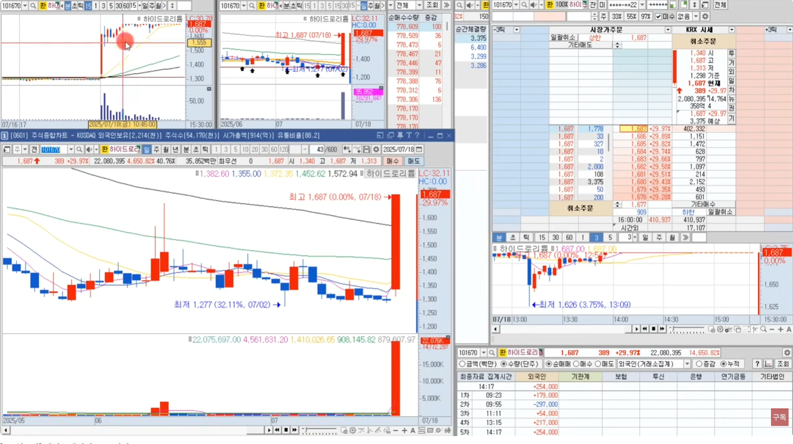
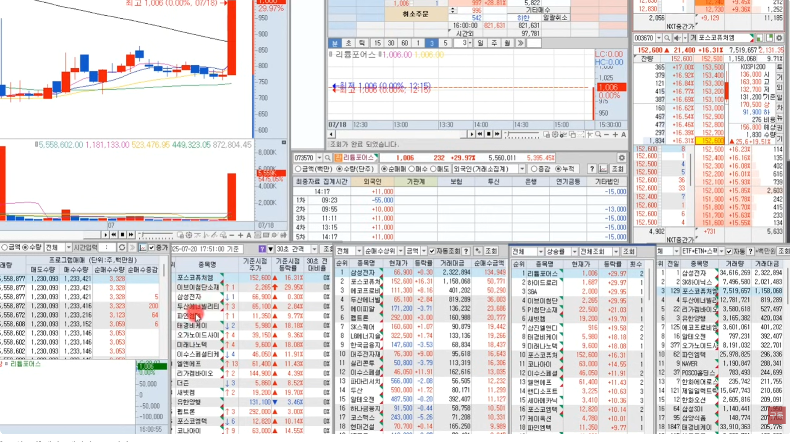

<br/>

[[TOP]](#index)

---
### 2. 종목 선정 기준

```
1. [0186] **당일 거래대금 상위**
2. [0162] **등락률 상위**
3. [0766] **프로그램 순매수 상위**
4. [0198] **실시간 종목 순회 순위 상위**
5. [1413] 순간체결량
6. [0130] 관심종목창
```

- **실시간조회/프로그램순매수/등락률/거래대금 상위** 
  - **4개의 교집합 (최소 3개이상) 종목**
  - 이 교집합이 억대 트레이더들이 매매를 하고 있거나 매매를 준비하고 있다
- **관심종목창** 
  - **전일 장대양봉 나온 종목을 추적관찰 할 때 본다** 
  - **보통 9시반에서 10시쯤 되면 주도주가 탄생** 한다. → 그러면 전날등록한 관심종목은 볼 필요가 없다.
  - **당일 검색기 혹은 실시간에 뜨는 주도주를 등록** → 어떤 섹터가 강세인지.. 어떤 이슈나 재료가 있는지... 확인!!
- 일봉의 흐름 : 신고가여부, 매물대까지의 거리
- 분봉의 흐름 : 길목구간체크, 눌림자리(C1,C2,C3)
- 호가창의 배열, 빵빵함
- 호가창의 체결속도, 체결강도
- 프로그램 순매수 여부
- 기관/외인이 대량매수, 대량매도 관심이 없는지
- 거래원을 통해 주가를 이끄는 주체를 확인하고 돈이 지속적으로 들어오는지
- 다른섹터 1등주가 무너지고 있는지 아니면 강하게 올라오는지 
- **중요하지 않은게 없다**
- 대신에 **10% 길목구간에서 기다리자**
  - 왜냐면 그 아랫구간은 속임수가 많다
  - 10%까지 올라왔다는거는 그 아랫구간 매물을 소화하고 올라왔다고 보는거다 → **반드시 수급과 동반**
  - **충분히 10% 구간에서 잡아도 돌파든 눌림이든 잡으면 15~20%까지는 가더라**
  - 경험으로 아는 사람들은 10% 구간에서 기다리게 된다 

---  
- 장초 시간별 매매
  <table>
    <tr align="center">
      <td width="150"><b>시간</b></td>
      <td width="650"><b>트레이딩</b></td>
    </tr>
    <tr valign="top">
      <td align="center"><b>8:00 ~ 8:50</b></td>
      <td>
        <ul>
          <li> 상승의 명분이 명확히 보이면 매매한다
          <li> 안보이면 매매를 패스하고, 당일 주도주가 출현할때까지 대기한다
          <li> 시장의 흐름을 관찰
        </ul>
      </td>
    </tr>
    <tr valign="top">
      <td align="center"><b>9:00 ~ 9:30</b></td>
      <td>
        <ul>
          <li> 상승의 명분이 명확히 보이면 매매한다
          <li> 안보이면 매매를 패스하고, 당일 주도주가 출현할때까지 대기한다
          <li> 시장의 흐름을 관찰
        </ul>
      </td>
    </tr>
    <tr valign="top">
      <td align="center"><b>9:30 ~ 10:30</b></td>
      <td>
        <ul>
          <li> 주도주가 출현. 10% 길목구간에서 기다린다
          <li> 사실 돌파를 하던, 눌림을 하던 타점보다 중요한건 주도주를 잘 선택했냐이다.
          <li> 10%에서 잘 선택했다면 15% 혹은 20%까지 끌고 갈 수 있는 훈련이 되어있어야 한다
          </br> - 개미들은 2~3%만 수익이 찍혀도 매도하려고 한다
          </br> - 억대트레이더들은 10% 구간에서 수십억을 태운다
        </ul>
      </td>
    </tr>
  </table>

<!-- - 8시에 시작
  - 상승의 명분이 명확히 보이면 매매한다
  - 안보이면 매매를 패스하고, 당일 주도주가 출현할때까지 대기한다
  - 시장의 흐름을 관찰
- 9시~9시30분
  - 전날에 장대양봉이 출현했는데 상승의 연속성이 있으면 매매한다
- 9시30분~10시30분
  - 주도주가 출현. 10% 길목구간에서 기다린다
  - 사실 돌파를 하던, 눌림을 하던 타점보다 중요한건 주도주를 잘 선택했냐이다.
  - 10%에서 잘 선택했다면 15% 혹은 20%까지 끌고 갈 수 있는 훈련이 되어있어야 한다
    - 개미들은 2~3%만 수익이 찍혀도 매도하려고 한다
    - 억대트레이더들은 10% 구간에서 수십억을 태운다 -->


### 주식에서 정석을 알려달라고 한다

- 정석은 눌림매매를 하지 않는게 정석이다
  - 정석은 **하락을 하던 상승을 하던 돈이 들어올때 매매하는게 정석** 이다.
  - 보통 하락을 하면, 설마 하락만 하겠냐? 반등폭을 먹으려고 눌림을 한다
- **프로그램의 순매수 증가여부도 함께 본다**
  - 요즘에는 프로그램이 한번 팔기 시작하면 장마감때까지 팔게된다. 
    - 그러면 반등다운 반등아 잘 안나올수 있다.
    - 반등이 나오더라도 저점대비 2~3%정도 반등. 먹을 구간도 별로 없는데 리스크만 크다 → V자 반등 기대마라 !
  - 전날 장대양봉 나온 종목에서 프로그램이 막 산다. 
    - 그러면 전날 윗꼬리 고가 돌파할때 매수하는게 정석 패턴이다.
- **데이트레이딩은** 
  - 10% 길목에 샀던 13%에서 샀던 20% 구간까지 잘 끌고 갈수 있어야 한다
  - 그냥 2~3% 먹고 나오는 건 스캘핑이다
  - **손익비가 나오는 자리에서 사서 좀 길게 끌고 가야 한다**
  - 그날 사서 그날 파는거지만 좀 스캘핑보다는 길게 보는 관점이 있어야 한다. 

<br/>

[[TOP]](#index)

---
### 3. 분봉 매수 타점

#### 눌림매매는 절대 하지마라?
  - 눌림매매는 **잡기술의 영역** 이다 
  - 수익이 날때도 있고, 잃을때도 있다
  - **눌림매매를 하려면 생각이 유연해야 한다**
  - **돌파의 관점도 이해해야 되고, 눌림의 관점도 이해** 해야 된다
  - 일단 눌림은 패스

---
#### 무조건 돌파의 관점으로만 생각하라
- **처음에 누군가의 돈이 들어왔다**
  - **거래대금이 빵빵터지면서 올라간다**
    - 이런 캔들에서 뭘보면 되냐
    - 캔들의 저가가 올라가고 있죠
    - 캔들의 고가가 올라가고 있죠
  - 음봉 하나 떨어졌다고 추세가 깨진게 아니다
    - **추세가 깨지려면 이 음봉에서 전캔들의 저가를 깨고 내려가야 한다**
    - 근데 전캔들이 저가를 깨지않고 올라갔다
    - 그리고 5이평도 이탈 안했다
    - 그러면 추세가 깨진게 아니다
- 그럼 **언제 추세가 깨진거냐?**
  - 위에서 음봉 다음에서 전캔들의 저점을 깼다
  - 근데 누군가의 저점매수세로 반등이 나온거다
  - 그리고 전고점을 돌파못하고 떨어진 흐름
  - 이제 전저점 테스트로 가는거다
  - 여기서 하나 느낄수 있는것은 **처음으로 3분봉상 5이평을 종가상 이탈했다**
  - 얘가 **기준봉** 이 되는거다
- 이후부터 쭉 떨어지죠
  - 여기서 왜 거래량 거래대금이 터젔냐?
  - **누구나 생각하는 지지라인을 여기서 이탈하니깐 원칙대로 매매하는 사람들은 다 손절이 나갔다**
  - 근데 이런 속임수가 왜 뜨냐?
  - **10% 이하 구간이기 때문에** 뜨는거다
  - 그렇게 보면 마음이 편하다
  - 주가가 쭉 빠질때는 눌림을 하지마라
- 근데 **언제 매수를 하냐?**
  - **첫번째 매수타점**
    - 고가가 낮아지고 있다가,
    - 처음으로 **전캔들의 고가를 돌파** 하는 시점
  - 그러면서 어떤일이 일어나죠?
    - 여기서는 종가상 5이평을 돌파하고 올라가죠
    - 여기가 첫번째 매수타점이 될 수 있다
    - 만약 종목을 잘 골랐다면 눌림에 사든 돌파에 사든 다 수익구간을 주고 고점에 물려도 탈출기회는 준다
    - 근데 지금 정석패턴을 알려드리는 거잖아요

---
#### 정석으로 바라보는 매수타점(돌파)

<table>
  <tr>
    <td align="center"><b>매수타정</b></td>
    <td width="80%">
      <b>주도주눌림 매매시</b> (길목구간 이후)
      <ul>
        <li> <b>타점1 : 전캔들 고가 돌파</b> → 전고점 찍고온 고점이 심리적 저항대임 기억할 것
        <li> <b>타점2 : 5이평 깬 종가상 깬 고점을 돌파</b> → 돌파후 5이평 처음 이탈한 추세가 바뀐 변곡점을 재돌파
        <li> <b>타점3 : 전고점을 돌파, 거래량 수반</b> (신고거의 80%이상)
      </ul>
    </td>
  </tr>
  <tr><td colspan="2">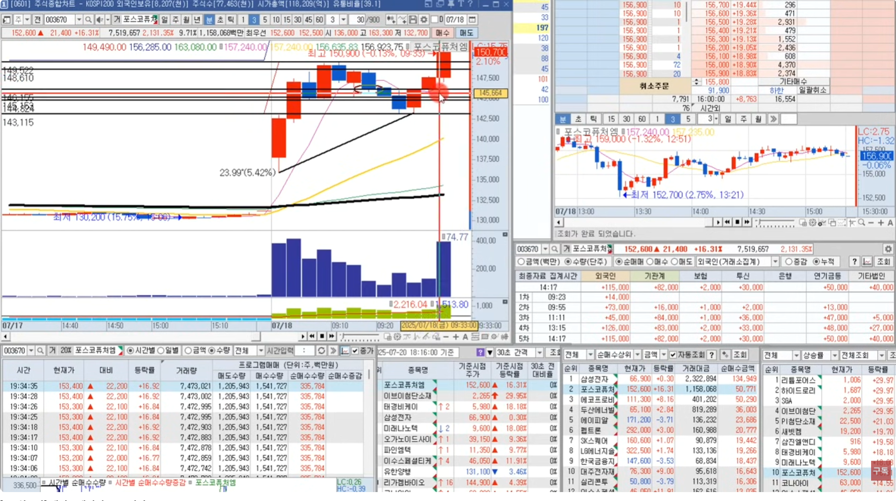</td></tr>
  <tr>
    <td align="center"><b>매도타정</b></td>
    <td>
      <b>추세매매시 끌고 갈 수 있어야 한다</b>
      <ul>
        <li> 양봉꼭지라 예측하고 팔아봐야 더 가더라. 머리보다는 어깨에 팔자는 생각
        <li> <b>돌파봉 혹은 이전고가의 저점을 이탈할 경우 매도</b>
        <li> <b>종가상 처음으로 5이평을 이탈하는 자리에서 익절</b>
      </ul>
    </td>
  </tr>
  <tr><td colspan="2">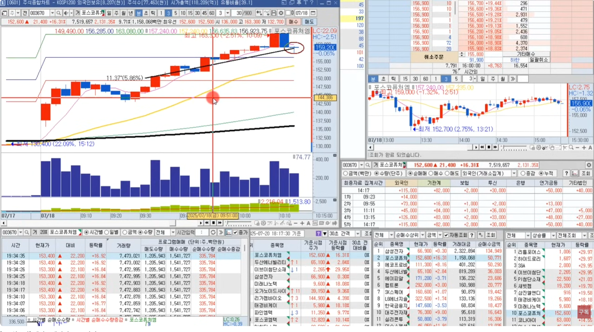</td></tr>
</table>


- [x] 1. 첫번째 매수타점
  - **전캔들 고가를 돌파한 순간**
  - 근데 매수하자 마자 뚝떨어지면, 최근에 반등나왔던 캔들의 저점이 깨지면 손절하는거다
  - 10% 이하인데 왜 사냐?
    - 속임수가 많은줄 알면서도..
    - 저가를 올렸네 그럼 고가도 올릴수 있겠네 이렇게 볼수도 있다
    - 10% 가까우니깐 여기서 **떨어지면 손절하고 올라가면 손인비 싸움** 이 되는거다
    - **올라가면 추세를 돌리는 변곡점** 이다
- [x] 2. 두번째 매수타점
  - **5이평을 깬 종가상 깬 고점을 돌파 할 때** 가 2번째 돌파타점이다
- [x] 3. 세번째 매수타점
  - **전고점을 돌파할 때** 돌파하는게 3번째 돌파타점이다.
- [ ] 매수는 위 3개가 정석이다

---
### 4. 손절의 기준
> - 돌파봉의 저점을 깨면 손절
> - 전저점을 이탈하면 손절

#### 손절은?

- **매수한 봉의 저점 바로만약 저가아래 라운드피겨값을 이탈** 하면 손절한다
  - 만약 저가가 147,100원일때 147,000원을 깨면 손절
  - 10% 아래에서는 페이크를 많이 주는 반명
  - 10% 구간을 돌파하니깐 올라갈때 차트가 깨끗해진다. 종가상 5이평을 이탈 안하고 계속 간다
  - 그러다가 처음으로 이탈한 자리
  - **종가상 처음으로 5이평을 이탈하는 자리에서 추세매매자들은 익절** 한다
- 추세매매자들의 생각
  - 주가가 올라가는 양봉꼭지에서 팔아봤자 버티면 더 가더라
  - 그래서 **추세의 끝단까지 모아보자**
  - **머리에는 못팔더라도 어깨에는 팔자** 하는게 이평깨는 자리 
  - 그럼, 여기서 쭉 빠질지 반등이 나올지 알수가 없다.
  - 여기가 기준봉이 되는거다
  - 전 캔들의 고가를 돌파하고 다시 올라가면, 여기서 매수할 수 있다
- 대신 매수할때 그걸 알아야 한다
  - **전에 캔들이 변곡점** 이었기 때문에 **전고가 찍고온 고점이 심리적인 강력한 저항대** 이다
  - 그니까 여기 최고점에서 못판 사람들은 5이평 깨졌을때 저기서 팔껄 이런 껄무새가 된다
  - 이때 주가가 다시 올라가면 저기가 강력한 저항대가 된다
  - 결국 돌파를 못하고 떨어진다
  - 5이평을 깨고 최근 변곡점이었던 저가를 깨잖아요
    - 그럼 이런 거래대금이 터지는 거다
- 어떤 느낌인지 알겠죠?
- 분봉상 매수타점은 이개 전부다

```
  예시. 펩트론

    첫상승파동, 이 구간에서 스캘핑 하는 사람들은 들어간다
    스캘핑도 잡기술이기 때문에 오히려 데이트레이딩 매매가 꼬인다
    전고를 돌파못하면 저가를 테스트하러 가는거다
    10% 구간을 돌파하면 차트가 깨끗해지고 추세를 타고 상승한다
    전고점을 돌파하는 자리가 첫매수타점
    5이평을 처음으로 이탈하는 음봉, 즉 상승추세를 돌리는 변곡캔들이 여기서 뜬거다.
    그러면 이 변곡캔들의 고가를 알고 있어야 한다. 선을 그어두자
    주가 떨어질때는 매매하지 마라
    10% 구간에서 지지가 나오면서 반등이 나온다
    그어둔 선에서 계속 저항을 받는다.
    그러다 돌파하고 나면 지지를 받는다.
    계속 버텼으면 5%를 먹는거다
```

<table>
  <tr>
    <td>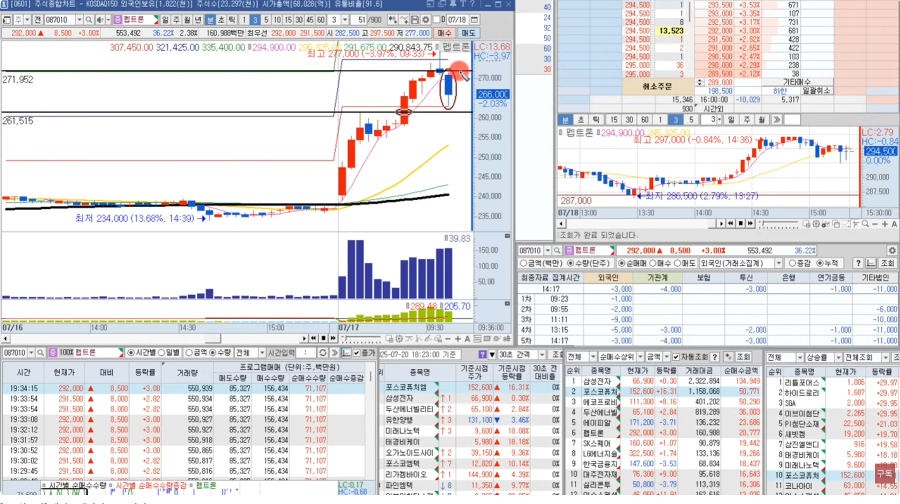</td>
    <td>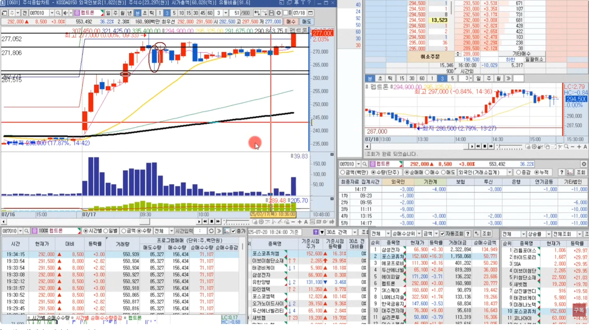</td>
  </tr>
  <tr>
    <td colspan="2">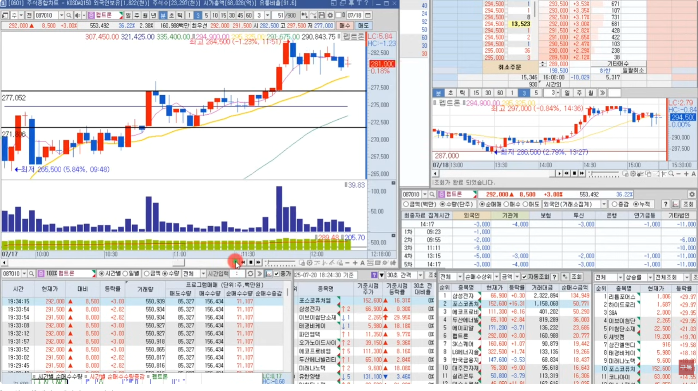</td>
  </tr>
  <tr>
    <td>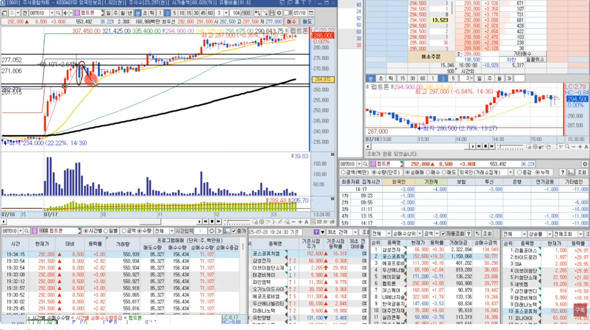</td>
    <td>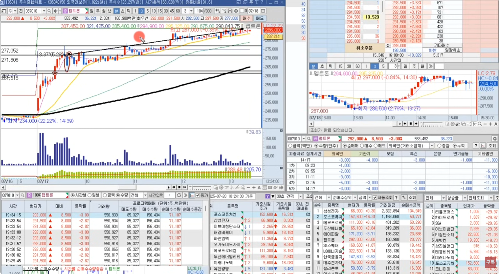</td>
  </tr>
</table>

<br/>

[[TOP]](#index)

---
### 5. 마인드 셋

- **종목수를 줄이고, 매매횟수를 줄이라** 는 소리다
- 이종목 저종목 다 들어가서 기술적으로 수익을 내려고 하지말고,
- 그날의 종목을 잘 골라서 하루에 한두종목을 매매하더라도 
  - **기술적인 영역이 아니고 정석으로 매매** 하고 나와라
  - 수익을 내고 나와라
- 그리고 **손절라인이 오면 칼손절** 을 해야 된다
- 신기하게도
  - **10%를 돌파하면 5% 단위로 지지/저항이 있다**
  - 10% 돒파하면 15%까지 가고,
  - 15% 돌파못하면 10%에서 지지까지 내려와서 반등하고,
  - 그리고 15% 다시 돌파하면 20% 구간까지 간다
  - 한두종목이 아니라 **이런 종목이 정말 많다** !!!
- **만약 눌림/돌파/종가배팅 중에서 꼭 하나만 배워야 한다면,** 
  - **돌파가 정석** 이다!!
  - 처음 주식할때, 주식의 꽃 스캘핑과 눌림을 배웠었는데 그게 아니었다.
  - 눌림을 하다보면 
    - 하루종일 종목을 바라보고 있어도 눌림타점이 안오고, 
    - 눌림타점에 오기 시작하면 타점깨고 쭉 빠진다
  - 직장인은 
    - 돌파를 할 수가 없다
    - 눌림이나 종가베팅을 하기보다는 
    - **단기스윙** 을 하는게 낫다!

---
#### 예시차트 
**펩트론**
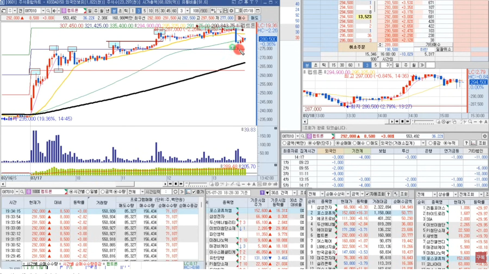

**유한양행**
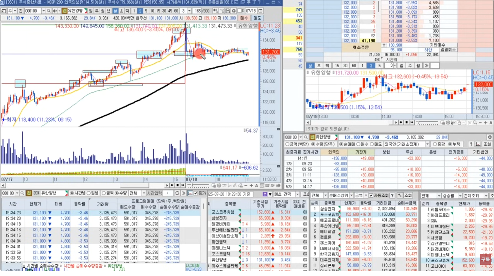

**포스코퓨처앰**
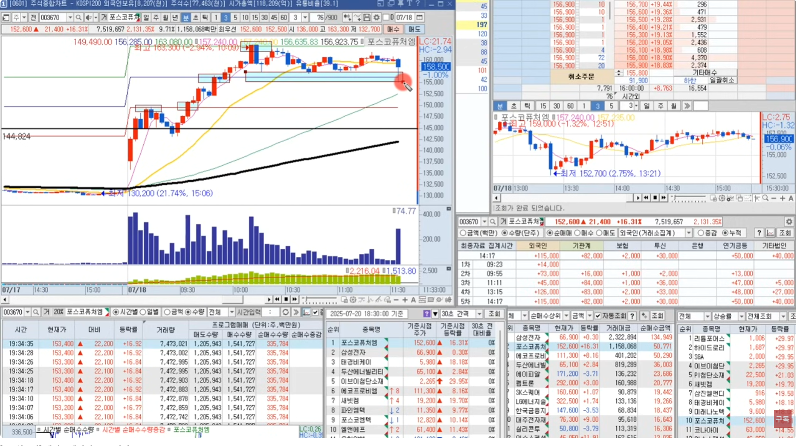

---
#### 종가베팅 관점

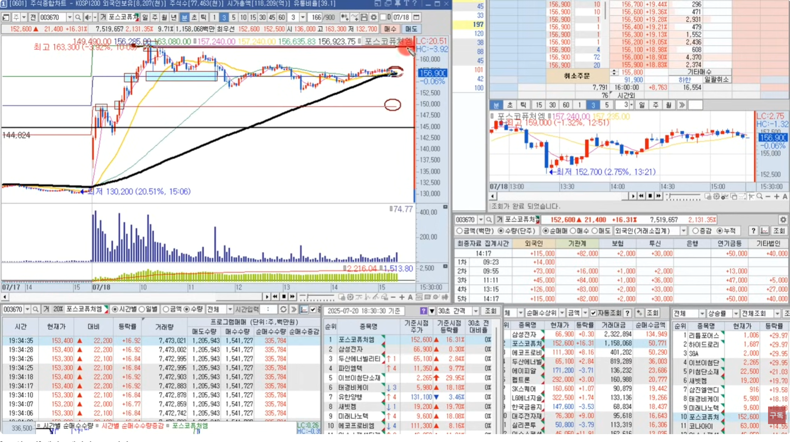

- 정확히 15% 부근에서 종료했다
- 다음날 
  - 장초에 하락하면 10% 선까지 갈꺼라 생각하고,
  - 반대로 상승하면 20% 전고돌파까지 갈수있다고 생각해라

<br/>

[[TOP]](#index)

---