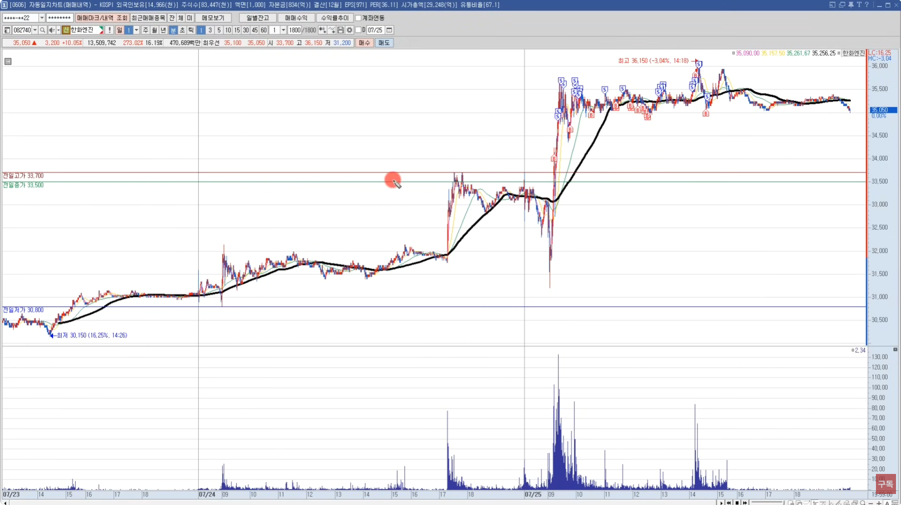
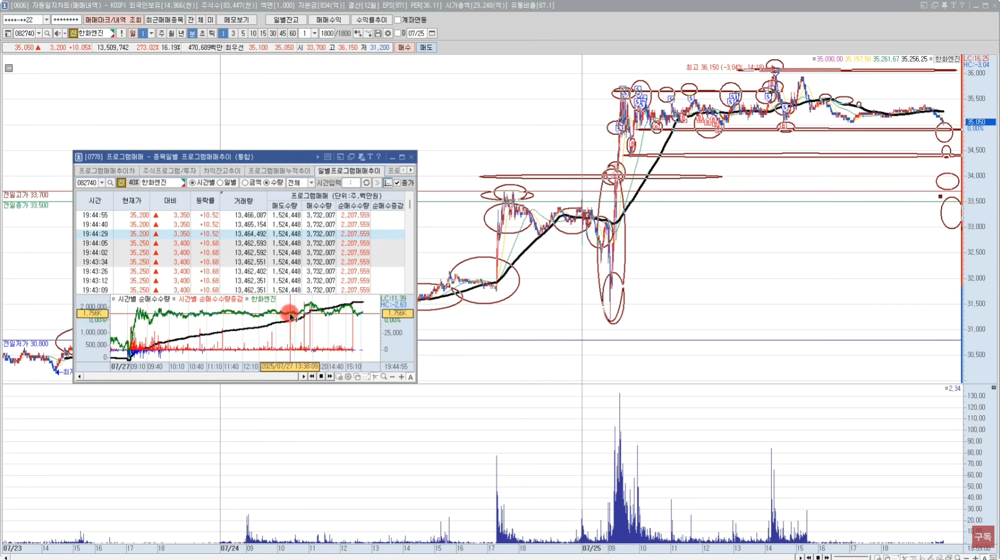
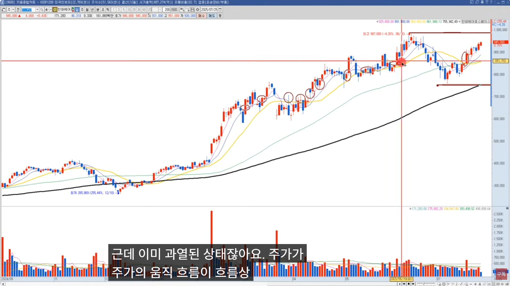
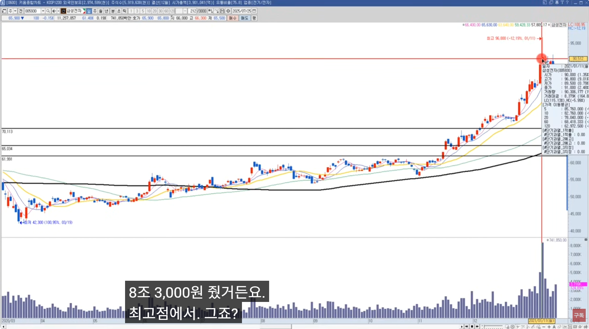

🏠 > [kostock](../../../) > [experts](../../) > [천리안주식](../) > `S4_주도종목실전 - (4)종목선정심화`

<table>
  <tr>
    <td><a href="../">[천리안주식]</a></td>
    <td><a href="../S0_INTRO_NEW">S0_INTRO</a></td>
    <td><a href="../S1_시장보는기준">S1_시장보는기준</a></td>
    <td><a href="../S2_단타의기본기">S2_단타의기본기</a></td>
    <td><a href="../S3_쉬운매매구조">S3_쉬운매매구조</a></td>
    <td><a href="../S4_주도종목실전">S4_주도종목실전</a></td>
    <td><a href="../S5_유료강의압축">S5_유료강의압축</a></td>
  </tr>
  <tr>
    <td colspan="7" align="right"> 
      <a href="S4_실전1.md">1️⃣ 종목선정기준</a>  | 
      <a href="S4_실전2.md">2️⃣ 주도주매매 </a>  | 
      <a href="S4_실전3.md">3️⃣ 데이트레이딩</a>  | 
      <b href="S4_실전4.md">4️⃣ 종목선정심화</b>  | 
      <a href="S4_실전5.md">5️⃣ 장대양봉단타</a>  | 
      <a href="S4_실전6.md">6️⃣ 매매기법특강</a>      
    </td>
  </tr>
</table> 

### INDEX
- [[S4-7강] 거래대금보다 중요한 기준](#s4-7강-거래대금보다-중요한-기준)
  - [1️⃣ 빠르게 수익 내려면 결국 종목 선정이다](#ⓐ-1️⃣-빠르게-수익-내려면-결국-종목-선정이다)
  - [2️⃣ 거래대금만 보면 놓치는 것들](#ⓐ-2️⃣-거래대금만-보면-놓치는-것들)
  - [3️⃣ 시장 흐름을 먼저 읽어야 한다](#ⓐ-3️⃣-시장-흐름을-먼저-읽어야-한다)
  - [4️⃣ 진입 시점](#ⓐ-4️⃣-진입-시점)
  - [5️⃣ 기다리는 자가 먹는다](#ⓐ-5️⃣-기다리는-자가-먹는다) 
- [[S4-8강] 키워드 없이는 종목 못 고릅니다](#s4-8강-키워드-없이는-종목-못-고릅니다)
  - [1️⃣ 종목선정, 키워드 부터 시작이다](#ⓑ-1️⃣-종목선정-키워드-부터-시작이다)
  - [2️⃣ 섹터 vs 테마, 명확히 구분해야 한다](#ⓑ-2️⃣-섹터-vs-테마-명확히-구분해야-한다)
  - [3️⃣ 지수 흐름을 보면 키워드가 보인다](#ⓑ-3️⃣-지수-흐름을-보면-키워드가-보인다)
  - [4️⃣ 프로그램 수급 + 거래대금 = 키워드 검증](#ⓑ-4️⃣-프로그램-수급--거래대금--키워드-검증)
  - [5️⃣ 종목 고를때 이 순서대로 보면 된다](#ⓑ-5️⃣-종목-고를때-이-순서대로-보면-된다)
  - [6️⃣ 키워드는 하루아침에 바뀌지 않는다](#ⓑ-6️⃣-키워드는-하루아침에-바뀌지-않는다) 
- [[S4-9강] 지금 시장, 어디에 집중해야 할까?](#s4-9강-지금-시장-어디에-집중해야-할까)
  - [1️⃣ 시장은 기준이 있어야 버틸 수 있다](#ⓒ-1️⃣-시장은-기준이-있어야-버틸-수-있다)
  - [2️⃣ 주도섹터 vs 순환섹터 어떻게 다를까?](#ⓒ-2️⃣-주도섹터-vs-순환섹터-어떻게-다를까)
  - [3️⃣ 신고가? 거래대금? 함정도 많다](#ⓒ-3️⃣-신고가-거래대금-함정도-많다)
  - [4️⃣ 기준을 세우는 3가지 방법](#ⓒ-4️⃣-기준을-세우는-3가지-방법)
  - [5️⃣ 기준이 잡히면 전략은 단순해진다](#ⓒ-5️⃣-기준이-잡히면-전략은-단순해진다)
  - [6️⃣ 실적 시즌 이후에 시장이 요동칠 수 있다](#ⓒ6️⃣-실적-시즌-이후에-시장이-요동칠-수-있다)
- [[S4-10강] 당일 수익, 이 순서로 보세요](#s4-10강-당일-수익-이-순서로-보세요)
  - [1️⃣ 데이트레이딩, 시장을 먼저 봐야한다](#ⓓ-1️⃣-데이트레이딩-시장을-먼저-봐야한다)
  - [2️⃣ 시장 흐름은 키워드로 해석할 수 있다](#ⓓ-2️⃣-시장-흐름은-키워드로-해석할-수-있다)
  - [3️⃣ 키워드 + 장대양봉, 이 조합을 봐야한다](#ⓓ-3️⃣-키워드--장대양봉-이-조합을-봐야한다)
  - [4️⃣ 시장의 변곡점이 올때는 대형 섹터를 먼저 봐야한다](#ⓓ-4️⃣-시장의-변곡점이-올때는-대형-섹터를-먼저-봐야한다)
  - [5️⃣ 실전 종목 선정 흐름](#ⓓ-5️⃣-실전-종목-선정-흐름)
  - [6️⃣ 키워드를 알면 타이밍도 보인다](#ⓓ-6️⃣-키워드를-알면-타이밍도-보인다)

---

# S4. 주도주 실전 완성 (4) 종목 선정 심화

재생시간 | 강의제목 
:------:|---------
16:30 | [4주차 7강] 거래대금보다 중요한 기준
31:03 | [4주차 8강] 키워드 없이는 종목 못 고릅니다
20:09 | [4주차 9강] 지금 시장, 어디에 집중해야 할까?
22:03 | [4주차 10강] 당일 수익, 이 순서로 보세요
21:27 | [4주차 11강] 데이 트레이딩, 결국 이 구간에서 사야 먹힙니다
17:25 | [4주차 12강] 단타, 여기서 안 사면 평생 힘듭니다

<br/>

[[TOP]](#index)

---
## [S4-7강] 거래대금보다 중요한 기준
> 수익 빠르게 내려면, 종목선정 기준부터 바꿔야 한다 

### Ⓐ 1️⃣ 빠르게 수익 내려면 결국 종목 선정이다

- 매일매일 새로운 종목에 들어가는 건 사실상 '확률게임' 이다
- **움직일 준비가 된 종목. 기다리는 전략**

### Ⓐ 2️⃣ 거래대금만 보면 놓치는 것들

-  거래대금이 아무리 많아도 **연속성이 없는 종목이면 수익보다 위험** 부담이 훨씬 크다 


### Ⓐ 3️⃣ 시장 흐름을 먼저 읽어야 한다

- 지금 시장이 **어떤 섹터/테마장을 형성하고 있는지 파악하는게 1순위** 이다
  - 정치 테마장인가?
  - 정책 기대감이 있는 장인가?
  - 실적이 반영되는 장인가?
  - 신규 상장주에 자금이 몰리는 장인가?
- 현재는 조방원
  테마 | 종목
  ----|-----
  조선 | 삼성중공업, 한화오션
  방산 | 현대로템, 한화에어로스페이스, 한화시스템
  원전 | 두산에너빌리티
- **'기법'** 보다 **'종목 선정'** 이 더 중요하다 
- 종목선정보다 더 중요한건 **'시장 주심 키워드'** 가 더 중요하다


### Ⓐ 4️⃣ 진입 시점

- 그럼 어떤 자리에서 들어가야 할까?
  - [ ] 1. **눌림 이후 5이평을 회복하는 지점** ⇒ 거기가 맥점
  - [ ] 2. **장기 이평선 위에서 재반등 하는 흐름**
- 이건 단순히 기법보다는 **수급이 다시 들어오고 있다는 신호**
- 그리고 **이 구간은 대부분 재료가 완전히 소멸되기 전에 마지막으로 주는 반등 구간**

### Ⓐ 5️⃣ 기다리는 자가 먹는다

- 매일매일 종목 갈아타면서 타점없이 추격매매 하는것보다는
- **확률 높은 자리에서만 진입** 하는 것이 훨씬 안정적인 매매
- 한두 종목만 골라서
  - **시장 흐름에 부합** 하고, 
  - **차트 안정적** 이고,
  - **재료 살아있을때** 매매

### 다음편에서는

- 오늘은 종목선정의 기본 기준과 시장에서 어떤 흐름을 먼저 읽어야 하는지까 설명했다
- 다음편에서는 지금 시장에서 실제로 어떤 키워드가 수익으로 이어지고 있는지
- 주도섹터오 순환섹터가 어떻게 구분하고 대응해야 하는지 구체적으로 다뤄보도록 하겠다

<br/>

[[TOP]](#index)

---
## [S4-8강] 키워드 없이는 종목 못 고릅니다
> 섹터와 테마, 키워드 없이 종목 못 고른다

### Ⓑ 1️⃣ 종목선정, 키워드 부터 시작이다
- 지금 시장이 어떤 이슈에 반응하는 먼저 파악
- **키워드를 잡아야 종목이 보인다**

  <table>
    <tr align="center">
      <td width="300"><b>시장</b></td>
      <td width="400"><b>키워드</b></td>
    </tr>
    <tr valign="top">
      <td><b>정책주에 반응하는 시장이면?</b></td>
      <td>
        <ul>
          <li> 정책과 관련돈 키워드 먼저 봐야겠죠 
        </ul>
      </td>
    </tr>
    <tr valign="top">
      <td><b>실적시즌이면? </b></td>
      <td>
        <ul>
          <li> 전년대비 실적 서프라이즈 예상되는 업종 어디인지 봐야겠죠 
          <li> 2분기 호실적, 3분기 실적 기대감, 몇백억~몇천억 수주 몇조 수주
        </ul>
      </td>
    </tr>
  </table>
<!-- 
시장 | 키워드
------|------
정책주에 반응하는 시장이면? | 정책과 관련돈 키워드 먼저 봐야겠죠
실적시즌이면? | 전년대비 실적 서프라이즈 예상되는 업종 어디인지 봐야겠죠 <br/> 2분기 호실적, 3분기 실적 기대감, 몇백억~몇천억 수주 몇조 수주 
-->

### Ⓑ 2️⃣ 섹터 vs 테마, 명확히 구분해야 한다
- 섹터와 테마 비교
  <table>
    <tr align="center">
      <td width="400"><b>섹터</b></td>
      <td width="400"><b>테마</b></td>
    </tr>
    <tr>
      <td><b>성장 산업</b></td>
      <td><b>단기 재료 기반 이슈</b></td>
    </tr>
    <tr>
      <td><b>장기적으로 기관/외인 수급이 붙는 구조</b></td>
      <td><b>짧고 강하게 반응했다 소멸되는 흐름</b></td>
    </tr>
    <tr>
      <td>예> 2차전지, 반도체, 방산, 조선, 원전 화장품, 전력설비</td>
      <td>예> 정치테마, 정책주, 코로나, 돼지열병, 폭염</td>
    </tr>
  </table>
<!--   
- 섹터 : 성장 산업 (예: 2차전지, 반도체, 방산, 조선, 원전 화장품, 전력설비)
- 테마 : 단기 재료 기반 이슈 (예: 정치테마, 정책주, 코로나, 돼지열병, 폭염)
- 섹터 : 장기적으로 기관/외인 수급이 붙는 구조
- 테마 : 짧고 강하게 반응했다 소멸되는 흐름 
-->

### Ⓑ 3️⃣ 지수 흐름을 보면 키워드가 보인다
- 대세 상승기 vs 박스장 vs 하락장
- **지수 사이클에 따라 자금이 몰리는 키워드가 달라진다**

### Ⓑ 4️⃣ 프로그램 수급 + 거래대금 = 키워드 검증
- **키워드가 맞더라도, 프로그램 수급 + 거래대금이 실려야 '진짜'**
- 수급, 차트, 뉴스 함께 움직일때가 진입 기준
- 외국인/기관 수급
- 거래대금 상위

### Ⓑ 5️⃣ 종목 고를때 이 순서대로 보면 된다
- [ ] ① **지수 사이클 판단** 
- [ ] ② **키워드 선정** 
- [ ] ③ **프로그램 수급 + 거래대금 확인**
- [ ] ④ **섹터 내 중심주 선별**
- [x] 위의 순서를 기억해라
- [x] 매일 쏟아지는 종목들 속에서 진주를 찾는 확률이 높아진다

### Ⓑ 6️⃣ 키워드는 하루아침에 바뀌지 않는다
- 시장키워드는 하루이틀로 끝나지 않는다
  - 정책주든 실적주든 **보통은 2~3일 이상 시세 흐름이 이어진다**
  - 그안에서 파동이 만들어진다
  - 즉, 첫날 놓쳤다고 기회가 끝난게 아니고, 이해하고 기다리면 눌림목에서도 충분히 수익을 만들수 있다.

### 마무리하며
- 눌림목 강의하잖아요?
  - 시장중심주에서 어차피 우상향하는 종목에서 눌림목을 해야 되는데
  - 눌림목 타점 가지고 이종목 저종목 다들어가요 타점만 보고 그래서 안되는거야
  - 타점만 보고 수익이나면 마법의 선이죠
  - 근데, **주식에서 마법의 선 같은건 없다**
- 시장 중심주에서 눌림목을 하니깐 마법의 선처럼 느껴지는거다
- **핵심요약** 
  - 종목보다 먼저 키워드를 봐라
  - 키워드보다 먼저 지수흐름
  - 키워드 안에서 중심주를 찾고
  - 수급이 몰리는 순간을 기다려라
  - **시장지수 ⇒ 주도섹터 ⇒ 키워드 ⇒ 대장종목**

#### 매매예시 BS마크




- 잠잠하던 종목이 한번 털고 급등했는데, 어떻게 잡았나?
  - 프로그램 수급을 본거다
  - 프로그램 대량매수가 들어오네
  - 34,000원 라운디피겨를 돌파하려고 하네
  - 앞전고가 이미 돌파했네 ⇒ 매수 진입
- 팔고, 팔고 눌림에 사서 다시 팔고
  - 눌림에 사서 다시 팔고
  - 눌림에 사서 다시 팔고
  - 눌림에 사서 다시 팔고
- 앞전고가 돌파하길래 매수
  - 매수했다가 팔고 안가서 바로 팔았다
- 팔고 쭉 떨어지길래 여기서 왜 샀냐 ⇒ 라운드피겨 매수 걸어둠
  - 짧게 먹었다. 더 올라가긴 했지만...
- 여기서 왜 이후에 매매 안했나?
  - 앞전고가를 뚫고나서 눌림이면 매수했을텐데..
  - 앞전고가를 못뚫고 눌렸기때문에 매매안한거다
- 다음날 이 종목은 전고가를 뚫지못하면 박스권하단을 깨러 내려갈거다
- 이종목을 좋게 본사람들은 눌림에서 매수할거임

[[TOP]](#index)

---
## [S4-9강] 지금 시장, 어디에 집중해야 할까?

### Ⓒ 1️⃣ 시장은 기준이 있어야 버틸 수 있다
- 매수보다 중요한건 어디서 사고, 어디서 안 사는지
- 기준없이 따라가면 수익은 커녕 생존도 어렵다

### Ⓒ 2️⃣ 주도섹터 vs 순환섹터 어떻게 다를까?
- 주도섹터 : 거래대금 지속, 지수 견인, 안정적인 파동 실적 O
- 순환섹터 : 단기급등 후 소멸, 뉴스나 테마 기반, 실적 X

### Ⓒ 3️⃣ 신고가? 거래대금? 함정도 많다
- 신고가를 간다고 무작정 따라 붙지 마라
- 바닥에서 거래 실리며 올라온 종목이 진짜 강하다
- 종목은 강한데 이미 과열된 상태에서는 터진 거래대금은 고점일 신호일 수가 있다

### Ⓒ 4️⃣ 기준을 세우는 3가지 방법
- [x] 1> 차트 기준 : 이평선 지지 / 고점 돌파 여부
- [x] 2> 시장 기준 : 지금이 상승 구간인가?
- [x] 3> 종목 기준 : 중심주인가? 순환테마장인가?

```js
섹터 기준으로 따지면, 
  지금 돈일 몰린 섹터가 어디인가?
  주도섹터인가? 순환섹터인가?
  지금 반도체에 돈이 몰려요? 조선 방산 원전에 돈이 몰려요? 
  조방원에 돈이 몰리죠. 그럼 실적 장세인거다.

  4월 5월에는 김문수 테마, 이재명 테마 그런데 돈이 몰렸다
  그러면 수급주 실적주 보다는 정치테마주 세력주에 돈이 몰릴때였다
  그때의 종목 키워드는 지지율, 다음 대통령이 어떤 정책을 펼첬는지 이런게 시장의 키워드였다

차트 기준으로 예시를 들어보면, 
  전일대비 거래량,, 
  5일선을 이탈했는가?
  기준봉을 돌파했는가?
  이평선을 지지했는가?
  장대양봉 이후 눌림 조정이 나오는지
이런것들이 중요하다 

```

### Ⓒ 5️⃣ 기준이 잡히면 전략은 단순해진다
- 단기 : 분할매수 + 손절기준 명확하게
- 중기 : 주도섹터 중심주를 보유 (타점이 무의미하다)
- 스캘핑 : 거래량급증할때, 뉴스 급등주 신속 대응


### Ⓒ 6️⃣ 실적 시즌 이후에 시장이 요동칠 수 있다
- 숲 = 실적키워드
- 나무 =  실적이 붙는 개별종목
- 좋은 타점에 매수하는게 주식이다
- 좋은 타점을 가지고 이종목 저종목 다 들어가는건 마법의 선이라고 생각을 한다 

<br/>

<table>
  <tr>
    <td></td>
    <td></td>
  </tr>
</table>

- 이미 과열된 상태에서 거래대금이 최고로 터져도 최고점일 수 도 있다.
- 저점대비 주가가 10, 20배 

<br/>

[[TOP]](#index)

---
## [S4-10강] 당일 수익, 이 순서로 보세요
> 데이트레이딩, 지표 말고 '시장 키워드' 부터 봐라
> - 기법보다 먼저 봐야 할 것은 시장 키워드와 흐름
> - 이걸 보지 않으면, 아무리 좋은 기법얼 써도 실패할 확률이 높다

### Ⓓ 1️⃣ 데이트레이딩, 시장을 먼저 봐야한다
- **"시장 전체가 어떤 흐름에 반응하고 있느냐?"**
- 예를 들어
  - 시장이 강세일 때는 작은 재료도 급등으로 이어지고
  - 시장이 약세일 때는 재료가 아무리 좋아도 반응이 없다
- 기법보다 **시장이 먼저다 ⇒ 투심**
  - 그래서 지표보다 먼저 시장을 봐야하고, 
  - **시장의 중심 키워드 파악하는게 첫 단계다**

### Ⓓ 2️⃣ 시장 흐름은 키워드로 해석할 수 있다
- 자원주, 소부장, 장비주 다같이 순환하면서 움직였다
- 개별주식보다 섹터/테마 형성한 주식을 매매해야 확률이 높다

### Ⓓ 3️⃣ 키워드 + 장대양봉, 이 조합을 봐야한다
- 데이트레이딩에서 가장 먼저 보는 것
- 장대양봉 + 거래대금 + 프로그램순매수 + 시장 주도 키워드 (정치테마주 x, 정책 x, 실적시즌)

### Ⓓ 4️⃣ 시장의 변곡점이 올때는 대형 섹터를 먼저 봐야한다

### Ⓓ 5️⃣ 실전 종목 선정 흐름
> - [x] **오늘 시장 키워드** 체크한다 (방산, 전력설비, 화장품, AI정책)
> - [x] 해당키워드 종목중에 **대장주** 를 추려낸다 **(등락률, 거래대금, 프로그램수급)**
> - [x] 차트는 장대양봉 + 프로그램수급 + 거래대금
> - [x] 매수진입

- 시장 흐름 파악 > 키워드 파악 > 종목 고른다 대장주 > 타점
- 실시간종목조회 순위, 순간체결량 

- 시장중심주 조방원을 미리 공부해놓고 있는 상태에서 
  - 실시간 종목조회순위 이걸 보면 
  - 그날에 잡주들이 움직이는지, 시장중심주가 움직이는지 정도는 알 수 있다.
- 등락률 보고 섹터안에서 1,2,3등주를 가려낸다
- 실시간종목순위 볼 때 가장 중요하게 이 종목이 시장 키워드와 연결되어 있는가?

### Ⓓ 6️⃣ 키워드를 알면 타이밍도 보인다
- 키워드만 알면 어느 종목이 반응할 지 미리 알 수 있다
- 실적 장세
- 실적 키워드
- 최근에 장대양봉 나오고, 거래대금 어느정도 붙고, 프로그램 수급까지 있고, 일봉상 박스권 돌파, 신고가돌파 

### Wrap Up
- **데이트레이딩은 시장방향과 키워드가 전부다**
- 지표는 보조수단일 뿐이고, 키워드가 핵심이다.
- 시장이 강한 날 비중베팅을 하는게 원칙이다.
- 손절이나 매도는 
  - 전캔들 저가 깰때 손절, 
  - 5이평 깰때 손절, 
  - 최근 지지 이탈에 손절

<br/>

[[TOP]](#index)

---