🏠 > [kostock](../../../) > [experts](../../) > [천리안주식](../) > `S4_주도종목실전 - (5)장대양봉단타`

<table>
  <tr>
    <td><a href="../">[천리안주식]</a></td>
    <td><a href="../S0_INTRO_NEW">S0_INTRO</a></td>
    <td><a href="../S1_시장보는기준">S1_시장보는기준</a></td>
    <td><a href="../S2_단타의기본기">S2_단타의기본기</a></td>
    <td><a href="../S3_쉬운매매구조">S3_쉬운매매구조</a></td>
    <td><a href="../S4_주도종목실전">S4_주도종목실전</a></td>
    <td><a href="../S5_유료강의압축">S5_유료강의압축</a></td>
  </tr>
  <tr>
    <td colspan="7" align="right"> 
      <a href="S4_실전1.md">1️⃣ 종목선정기준</a>  | 
      <a href="S4_실전2.md">2️⃣ 주도주매매 </a>  | 
      <a href="S4_실전3.md">3️⃣ 데이트레이딩</a>  | 
      <a href="S4_실전4.md">4️⃣ 종목선정심화</a>  | 
      <b href="S4_실전5.md">5️⃣ 장대양봉단타</b>  | 
      <a href="S4_실전6.md">6️⃣ 매매기법특강</a>      
    </td>
  </tr>
</table> 

### INDEX
- [[S4-11강] 데이 트레이딩, 결국 이 구간에서 사야 먹힙니다](#s4-11강-데이-트레이딩-결국-이-구간에서-사야-먹힙니다)
  - [시장을 보며 하루를 시작해야 하는 이유](#시장을-보며-하루를-시작해야-하는-이유)
  - [일봉상 5이평, 분봉상 5이평 이탈 후 되돌림 구간에서 기다려라](#일봉상-5이평-분봉상-5이평-이탈-후-되돌림-구간에서-기다려라)
  - [거래대금과 프로그램 수급으로 첫 신호를 잡아라](#거래대금과-프로그램-수급으로-첫-신호를-잡아라)
- [[S4-12강] 단타, 여기서 안 사면 평생 힘듭니다](#s4-12강-단타-여기서-안-사면-평생-힘듭니다)
  - [장대양봉, 왜 중요한가?](#장대양봉-왜-중요한가)
  - [분봉차트에서 C봉 전략](#분봉차트에서-c봉-전략)

---
# S4. 주도주 실전 완성 (5) 장대양봉단타

재생시간 | 강의제목 
:------:|---------
21:27 | [4주차 11강] 데이 트레이딩, 결국 이 구간에서 사야 먹힙니다
17:25 | [4주차 12강] 단타, 여기서 안 사면 평생 힘듭니다

 

[[TOP]](#index)

---
## [S4-11강] 데이 트레이딩, 결국 이 구간에서 사야 먹힙니다

### 시장을 보며 하루를 시작해야 하는 이유
- 시장의 키워드 파악이 중요하다
- 시장 분위기 이슈를 읽는게 우선이다
- 시장이 약할때 혹은 매매종목이 없을때 쉬는것도 전략

### 파동은 반복된다
- 차트는 파동의 연속이다
- **상승 > 조정 > 하락 > 재상승** 이 흐름들은 모든 종목, 모든 구간에서 나타난다
- 이 원리를 이해하면 시장이 달라 보인다

---
### 일봉상 5이평, 분봉상 5이평 이탈 후 되돌림 구간에서 기다려라
- 종가상 5이평을 이탈하고 재돌파하는 자리 
  - 이탈한 봉의 고가를 재돌파를 해야 인정
  - 돌파할때 앞전 거래대금의 7,80% 이상 거래대금이 터져야 한다
  - 여기서 종가배팅했다면 
    ⇒ 갭 2% 뜨고 장중 14%까지 갔다가 떨어졌다
- 종가배팅에 활용
  - 종배종목 : 
    - 거래대금과 함께 5이평 이탈 재돌파 
    - 그냥 5이평을 돌파 혹은 회복하는 자리에서 손절한 경우가 많았다
    - 그래서 5이평을 이탈한 봉의 고가를 저항라인으로 본다
  - 손절자리 : 최근저점을 이탈하면 손절

<h4>[예시1] 일봉상으로 본 종가배팅</h4>
<table>
  <tr>
    <td>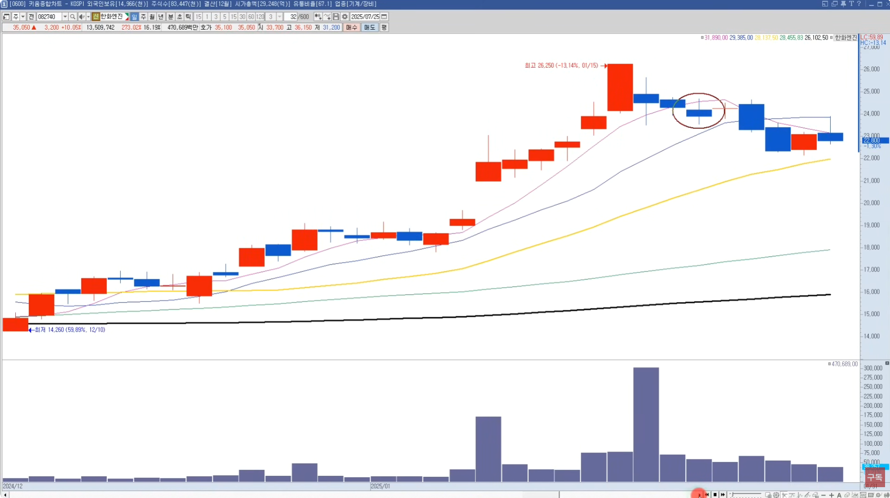</td>
    <td>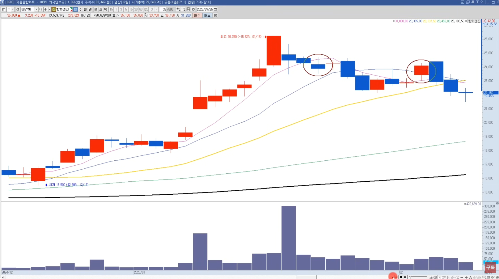</td>
  </tr>
  <tr>
    <td>상승후 눌림에서 종가상으로 처음으로 5이평선을 깬 캔들이 요기</td>
    <td>예전엔 모든 이평을 돌파하는 이런자리에서 들어갔다가 많이 손절 당함</td>
  </tr>
  <tr>
    <td colspan="2">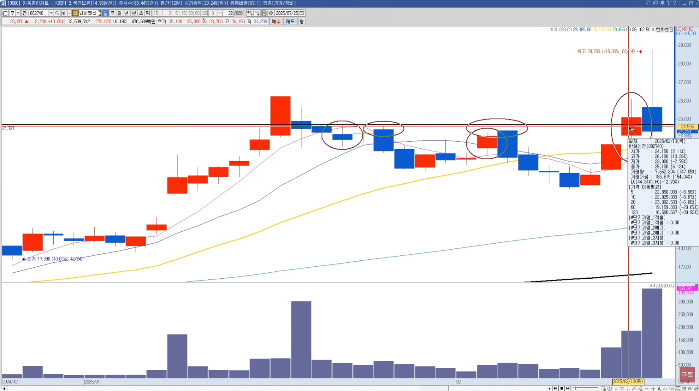</td>
  </tr>
  <tr>
    <td colspan="2">
      <ul>
        <li> 그래서 새롭게 만든 기법이 이탈봉의 고점을 재돌파하는 자리에서 들어감
        <li> 재돌파 하였고, 거래대금도 앞전 거래대금의 7,80% 이상 터졌다
        <li> 여기서 종배 했다면 ⇒ 다음날 갭 2% 뜨고 장중 14%까지 갔다가 떨어졌다
      </ul>
    </td>
  </tr>
  <tr>
    <td>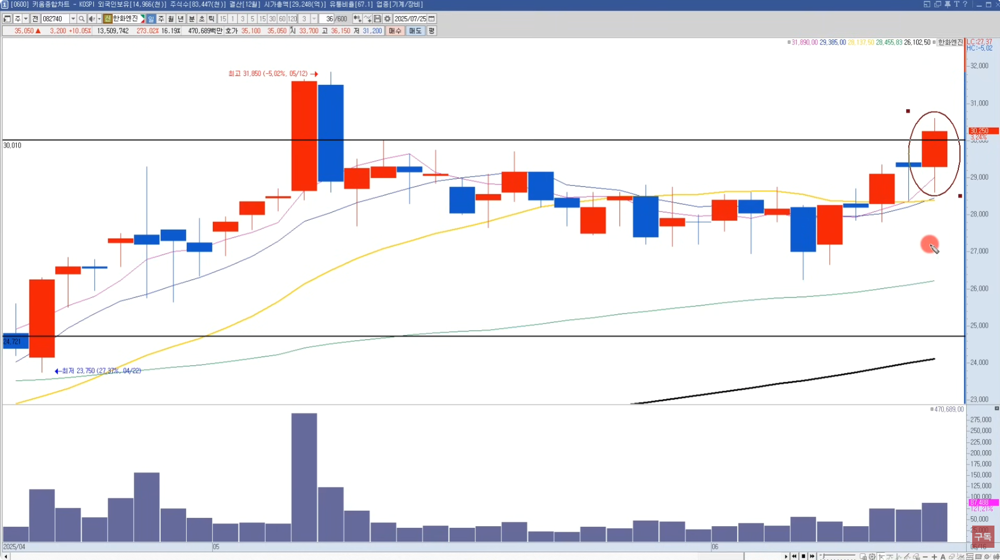</td>
    <td>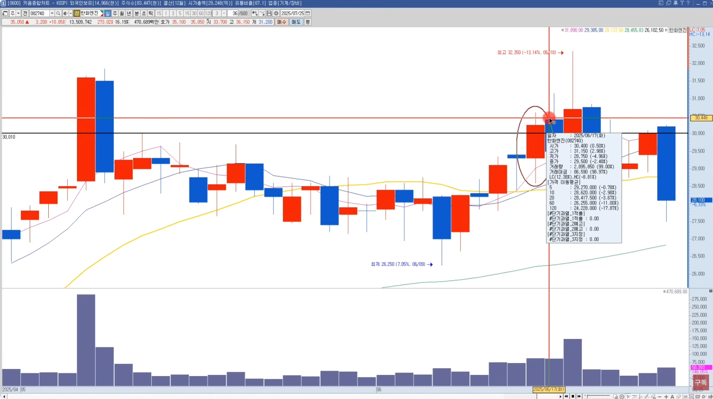</td>
  </tr>
  <tr>
    <td>큰 상승후 처음으로 5이평을 깬 캔들의 고점을 재돌파한 봉은 요기</td>
    <td>다음날 0.5%갭 후 2.98% 상승후 하락 음봉, 그 다음날 큰 상승 나옴</td>
  </tr>
</table>
 

<h4>[예시2] 돌파자리에서 분봉으로 본 매수타점</h4>
<table>
  <tr>
    <td>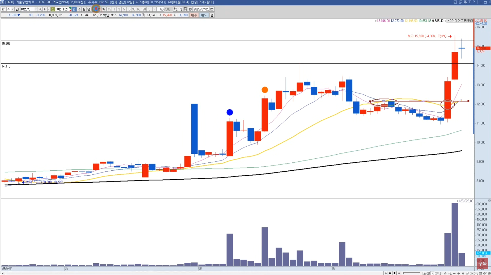</td>
    <td>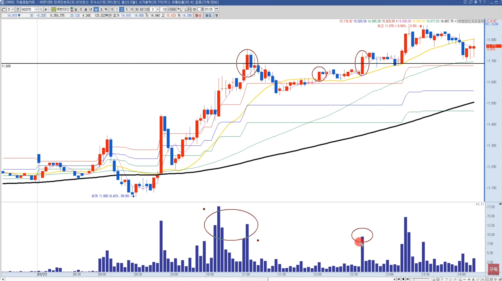</td>
  </tr>
  <tr>
    <td>일봉상 전고점을 강력하게 돌파한 차트를 분봉으로 봐 보자</td>
    <td>상승후 5이평을선 이탈한 고점을 거래량과 함께 재돌파한 자리가 매수타점</td>
  </tr>
  <tr>
    <td colspan="2">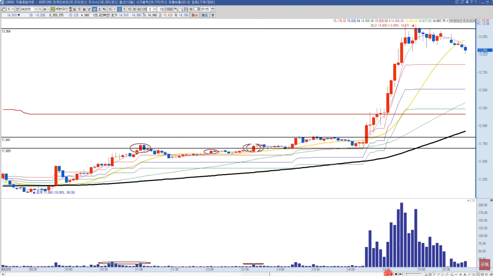</td>
  </tr>
  <tr>
    <td colspan="2">
      <ul>
        <li> 길게보면 돌파자리가 지지라인으로 받쳐주면서 한번도 이탈하지 않았다
        <li> 2시15분쯤 강한 거래량을 동반하며 상승추세가 만들어졌다
        <li> 추세를 끌고 간다면, 종가상으로 5이평을 이탈하는 자리에서 매도
      </ul>
    </td>
  </tr>
</table>

---
### 거래대금과 프로그램 수급으로 첫 신호를 잡아라
- 장 시작 30분 이내 거래대금/프로그램 수급 종목을 추려라
- 특히 **장대양봉 + 거래대금 + 프로그램수급** 이 동반된 종목
- 단, 연속성 없는 종목은 피해야 한다

### 첫봉이 강한 종목 vs 두번째 상승 나오는 종목
- 5~10% 3분봉상 장대양봉
  - 이때 같이 빨려들어가면 꼭지일 가능성이 높다
- 진짜 기회는 **첫상승후 눌렸다가 5이평 이탈하고 눌렸다가 재돌파할 때** 
  ⇒ 이때가 진짜 기회다
- 손익비가 좋다

### 종목선정
- 거래대금 500억 이상 요즘에 장 좋을때는 1000억이상 터진 종목
- 프래그램 순매수 상위 10등안에 있는 종목

### 테마/정책주도 파동을 탄다

### 매수 타이밍은 5이평선을 이탈 이후 다시 돌파하는 지점
- 눌림은 초보들이 힘들수 있다. 
  - 손절을 못하고 물타기 하면 계좌가 x박살 난다
  - 손절은 전저점 이탈시 철저하게 기계적으로 한다
- 심리적으로 손절라인 손입비 모두 유리하다 

### 결론
- **기다림(자기절제)과 기준**
- **시장을 먼저 봐라**
  - 시장안에 키워드가 있고
  - 키워드 안에 종목이 있고
  - 종목안에 타점이 있다

 

[[TOP]](#index)

---
## [S4-12강] 단타, 여기서 안 사면 평생 힘듭니다

### 장대양봉, 왜 중요한가?
- 주식차트는 심리를 반영한다
  - 거래량이 터지고 장대양봉이 나오는 시점은 **심리가 폭발하는 순간** 이다
  - 상승장 초기, 박스권 돌파, 신고가 갱신... 전부 심리기반에서 설명이 가능하다
  - 예시 : 3일간 눌림후 거래량이 폭발하면서 장대양봉이 나올때 ⇒ 실질적인 트리거 !
- 일봉의 기준 : **박스권 돌파부터 체크하라**
  - 가장 기본은 박스권 돌파다!
  - **횡보기간이 길면 길수록 돌파의 에너지도 크다**
  - 특히 이전고점 돌파, 거래대금 증가  ⇒ 돈이 들어왔다는 확실한 신호다  
- 장대양봉 4가지 패턴 정리
  - 박스권돌파 장대양봉
  - N자형 2차상승 장대양봉
  - 고점조정후 재반등 장대양봉
  - 쫄쫄이양봉후 신고가돌파 장대양봉

<h4>[예시1] 장대양봉 이후 상승하는경우 많음</h4>
<table>
  <tr>
    <td>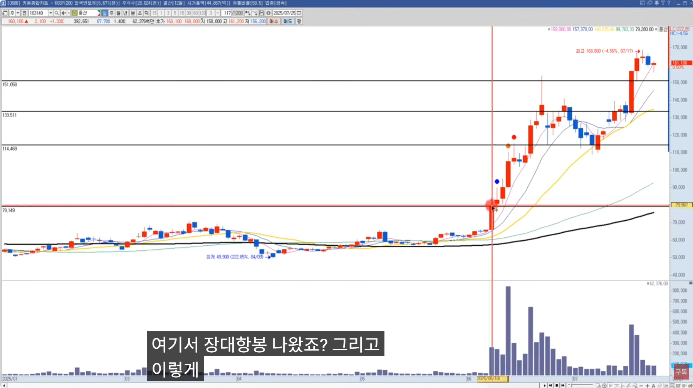</td>
    <td>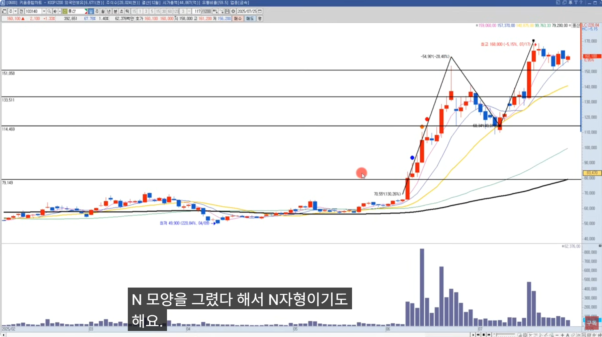</td>
  </tr>
  <tr>
    <td>박스권을 돌파하는 장대양봉 이후</td>
    <td>N자형의 2차상승 상승과 또다시 고점을 돌파하는 장대양봉</td>
  </tr>
  <tr>
    <td>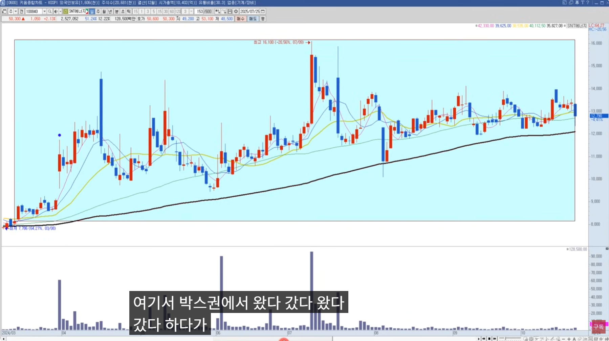</td>
    <td>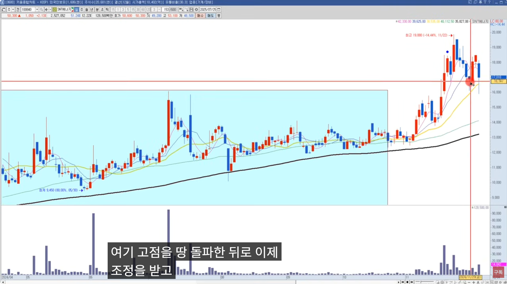</td>
  </tr>
  <tr>
    <td>박스권안에서 저점과 고점이 상승하며, 거래량없이 올랐다 내렸다 </td>
    <td>신고거는 아니지만, 큰 거래량과 함께 장대양봉 돌파후 조정받았지만 돌파라인 지지 </td>
  </tr>
  <tr>
    <td colspan="2"></td>
  </tr>
  <tr>
    <td colspan="2">
      <ul>
        <li> 조정을 받고 다시 전고를 돌파하며 우상향 하는 모습
        <li> 이후에 박스권저가대비 거의 500~1000% 이상의 대상승이 나옴
      </ul>
    </td>
  </tr>
</table>  

---
### 분봉차트에서 C봉 전략
- 거래량과 C봉의 의미
  - 거래량이 터지며 나오는 2~4% 양봉 = C봉
  - 이 캔들은 대부분 첫 신호이자 재료 반영의 시작점
- C봉 이후 전략
  - C봉의 저점 이탈시 손절
  - 이탈없이 우상향한다. 전캔들 저가 이탈에 익절 전략

<h4>[예시2] 분봉상 C봉 출현시 익절 및 손절</h4>
<table>
  <tr>
    <td>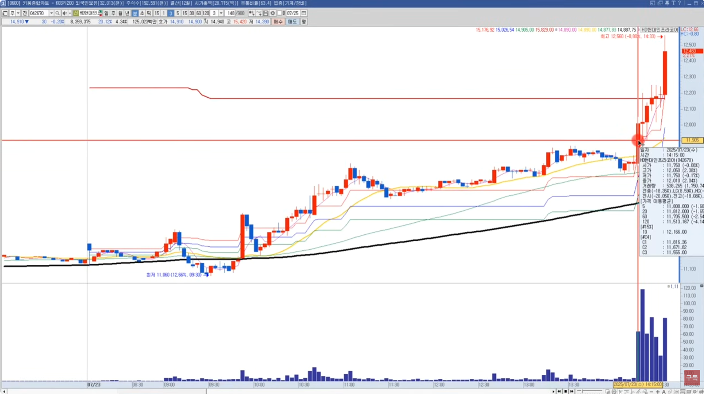</td>
    <td>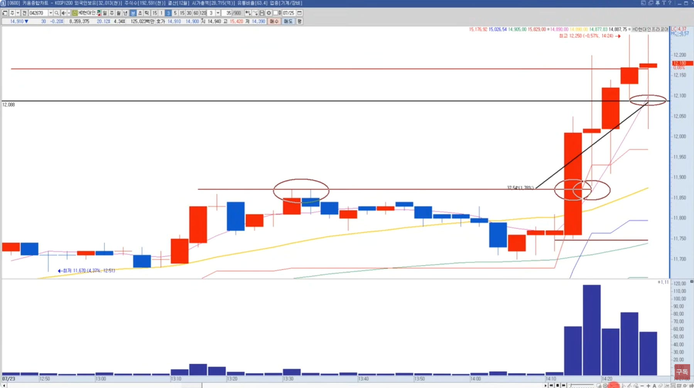</td>
  </tr>
  <tr>
    <td>강력한 수급과 함께 박스권을 돌파하는 장대양봉 출현</td>
    <td>
      돌파에서 샀던, 돌파후 다음캔들 눌림조정에서 샀던 돌파봉 저점이탈하면 손절  
      전캔들의 저가를 훼손하면 매도 
    </td>
  </tr>
  <tr>
    <td>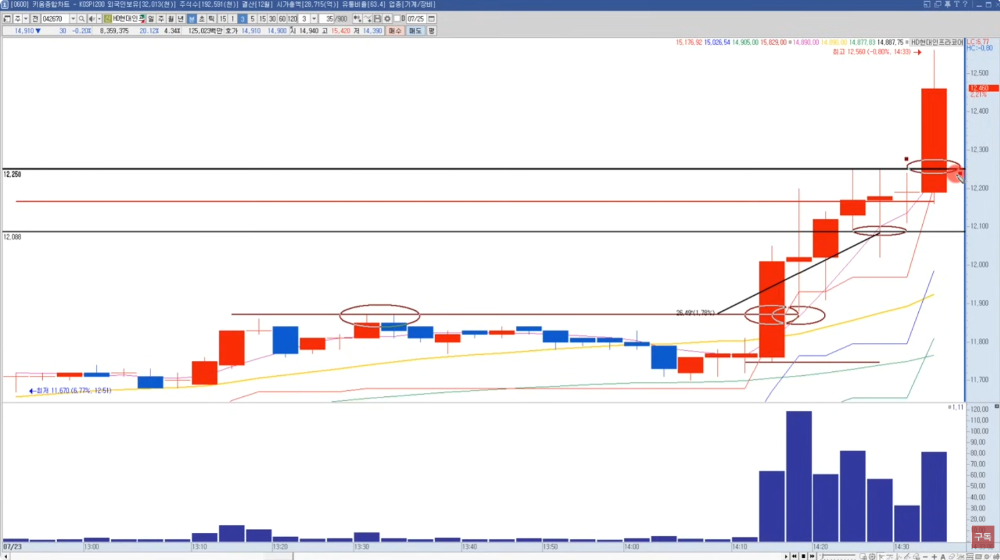</td>
    <td>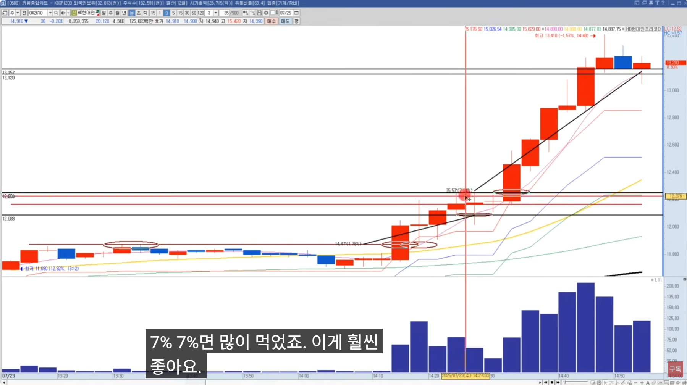</td>
  </tr>
  <tr>
    <td>앞에서 털렸지만, 다시 진입하려면 전고점 돌파시 다시 매수</td>
    <td>
      조금씩 분할매도했으면 2~3% 먹지만, 끌고간 경우 7% 먹었다.  
      추세매매로 원샷원킬 했을때 ⇒ 손익비가 훨씬 낫다.
    </td>
  </tr>
<table>

 

[[TOP]](#index)

---
