🏠 > [kostock](../../../) > [experts](../../) > [천리안주식](../) > `S5_유료강의압축5`

<table>
  <tr>
    <td><a href="../">[천리안주식]</a></td>
    <td><a href="../S0_INTRO_NEW">S0_INTRO</a></td>
    <td><a href="../S1_시장보는기준">S1_시장보는기준</a></td>
    <td><a href="../S2_단타의기본기">S2_단타의기본기</a></td>
    <td><a href="../S3_쉬운매매구조">S3_쉬운매매구조</a></td>
    <td><a href="../S4_주도종목실전">S4_주도종목실전</a></td>
    <td><a href="../S5_유료강의압축">S5_유료강의압축</a></td>
  </tr>
  <tr>
    <td colspan="7" align="right"> 
      <a href="S5_강의1.md">강의1</a> 🟥  
      <a href="S5_강의2.md">강의2</a> 🟧 
      <a href="S5_강의3.md">강의3</a> 🟨 
      <a href="S5_강의4.md">강의4</a> 🟩 
      <b href="S5_강의5.md">강의5</b> 🟦 
      <a href="S5_강의6.md">강의6</a> 🟪 
      <a href="S5_강의7.md">강의7</a> 
    </td>
  </tr>
</table> 

### INDEX
- [종목선정](#종목선정)
- [수급주, 수급세력주, 세력주 구분](#수급주-수급세력주-세력주-구분) : 기관의 개입 여부
- [연속성이 있는 종목](#연속성이-있는-종목)
- [정형화가 가능한 매매를 좋아한다](#정형화가-가능한-매매를-좋아한다) : 시개매매와 주도주돌파매매

---

# S5. 시크릿 강의 (5) 종목선정
> - 유료강의만 20명 이상에게서 들었었다.
> - 불개미, 미모사, 트레이더김씨, T98, 날좋은날에, 만쥬, 아프리카디펜티, 주포와함께춤을, 고라니, 바른다른, 침착해, 버저비트, 서희파더, 청사진, 홍인기 등등
  
### 종목선정
- **종목선정에서 만큼은 알려주는게 별게 없었다** ⇒ 진짜 그게 맞다는 말이다 
- 아니라면, 20명 다 거짓말을 칠리는 없다
  - 누구는 등락률 보고,
  - 누구는 거래대금 보고,
  - 누구는 순간체결량 보고,
  - 누구는 실시간순위 보고,
- **보라고 하는게 정답이 아니고, 왜 보라고 하는지를 생각해봐야 한다**
  - 다 이유가 있는거다
  - 예를들어, 누가 뉴스가 뜨자마자 5억을 미수몰빵으로 시장가를 산다고 한다면..
    - 순간체결량에 파바박 뜨고, 
    - 실시간순위에도 올라올 것이다.
    - 아무래도 실시간순위를 보는 사람이 순간체결량보는 사람보다는 늦을수 밖에 없다
    - 실제는 강사본인은 순간체결량을 보면서 실시간순위를 보라고 강의를 할수도 있다
    - 그래서, 순간체결량과 실시간순위를 보면서 매매를 하지는 않는다
    - 왜냐? 
    - 거기서 더 가냐 안가냐는 그 뉴스가 좋냐 안좋냐에 따라서 다르다
    - 혹은 그 뉴스가 안좋아도 누가 그냥 올리겠다고 하면 올라간다
    - 그말은, 세력이 붙었나 안붙었나가 중요하다 
      - 세력이 붙으면 계속 올라가는거고 분봉상 연속성 있게...
      - 세력이 안붙으면 세력이 잠깐 위로 뻥 친다음에 위에다가 다다다다 팔고 나갔으면 상승의 연속성이 끝난거다
      - 근데, 세력이 나갔는지 안나갔는지는 우리가 알수가 없다
- **우리가 판별하기 위해서는**
  - 뉴스가 좋은지 안좋은지
  - 거래대금이 계속 터지는지 안터지는지
  - 일봉위치가 좋은 위치인지 아닌지
  - 그래서, **등락률과 거래대금** 을 보는게 **보통 상승의 연속성이 있으면 여기에 뜬다** 
  - 상승의 연속성이 없는 종목은 
    - VI들어가도 풀리자마자 고꾸라지고, 
    - 갭을 뜨고나서도 고꾸라지고, 
    - VI후에 한번 슈팅을 주고 바로 고꾸라진다
- 처음 출발시키는 사람들이 **수급주, 세력주 구분하는 것을 중요** 하게 생각한다
  - **유료강의에서는 세력주를 하라고 가르친다** 말이죠. **why?**
    - 솔직히 알것 같다
    - 순간체결량과 실시간거래순위에 뜨고 개미들이 들어오면 거기다가 팔아먹고 나가기가 좋다
    - 세력이 팔아먹고 나가면, 눌림에서 새로운 세력이 들어오지 않는이상 그 종목은 쭉하고 떨어진다
  - 근데, **수급주에서는 그 짓거리를 못한다**
    - 누가 5억 10억 때려봤자 안갈놈은 안간고,
    - 눌림에서 던져봐야 표시도 안난다
    - **수급주를 하는게 안정적이다**

<h4>장초 종목찾기</h4>
<table>
  <tr>
    <td>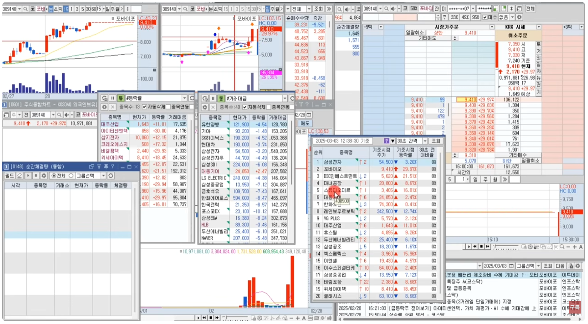</td>
    <td>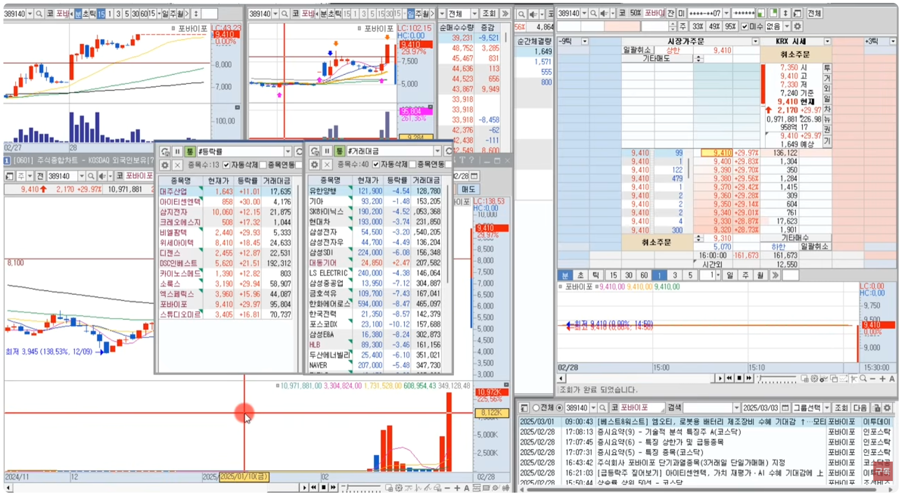</td>
  </tr>
  <tr>
    <td>순간체결량, 실시간조회순위</td>
    <td>거래량 10% 이상, 거래대금 1천억 이상</td>
  </tr>
</table>

 

[[TOP]](#index)

---
### 수급주, 수급세력주, 세력주 구분
- **수급주**  
  - 일단 연기금 수급이 꾸준하게 사고팔고 하는 수급이 있고
  - 그러면서 동시에 사모펀드, 투신, 금융투자 등이 있어야한다 
- **수급세력주** 
  - 일반 개인이 10억 정도로 좌지우지 못한다
  - 호가창이 빵빵하다
- **세력주** 
  - 일반 개인이 5억,10억으로 좌지우지 한다
  - 호가창이 텅텅비어 있다
- **상승의 연속성이 있는지 여부 판단**
  - 급등후에 바로 고꾸라지면 연속성이 없는것이고,
  - 급등후에 횡보한다면 이게 시그널일 수 있다 
    - 누군가가 바닥을 지켜주고 있는 것이다
    - 그래서 전고점을 돌파할때 살수가 있다 ⇒ 돌파매매 가능
  - 이런 원리를 제대로 알아야 한다

<h4>수급주와 세력주 구분</h4>
<table>
  <tr>
    <td>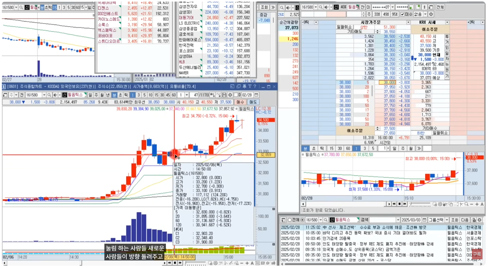</td>
    <td>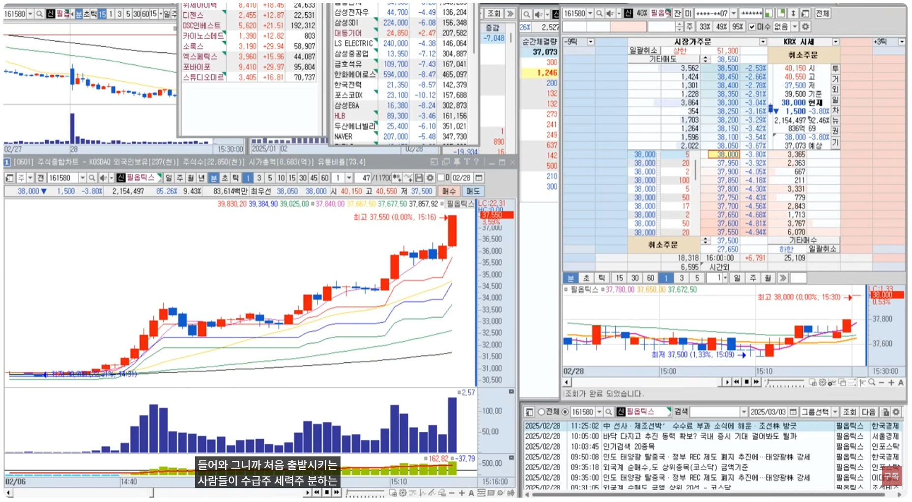</td>
  </tr>
  <tr>
    <td>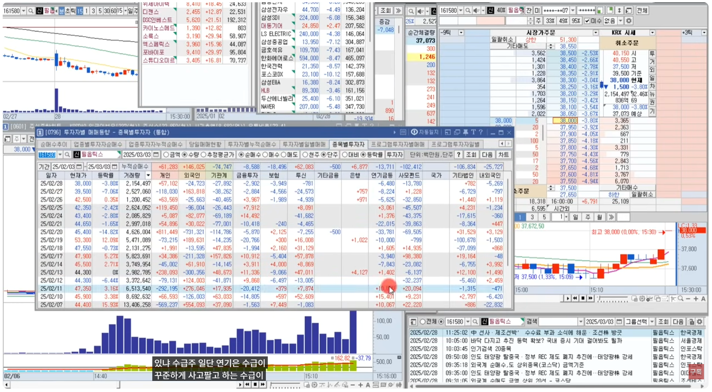</td>
    <td>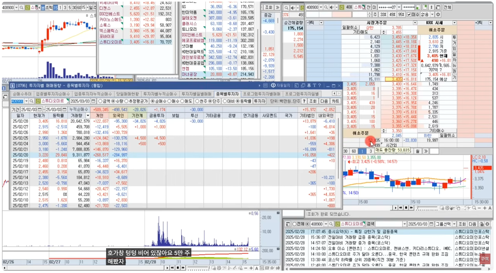</td>
  </tr>
</table>

 

[[TOP]](#index)

---
### 연속성이 있는 종목
- 검색기 활용 : 거래량, 거래대금
  - **거래량은 10% 이상 올라온 것**
  - **거래대금은 1000억 이상인 것**
  - 장초에는 텅텅비어 있다가, **뜨는 종목이 그 섹터의 주도주와 대장주가 될 수 있다**
  - 보통 대장주가 처음에 먼저 뜬다
- 예를들어, 스튜디오 미르가 뜬다면.. 
  - 한한령 종목인데 이러면서 관심종목의 한한령 관련 종목들을 싹다 본다
  - 근데 후발주들이 올라오고 있다면, 그날은 한한령이 주도섹터가 될 수 있다
  - 그러면 10%위에서 횡보하다가, 전고점을 돌파하면서 거래대금이 올라오면서 위로 빵하고 올라갈때 매수할 수가 있다
  - 아무데서나 다 사는게 아니다

<h4>연속성이 있는 종목</h4>
<table>
  <tr>
    <td>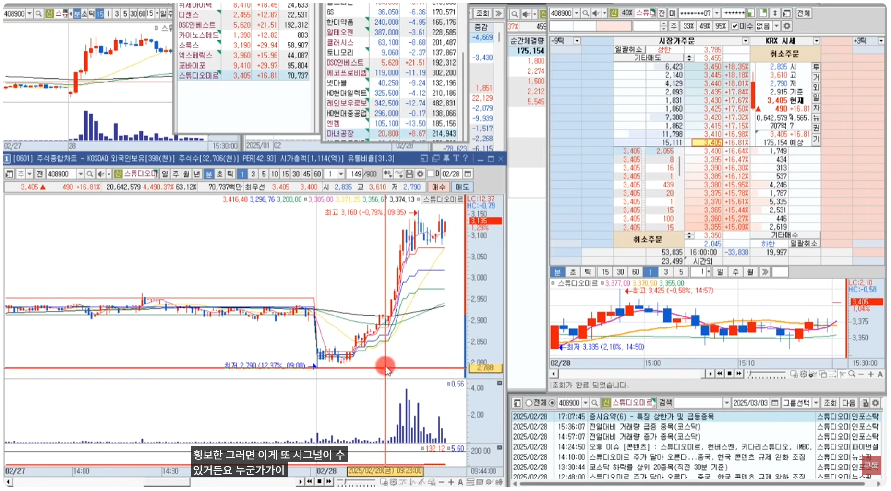</td>
    <td>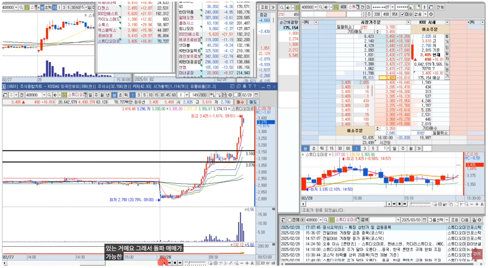</td>
  </tr>
  <tr>
    <td>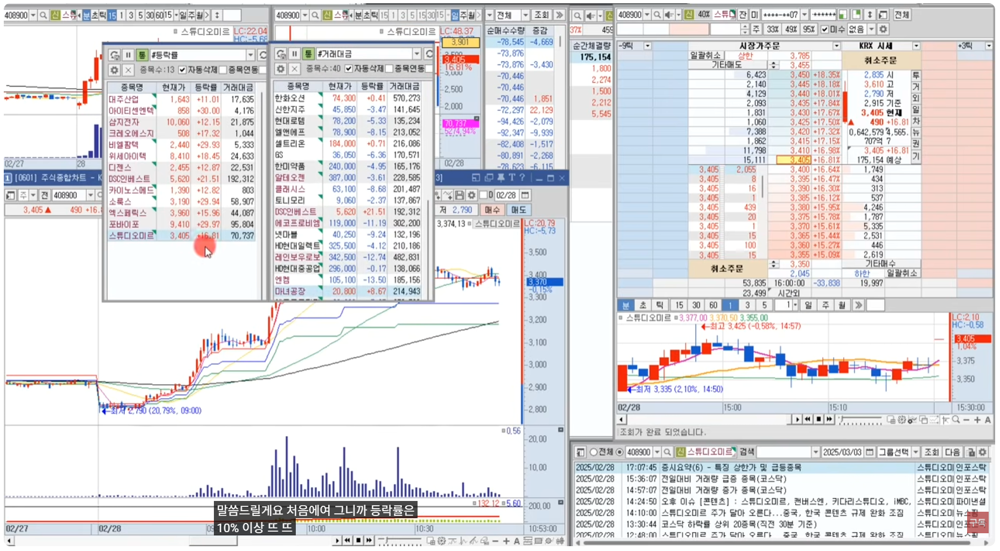</td>
    <td>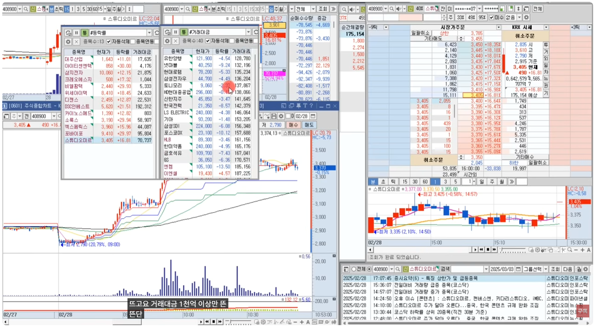</td>
  </tr>
  <tr>
    <td>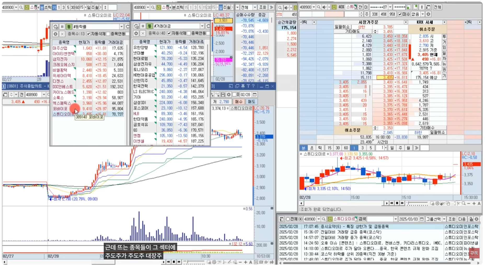</td>
    <td>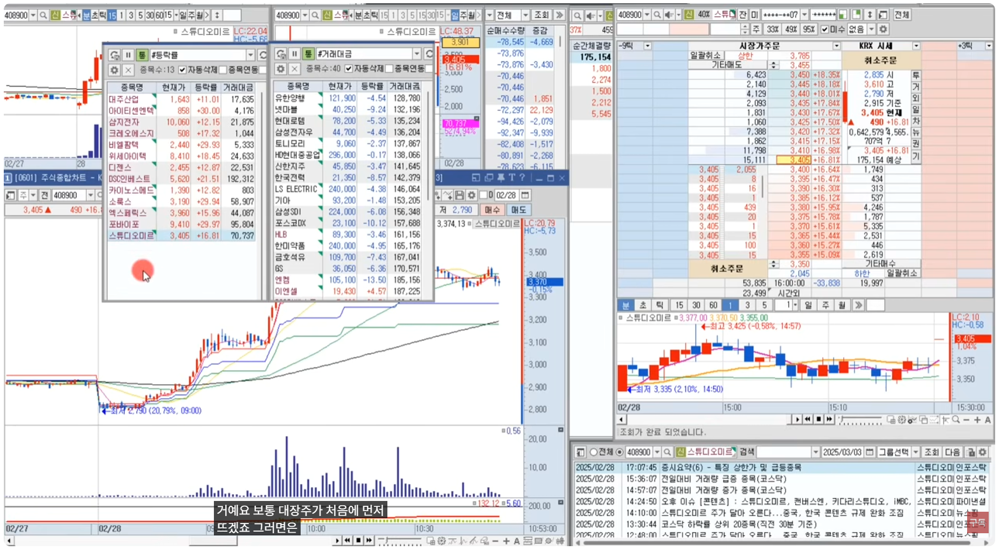</td>
  </tr>
  <tr>
    <td></td>
    <td></td>
  </tr>
</table>

 

[[TOP]](#index)

---
### 정형화가 가능한 매매를 좋아한다
- **정형화 가능한 시개매매와 주도주돌파매매**
  - 시가매매는 9:00~9:30
  - 주도주돌파눌림매매는 9:30~10:00
  - 이것까지는 정형화를 시킬수가 있다 
  - 억대트레이더들도 이렇게 정리해줬다
- 근데 11시 이후부터는 오후장에 갑자기 틔어올라오는것을 매매한다 ⇒ 대형주가 아닌이상 뉴스돌파다
  - **뉴스돌파는 처음에 출발시킨 사람한테만 수익을 챙겨주는 거다.** 
  - 그래서 **뉴스돌파는 안한다**
  - 진짜 좋은뉴스로 강하게 올라갈때는 VI까지 개인이 올라탈수 없을 정도로 한방에 들어간다
  - 안좋거나 애매한 종목은 VI가 위에 보이면 위에다 세력이 팔고 있다. 
    - 올라갈만하다 안올라가고..
    - VI가 보이면 그냥 올라오기전에 다 팔아버린다.

 

[[TOP]](#index)

---