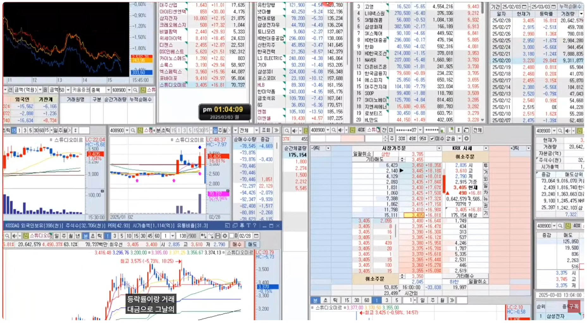
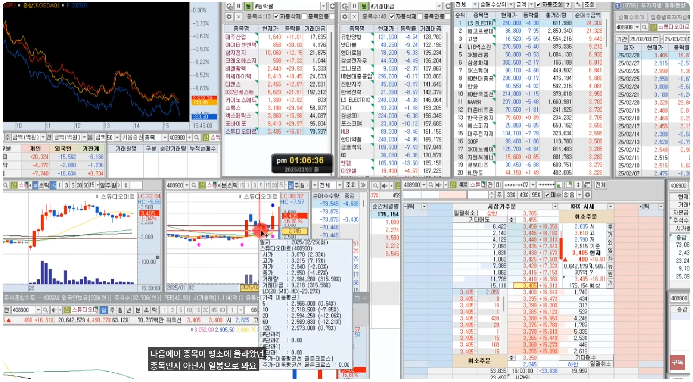
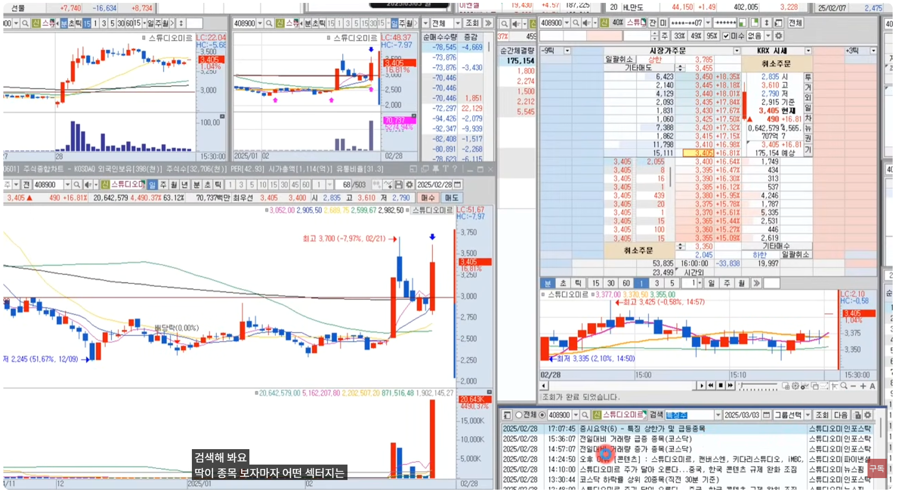
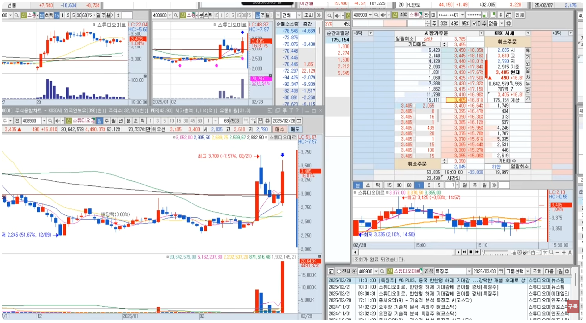
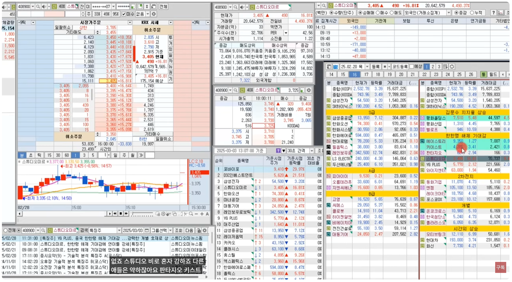
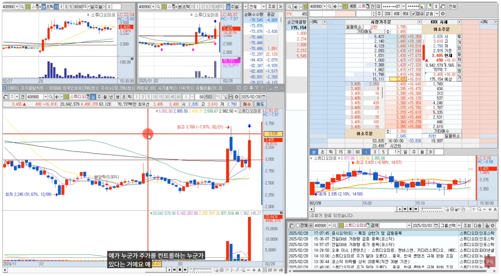
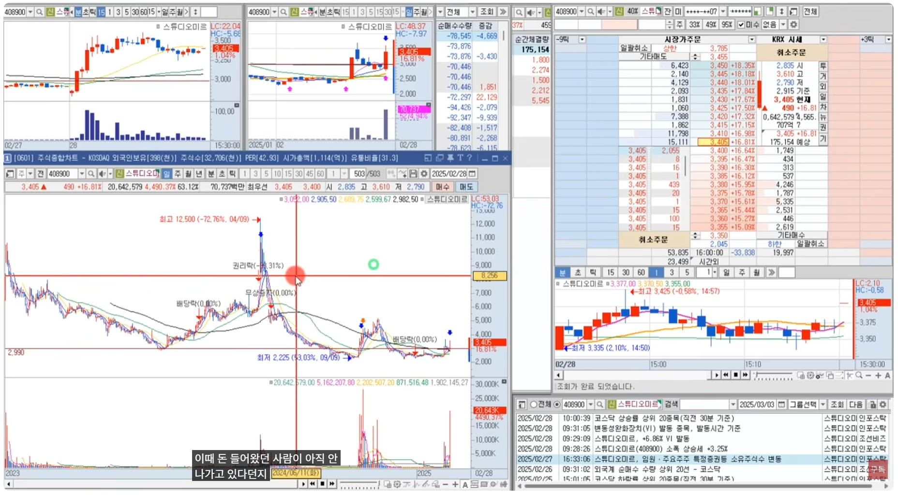
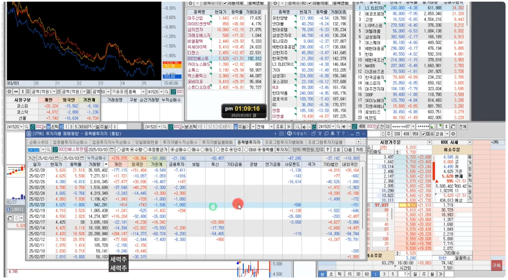

🏠 > [kostock](../../../) > [experts](../../) > [천리안주식](../) > `S5_유료강의압축6`

<table>
  <tr>
    <td><a href="../">[천리안주식]</a></td>
    <td><a href="../S0_INTRO_NEW">S0_INTRO</a></td>
    <td><a href="../S1_시장보는기준">S1_시장보는기준</a></td>
    <td><a href="../S2_단타의기본기">S2_단타의기본기</a></td>
    <td><a href="../S3_쉬운매매구조">S3_쉬운매매구조</a></td>
    <td><a href="../S4_주도종목실전">S4_주도종목실전</a></td>
    <td><a href="../S5_유료강의압축">S5_유료강의압축</a></td>
  </tr>
  <tr>
    <td colspan="7" align="right"> 
      <a href="S5_강의1.md">강의1</a> 🟥  
      <a href="S5_강의2.md">강의2</a> 🟧 
      <a href="S5_강의3.md">강의3</a> 🟨 
      <a href="S5_강의4.md">강의4</a> 🟩 
      <a href="S5_강의5.md">강의5</a> 🟦 
      <b href="S5_강의6.md">강의6</b> 🟪 
      <a href="S5_강의7.md">강의7</a> 
    </td>
  </tr>
</table> 

### INDEX
- 
- 
- 

---

# S5. 시크릿 강의 (6) 주도주매매

### 주도주매매종목 

- 아침마다 **등략률과 거래대금** 으로 그날의 **주도주들을 관심종목에 등록**
- 9시30분에서 10시까지 그시간의 주도주와 대장주를 정리
  - 검색기에 뜨도 평소 올라오던 종목이 아니면 아예 매매를 안한다
  - 처음보거나 쩜상으로 올라간 종목도 매매 안한다
- **평소 올라왔던 종목인지 아닌지는 일봉으로 본다**
- **딱 보자마자 어떤 섹터인지를 모르면, 뉴스에서 특징주로 검색** 해본다
  - 만약에 뉴스에 한햔령이 뜬다면
  - 다른 한한령 종목에서도 올라온게 있는지 관심종목에서 찾아보고 등록
  - 근데 스튜디오미르 혼자만 강하고 다른종목은 다 약하다면, 
  - 이종목은 누군가 주가를 컨트롤하는 누군가 있다는 의미다
  - 즉, 개별이슈로 올라가는 종목
  - 아니면 앞에 들어왔던 사람들이 아직 안나가고 있다던지

<h4>주도주매매종목 찾기</h4>
<table>
  <tr>
    <td></td>
    <td></td>
  </tr>
  <tr>
    <td></td>
    <td></td>
  </tr>
  <tr>
    <td></td>
    <td></td>
  </tr>
</table>

 

[[TOP]](#index)

---
### 세력주인지 수급주인지 판단
  - 세력주는 조심해야 한다
    - **세력주는 개미에게 물량을 떠넘기며 수익을 낸다**
    - 세력주는 기관, 외국인이 관심을 가지지 않는다
    - 개인이 외국인 계좌로 매매를 하던가..  
  - 변동성이 좋다고 세력주를 하라고 하는 사람이 있는데..
    - 그 변동성을 우리가 만들어 낼수가 없다. 세력이 만들어 낸다.
    - 개미가 강하게 들어오면 주가를 올리면서 팔고, 
    - 개미가 약하게 들어오면 주가를 한방에 던지며 피뢰침을 만든다

<h4>세력주인지 수급주 구분</h4>
<table>
  <tr>
    <td></td>
    <td></td>
  </tr>
</table>

 

[[TOP]](#index)

---