🏠 > [kostock](../../../) > [experts](../../) > [천리안주식](../) > `S5_유료강의압축7`

<table>
  <tr>
    <td><a href="../">[천리안주식]</a></td>
    <td><a href="../S0_INTRO_NEW">S0_INTRO</a></td>
    <td><a href="../S1_시장보는기준">S1_시장보는기준</a></td>
    <td><a href="../S2_단타의기본기">S2_단타의기본기</a></td>
    <td><a href="../S3_쉬운매매구조">S3_쉬운매매구조</a></td>
    <td><a href="../S4_주도종목실전">S4_주도종목실전</a></td>
    <td><a href="../S5_유료강의압축">S5_유료강의압축</a></td>
  </tr>
  <tr>
    <td colspan="7" align="right"> 
      <a href="S5_강의1.md">강의1</a> 🟥  
      <a href="S5_강의2.md">강의2</a> 🟧 
      <a href="S5_강의3.md">강의3</a> 🟨 
      <a href="S5_강의4.md">강의4</a> 🟩 
      <a href="S5_강의5.md">강의5</a> 🟦 
      <a href="S5_강의6.md">강의6</a> 🟪 
      <b href="S5_강의7.md">강의7</b> 
    </td>
  </tr>
</table> 

### INDEX
- 
- 
- 

---

# S5. 시크릿 강의 (7) 시장에 따른 매매방법

### 시장분석이 먼저다
- 현재 어떤매매가 잘 맞는 매매인가?
  - 현재 돌파매매는 쉽지가 않다.
  - 20% 이상에서는 돒파매매 금지
  - 5~10% 사이에서만 돌파매매 : 전고돌파 수급 동반될때만
- 손절시 호가창보고 빠르게 대응하거나, 전봉의 저점이탈시 손절
  - 돌파후 첫눌림에서 눌림자리 매수
- 하루에 10개 이상 매매한다고 좋은게 아니다
- 하루에 딱 2~3개 혹은 5개 미만이 딱 좋다

 

[[TOP]](#index)

---
### 시장에 따른 종목검색
<table>
  <tr align="center">
    <td width="200"><b>구분</b></td>  
    <td width="400"><b>지수가 하락</b></td>  
    <td width="400"><b>지수가 상승</b></td>  
  </tr>  
  <tr>
    <td align="center"><b>주도섹터</b></td>  
    <td>시가총액 낮은 종목인 세력주가 날뛸수 있고</td>  
    <td>수급주들이 날띌수가 있다</td>  
  </tr> 
  <tr>
    <td align="center"><b>종목선정</b></td>  
    <td>거래량, 거래대금 터지는 종목 위주</td>  
    <td>프로그램 순매수 상위 </td>  
  </tr> 
</table>

<h4>시장에 따른 종목검색 및 매매방법</h4>
<table>
  <tr>
    <td>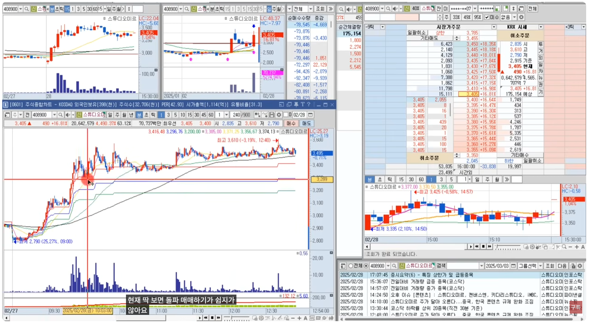</td>
    <td>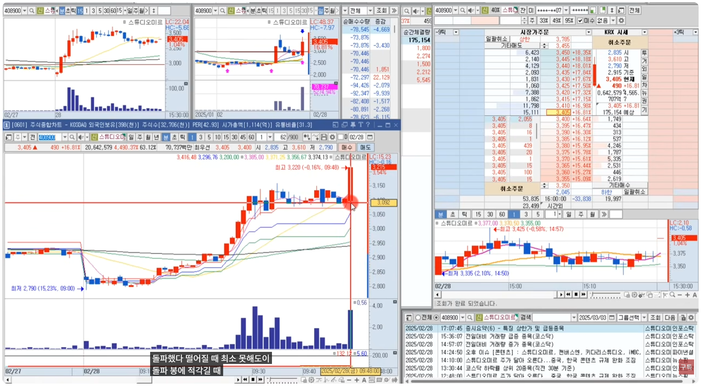</td>
  </tr> 
  <tr>
    <td>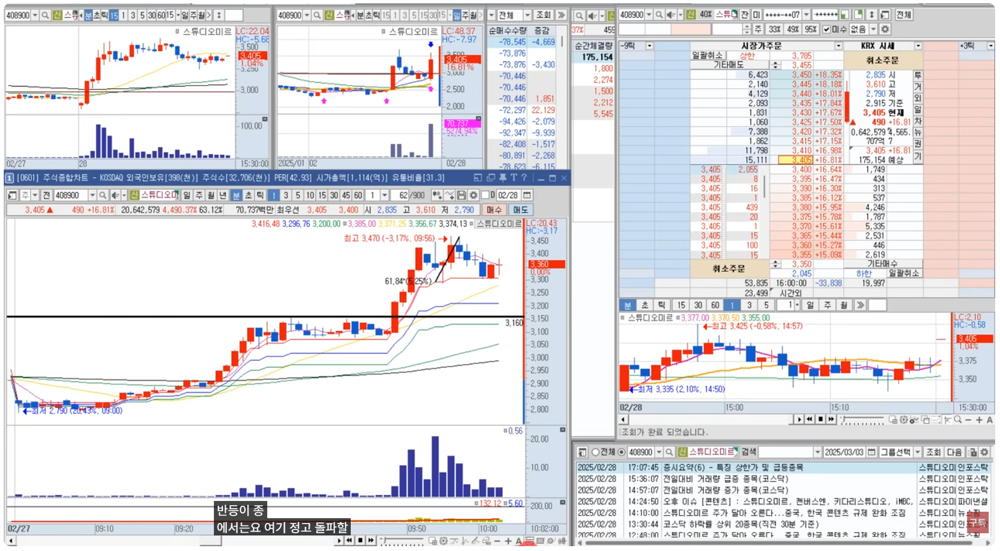</td>
    <td>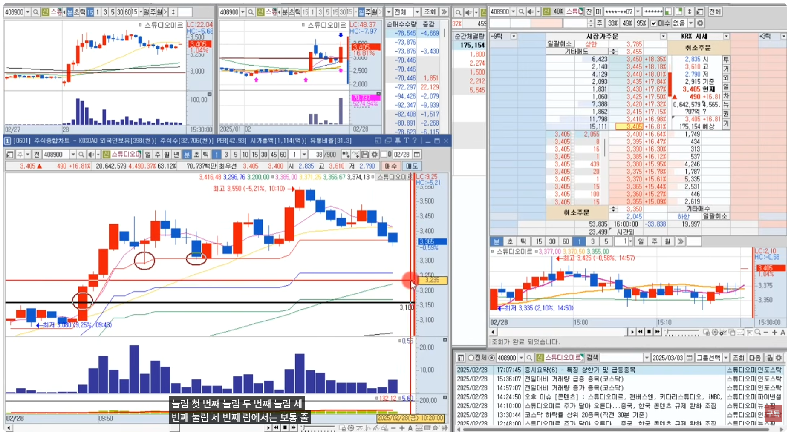</td>
  </tr> 
  <tr>
    <td>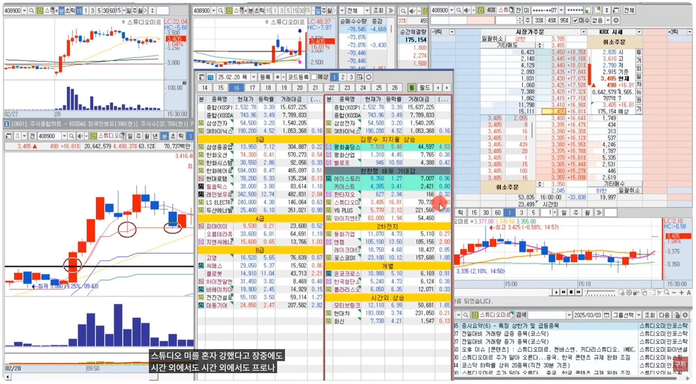</td>
    <td>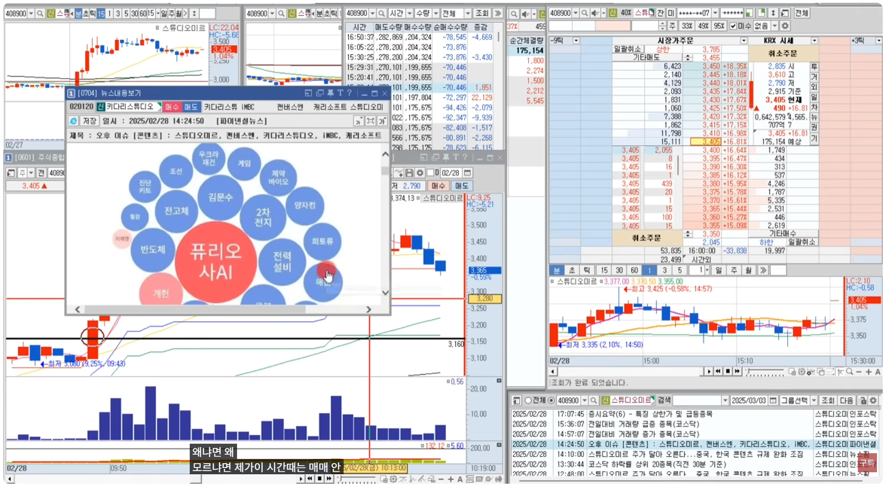</td>
  </tr> 
  <tr>
    <td>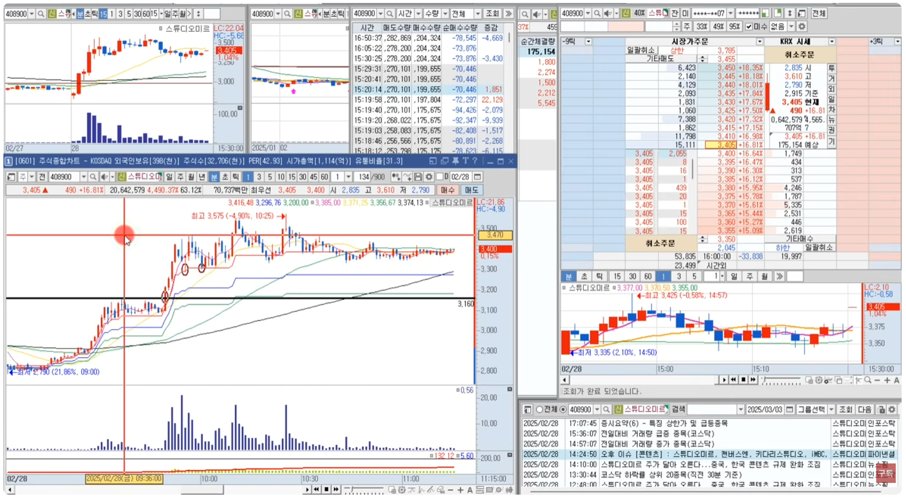</td>
    <td>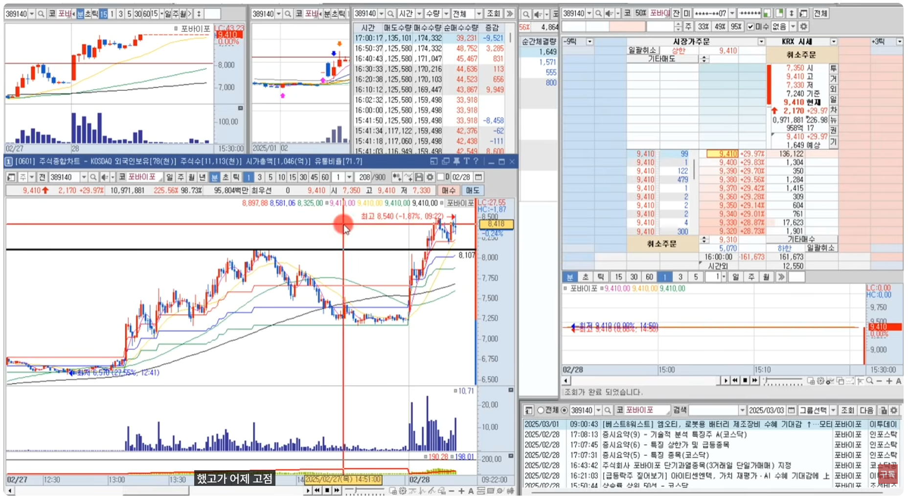</td>
  </tr> 
  <tr>
    <td>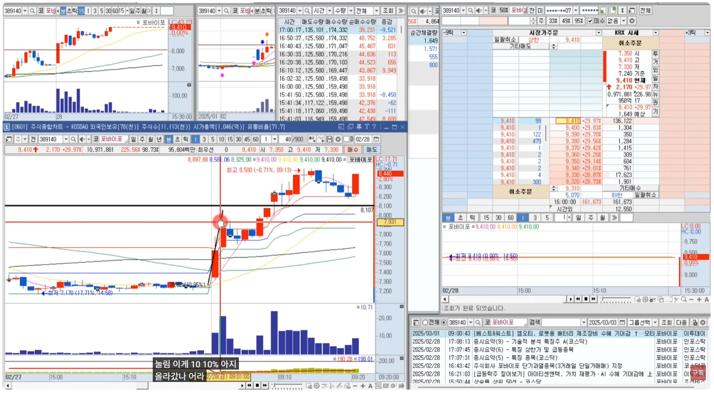</td>
    <td>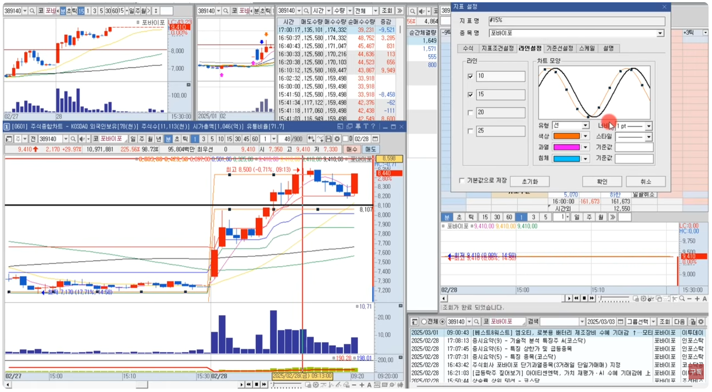</td>
  </tr> 
  <tr>
    <td>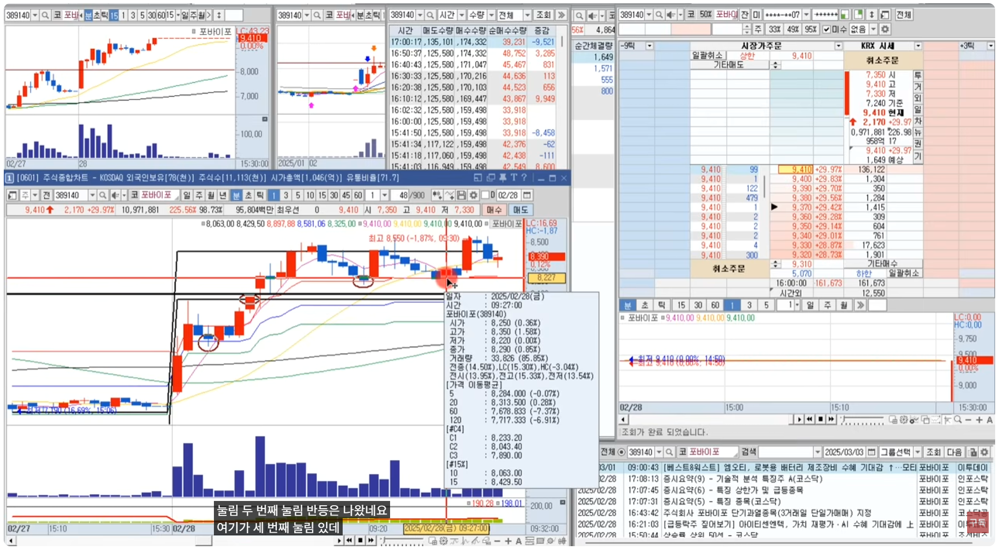</td>
    <td>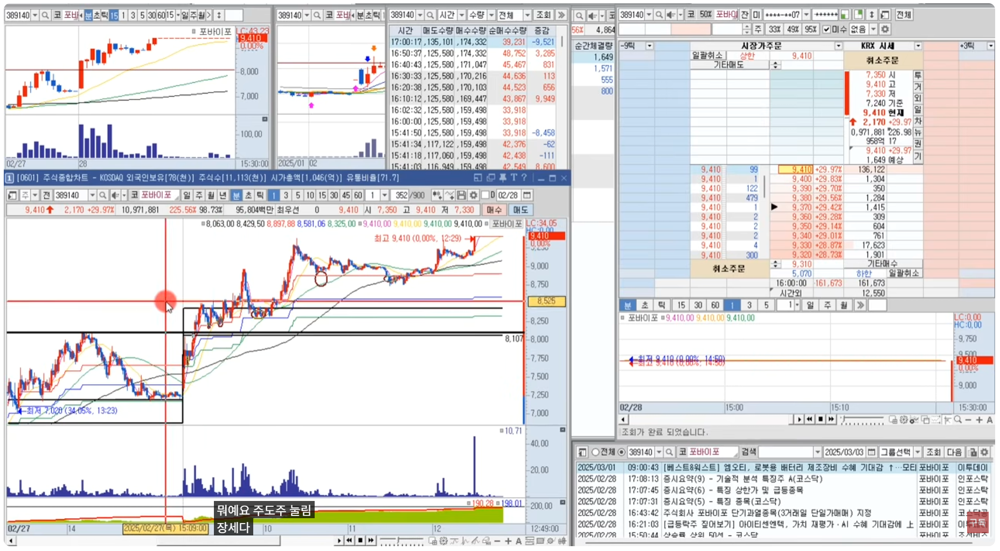</td>
  </tr> 
  <tr>
    <td>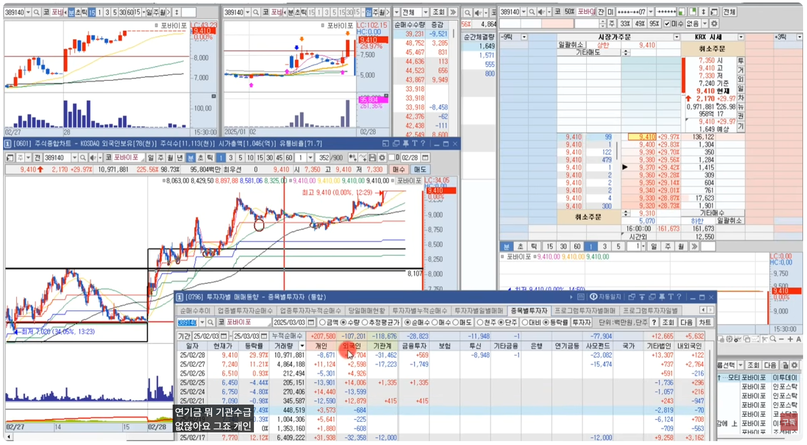</td>
    <td>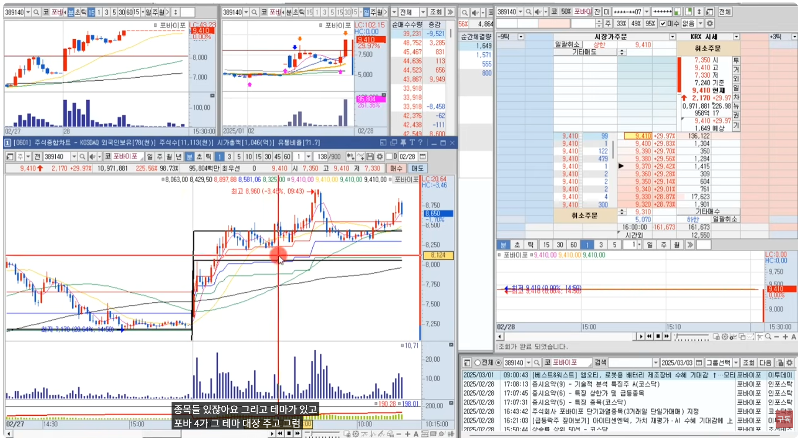</td>
  </tr> 
  <tr>
    <td>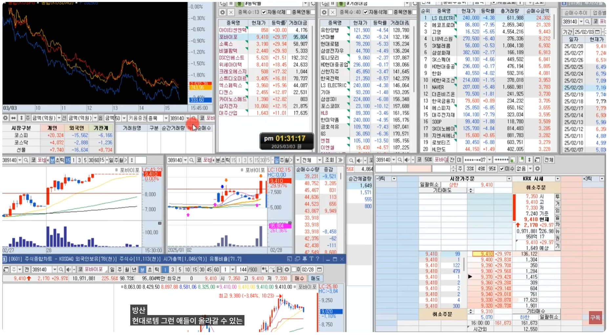</td>
    <td>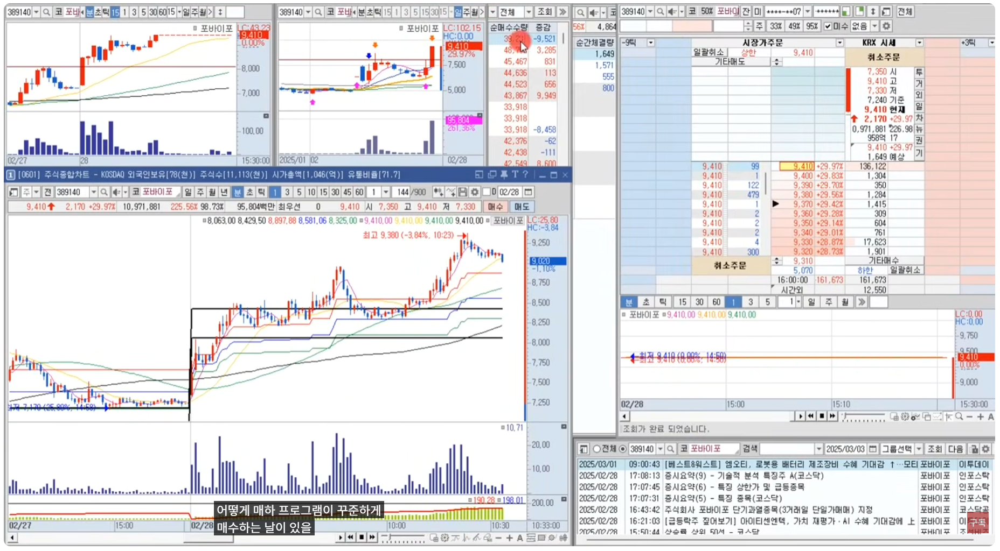</td>
  </tr> 
  <tr>
    <td>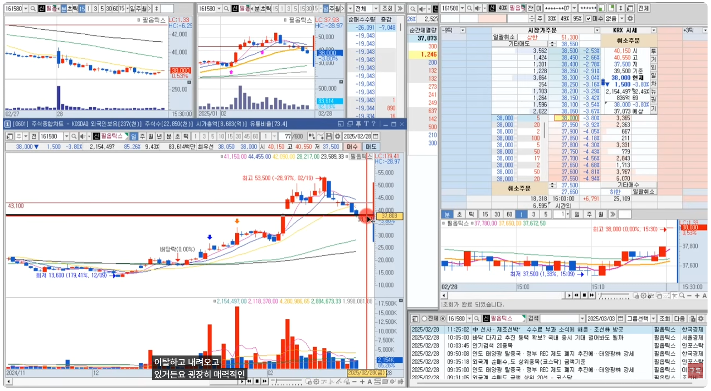</td>
    <td></td>
  </tr> 
  <tr>
    <td>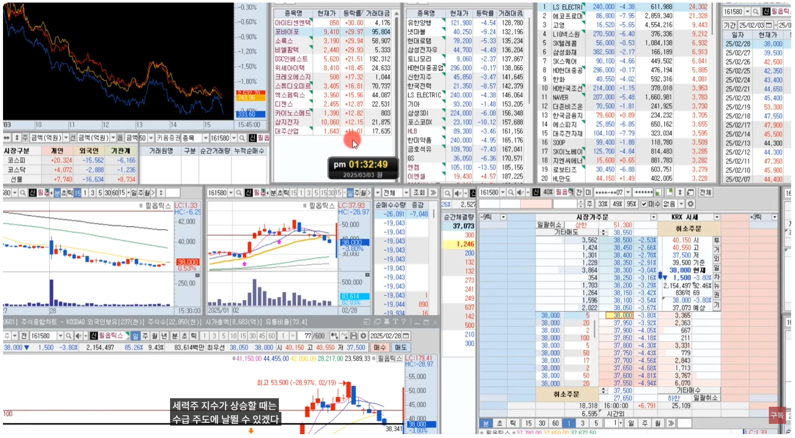</td>
    <td>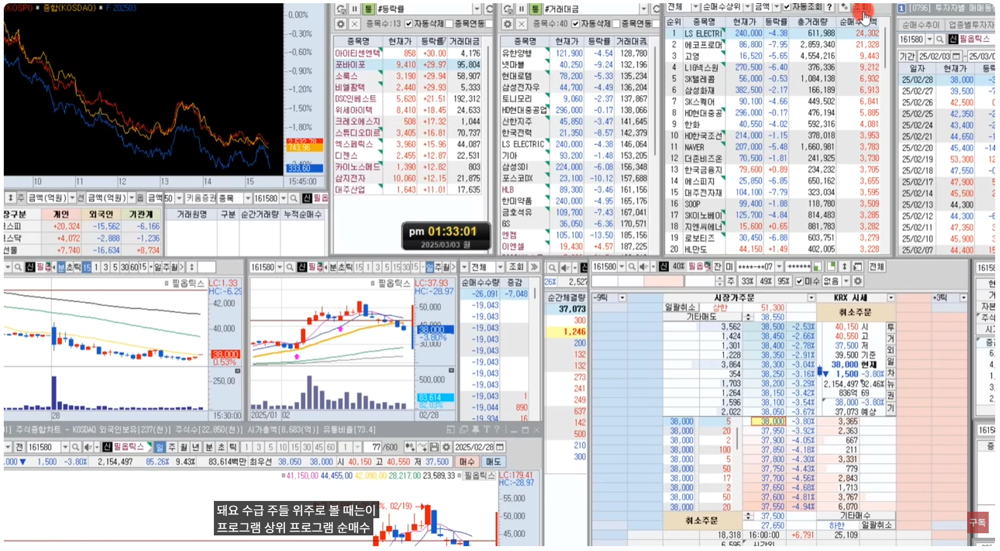</td>
  </tr>
</table>

 

[[TOP]](#index)

---