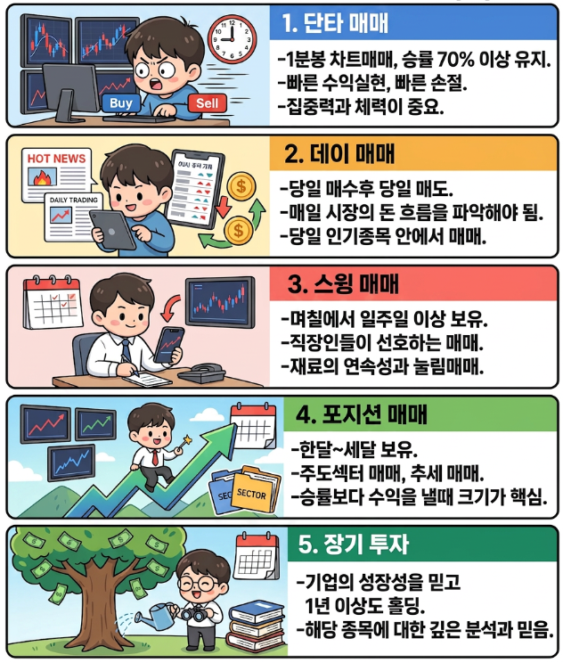
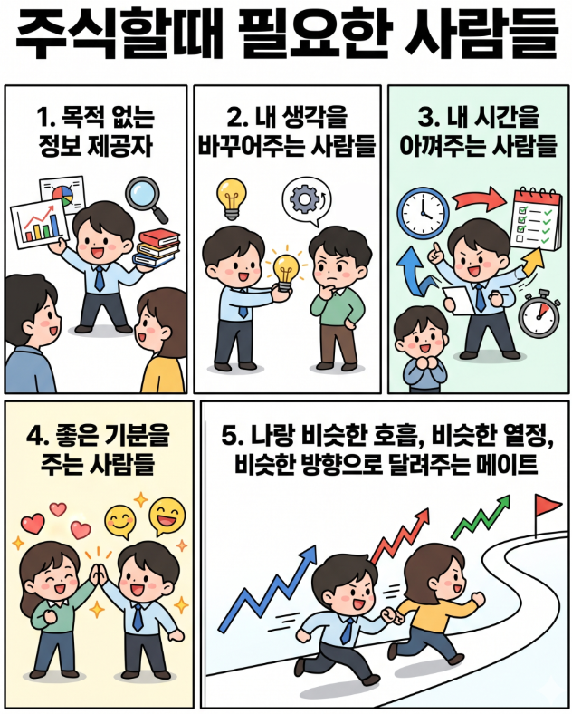

🏠 > [kostock](../) > `strategy research`

<table>
  <tr>
    <td><a href="../">Main</a></td>
    <td><a href="../s10_experts/">고수탐방</a></td>
    <td><b href="../s20_research/">전략연구</b></td>
    <td><a href="../s30_short-term/">단기투자</a></td>
    <td><a href="../s40_long-term/">장기투자</a></td>
    <td><a href="../s50_principles/">기준원칙</a></td>
    <td><a href="../s60_stocks">종목연구</a></td>
    <td><a href="../s90_database/">문서자료</a></td>
  </tr>
</table>

---
# S20. 전략연구

### INDEX
- [기본상식](./기본상식/)
- [세력개요](./세력개요/)
- [세력운영](./세력운영/)
- [패턴연구](./패턴연구/)

---
### 주식 투자자의 유형

---

---

- 발전은 혼자 있을때 고민과 반복으로 이뤄지는 것!!!

---