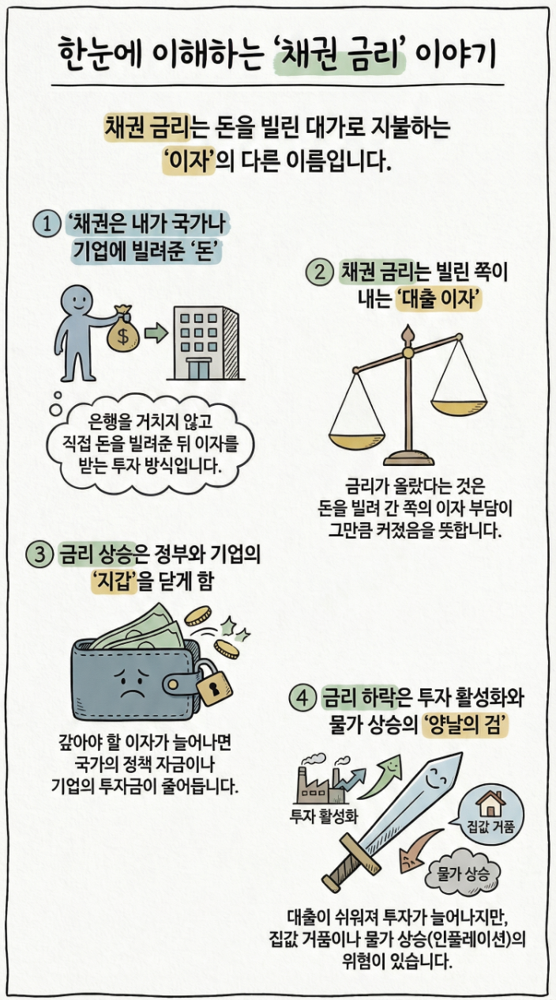

🏠 > [kostock](../../) > [research](../) > [기본상식](./) > `기본개념`

<table>
  <tr>
    <td><a href="../"><b>전략연구</b></a></td>
    <td><a href="../세력개요/">세력개요</a></td>
    <td><b href="../세력운영/">세력운영</b></td>
  </tr>
</table>

### INDEX
- [기본개념](#기본개념)
- [채권금리](#한눈에-이해하는-채권금리-이야기)

---
## 기본개념

### 한눈에 이해하는 채권금리 이야기

 

[[TOP]](#index)

---