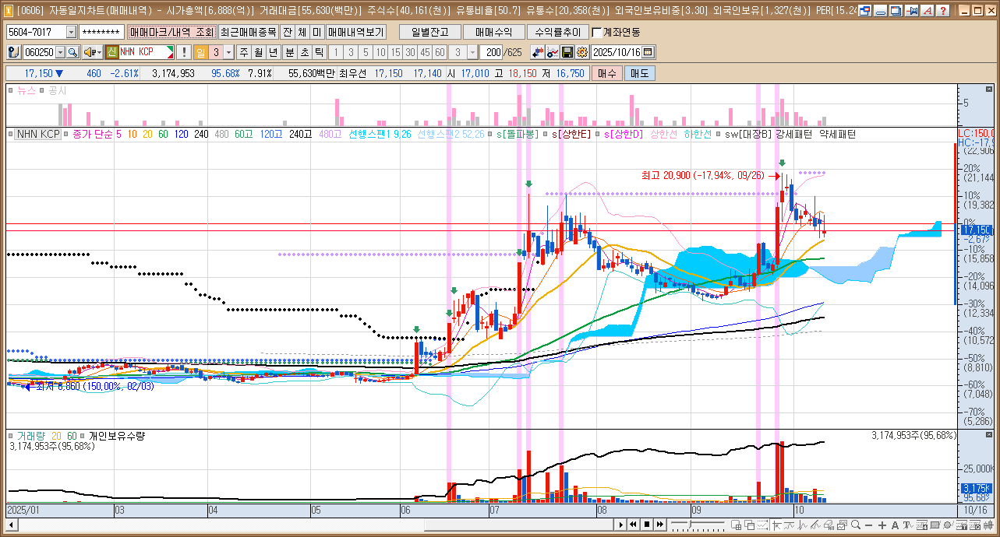
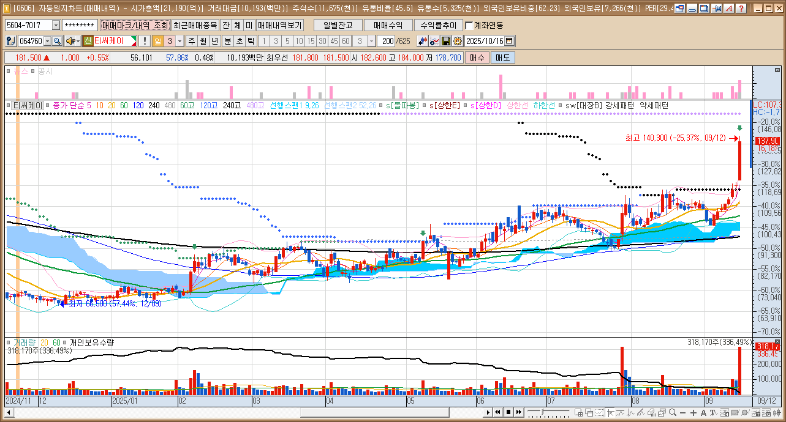
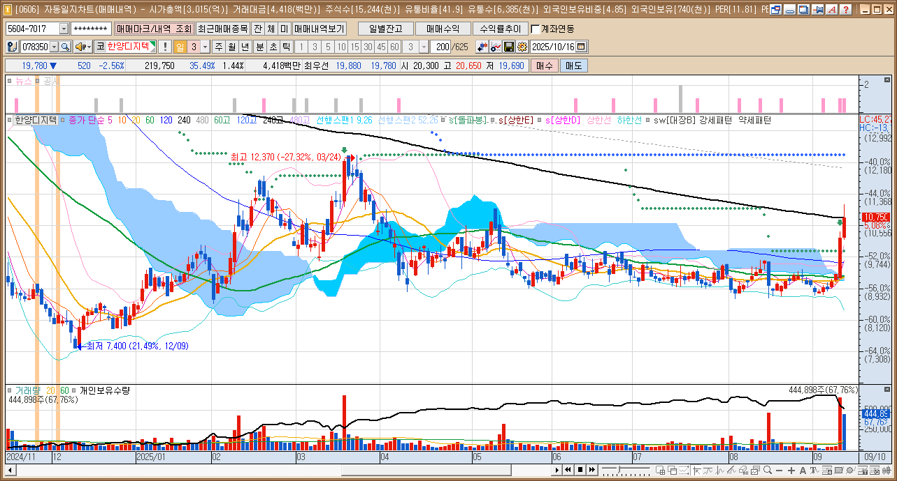

🏠 > [kostock](../../) > [research](../) > [세력개요](./) > `차트_세력탐색1`

<table>
  <tr>
    <td><a href="../"><b>전략연구</b></a></td>
    <td><b href="../세력개요/">세력개요</b></td>
    <td><a href="../세력운영/">세력운영</a></td>
  </tr>
</table>

## 세력차트 3번자리

| 출발 | 패턴 |
|-----|-----|
|  |  |
|  |  |
|  |  |
|  |  |
|  |  |
| | |
|  |  |
|  |  |
|  |  |
|  |  |
|  |  |
| | |
|  |  |
|  |  |
|  |  |
|  |  |
|  |  |
| | |
|  |  |
|  |  |
|  |  |
|  |  |
|  |  |
