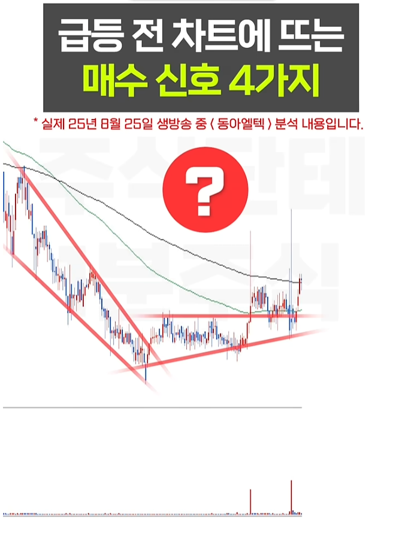
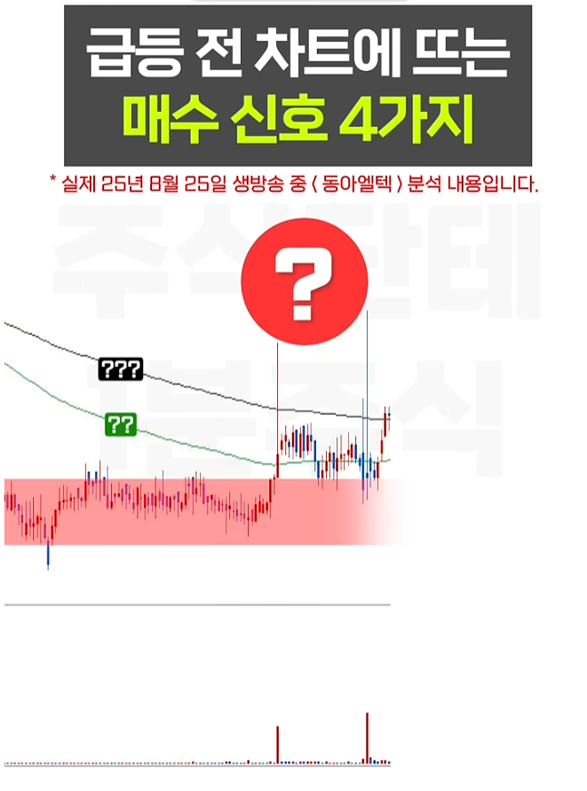
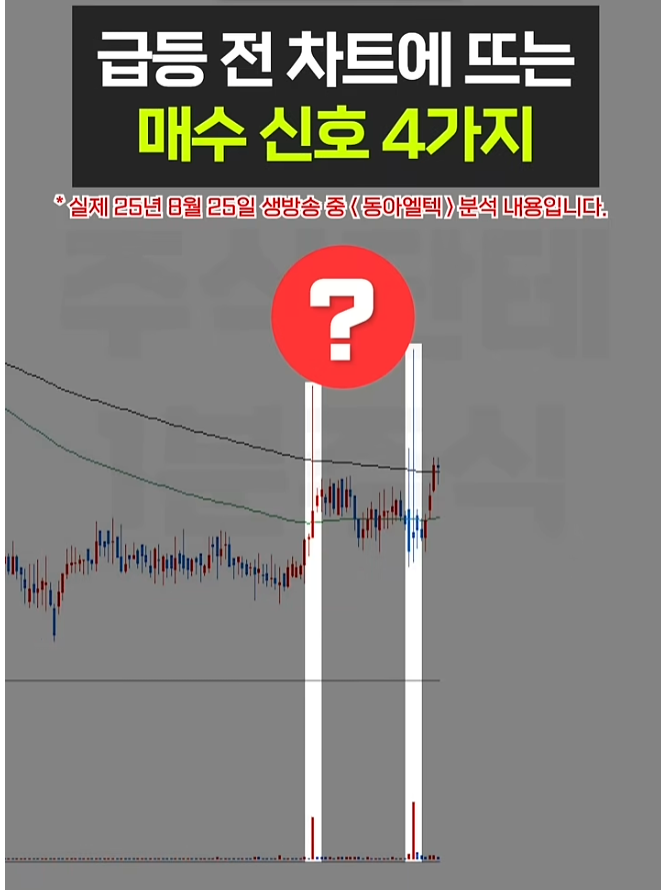
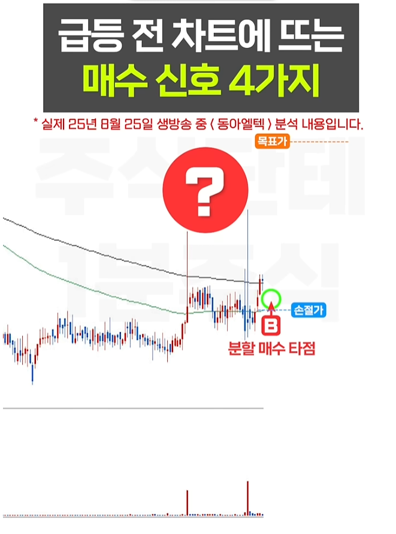
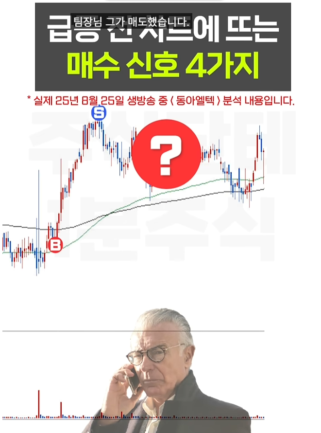
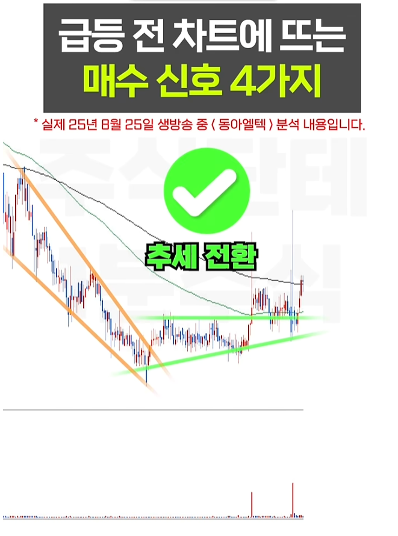
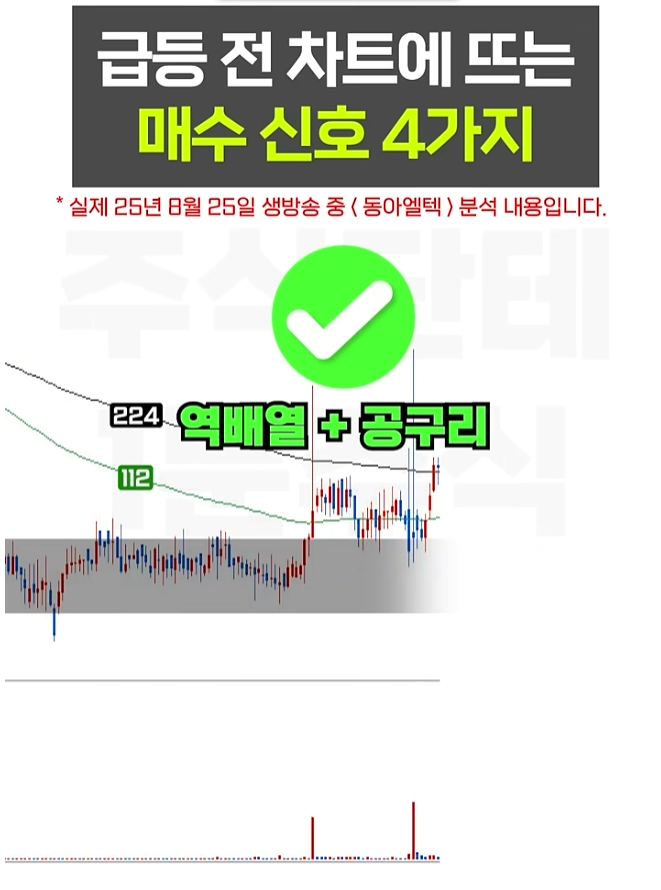
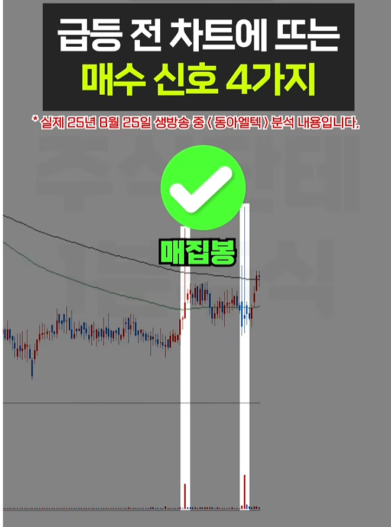
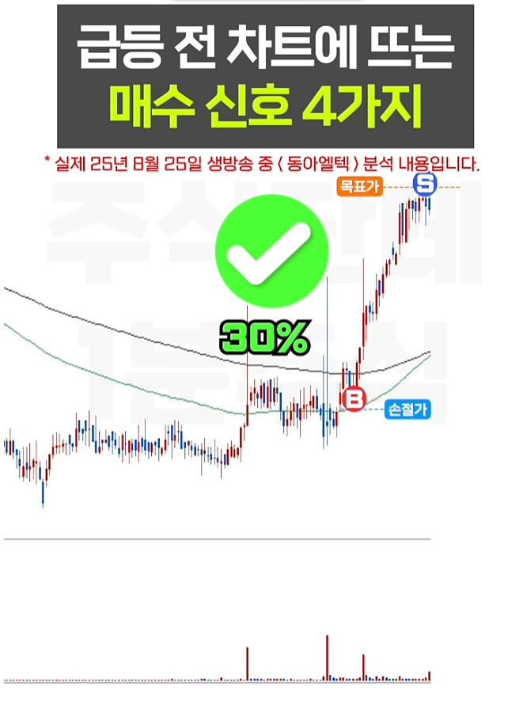
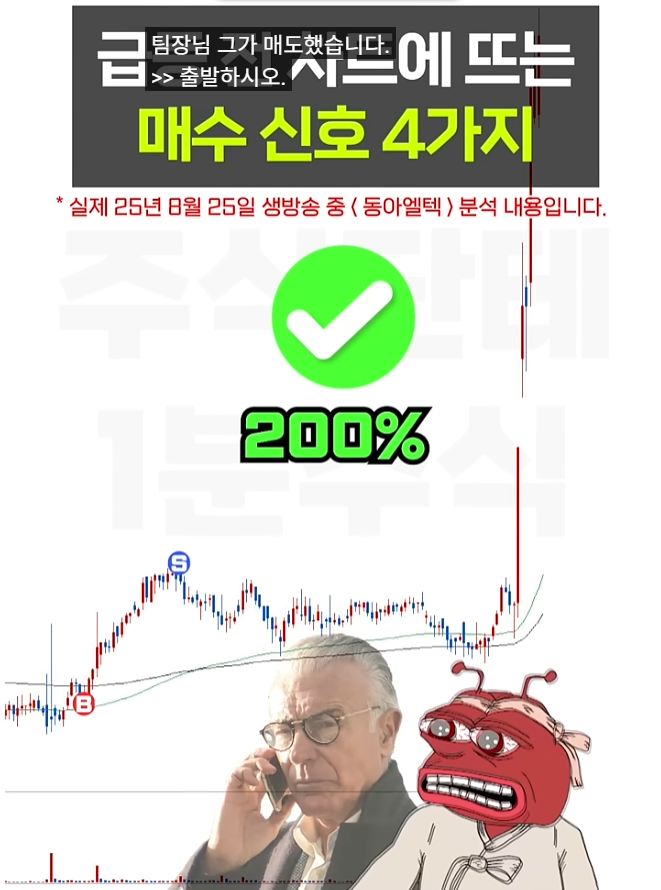

🏠 > [kostock](../../) > [research](../) > [패턴연구](./) > `급등전신호`

<table>
  <tr>
    <td><a href="../"><b>전략연구</b></a></td>
    <td><a href="../기본상식/">기본상식</a></td>
    <td><a href="../세력개요/">세력개요</a></td>
    <td><a href="../세력운영/">세력운영</a></td>
    <td><b href="../패턴연구/">패턴연구</b></td>
  </tr>
</table>

### 급등전 차트에 뜨는 매수신호 4가지
> 개미가 4000%를 못 먹는 이유

 
<table width="900">
  <tr align="center">
    <td><b>Signal.1</b></td>
    <td><b>Signal.2</b></td>
    <td><b>Signal.3</b></td>
    <td><b>Signal.4</b></td>
    <td><b>J-Curve</b></td>
  </tr>
  <tr align="center">
    <td></td>
    <td></td>
    <td></td>
    <td></td>
    <td></td>
  </tr>
  <tr align="center">
    <td></td>
    <td></td>
    <td></td>
    <td></td>
    <td></td>
  </tr>
  <tr align="center" valign="top"> 
    <td><b>추세전환</b> 하락추세선 돌파 (횡보구간)</td>
    <td><b>역배열상</b> 공구리돌파후 지지 (Fake 판별)</td>
    <td><b>매집봉  </b> 최소 2~3개이상 (다다익선)</td>
    <td><b>상한가  </b> 본격적 상승신호 (세력개입)</td>
    <td><b>대상승  </b> 골파기•개미털기 (기간•가격 대칭)</td> 
  </tr>
<table>

- 차트와 호가창에서 **세력의 힘**을 느껴야 한다. 
- 주가를 볼필요 없다. 거래량을 봐라. ⇒ **거래량과 장대양봉** 
- **거래량 증가**는 **세력이 매수**를 했다는 것이다. ⇒ 개인은 거래량을 눈에 띄게 증가 시킬수 없다. 
- **거래량 증가**는 **주가 상승을 위한 시그널**이다. ⇒ 특정구간에서 지지를 받고 거래량 증가
- 세력은 자신의 물량을 **팔기위해 주가를 상승**시킨다. ⇒ 세력은 최대한 비싸게 팔고싶어한다. 
- 고점에서 앞서 매집한 물량만큼 즉 **최대거래량 터지고 하락하면 세력이 털고 나간것**이다. 

 
<table width="900">
  <tr align="center">
    <td><b>Signal</b></td>
    <td><b>차트패턴</b></td>
    <td><b>패턴의미</b></td>
  </tr>
  <tr align="center">
    <td>신호1</td>
    <td></td>
    <td></td>
  </tr>
  <tr align="center">
    <td>신호2</td>
    <td></td>
    <td></td>
  </tr>
  <tr align="center">
    <td>신호3</td>
    <td></td>
    <td></td>
  </tr>
  <tr align="center">
    <td>신호4</td>
    <td></td>
    <td></td>
  </tr>
  <tr align="center">
    <td>대상승</td>
    <td></td>
    <td></td>
  </tr>
<table>

---