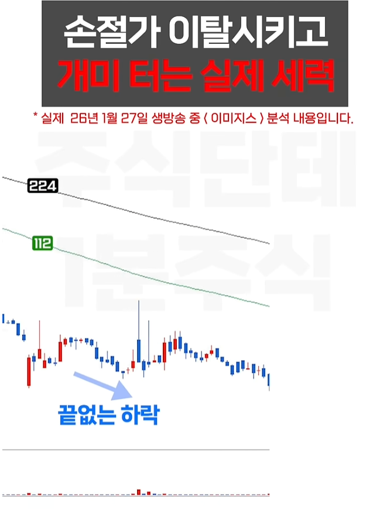
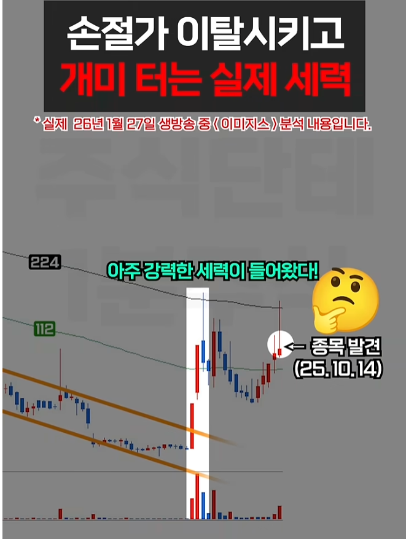
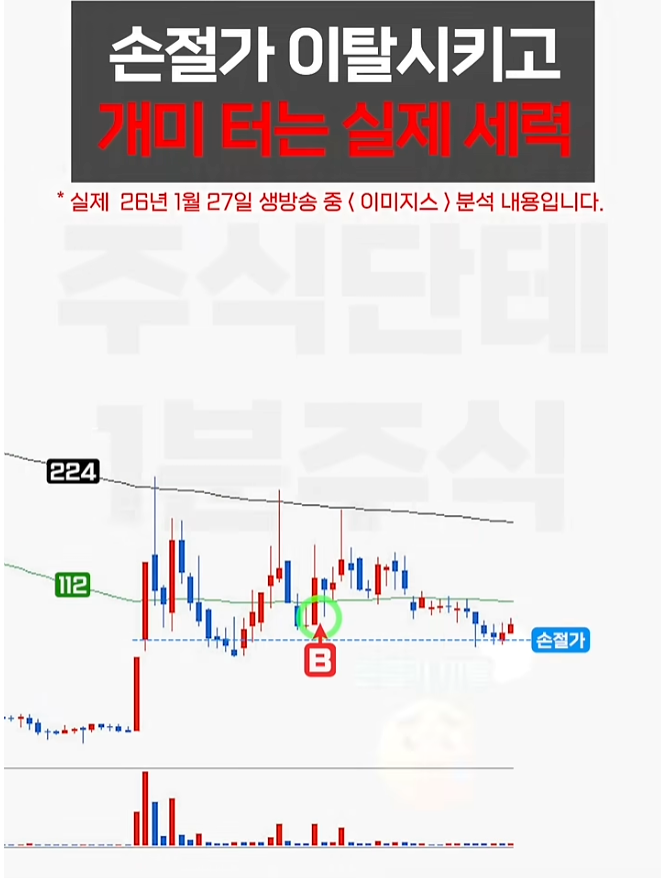
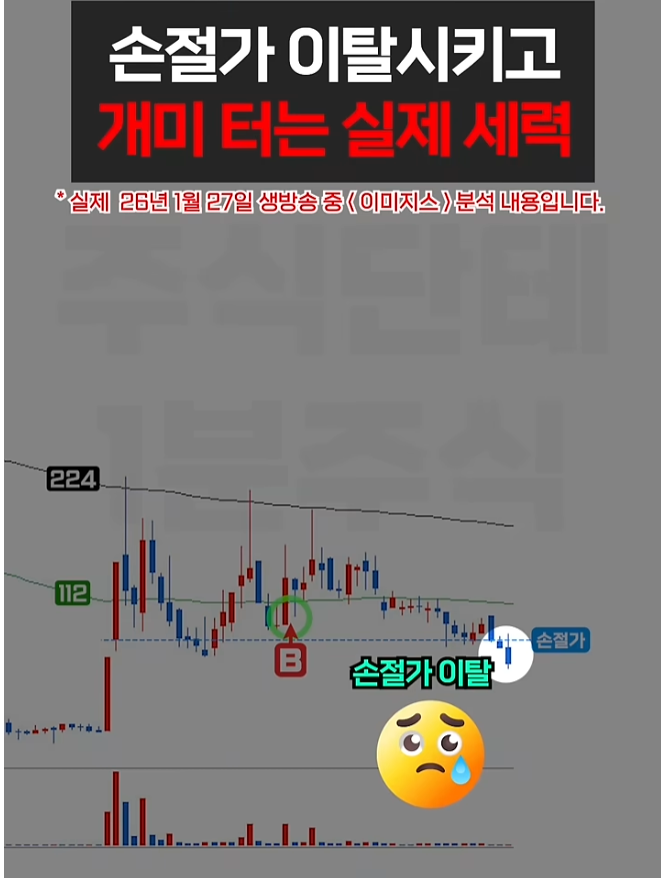
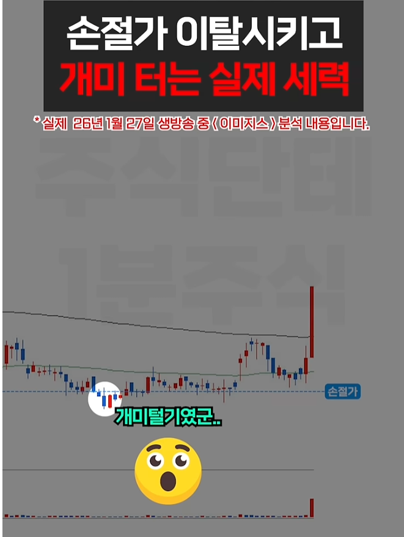
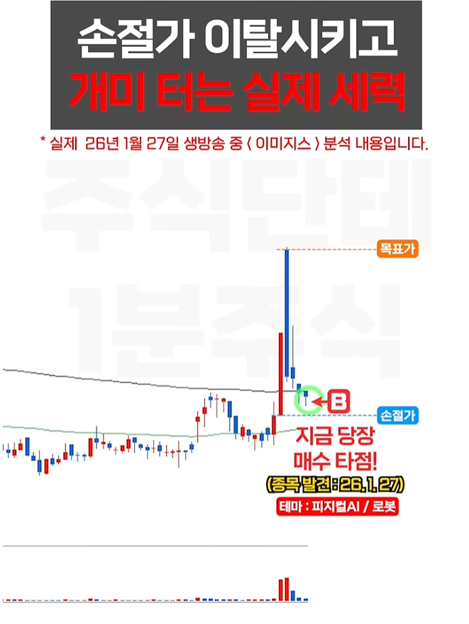
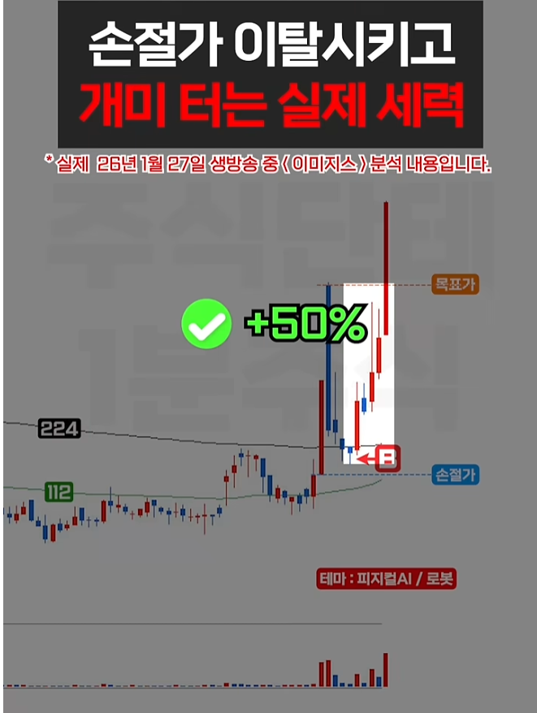
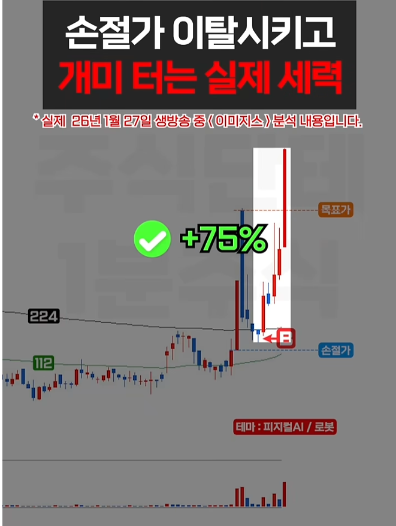

🏠 > [kostock](../../) > [research](../) > [패턴연구](./) > `개미들털기`

<table>
  <tr>
    <td><a href="../"><b>전략연구</b></a></td>
    <td><a href="../기본상식/">기본상식</a></td>
    <td><a href="../세력개요/">세력개요</a></td>
    <td><a href="../세력운영/">세력운영</a></td>
    <td><b href="../패턴연구/">패턴연구</b></td>
  </tr>
</table>

### 개미들 터는 실제 세력
> 손절가 이탈시키며 어떻게 운영하는지 의도파악

 
<table width="900">
  <tr align="center">
    <td><b>Signal.1</b></td>
    <td><b>Signal.2</b></td>
    <td><b>Signal.3</b></td>
    <td><b>Signal.4</b></td>
  </tr>
  <tr align="center">
    <td></td>
    <td></td>
    <td></td>
    <td></td>
  </tr>
  <tr align="center" valign="top"> 
    <td><b>추세하락</b></td>
    <td><b>추세반등</b></td>
    <td><b>횡보구간</b></td>
    <td><b>시간끌기</b></td>
  </tr>
  <tr align="center">
    <td></td>
    <td></td>
    <td></td>
    <td></td>
  </tr>
  <tr align="center" valign="top"> 
    <td><b>박스돌파</b></td>
    <td><b>급등급락</b></td>
    <td><b>물량매집</b></td>
    <td><b>본격상승</b></td>
  </tr>
<table>

- 전형적인 세력들의 운영패턴이다.
- 3번자리전까지는 세력이 들어온후 이탈여부만 체크한다.
- 손절라인기준으로 강한반등이 나온다면 함께 동승
- 세력은 매집한 많은 물량을 떠넘기기 위해서 무조건 가격을 올려야 한다.
- 만약 고점에서 최고거래량이 나온다면 거기가 세력이 물량을 떠넘기는 구간일 확률이 높다.

 
<table width="900">
  <tr align="center">
    <td><b>Signal</b></td>
    <td><b>차트패턴</b></td>
    <td><b>패턴의미</b></td>
  </tr>
  <tr align="center">
    <td>1번구간</td>
    <td></td>
    <td></td>
  </tr>
  <tr align="center">
    <td>2번구간</td>
    <td></td>
    <td></td>
  </tr>
  <tr align="center">
    <td>3번구간</td>
    <td></td>
    <td></td>
  </tr>
  <tr align="center">
    <td>골파기후 상승구간</td>
    <td></td>
    <td></td>
  </tr>
  <tr align="center">
    <td>대상승</td>
    <td></td>
    <td></td>
  </tr>
<table>

---