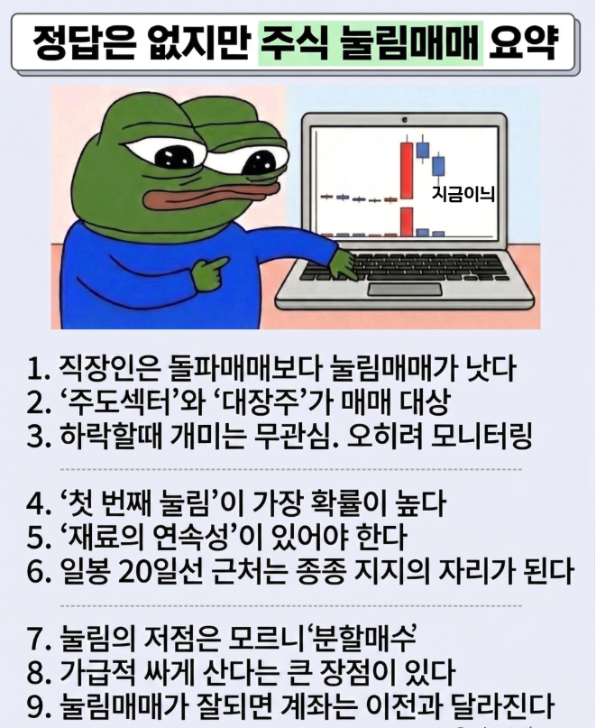
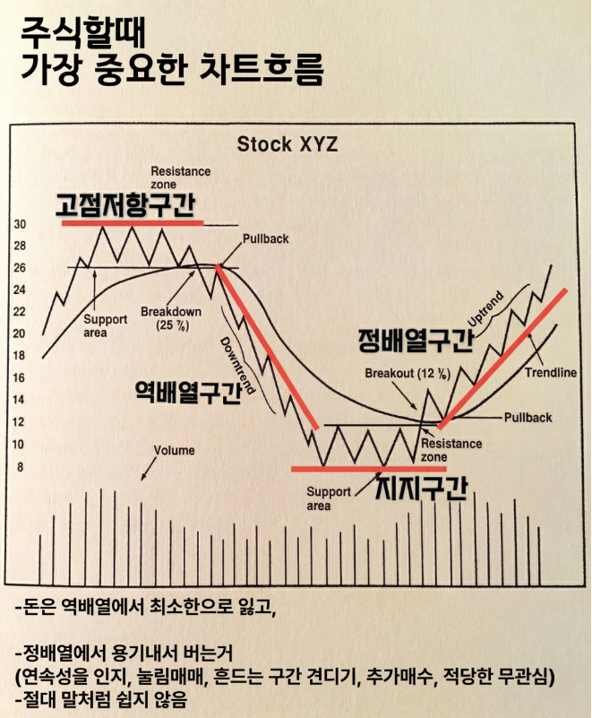
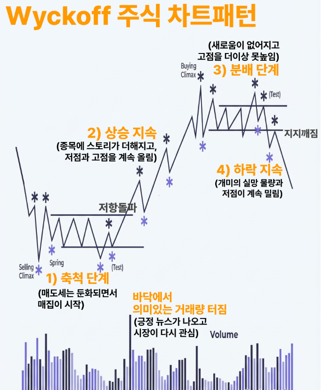
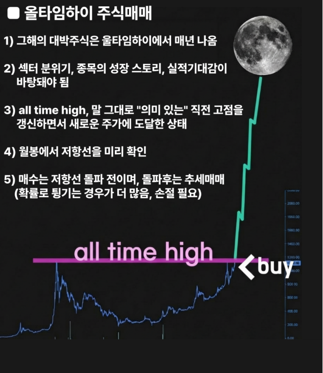

🏠 > [kostock](../../../) > [short-term](../../) > [단타매매](../) > `눌림매매`

<table>
  <tr>
    <td><a href="../">단타매매</a></td>
    <td><b href="../돌파눌림매매/">돌파눌림매매</b></td>
    <td><a href="../볼린저매매법/">볼린저매매법</a></td>
    <td><a href="../스캘핑매매법/">스캘핑매매법</a></td>
    <td><a href="../전일고가돌파매매/">전일고가돌파매매</a></td>
  </tr>
</table>

---
# 눌림매매

### INDEX
- [눌림매매](./눌림매매.md)
- [돌파매매](./돌파매매.md)

---
### 주식눌림매매

- 성급하게 들어가지 말자
- ~작은눌림은 먹어도 작게먹고 손절이 크지만,~ **큰눌림은 손절도 작고 먹을폭도 크다!**
- **확실하게 반등을 확인하고 들어가도 늦지 않다.**
- ~V자 반등은 거의 없다.~ 단, **낙폭에서는 무조건 V자 반등이 바로 나와야 하고, 그렇지않으면 바로 나와야 한다!**

 

[[TOP]](#index)

---
### 쉽지만 중요한 개념

- **시장 인기주가 잠시 숨 고르기 하는 구간** 을 모니터링하는 관찰력이 필요 
    ⇒ **대부분의 개미는 주가가 밀릴 때는 관심을 덜 둔다.** 
- 눌림매매의 단점이 있는데... 종목수가 늘어날 수 있다는점.
- 시장이 뜨거워서 이것저것 오를 땐, **돌파매매**가 낫고  *(1년 중 이런 시기가 있다)*
- 시장이 애매하거나 힘이 없을 땐, **눌림매매**가 편하다.
- **가급적 낮게 산다는 건 매매심리에 꽤 도움이 됨.** 
  - 평단가가 낮다는 거!
  - 먹을때 크게 먹는다!
  - 고점에서 물리면 본전탈출이 목적이 되고, 단타가 강제스윙이 되는 우를 범한다.

 

[[TOP]](#index)

---
### 차트흐름

- **시간이 지나고 남는 건 심플함**이다!
- **역배열에선 돈을 적당히만 잃고**
  - 사실 쉽진 않고.. ~시장에 돈을 뺏기면 계속 매매해서 찾아오고픈 게 사람 심리~
- **정배열에서 돈을벌기.** 용기와 적당한 무관심이 필요. 
  - 실행력이 가장 중요
- 차트도 중요한데...종목이 더 중요. 
  - **'감' '인사이트' '통찰력'** 이런게 결국 종착지 아닌가 싶다. 
  - 감이란 게 결국 **경험이 쌓여서 만들어진 거**
- '산 정상으로 가는 길은 다양하다'
  - **이미 시장에 먹혀왔던 방법을 자신에게 맞게 조정하기.** 
  - 자기만의 서사로 나아가기. 

 

[[TOP]](#index)

---
### 차트의 구간

- **축측단계** : 매도세는 둔화되면서 매집이 시작
- **상승지속** : 종목에 스토리가 더해지고 저점과 고점을 계쏙 올림
- **분배단계** : 새로움이 없어지고 고점을 더이상 못높임
- **하락지속** : 개미의 실망 물량과 저점이 계속 밀림

 

[[TOP]](#index)

---

- 말로만 적는건 쉽다.
- 그냥 5개 종목중에 1개정도가 스페셜하게 잘되면 되고,
- 2개는 무난하고, 2개는 맘대로 안된다. 이게 주식이다!!

 

[[TOP]](#index)

---
