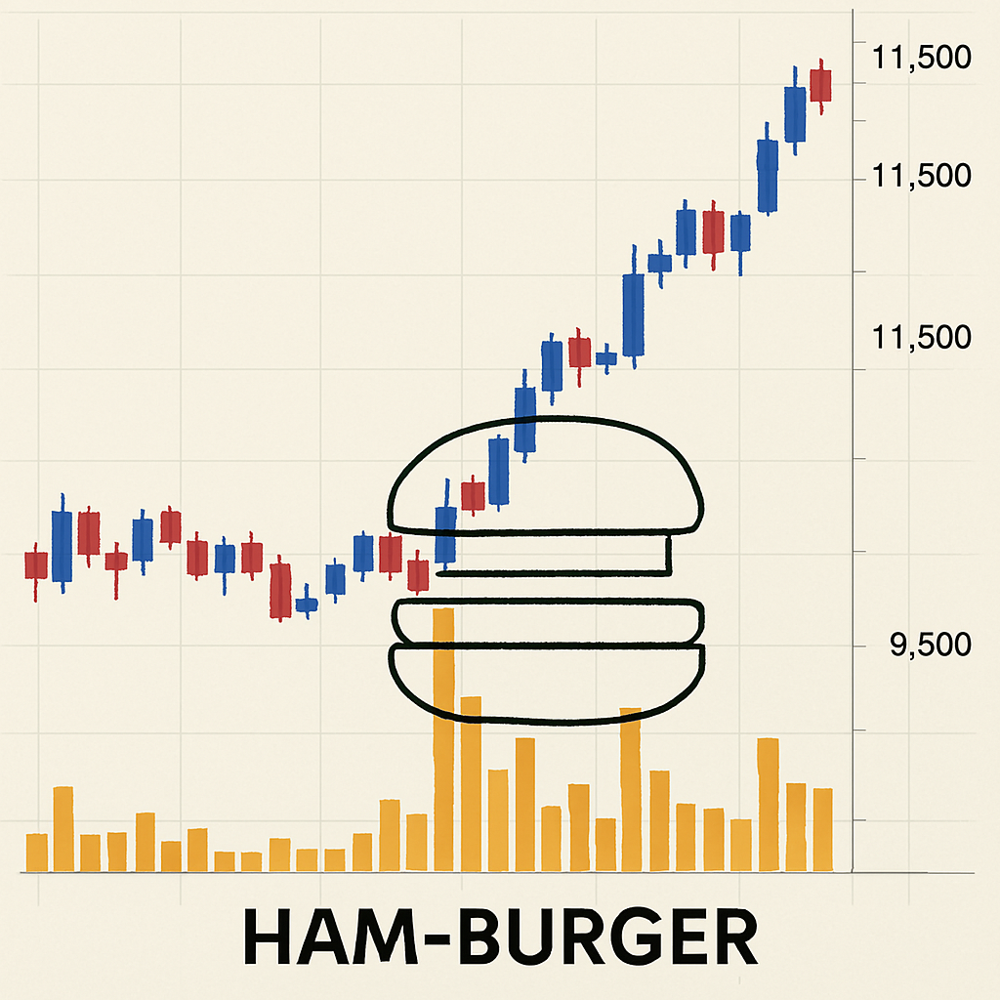

🏠 > [kostock](../../) > [principles](../) > [나만의기법](./) > `기법연구`
<table>
  <tr>
    <td><a href="readme.md">나만의기법</a></td>
    <td><a href="./S1_시간별매매.md">시간별매매</a></td>
    <td><a href="./S2_시스템환경.md">시스템환경</a></td>
    <td><a href="./S3_종목선정.md">종목선정</a></td>
    <td><a href="./S4_단타매매.md">단타매매</a></td>
    <td><a href="./S5_스윙매매.md">스윙매매</a></td>
    <td><a href="./S6_매매복기.md">매매복기</a></td>
    <td><b href="./S7_기법연구.md">기법연구</b></td>
  </tr>
</table>

---
## 7️⃣기법연구

### INDEX
- [데이 트레이딩](#데이-트레이딩)
- [인버스 트레이딩](#인버스-트레이딩)
- [상한가첫눌림 매매](#상한가첫눌림-매매)
- [기준봉눌림 매매](#기준봉눌림-매매)
- [햄버거 매매](#햄버거-매매)

---
### 데이 트레이딩

| 기법 | 분할 | 눌림 반등 (예측)  | 돌파 눌림 (확인)  |
|-----|-----|-----------------|-----------------|
| 전략 | 종목선정 | 장초에는 외봉 눌림, 장중에는 쌍봉 눌림 | 횡보중인 박스권을 돌파 or 돌파후에 눌림지지 확인      |
|     | 손절라인 | 기준봉 시가 이탈시  | 매수봉 시가 이탈시 |
| 매수 | 분할매수 | 2% 하락시 물타기   | 2% 상승시 불타기 |
|     | - 1차 매수 | 비중 20%, 200만  | 비중 50%, 500만 |
|     | - 2차 매수 | 비중 20%, 200만  | 비중 30%, 300만 |
|     | - 3차 매수 | 비중 50%, 500만  | 비중 10%, 100만 |
| 매도 | 분할매도 | 전고점 부근(분봉)   | 전고점 부근(일봉) |
|     | - 1차 매도 | 물타기후 평단부근  | 저항대(전고/VI)  | 
|     | - 2차 매도 | 저항대(전고/RF)   | 추세꺾이면 즉시   | 

 

[[TOP]](#index)

---
### 인버스 트레이딩
- 시장이 좋지 않고, 매매할 종목이 없는 날은 현금을 보유하는 것도 매수의 한 방법이다.
- 그래도 매매하고 싶다면 지수종목을 매수하자
- 인버스 종목
  - [KODEX 인버스]
  - [KODEX 코스닥150선물인버스]
  - [KODEX 미국나스닥100선물인버스]
  - [KODEX 미국달러선물인버스2X]: 환률하락시 더블로 상승
- 레버리지 종목
  - [KODEX 레버리지]

 

[[TOP]](#index)

---
## 상한가첫눌림 매매
> - 최근상한가 종목중에서 첫눌림구간을 공략하는 단타스윙 (1주이내)
> - 차트에서 수신관리자 만들기 ⇒ 📉[수식관리자](../수식관리자/기법_상한가첫눌림.md)

| 단계 | 매매기법 |
|-----|-----|
| 종목 | 최근상한가 종목 or 장대양봉 종목을 관심종목에 저장 |
| 매수 | 기준봉의 중간값 아래에서 **스토캐스틱슬로우(20,10,20) 과매도구간**을 이탈후 첫상향돌파 |
|     | 30분봉 차트에서 상한가눌림 포착신호 확인 후, 종가에서 매수 |
| 매도 | **기준봉의 (H+L)/2** 에 매도선을 긋는다.   cf. 대략 **17.5% 상승** 지역 |
|     | 1차 매도: 매도선 부근의 라운드피겨값 1~2호가 아래에서 절반 익절 |
|     | 2차 매도: 상승후 추세가 꺾이는 지점에서 전량 매도 (5일선이탈시 or 거래량터진후 첫음봉) |
<!-- 
- 매수
  - 최근상한가 종목 or 장대양봉 종목을 관심종목에 저장 
  - 기준봉의 중간값 아래에서 스토캐스틱슬로우(20,10,20) 과매도구간을 이탈후 첫상향돌파
  - 30분봉 차트에서 상한가눌림 포착신호 확인 후, 종가에서 매수

- 매도
  - 기준봉의 (H+L)/2 에 매도선을 긋는다. 대략 17.5% 상승지역
  - 1차 매도: 매도선 부근의 라운드피겨값 1~2호가 아래에서 절반 익절
  - 2차 매도: 상승후 추세가 꺾이는 지점에서 전량 매도 (5일선이탈시 or 거래량터진후 첫음봉)
-->

- 상한가 매매법
  - 매매횟수가 많지는 않지만, 포착되면 2~3일 안에 승부

- 상한가매매 조건4가지 
  - **1. 시장**
    - 미국장 급락 => 국장은 갭하락
    - 갭하락 이후 양봉이 나올 확률이 많음
    - 미국장이 -3%이상 급락한 다음날 기준으로 잡는다.
  - **2. 기업**
    - 상한가 종목중, 저평가 종목은 추가상승확률이 높다
  - **3. 차트**
    - 주봉상에서 전고점 돌파
    - Good !!
  - **4. 재료**
    - 지속적 상승나올수 있는 재료인지 파악
    - 테마주이면 신뢰도가 더 높다.
  - 수익목표 : 10%~15%이상

- Wrap Up

| 기준 | 상한가매매법 |
|------|------------|
| 1.시장 | - **미국 증시가 -3%이상** 급락한 전날 **"상한가 종목"**   - 기업의 아무 악재 없이 시장 때문에 저렴한 구간 형성 ! |
| 2. 기업 | - 상한가를 쳤음에도 **저평가**가 되고 있는 기업!   - 상한가 간 뒤 **시총과 기업의 순현금이 비슷**   - 시장에 Hot한 테마, 종목이 저평가가 되기는 쉽지 않음   - 상한가 쳤음에도 불구하고 PER, PBR도 저평가 상태 |
| 3. 차트 | - **전고점 첫 돌파 패턴** 등등   - 추가 상승이 나올 수 있는 차트 패턴을 가지고 있어야 한다. |
| 4. 재료 | - **상승이 추가적으로 나올수 있는 "재료 & 이슈"** |

 

[[TOP]](#index)

---
## 기준봉눌림 매매
> 괜찮은 장목을 발굴해 놓고 눌림목이 나온다면 어떤 시점에 들어가겠다라는 시나리오를 미리 짜져 있는 상태에서 매매

<b>(1) 원칙</b>
- 눌림목 매매
  - 떨어지지 않으면 절대 매매하지 않는다
- 종목발굴법
  - 주봉, 월봉 Good!  첫돌파
  - 재료 파악
- 매매타이밍
  - 눌림목이 나오면 매수
- 매매횟수가 많지 않으면서 더 큰수익 

<b>(2) 실전</b>
- 주봉상에서 
  - 전고점 돌파하는 역망치 캔들
  - 한번도 돌파하지 않는 이평선(10/20/60)을 종가상 돌파하는 역망치 캔들
  - 몸통안에서 매수
- 일봉상에서 
  - 전고점을 돌파하는 자리에서 지지하면 매수
  - 일봉상 중요한 라인을 지지 
  - 주봉의 박스하단에서 갭하락하지 않으면 매수
- 분봉상에서 
  - 쌍바닥을 찍고, 이평선을 돌파후 지지할 때 종가에서 매수
  - 일봉상에서 중요한 라인을 잡았다면, 60분봉상에서 다시 잡고
  - 60분봉상에서 중요한 라인을 잡았다면, 3분/5분 자리에서 다시 매수타점을 잡는다.
  - 분봉상에서 바닥을 찍고 반등 or 그동안 돌파하지 못했던 주요 이평선을 돌파하는 자리에서 매수
  - 몸통을 벗어나면 매매하지 않는다. 
- 손절 및 익절
  - 흔들리지만 주봉의 몸통을 벗어나지 않으면 버틴다
  - 거래량이 터지면서 급등하면 매도 
  - 보통 1~3일이내에서 매도타점이 나옴 (5%~10%)

 

[[TOP]](#index)

---
## 햄버거 매매
> [불개미&대왕개미]님의 유튜버에서 언급한것을 나름 생각하며 정리  
> • 1분봉 거래대금 차트에서 특정 구간마다 거래량이 뭉치며 위·아래로 층을 이루는 형태   
> • 이 모습이 마치 빵(위·아래)과 패티(중간 거래량 뭉침)가 겹겹이 쌓인 햄버거 구조와 유사  

- 햄버거매매의 특징 

| 구분 | 전략 | 장점 | 위험 |
|-----|-----|------|-----|
| 대장주 매매 | 테마의 중심 종목 매수 | 안정적, 갭상승 가능성 큼 | 진입 타이밍 놓치면 기회 제한 |
| 후발주 매매 | 대장주 급등시 따라붙는 종목 매수 | 단기 급등 가능성 | 대장주 하락시 급락 위험 | 
 

- 햄버거매매의 적용 및 유의사항 
  - 데이트레이딩에서 적용 (일봉X, 스윙X)
  - 대장주 위주 매매
    - 테마주가 움직일 때는 웬만하면 대장주를 공략
    > → 대장주는 상한가에 도달하면 다음날 갭 상승을 줄 가능성이 높다.
  - 후발주(이등주·삼등주) 매매 조건
    - 대장주가 너무 빨리 상한가에 도달해 기회를 주지 않을 때만 후발주를 공략
    > → 하지만 대장주가 조금만 흔들려도 후발주는 크게 무너질 수 있어 위험
  - 갭 상승 종목 주의
    - 전날 시간외 거래에서 크게 오른 뒤, 다음날 또 갭을 띄운 종목은 매매하지 않는 것이 원칙
    > → 변동성이 크고 위험하기 때문
 

- 종목 선정 기준

| 선정기준 | 상세내용 |
|---------|--------|
| 테마 강도 | 뉴스, 정책, 이슈로 인해 강하게 움직이는 테마가 있는지 확인   → 예: 로봇, AI, 원전, 정치 관련주 |
| 대장주 확인 | 테마 내에서 가장 먼저 움직이고 거래량이 몰리는 종목   → 대장주가 햄버거 패턴을 만들면 신호 강함 |
| 거래량 집중 | 1분봉 기준으로 거래량이 중앙에 뭉쳐 있는지 확인   → 위·아래 거래량이 얇고, 가운데가 두꺼우면 햄버거 패턴 |
| 호가창 흐름 | 매수세가 강하게 들어오는지, 호가창이 밀리지 않는지 체크   → 실전에서는 호가창이 가장 중요한 판단 기준 중 하나 |
 

- 햄버거매매 차트예시
<table width="600">
  <tr>
    <td width="300" align="center">
      
    </td>
    <td valign="bottom">
      <ul>
      <li> 위·아래 빵(얇은 거래량)   
      → 초반과 후반에 거래량이 상대적으로 적음  
      <li> 가운데 패티(두꺼운 거래량)   
      → 특정 시점에 거래량이 집중되며 강한 매수세가 들어옴  
      <li> 결과   
      • 이 구간을 돌파하면 단기 급등 가능성이 커서 단타 매매에 활용됨  
      <li> 적용방법   
      • 햄버거가 만들어는 조짐이 보이면 매수 (횡보구간 박스권 첫돌파 & 강한수급)  
      • 햄버거가 최대로 커지는 지점에서 매도 (거래량감소 & 음봉)  
      • 햄버거가 완성되면 굳굳바이 !!! 
        
      </ul>
    </td>
  </tr>
</table>
 

- 햄버거매매 일지작성
> 햄버거매매는 단타중심이기 때문에 빠른복기와 반복학습이 중요

❶ 기본 항목 기록 

| 항목 | 내용 |
|-----|-----|
| 날짜 | 매매한 날짜 |
| 종목명 | 매매한 종목 |
| 진입가/청산가 | 매수·매도 가격 |
| 수익률 | 실현 손익과 수익률 |
| 거래량 패턴 | 햄버거 패턴 여부 (O/X) |
| 대장주 여부 | 해당 종목이 테마의 대장주인지 |
| 매매 이유 | 진입 근거 (패턴, 뉴스, 수급 등) |
| 복기 | 잘한 점 / 개선할 점 |

❷ 패턴 캡처

  - 1분봉 차트에서 햄버거 패턴이 보이는 구간을 이미지로 저장해두면 복기에 큰 도움이 된다.

❸ 실수 기록

  - 손실이 났을 경우, 왜 손실이 났는지를 구체적으로 기록
  - 예: “대장주가 흔들렸는데 후발주에 물림”

 

[[TOP]](#index)

---