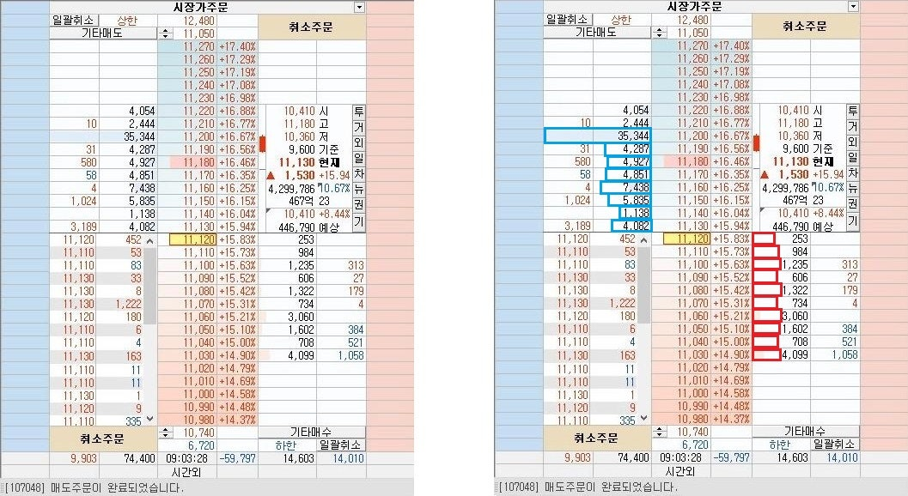
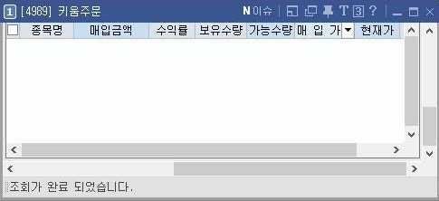

🏠 > [kostock](../../) > [principles](../) > [나만의기법](./) > `기법연구 | 주식단테`
<table>
  <tr>
    <td><a href="readme.md">나만의기법</a></td> 
    <td><a href="./S0_기준원칙.md">기준원칙</a></td>   
    <td><a href="./S1_시간별매매.md">시간별매매</a></td>
    <td><a href="./S2_시스템환경.md">시스템환경</a></td>
    <td><a href="./S3_종목선정.md">종목선정</a></td>
    <td><a href="./S4_단타매매.md">단타매매</a></td>
    <td><a href="./S5_스윙매매.md">스윙매매</a></td>
    <td><a href="./S6_매매복기.md">매매복기</a></td>
    <td><a href="./S7_기법연구.md">기법연구</a></td>
  </tr>
  <tr>
    <td colspan="9" align="right">
       <a href="T0_KDarwin.md">[케이다윈]</a> |
       <a href="T1_차트영웅.md">[차트영웅]</a> |
       <b href="T2_주식단테.md">[주식단테]</b> |
       <a href="T3_대왕개미.md">[대왕개미]</a>
    </td>
  </tr>
</table>

### INDEX
- [1️⃣ 즉문즉답 1편](#1️⃣-즉문즉답-2편)
- [2️⃣ 즉문즉답 2편](#2️⃣-즉문즉답-2편)

---
## ▶️나주다 미모사님의 즉문즉답

<u>모두 데이트레이딩 기준입니다 </u>

---
### 1️⃣ 즉문즉답 2편

▶️ 종목알람은 어디서 어떻게 하신다는 건지요?
- [0198]실시간 종목 조회 순위 와 
- [0193]변동성완화장치 발동종목과 
- **전날 정리한 관심종목** 을 이용하여 주로 종목을 찾습니다

---
▶️ 손절 타이밍을 어떻게 잡아야할까요
- 시장 상황과 매매에 따라 다르게 손절을 치는 편이에요
- 돌파의 경우 그 봉의 1분봉 시가를 이탈하면 자르기도 하고,
- 눌림을 받는다면 단기 전저점을 이탈하면 자르기도 하고,
- 이 종목에 당장 수급이 들어와야 하는 상황인데 그렇지 않으면 바로 손절하기도 하고,
- 기준을 상황마다 다르게 적용하지만 **공통적으로 짧게 손절을 치려고 하는 편** 입니다

---
▶️ 자신 있는 곳에 비중 베팅 할 수 있는 근거가 궁금합니다. 그 자신 있는 곳이라는 곳에서 한 번 맞으면 크게 털리기도 하는건지도 궁금합니다
- 트레이더마다 자신 있는 매수 타점이 다릅니다. 제 기준에서 확률이 90%이며 **손절을 1-2%에서 끊어낼 수 있는 지점에서는 비중 베팅** 을 합니다. 다만 **시장에서 강한 종목에 한해서** 입니다
- 그리고 비중베팅에 실패할 경우, 손실금은 크지만 실패할 확률 자체는 낮기 때문에, 다음에 또 좋은 자리에서 비중베팅을 하여 손실을 수익으로 돌립니다

---
▶️ 일반 비중 할 때와 비중 베팅 할때에는 몇 배 정도 차이나게 진행하시나요?
- 일반 비중이 심리적으로 편한 금액이라면
- 비중베팅은 보통 위의 3배~5배 정도 들어갑니다
​
---
▶️ 한 가지 질문 드리자면 광기의 시작을 기준으로 잡는 판단 기준이 있으실까요?
- 현재 시장에서 독보적으로 강하고, **모든 시장 참여자들이 보고 있는 종목**이라는 전제가 중요합니다
- 제가 작성했던 광기를 먹는 방법 글에 나온 차트 처럼
- 밀리지 않고 고점을 지속적으로 뚫어주며, 거래대금을 크게 터뜨리며 탄탄하게 올라가고,
- 오늘 등락률 상 오를 수 있는 폭이 아직 많이 남아 있을 때 광기가 시작될 수도 있겠구나 생각합니다
​
---
▶️ 호가창이 중요한가요? 호가창을 좀 설명해 주시면 감사하겠습니다
- 매매하는 스타일에 따라 다른데, 주도주를 매매하는 제 입장에서는
- **중요한 돌파 구간에서 매수세가 강하게 들어오는지 그것만 확인**합니다
- 제일 중요한 순서대로 나열하면
- **시장 상황 > 테마(개별 종목)의 강도 > 일봉 > 분봉 흐름 > 호가창** 

| 상승할 때의 흔한 호가창 |
|:---:|
|  |

- 보통 위와 같은 호가창처럼
  - 호가창이 빼곡하며 특정 가격에 매도물량이 크게 걸려있고, 나머지 호가들은 평범하며
  - 호가창이 비어 있지 않게 형성되어 있는 호가창을 상승하는 좋은 호가창이라고 합니다. 
- 실제로 주가가 상승할 때 위와 같은 호가창이 형성되는 것은 맞지만,
  - 호가창의 배열 상태가 안좋다고 하더라도, 당장 상승하기 시작하면 좋은 호가창 배열로 바뀝니다
- 호가 스캘을 하시는 트레이더분들을 제외하고는, 
  - **호가창이 아닌 시장 상황, 테마(개별 종목)의 강도, 일봉, 분봉 흐름** 을 중점에 두고 매매하시는게 좋습니다 
  - 초보 시절 호가창에 비밀이 있는 줄 알고 호가창만 파서 시간 날린 1인 여기 있습니다 또륵

---
▶️ 낙주잡고 매도하는 기준이 있으실까요?
- 낙주로 매수를 하게 되어 목표 수익실현 구간은 **단기적으로 저항이 있어 보이는 곳을 목표로 매도**치려 하지만
- 요새는 **적당히 2-3% 이상 되면 분할 매도** 하는 편입니다
- 욕심 내면 다 날리게 되더라구요
- 그리고 예수금의 얼마정도를 낙주로 들어가는지 여쭤보셨는데
- 마음 편한 금액까지만 매수하시는 것이 좋습니다
- 낙주 잡다가 투매를 또 맞게 되면 손실률이 순식간에 커지기 때문에 타격 없을 만큼의 금액만 매수하시는 것을 추천드립니다

---
▶️ 독학이실지요? 낙주매매는 호가가 중요할까요? 
- 불개미님, 트레이더김씨님, 리버스페스님, 고라니주식님, 베짱이인생님, 성이님 등 훌륭하신 선배님들 강의 또는 관점 글을 보고 공부하였습니다
- **검증된 고수분들의 강의와 관점** 글을 보고 공부하셔야 올바른 관점을 가지고 **[지름길]**로 갈 수 있습니다
- 개인적으로 낙주매매에서 호가창을 많이 보는데, 매수하려는 구간에서 호가가 밀리지 않는 걸 확인하려고 합니다

---
▶️ 자기와 궁합이 맞는 종목이 있는지요?
- 본인의 매매 스타일로 수익내기 어려운 종목들이 있습니다
- 종목의 움직임도 고려해서 궁합이 맞고 안 맞는 종목들이 있어요
- 트레이더의 매매 스타일마다 다릅니다
- 평소 궁합이 안맞던 종목이다 싶으면 비중을 줄여서 들어가기도 합니다
​
---
▶️ 소액으로 잘 갈고 닦아 금액으로 커졌다는데 첫 출발할때 예수금이 얼마였는지요? 경력이랑 시작 시드가 궁금합니다
- 다시 정확히 확인해봤는데
- 20년 4월부터 트레이딩을 시작했습니다
- 할 줄 몰라서 소액으로 매매하며 7달 동안 연구해보다가
- 주식도 잘 하는 분의 관점을 배워야 답이 나오겠구나 싶어서 선배님들의 관점을 공부해보다가,
- 21년 6월에 알바하고 남은 돈인 98만원을 입금해서 다시 시작했습니다
- 돈이 없어서 추가 입금은 못 했고, 저 돈이 시작 시드입니다
- 각자의 매매 포지션에서 바른 관점으로 공부를 하신다면, 
- 시드머니는 중요하지 않다고 생각합니다
- 오히려 소액으로 시작을 하셔야 멘탈이 덜 흔들린 상태에서 공부를 꾸준히 하실 수 있기 때문에,
- 꼭 소액으로 시작하시는 것을 추천드립니다
​
---
▶️ 올려주시는거 항상 잘 보고 있어요 ㅎㅎ 승률보단 손익비로 승부하는 전략이신거죠
- 트레이더마다 다르지만 저는 **손익비를 더 중요**하게 생각합니다
- 특히 시장이 안 좋을 경우, 승률이 현저히 떨어질 수 있는데 
- 이때는 **손익비와 비중 조절에 따라** 계좌의 플러스 마이너스가 결정납니다
- 시장이 안 좋더라도 한 번씩은 [강한 종목]이 나오길 마련인데, 이때는 **비중을 실어 손익비를 극대화** 하는 것을 목표로 합니다
​
---
▶️ 강한 종목이라는게 상승률 상위를 말씀 하시는건가요? 아니면 거래대금 상위를 말씀 하시는건가요?
- 장이 종료된 상태에서, 결과적으로는 둘 다에 해당될 것입니다
- 매수를 생각하고 있을 시점에는, **1분당 거래대금**이 다른 종목보다 많이 터지고 있을 것이고, 상승률이 엄청 높지는 않은 상태일 거예요
- **평소에도 인기 있던 종목이 신고가**를 뚫으려고 하거나, 뚫고 올라와서 신고가에서 움직이고 있을 때
- 오늘도 강하겠구나 생각하고, 시나리오를 생각하고 매수 타점을 잡아 들어갑니다
- 최근에 거래대금이 크게 터지며 상승률도 높아 모든 시장 참여자들이 보던 에코프로머티, LS머트리얼즈 같은 종목을 강한 종목으로 생각합니다
- 7월 기준으로는 에코프로 시리즈, 포스코 시리즈, 금양 등이 있습니다
​
---
▶️ 특정일과 비교해서 미모사님 거래금액이 크게 줄은것은 시장의 주도 종목이 없기 때문인가요?
- 네 시장에서 강한 종목이 없었기 때문입니다
- 주도 종목이 아니라면 같은 타점이라도 확률이 떨어지기 때문에 소액으로 매매합니다
- 종목 상관 없이 일정한 금액으로만 매매를 하신다면, 승률과 손익비가 떨어질 수 있습니다
​
---
▶️ 강한 종목이란 최근의 신규상장주로써 시장의 거래대금을 독식했던 종목들을 말씀하는것인가요? 대표적인게 에코프로머티와 그외 두산로보틱스 포함해서요?
- 네 맞습니다 그런 종목들이 있을 때만 비중을 크게 늘려서 매매하고, **평소에는 편한 금액으로만** 매매합니다
- 시장이 빠지는데 주도 종목도 없다면 편한 금액보다도 비중을 더 낮춰서 매매합니다
​
---
▶️ 실패의 과정을 거치셨나요? ㅠㅠ 강한 종목 선정에 대한 팁이 궁금합니다..!
- **주식은 어느정도 실력이 되어야 수익낼 수 있다**고 들었기에 경험을 쌓고자
- 처음에는 단주 혹은 10만원 매수 이런 식으로 매매했습니다
- 그래서 깡통을 찬 적은 없습니다. 애초에 돈이 없기도 했습니다ㅎㅎ
- 다만 처음 주식 시작하고 공부하던 33개월 정도는 이게 잘하고 있는건지 헤매긴 했습니다
- **[강한 종목]**은 
  - **시장 참여자들이 모두 보고 있을 만한** 종목입니다
  - **강한 재료 혹은 강한 테마에 속해 있는 1등주**이며, 
  - 현재 **1분당 거래대금이 다른 종목에 비해 독보적으로 많이 터지고**,  
  - **신고가를 돌파하려는 종목 혹은 신고가에서 움직이는 종목**을 좋아합니다
​
---
▶️ 강한종목 선정은 어떻게 하세요? 장 시작 후 강하다 생각해서 매수했는데 시간이 지나면서 거래량 끊기는 걸 많이 봐서요
- 평소 시장 참여자들 모두가 좋게 보던 종목이 
  - 신고가를 뚫거나, 신고가를 뚫으려고 할 때의 모습, 그 전후로 터지는 거래대금이 많을 경우 오늘 이 종목이 강하겠구나 생각하고 종목을 선정합니다
  - 종목이 고점을 찍고 내려오기 시작하면 거래량이 자연스레 줄어듭니다
- 반대로 강하다 생각해서 매수한 후, 
  - 어느정도의 상승을 하지도 않았는데, 거래량이 줄어들며 주가가 빠지면, 
  - 수급이 다른 종목이나 테마로 이동했을 가능성이 높습니다
  - 그러면 제가 선택한 종목이 시장에서의 주도권을 뺏긴 것으로 판단하고 매도하는 편입니다
  - 그러한 상황이 아니라면, 종목이 힘을 잃었다고 판단하고 계획해 둔 손절라인 이탈할 경우 손절합니다
- 다른 테마로 수급이 이동되었나? 궁금하시다면 키움증권 기준 **[0198]실시간 종목 조회 순위** 를 참고하시면 편합니다
  - 다만 저 창을 참고하며 순위권에 있다고 무작정 매수하시면 손실 확률이 매우 높으니 주의 하셔야 합니다
​- 특히 강한 종목 선정 방법들에 대한 고민을 많이 하셨는데
  - 매일 시장을 정리하고, 거래대금이 많이 터진 종목이나 테마에 대해 공부하다 보면
  - 자연스레 강한 종목이란 무엇인지 알게 됩니다
- 시장 정리에 대한 추천드리는 공부 방법으로는
​  - 나주다 카페의 '디선'님 '지니어스G'님 '레드니케'님 '마카오박'님 등 여러 선배님들의 게시글 중 보시기 편한 선배님을 구독 클릭하시고 알림 뜨면 글에 들어가서
  - 당일 거래대금이 크게 터진 종목들의 급등 이유, 간략한 시장 상황에 대해 정리하시면 좋습니다
​- 또한 나주다 카페의 수많은 고수분들의 글, 네이버 블로그 '리버스페스'님의 글을 보며 선배님들의 관점을 공부하시는 것이 도움이 많이 됩니다

 

[[TOP]](#index)

---
### 2️⃣ 즉문즉답 2편

---
▶️ 주도주 찾는 방법이 궁금합니다
- 키움증권 기준 실시간종목조회창[0198]으로 시장을 구경하다가
- 현재 시장 테마에 맞는 종목이거나 개별적으로 **좋은 뉴스를 달고 올라온 종목이 거래 대금을 크게 터뜨릴 때,**
- 특히 **신고가 부근이거나 신고가를 돌파할 때 거래대금이 터지고 있으면** 주도주가 될 수 있겠구나 생각합니다

---
▶️ 실시간종목조회창[0198] 활용방법
- 보통은 [0198]으로 시장을 구경하다가 제 원칙에 부합하는 종목이 있다면 매수를 계획합니다
- 평소에는 [0198] 창을 통해 어떤 종목이나 테마에 수급이 쏠리는지 구경합니다
- 꼭 매수해야지! 생각으로 보면 뇌동매매로 이어지기에
- 시장을 구경하는 느낌으로 보시는 게 좋아요~

---
▶️ 모니터 모델명 알 수 있을까요
- 모니터 모델명: ls34j550wqkxkr
- 21년도에 307,720 원에 구매했고, 한 대만 써요
- 모니터는 잘 모르는데 저처럼 모르시는 분들 계실까봐 말씀 드리는데~
- 모니터가 크면 hts에 창 많이 띄울 수 있는 줄 알고 대형 fhd 모니터 샀었는데, fhd면 화면 크다고 창 많이 띄울 수 있는게 아니더라구요
- 그래서 위의 모델인 와이드 qhd 사용하고 있어요
- 창 공간이 조금은 부족한 느낌인데 그래도 잘 쓰고 있습니다

---
▶️ 메이저리그(큰 손, 대형 주도주, 이를테면 최근 두산로보틱스, 에코프로머티)에 처음부터 익숙해지는 것이 유리할지, 마이너리그(일반, 기타수익주)에서 익숙해져서 메이저로 진입하는 게 맞는지요?  
제 생각에는 각 리그의 성격이 달라서 마이너에서 1등이라고 메이저에서 좋은 성적은 힘들지 않나 해서요.
 처음부터 표준을 메이저에 맞추고 훈련하는 게 맞을 것 같은데, 질문드려봅니다.

(※아래 답변은 가벼운 종목 스캘핑, 호가가 얇은 뉴스매매를 잘 하시는 분들과 이를 목표로 하시는 분들은 예외입니다)
 ​
- 저도 주린이 때 고민 했던 중요한 말씀이세요
- 마이너리그의 종목들(잡주 포함 가벼운 종목)은 수익 %를 쉽게 많이 주는 것 같아서
- '소액일 때는 마이너의 종목들을 매매하여 시드를 늘리고 메이저로 진입하는게 맞겠지?' 라고 생각하였는데, 안 좋은 생각이었습니다
- 결론적으로 말씀드리면 **처음 공부할 때부터 메이저리그의 종목들에 초점**을 맞추셔서 공부하시는게 좋습니다

(거래대금이 크게 터지는 대형 종목들+당일 거래대금이 크게 터지며 급등하는 당일 주도주)

이유는 다음과 같습니다

❶ 메이저와 마이너 종목의 움직임이 다릅니다. 
- 마이너 종목 매매에 습관이 되어 있으면 메이저 종목을 매매 할 때 몸에 배어 있는 악습관으로 고생을 하게 됩니다. 
- 악습관 없애는 것은 시간이 많이 들고 어렵기 때문에 메이저 종목만 보시는 걸 추천드립니다

❷ 마이너 종목은 수익 %를 쉽게 많이 주는 것 같아 보이지만, 직접 매매해보시면 승률 자체가 확 떨어집니다
- 종목이 잘 올라가다가 급락나오는 경우가 대다수이며, 여러 번 성공하여도 한두번의 실패로 결국 손실 전환됩니다

❸ 마이너종목의 쉽고 큰 %를 이용하여 시드를 늘리는 게 아니라면 어떻게 늘리는가에 대해 고민하시는 분에게 드리고 싶은 말씀은
- 메이저 종목을 공부하고 매매하시다 보면 본인의 정형화된 매매 틀이 생기실 겁니다
- 그래서 평범한 수익을 꾸준히 쌓으시다가, 강한 테마나 종목, 이벤트성 상황에서 본인의 매매와 들어 맞을 때 시드가 한 단계식 업그레이드 되는 상황이 생깁니다
- 이러한 상황이 반복되면 소액이 큰 금액이 됩니다

개인적으로 마이너 종목은 노력으로 수익내기가 어렵다고 생각합니다
- 그렇지만 메이저 종목은 꾸준한 노력이 있다면 어느정도 수익내기가 가능한 것 같습니다
- 이게 처음에는 어렵기 때문에 시장 고수 선배님들의 관점을 배우셔야 합니다

---
▶️ 수익 전환 한 결정적 계기는 무엇이었는지 궁금합니다
- 저도 재능이라고는 1도 없었고, 주식 머리 자체가 없는 평범한 청년일 뿐이었습니다
- 그런데 마이너종목에 대한 관심을 끊고,
- 제 성향에 맞는 한가지 매매를 메이저 종목에서만 적용하다보니 수익이 쌓이기 시작했습니다

---
▶️ 뇌동매매도 하시나요
- 뇌동.. 제 손이 참 좋아하는데요...
- 저도 어쩔 수가 없는 것 같습니다
- 키움증권 [8282]창을 사용하여 더블클릭을 해서 매수하는데,
- 매수 실수나 뇌동매매로 나가는 손실을 줄이려고 매수 금액을 나눠서 매수하고 있어요
- 예를 들어 확실한 타점에서 3천만원을 매수한다 싶으면 버튼에 천만원을 셋팅해서 더블클릭을 세번하여 매수해요
- 뇌동 매매 때는 한 번 클릭에 그치게 되거든요
- 저는 이게 뇌동 방지에 도움이 되었는데, 여러분께 도움 되실 지 모르겠습니다ㅎㅎ

---
▶️ 소액으로 불려나가실때 항상 풀베팅을 하셨는지? 비중조절하시면서 계좌를 성장시키셨는지 궁금합니다
- 돈이 너무 없었어서 돈 한 푼도 항상 소중했습니다
- 그래서 잃으면 힘들어서 소액일 때도 마음 편한 금액으로만 매매하다가,
- 공부하다 보면 확률은 높은데, 손실은 짧게 칠 수 있는 구간 혹은 광기가 붙을 만한 구간에서는 풀베팅을 했는데 이럴 때 계좌가 조금씩 커졌어요
- 그리고 마인드 안 좋을 때 다 출금하고, 마인드 회복하면 다시 입금했어요
- 이번에 제가 출금 안 했다가 손실이 크게 났습니다ㅎㅎ...

---
▶️ 그리고 제가 비중을 늘릴 때 도움 되었던 내용인데
- 꾸준한 수익 확률을 확보하고, 비중을 늘릴 땐
  - 손실 %는 표시하지만, 손실 금액을 안 보이게 설정했어요
  - 금액이 안 보이기에 늘어난 비중에 심리적으로 덜 흔들렸어요
- [4989] 창에서 실현손익도 안 보이게 이렇게 해놨어요
  - 손실 나면 괜히 심리적으로 쫓기는 걸 방지해요

- 잘 하다가 한번씩 큰 손실 나서 힘들 때, 낮과 밤이라는 개념을 생각하면서 버티는데요~
  - 낮이 지나면 반드시 밤이 옵니다
  - 낮에 활동을 하고, 밤에는 했던 활동에 대해 생각을 정리하며 쉬어야 다음 낮에도 활동을 할 수 있습니다
- 마찬가지로 수익이 잘 나다가 슬럼프가 왔을 때, 반드시 찾아오는 밤이 왔다고 생각하고
  - 더 나은 낮을 위해 보완점을 살피는 시간이라고 생각합니다
  - 슬럼프가 오신 분들께서는 같이 보완점 살펴서 다음 낮을 준비하고
- 수익을 잘 내고 계신 분들께서는 해가 안 지는 백야에 계시길 바라겠습니다~~~

---
글을 쓰다 보니 길어졌는데, 저도 아직 주린이 때 감정이 남아있기 때문에 자세히 적고 싶었어요
- 이 글을 보고 계시는, 설 연휴에도 공부하고 계신 식구분들 응원합니다!
- 저도 공부하면서, 도움 드릴 수 있는 내용들을 작성하고 있을게요
- 응원해주신 선배,동기,후배님들 모두 감사드리며
- 마지막 남은 휴일 편히 쉬시고 상승 기운이 느껴지는 2월 시장 같이 화이팅입니다!!!

 

[[TOP]](#index)

---