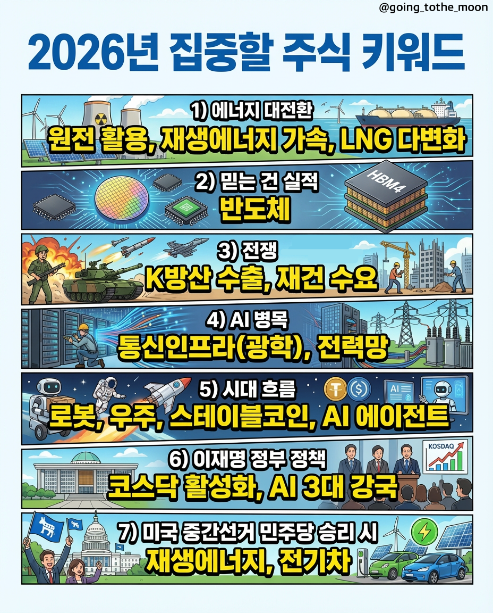
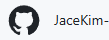
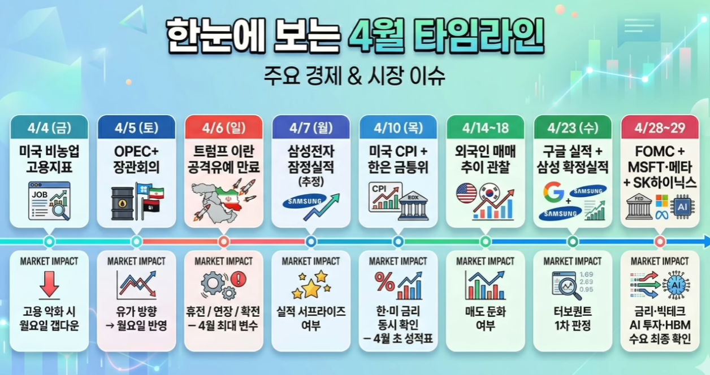

강인한멘탈🏠 > [kostock](../../) > [principles](../) > [마인드셋팅](./) > `매매일지`
<table>
  <tr>
    <td><a href="readme.md">마인드셋팅</a></td>
    <td><b href="../매매일지">0️⃣매매일지</b></td>
    <td><a href="../심법관리01.md">1️⃣심법관리</a></td>
    <td><a href="../심법관리02.md">2️⃣심법관리</a></td>
    <td><a href="../심법관리03.md">3️⃣심법관리</a></td>
    <td><a href="../학습방법.md">4️⃣학습방법</a></td>
  </tr>
</table> 

### INDEX
- [[월별 주도섹터]](#월별-주도섹터)
- [[즐겨찾기 북마크]](#즐겨찾기-북마크)
- [2026년 4월](#2026년-4월)
- [2026년 3월](#2026년-3월)
-  2026년 2월
-  2026년 1월

---
## 0️⃣매매일지

<!--  -->

※ 출처 : 🌝 [[고잉투더문]][TOMOON] 🌙

 

- **스토리가 좋은 뉴스와 사건**이 존재
  - 그게 시장의 관심을 받음
  - 차트의 저점, 고점의 변동은 있어도 그 후 계속 이야기들을 만들어내면서 오름
- **주도섹터** 가 되는 가장 쉬운 흔적은
  - 차트상 **전고점 돌파**가 나온다는 것!

### 월별 주도섹터 

| 월별 | 주도섹터 |
|:---:|---------|
| 1월 | 삼전&하닉, 로봇, 우주, 현대차밸류체인, 반도체소부장 |
| 2월 | 삼전&하닉, 증권주, 전력, 원전, 지주사, 태양광 | 
| 3월 | 통신인프라, 재생에너지 |
| 4월 |  |

- 지수 흐름이 좋으면 여러 주도섹터가 나오는데, 좋지 않으면 2~3개 정도!
- **[3월]** 앤비디아, AT&T 임팩트로 '통신인프라(광학)'가 좋았고,
- 고유가와 함께 '재생에너지'도 상대적으로 좋았다.
- 반도체소부장이 전고점 갱신 종목들이 좀 있었지만, 구글 터보퀀트 찬물로 밀려버림!

 

[[TOP]](#index)

---
### 즐겨찾기 북마크

| 즐겨찾기 | 내용 | 유형 |
|---------|-----|------|
| [[세력의 유동성사냥]][HUNTER] | 추세확인, 페에밸류갭, 수요존과 공급존 |  |
| [[블로그 고잉투더문]][TOMOON] | 주식사촌, 돈의흐름 팔로잉 |  |
| [[1분주식 Shorts]][1MINUTE]  | 1분쇼츠 꿀팁 |  |
| [[방구석 워런버핏]][ARMCHAIR] | 투표는 권력, 투자는 생존! 세상은 정치와 경제라는 수레바퀴로 굴러간다. |  |

[MAIN]: https://htmlpreview.github.io/?https://github.com/JaceKim-TheAL/biz_finance/blob/master/kostock/s90_database/html/main.html
[DOCS]: https://htmlpreview.github.io/?https://github.com/JaceKim-TheAL/biz_finance/blob/master/kostock/s90_database/html/doculist.html
[HUNTER]: https://htmlpreview.github.io/?https://github.com/JaceKim-TheAL/biz_finance/blob/master/kostock/s90_database/html/전략연구/유동성사냥/hunter_main.html
[TOMOON]: https://blog.naver.com/going_tothe_moon
[1MINUTE]: https://www.youtube.com/@1minstock/shorts
[ARMCHAIR]: https://www.youtube.com/@방구석워런버핏

 

[[TOP]](#index)

---
### 2026년 4월
> - [[자동일지차트(매매내역)]](https://github.com/JaceKim-TheAL/bs_review/tree/main/2026%EB%85%84/202604) : BS마크 매매복기
> - 손익비가 높은 매매에 집중하자! 시초에는 돌파, 그외는 눌림!!

 
📌 2026.04.21(화)

- 음~ 어제 전승에 자신만만했나?
- 시장은 여지없이 회초리를 들어주네
- 너무 성급했고, 욕심이 앞섰고, 조급했다!

 
📌 2026.04.20(월)

- 오늘 매매는 9전9승이지만, 50점만 주고싶다.
- 돌파보다는 전반적으로 눌림자리에서 매매를 한듯
  - **눌림매매는 차트에서 저항과 지지를 확인** 하고 예측되는 자리에서 들어가는게 손익비도 좋다.
  - 호가창의 매수세를 보고 고점에서 들어가서 손익비가 좋지않았고, 시간 낭비만!! ㅠㅠ
- 잘한것은 비중조절을 잘한듯 하다. **2분할/3분할로 하니 일단 조급하지 않았고** 조금 편하게 매매한듯!!
- **매수할때는 차트와 거래량 체크, 매도할때는 호가창을 보고 매도세가 강하면 매도!!**

 
📌 2026.04.17(금)

- 호가창보다 **차트상 추세와 힘을 믿고 끌고가는 매매** 가 아쉽다.
- 경험과 데이터를 쌓아야 겠다.
- ~NXT장에서 시초에 프로그램 매수후 바로 던지는 패턴~에 조심
- 당일 주도테마 대장을 공략
- 대장이 너무 고점이면, **등락률보다 거래대금과 실적(매출액,영업이익) 좋은주를 공략**
- 큰 욕심을 내지말고, 벌기보다 잃지않는 매매에 집중하자!!
- 종가베팅
  - 코스피는 거래량, 코스닥은 거래대금
  - 매물대가 적고, 뉴스에 영향을 잘 안받는 종목
- 돌파매매
  - 매수타점이 중요, 매수하면 대응의 영역
    - 매수후에는 호가창이 1순위, 차트가 2순위
    - 올라가지 않으면 바로 손절
    - 매수하자마자 올랐다가 탄력을 잃을거 같거나 다시 매수가로 오면? 그냥 좋은주식이라 생각하지 않고 바로 매도
  - 피하는 종목 
    - 단주 : 개미를 유혹
    - 과도한 허매수 : 사려는 의지가 있으면 큰물량을 절대 아래에 걸어두지 않음. 사려면 시장가로 끌어올림.

 
📌 2026.04.16(목)

- 시작은 매일 기회를 주는데 왜 나는 수익을 내지 못하는걸까?
- **트레이더의 실력은 시장의 움직임을 추측하지 않는데서 나온다.**
- 오를거 같은데??가 아니라 **기준에 맞으니깐 들어간다** 가 되어야 한다.
- 수많은 캔들중 장시작에 나오는 30분봉 캔들하나에 답이 나온다. why? 거래랭을 보면 알수있다.
- 가장 강력한 에너지를 품고 있다.
- [[원캔들 매매전략]](https://www.youtube.com/watch?v=t8nmwXo5UlA)
  - **첫30분** 동안은 전 세계의 기관들과 세력들이 **오늘 하루의 방향성을 놓고 가장 치열하게 싸우는 시간** 이다.
  - 트레이딩에서 가장 중요한것이 기준인데, 이 첫 30분봉 캔들이 완성되는 것이다.
  - 첫30분봉 캔들의 고점과 저점이 오늘하루의 기준선이 된다.
  - 즉, 고점을 뚫고 올라가느냐 저점을 뚫고 내려가느냐가 그날의 복잡한 움직임을 아주 단순하게 변하게 된다.
  - 왜 30분봉이냐면... 유동성과 신뢰성 때문
  - 첫 30분봉의 고점과 저점 레인지는 노이즈를 걸러내고 진짜 세력들이 돈을 어디에 쏟아부었는지 가장 명확하게 보여주는 지표이다.
  - **상단저항과 하단지지는 가장 큰 무기** 가 된다.
  - 실제 매매에서는 5분봉의 종가가 상단저항과 하단지지를 뚫어내는지를 확인해야 한다.
  - 즉, 세력들은 개미들을 낚기 위해 선위로 꼬리만 뺏다가 확 끌어내리는 일이 흔한일이다.
  - 수익 극대화 타점
  - 리테스트, 가격이 뚫고 올라갔다가 다시 저항선가까이 내려와 지지를 받는지를 확인하고 진입
  - 손익비는 2대1, 

 
📌 2026.04.15(수)

- 100%는 없다!
- 단기매매에서 분봉은 정말 중요! 
- **4대 일봉자리**
  - 전고점 도전하러 가는 자리
  - 신고가 자리
  - 매물대가 얇은 구간(빈집털이)
  - 바닥자리
- **~분봉상 회피패턴~ 탑5**
  - **뉴스빵 패턴** : **일봉자리 체크, 언론사 공신력 체크, 분봉상 주가선반영 여부 체크, 당일 주도섹터내에서 매매**
    - 세력의 선취매후 던짐, 보통 VI발동 후 급락! 일봉자리와 당일핫한 종목인지 체크
    - 고점에서 뉴스빵도 회피, 고점찍고 절반이상 밀린종목은 매물대가 많음
    - 급등후 10분이내 올라가지 않으면 무조건 컷! 가는 종목은 쭉쭉 올라감.
  - **깊은눌림 패턴** : **분봉상 시장 참여자들의 심리 파악후 매매**
    - 분봉차트를 보면 시장의 심리가 보인다. 
    - 시장가로 매수하면 올라갔다가도 잘 내려오지 않는다. 콘크리트 벽!
    - 절반까지 밀렸다가 다시간다고 해도 돌파가 쉽지 않다.
  - **끼가 다 온 패턴** : **종목별로 최대끼에 도달했을때 매매 주의, 끼를 갱신할 가능성도 있음**
    - 종목마다 끼가 다르다. 예를들어, 삼성전자는 맥시멈이 7%이다.
    - 어깨에서 매물소화를 하면서 신고가 돌파하러 가는 자리
    - 6개월/1년은 각자의 실력에 따라 다르다. 
  - **3파동 패턴** : **분봉상 1차,2차,3차 상승 후에 매매 주의**
    - 한번 오르고 누르고를 3번까지는 가능하지만, 그 이상은 정말 힘들다.
    - 세번째는 보통 젖먹던힘까지 짜서 위로 올린다. 
    - 상한가를 갔다는것은 누군가가 책임을 진다는 의미
  - **가분수 패턴** : **연속장대양봉 발생한 부담스러운 분봉상 위치, 시장참여자들이 매도 타이밍을 보는 위치에서 매매 금지**
    - 양봉이 연속으로 나왔을때, 4번째부터는 위험
    - 비현실적인 큰 장대양봉이 나오면 더이상 올라가기 힘들다. 
    - 물론 더 큰거래량과 함께 더큰 양봉이 나올수도 있다. 
    - 갭이 과하게 뜨면 위험하다.
    - 5%정도 갭뜨는 것은 오히려 좋다.
    - 고점에서 눌렀다가 잠시 돌아나가기도 하지만, 이런 패턴은 얼마 먹지 못한다. 
    - 차라리 횡보하면서 힘을 응축하고 돌파하면 오히려 낫다. 
- [[대왕개미 매매영상]](https://www.youtube.com/watch?v=CHVTxvb2c8k)
  - 주도섹터 : 거래대금 상위종목 중에서 4%이상 상승한 종목
  - 주도섹터 대장주 선정 후 체크사항
    - ❶일봉자리 ❷끼가있는종목 ❸프로그램/기관 수급 ❹시가총액
    - ❺거래대금 ❻지수상황비교 ❼동일 섹터의 후발주 ❽다른 섹터 흐름
  - 가장강한 대장주 : D+0, D+1, D+2, 관심종목

 
📌 2026.04.14(화)

- **프로그램매매의 80%가 외국인이며, 베이시스기반으로 컴퓨터가 자동으로 매매**
  - 외국인의 수급과 선물의 수급을 동시에 확인하자!
  - 하락에 큰베팅을 걸어놓고 수급이 들어오는 경우 진입 금지!
  - 이정도 빠졌으면 반등해주겠지~ 라며 매수후, 기도매매가 계좌를 망친다!
  - **프로그램이 설정한데로 방향이 정해지는거 같다.**
  - 공매도수량도 체크하라!
- 장중돌파를 하려면 풀장을 해야한다. 즉, 체력이 필요하다!
- 눌림매매는 수급과 추세가 좋은 종목이 잠시 쉬어가는자리에서 매매
  - 좋은 종목은 2% 눌리고 올라가고
  - 그다름 종목은 4~6% 눌리고 올라가고
  - 더안좋은 종목은 10% 눌리고 올라가는데
  - 계속 물타기를 하다보면, 좋은 종목은 찔끔 먹고.. 안좋은 종목에 몰빵하는 결과가 나온다. 
  - 즉, 눌림이라고 물타기를 하다보면 계좌가 망가질수밖에 없다.
  - 차라리 눌림에서는 들어갔다가 빠지면 전량 손절하고 타점을 다시 잡는게 낫다!!
- 종베와 시초는 개념이 다르다.
  - 종베를 위해 미국의 야간선물시장을 체크하라!
  - **시초의 타점은 종베매수자의 익절구간임을 잊지마라!**
  - 가더라도 익절물량을 다 받아내고, 그것을 뛰어넘는 매수량이 들어와야 올라간다.

 
📌 2026.04.13(월)

- 실험적으로 여러가지 매매를 해봤는데, 승률이 50%가 안된다. 일별수익도 1승4패 ㅠㅠ
- 나주다에서 많은 사람들이 역대급 수익을 내는데.. 난 자신감이 떨어졌다. 
- 긍정적인 마인드를 갖자. 그래도, 비중이 작아서 손실도 작았음에 위안을 삼자!
- 나의 필살기를 만들어야 한다. (돌파/눌림/종베/상따) 
- 무엇보다도 손절을 기계같이 해야한다.
- 손절의 기준 : 가격, 비중, 시간 중에서 하나라도 원하는 흐름이 아니면 칼같이 하자!

 
📌 2026.04.06(월)

- 한발 빠르게 들어가지 못한다면, 템포를 늦춰서 정확한 타점에서 들어가자!
- 정말 바보같은 짓을 했다. 
- 내부병합으로 거래정지된다는 종목에 종베를 들어가다니.. 그것도 비중을 다실어서..ㅠㅠ
- 당분간 공부만 해야겠다!!

 
📌 2026.04.03(금)

- 난 돌파매매보다는 눌림매매가 맞는거 같다.
- 눌림매매에서는 돌파매매에서 손절타이밍을 놓쳐 크게 물리거나 깨지지 않는다.
- 오히려 마음이 편하고, 제대로 먹으면 돌파매매 2~3개 이상의 수익을 낼수 있다. 
- 장초의 파동(고점과 저점)을 지켜보고 들어가니 타점잡기도 수월하다. 
- 코스피는 삼전닉스라면, 코스닥은 바이오 그리고 요즘 2차전지와 에너지관련주

 
📌 2026.04.02(목)

- 오전10시 트럼프 대국민연설 라이브, 이란 향해 "석기시대로 돌려놓을 것"
- 이 한마디에 모든 종목이 급락, 단 흥아해운 그리고 신규주(인벤테라, 교보20호스팩) 급등
- 어제 종베로 들고간 건설주들 -10%대 손절
- 하지만, 교보20호스팩으로 만회
- 분당 ±10% 등락을 보여주며 롤러코스트
- 시초가대비 -50%까지 내려갔다가, 12시부터 저가대비 +180%를 1시간만에 쩍었다!
- 왜, 신규주에 또 스팩주에 스캘퍼들이 달려드는지 실감하는 하루였다!
- 칼손절과 빠른대응만이 살길이다! 양날의 검이다!

 
📌 2026.04.01(수) 

- 지수가 받쳐주는 날은 과감하게, 지수가 빠지면 보수적으로 대응할 것!
  - 오늘 상승종목 840/1500개, 하락종목 71/160개인데 나주다보면 손실본사람이 더 많아 보임
  - 장초반 급등시킨후 흔들기 및 곤두박질, 즉 윗꼬리양봉 많음
- 돌파매매에서 물타기는 금물, 시가이탈하면 일단 손절 후 타점 다시 잡기!
  - 1파에서만 돌파매매, 즉 박스권돌파에만 진입.
  - 3파/5파 돌파는 보류. 왜냐면? 다음은 무조건 abc 조정이다! 
  - 1파 돌파후 반드시 거래량이 몰리더라도, 돌파자리까지 다시 눌러준후 출발!
  - 장초반 30분이내에만 도전!
- 눌림매매에서 손절라인은 유동성사냥군의 먹잇감!! 
  - 대칭점까지 기다린다!
  - 즉, 손절매물량, 패닉셀이 다 쏟아진후, 공포구간에서 매수세가 들어오면 과감하게 매수하자!
  - 오히려 돌파보다 손익비가 좋다. 
- 10시 이후 눌림자리는 반드시 전저점 확인, 정배열전환 구간에서 진입
  - PVG은 강력한 지지라인, 요기에서 매수

 

[[TOP]](#index)

---
### 2026년 3월
> - 역대상 가장 높은 지수를 갱신한 국내증시! KOSPI 6,347 / KOSDAQ 1,215 
> - 미국vs이란 전쟁으로 증시는 요동을 치고, 상승세도 멈추었다. 세계는 지금 에너지확보 전쟁중!

 
📌 2026.03.30(월) 

- 성급하게 들어가지 말자
- 작은눌림은 먹어도 작게먹고 손절은 크지만, 큰눌림은 손절도 작고 먹을폭도 크다!
- 확실하게 반등을 확인하고 들어가도 늦지 않다.
- V자 반등은 거의 없다. 단, 낙폭에서는 무조건 V자 반등이 나와야 하고, 그렇지않으면 바로 나와야 한다!

 
📌 2026.03.27(금) 

- **계좌관리가 중요** 함을 깨닫는 한주였다.
- 지난 두달간의 수익이 단 이틀만에 날아갔다. 
- 헤밍웨이의 말이 생각났다. **"바보가 되는데 단 하루면 충분하다."** ㅠㅠ
- 욕심도 욕심이지만, 안좋은 시장에서 복구심리때문에 안잃어도 되는 손실이 더 커진듯하다.
- 또 그것도 신규종목에서 깨지다니~~ ㅠㅠ
- 하루에 1%짜리 5번만 먹어도 5%수익인데, 한방에 10%로 짜리에 승부를 거나?
- 1억 베팅이면 5백만원이다! 이것도 적지않은 돈인데 말이다!!

 
📌 2026.03.26(목)  

- 오늘 매매에서 위기의식을 느꼈다!
- 나만의 타점과 멘탈이 있어야, 뇌동에서 벗어 날 수 있다.
- 새로운 것을 개발하는 것보다, **하지말아야 할 것을 하지 않는게 우선이다!**
- 추세가 하락중일때, 그리고 누가봐도 매도물량이 지속적으로 쏟아져 나올때는, 내가 잘못매수했음을 인정하고 무조건 손절하라!
- 오기를 부리다보면, 가장 큰 손실로 돌아올 뿐이다!!

 
📌 2026.03.25(수) 

- 신규주 [한패스] 스캘핑: 10시까지 50만원 수익, 오후에 -200만원 ㅠㅠ
- **신규종목은 데이터가 없기때문에, 무조건 추세에 따라야 한다.**
  - 장초에 광풍의 매수세이다가, 한번 꺾이기 시작하면 지속적으로 하락한다.
  - 제한없는 아니 최대 300%라는 열려있는 수익공간으로 많은 관심이 몰려있고, 편승하려는 매수대기자가 있다. 
  - 반면에, 상장하는 오늘을 위해 오랜기간을 수많은 매도대기자의 물량도 어마어마하다는 것을 잊지마라!
  - 말그대로 욕심과 욕망이 디글디글한 이판에서 살아남을 자신이 없다면, 절대 매수금지!
- 트레이딩은 수익이라 생각하면, 문제가 생긴다. 그러면, 내가 감내할수있는 손실범위를 초과하게 마련이다.
- **트레이딩은 수익이 아니라, 확률에 베팅하는 것이다!** 1%라도 더 손절을 안할수 있는 영역에서 트레이딩을 하는것이다. 
- 내가 알수 있는것은 오직 가격이다! 이것이 나의 보조지표이며, 미래이자 현실적지표이다!

 
📌 2026.03.23(월) 

- [베짱이인생]님의 상따 엿보기
  - **[특징주] 뉴스중요, 거래원확인, 프로그램의 일관성있는 순매수**
- 상따 절대원칙
  - ❶ 이유모르는거 들어가지 않기! 
  - ❷ 뇌동매매 하지않기! 
  - ❸ 손절잘하기!
- 실력만 있다면 예수금은 중요하지 않다. 소액으로 자신만의 매매방법을 만들것!!!

 
📌 2026.03.20(금) : BTS 컴백 콘서트, 10만명 광화문 집결! (외국인 90%, 190개국 세계3억명 동시접속 시청)

- 내가 **가장 못하는게 [매도]** 이다.
- 살때는 과감하게 사는데, 수익이 나도 손실이 나도 왜 팔지 못할까?
- 더 올라갈거 같아서~ 눌렸으니 다시 반등할거 같아서~ **결국은 내 욕심** 때문이다.
- 과거차트를 너무 맹신하지말고, 미래를 낙관적으로 예측하지 말자!
- 당장 **현재상황에서 올라갈지 내려갈지를 집중해서 판단하고, 과감하게 실행하자!!**

 
📌 2026.03.18(수)

- ~제발 아무 종목에 몰빵하지 말자.~ 🚫
- 분할매수와 집중매수의 타이밍이 있지만, **준비가 안됐다면 분할매수**가 답이다.
- 충분히 공부가 되었고 확신이 있는 종목중, 급락하거나 눌림이 왔을때 그때 과감하게 집중투자해야 한다.

 
📌 2026.03.13(금) 

- ~잡주는 관심도 가지지말고,~ 대형주와 테마주만 매매하자!
- **고수들이 노는종목에서 놀아야 한다!** 수익/손실을 떠나서 매매종목이 동일해야 한다.
- 뉴스와 수급에는 이유가 있고, 거기에 움직이는 종목을 매매해야 신뢰도가 높다!
- 잡주에서는 수익내기도 힘들고 내더라도 운빨이다. **고수들은 잡주를 절대 매매하지 않는다!**

 
📌 2026.03.03(화) 

- **눌림매매 10계명**
  - ❶ **양봉에 매수하지 않는다.**
  - ❷ 한계없는 매수하지 않는다.
  - ❸ 발매도에 익숙해진다.
  - ❹ **본전에 목숨걸지 않는다.**
  - ❺ 돌파장에 포모 느끼지 않는다.
  - ❻ **공포에 귀 기울이고, 공포를 즐긴다.**
  - ❼ 패배의 원인을 찾는다.
  - ❽ **어쩔수 없는 패배를 인정한다.**
  - ❾ 하락장에 살아남는다.
  - ❿ 천천히 나아간다 !

 

[[TOP]](#index)

---
