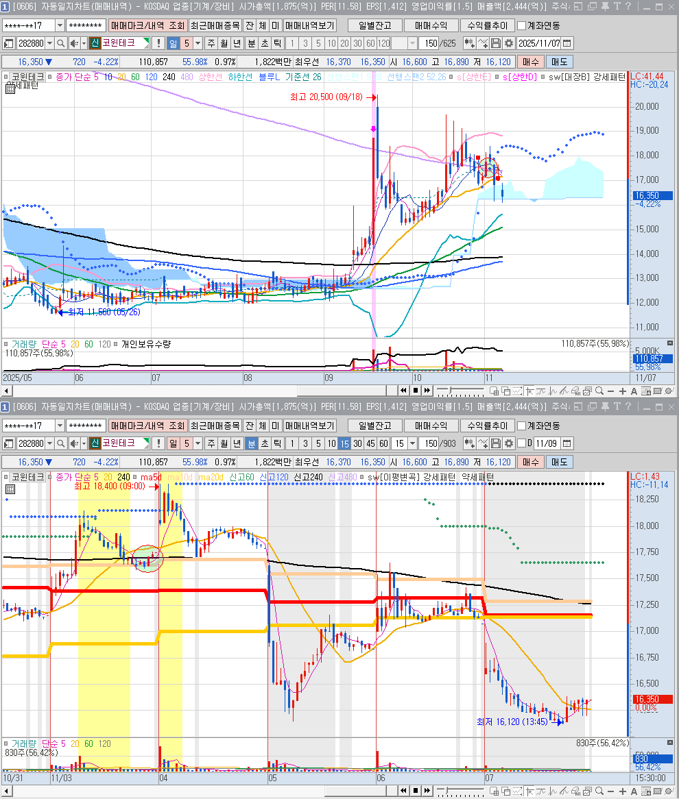

🏠 > [kostock](../../) > [principles](../) > [조건검색기](./) > `종베`

<table>
  <tr>
    <td><a href="search01.md">수급</a></td>
    <td><a href="search02.md">추세</a></td>
    <td><b href="search03.md">종베</b></td>
    <td><a href="search04.md">단타</a></td>
    <td><a href="search05.md">스윙</a></td>
  </tr>
</table>

---
# 종베

### (종베) [일]3번자리_종가베팅

---

---

---