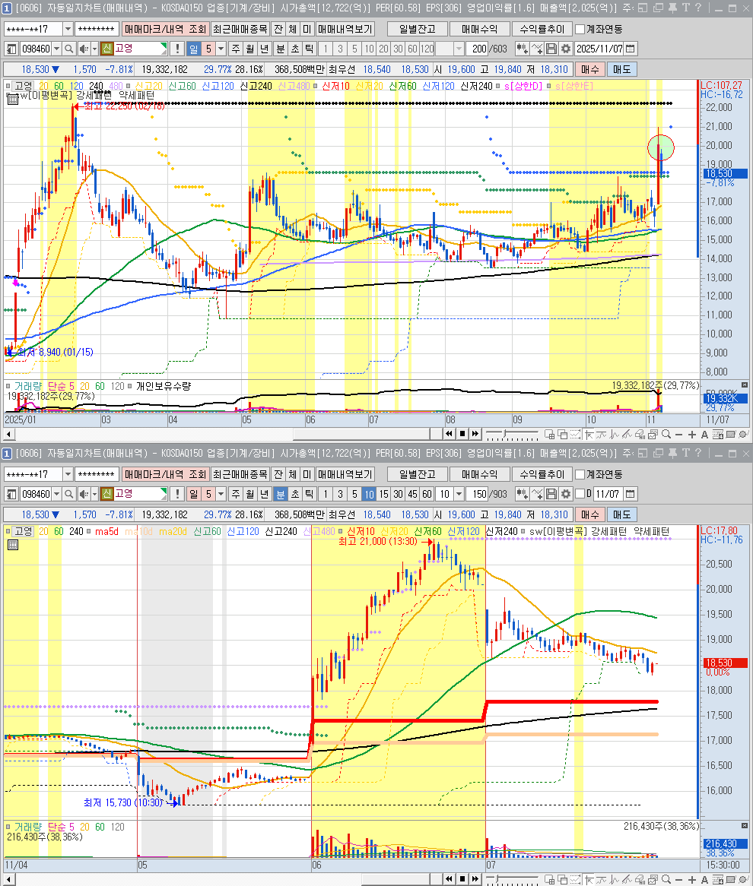
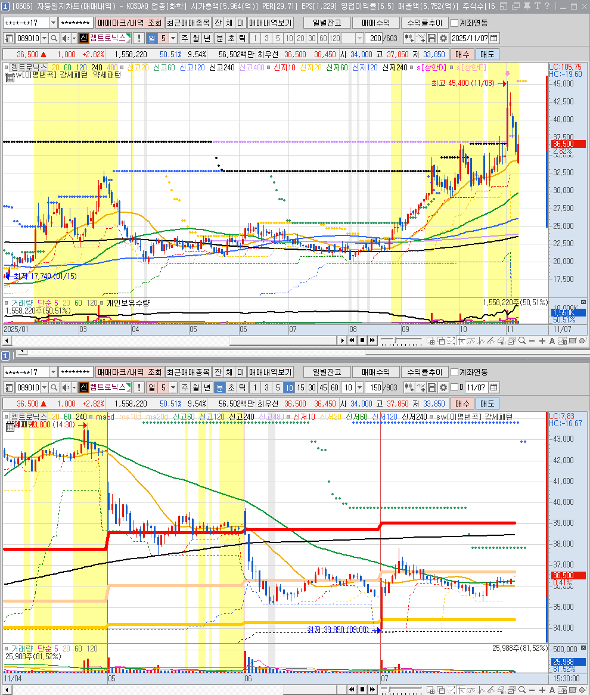
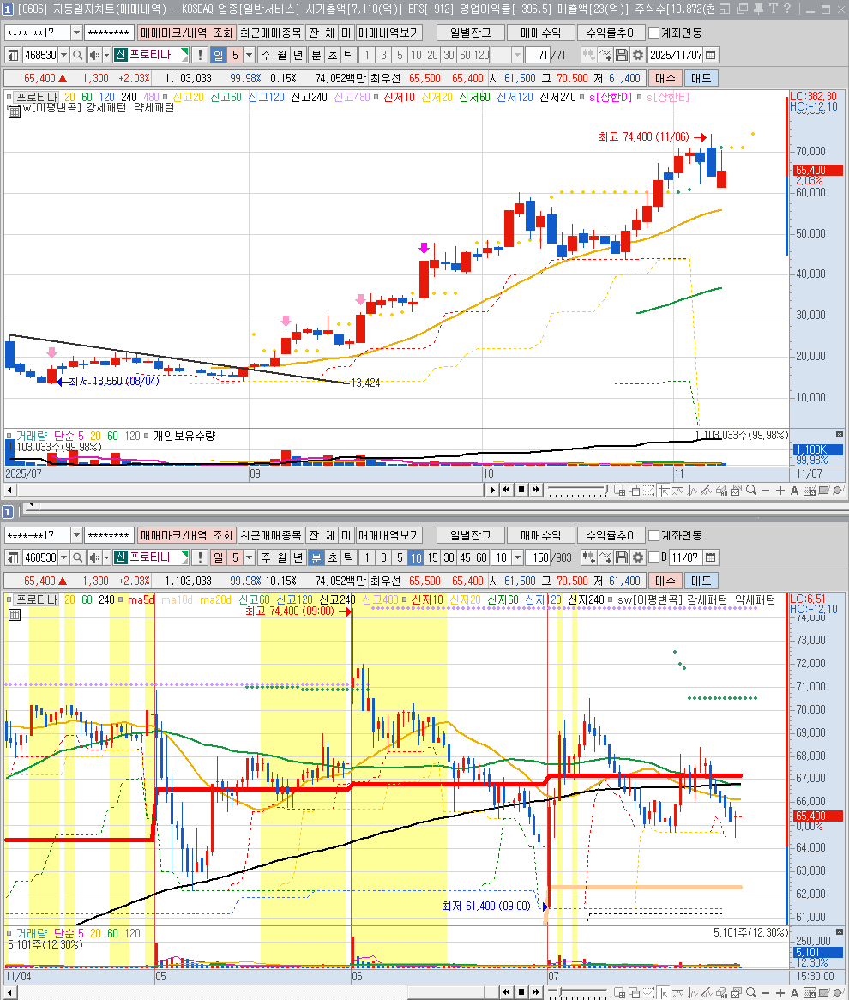

🏠 > [kostock](../../) > [principles](../) > [조건검색기](./) > `종베`

<table>
  <tr>
    <td><a href="search01.md">수급</a></td>
    <td><a href="search02.md">추세</a></td>
    <td><b href="search03.md">종베</b></td>
    <td><a href="search04.md">단타</a></td>
    <td><a href="search05.md">스윙</a></td>
  </tr>
</table>

---
# (종베) [일]세력매집_이평지지

### 2025.11.06 : 고영 ⇒ 🟩 손절
- 시장지수가 하락, 외국인 매도세 우세

 

---
### 2025.11.06 : 필옵틱스 ⇒ 🟩 손절
- 세력의 돈이 안들어옴, 종베대상 아님

 

---
### 2025.11.06 : SK바이오사이언스 ⇒ 🟩 손절
- 세력의 돈이 안들어옴, 종베대상 아님

 

---
### 2025.11.06 : 뉴로핏 ⇒ 🟩 손절
- 세력의 돈이 안들어옴, 종베대상 아님

 

---
### 2025.11.06 : 인벤티지랩  ⇒ 🟥 익절
- 장후반 세력의 물량이 주가를 들어올림

 

---
### 2025.11.06 : 피아이이 ⇒ 🟥 익절
- 장후반 세력의 물량이 주가를 들어올림

 

---
### 2025.11.05 : 대한전선 ⇒ 🟥 익절
- 갭으로 시작하는 경우, 수익챙기려는 매도세 강하므로 빠르게 정리

 

---
### 2025.11.05 : 대원전선 ⇒ 🟥 익절
- 갭으로 시작하는 경우, 수익챙기려는 매도세 강하므로 빠르게 정리

 

---
### 2025.11.05 : 캠트로닉스 ⇒ 🟪 본전
- 갭으로 시작하였으나, 바로 하락하며 익절구간 및 시간이 짧음

 

---
### 2025.11.05 : 일진전기 ⇒ 🟥 익절
- 갭상승으로 시작, 전고점일 찍고 내려옴

 

---
### 2025.11.05 : 올릭스 ⇒ 🟥 익절
- 갭으로 시작하는 경우, 수익챙기려는 매도세 강하므로 빠르게 정리

 

---
### 2025.11.05 : 뉴로핏 ⇒ 🟥 익절
- 갭으로 시작하여 윗꼬리 만들었지만, 크게 눌리지 않고 전고점을 새롭게 돌파

 

---
### 2025.11.05 : 인벤티지랩 ⇒ 🟥 익절
- 갭으로 시작하는 경우, 수익챙기려는 매도세 강하므로 빠르게 정리

 

---
### 2025.11.05 : 프로티나 ⇒ 🟥 익절
- 갭으로 시작하는 경우, 수익챙기려는 매도세 강하므로 빠르게 정리

 

---