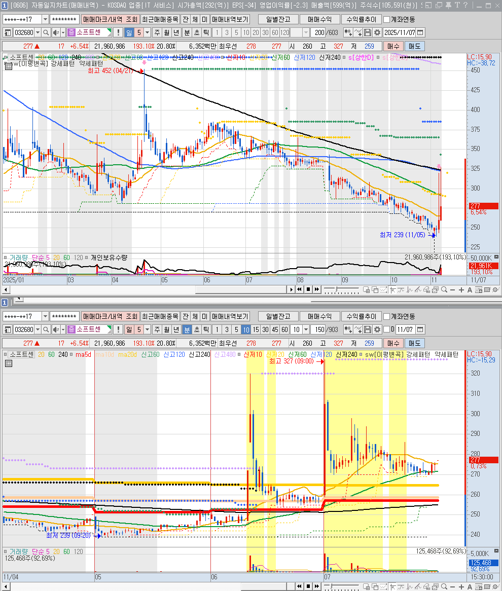
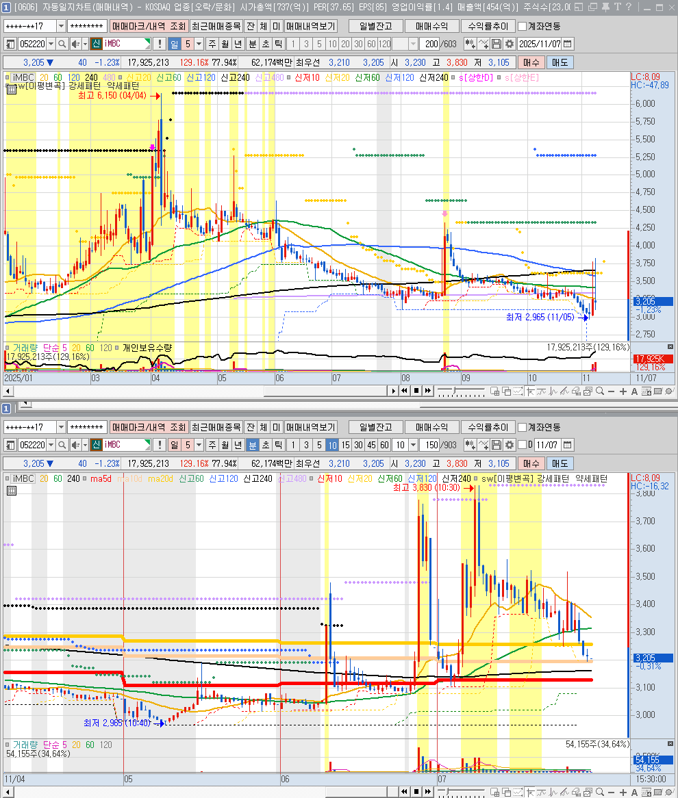
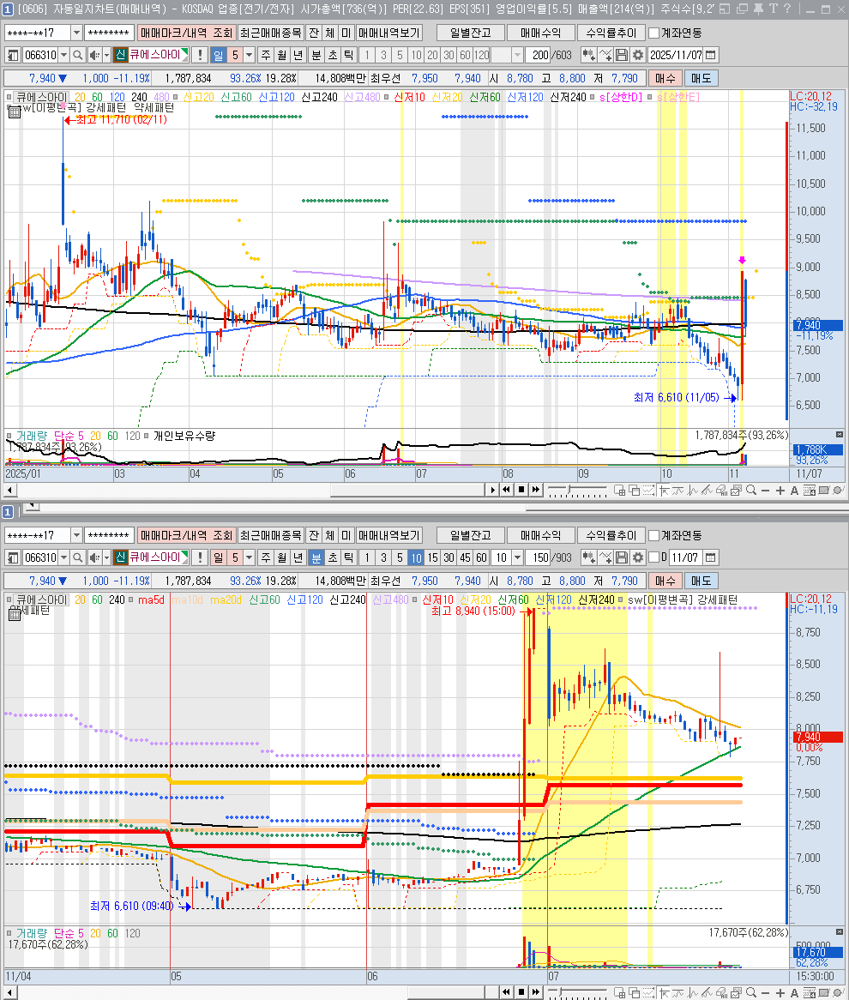
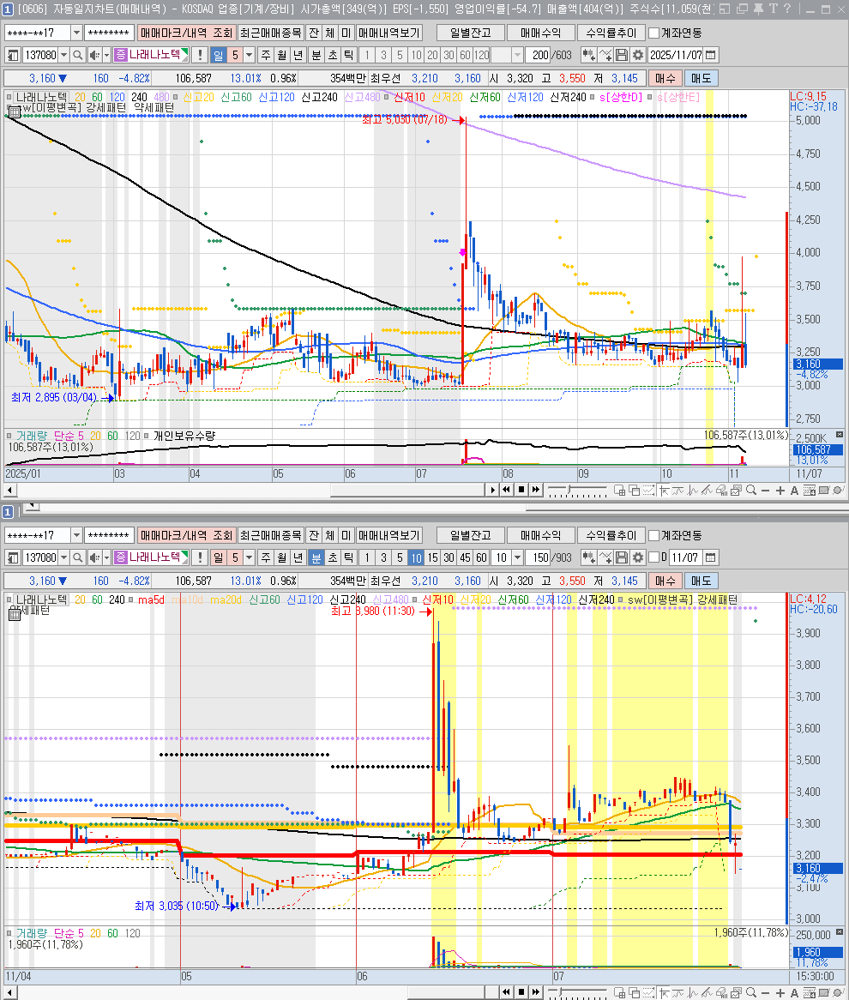
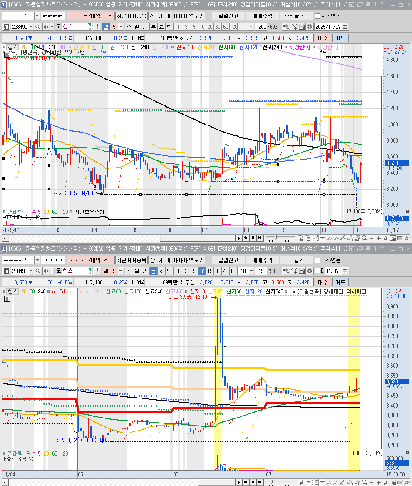
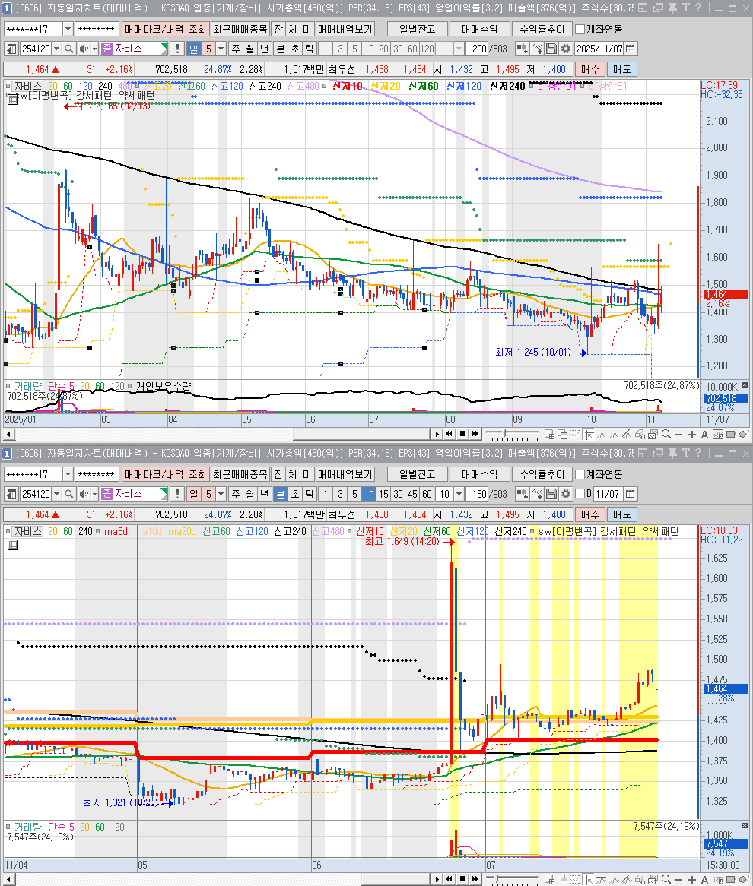
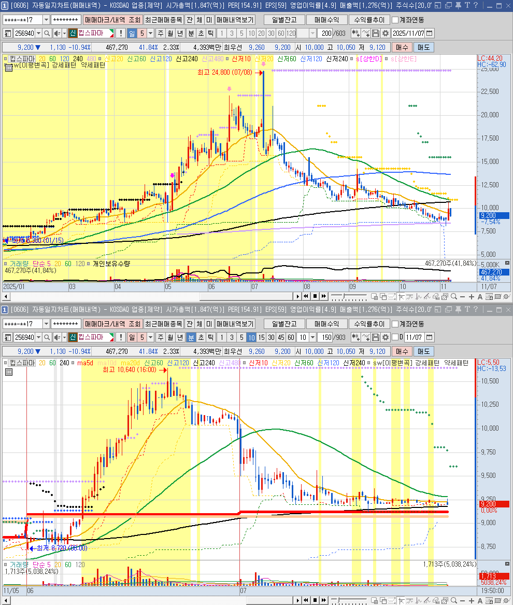
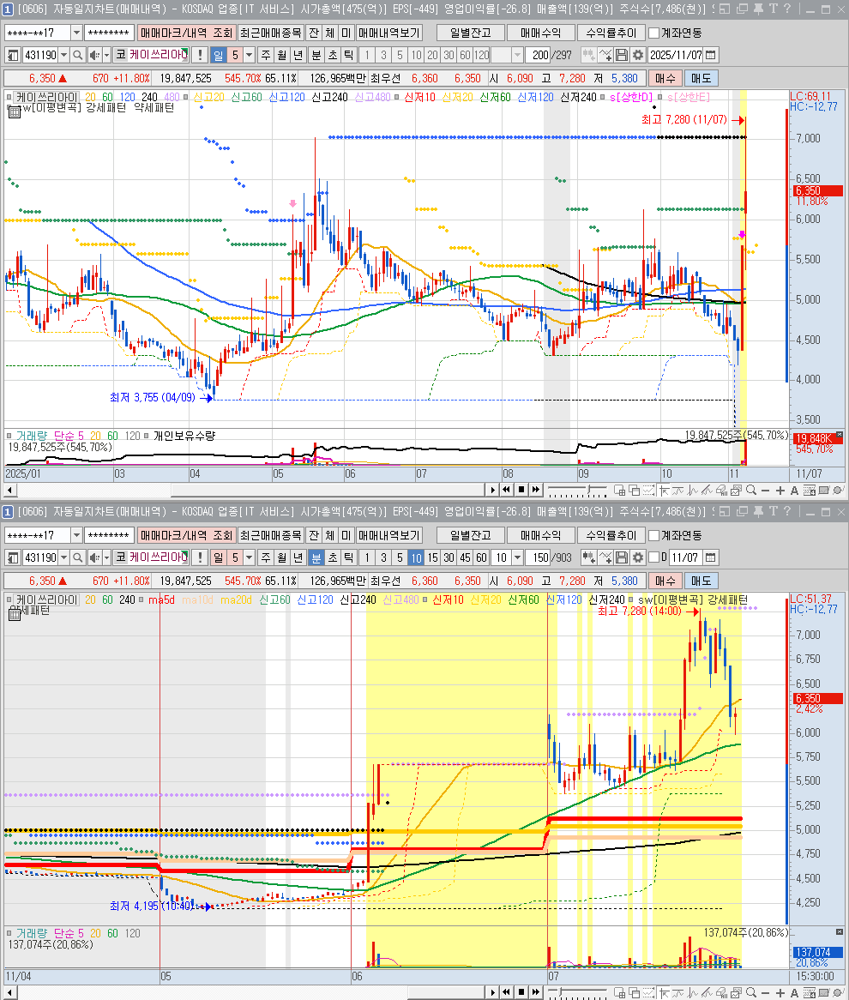
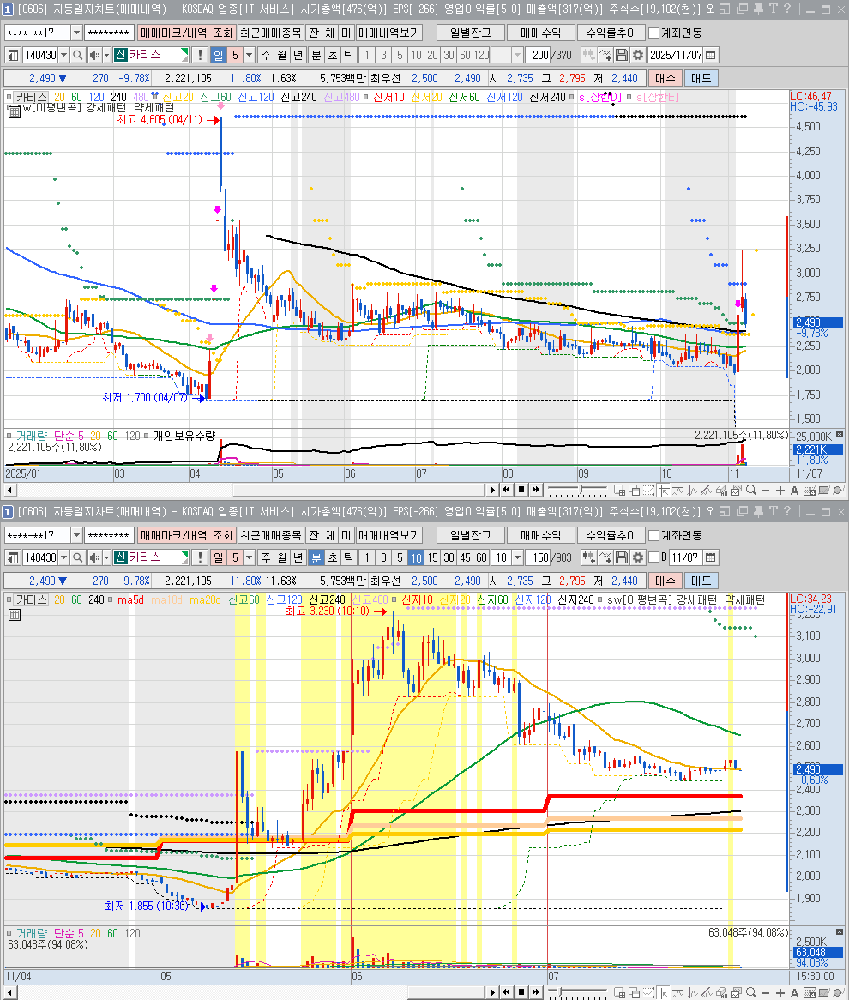

🏠 > [kostock](../../) > [principles](../) > [조건검색기](./) > `종베`

<table>
  <tr>
    <td><a href="search01.md">수급</a></td>
    <td><a href="search02.md">추세</a></td>
    <td><b href="search03.md">종베</b></td>
    <td><a href="search04.md">단타</a></td>
    <td><a href="search05.md">스윙</a></td>
  </tr>
</table>

---
# (종베) [일]신저가후_양봉반등

### 2025.11.06 : 씨아이테크 ⇒ 🟪 본전
- 긴꼬리양봉을 만들고 장후반에 매수세 안보임

 

---
### 2025.11.06 : 소프트센 ⇒ 🟥 익절
- 긴꼬리양봉을 만들고 저점과 고점 그리고 종가가 상승하여 확률이 높음

 

---
### 2025.11.06 : iMBC ⇒ 🟩 손절 후, 🟥 익절
- 장초반 갭하락과 빠른상승이 있었으나 밀림
- 5일선 지지를 하고 크게 반등하였음

 

---
### 2025.11.06 : 큐에스아이 ⇒ 🟩 손절
- 장종료전에 급등이 나왔고 상한가 도달
- 전고점을 급하게 돌파하여, 익절을 하려는 매도세가 강함
- 매물소화기간이 필요하여 숨고르기 상태로 보임

 

---
### 2025.11.06 : 서울바이오사이언스  ⇒ 🟩 손절 후, 🟥 익절 타이밍이 짧음
- 상한가 종목으로 갭하락후 급등후 빠르게 하락
- 순간적으로 익절을 주긴했으나, 매우 어려운 구간

 

---
### 2025.11.06 : 현우산업 ⇒ 🟪 본전, 🟥 익절
- 전일 추세를 믿고, 길게 끌고 갔다면 익절 예상
- 전일 장대양봉마감이라 매물소화기간이 필요한것으로 보임

 

---
### 2025.11.06 : 나래나노텍 ⇒ 🟥 익절
- 잠깐 눌린후 급등

 

---
### 2025.11.06 : 아주스틸 ⇒ 🟪 본전
- 전일 급등후 급락이라, 매물소화기간이 필요

 

---
### 2025.11.06 : 힘스 ⇒ 🟪 본전 🟩 약손실
- 전일 급등후 급락이라, 매물소화기간이 필요

 

---
### 2025.11.06 : 자비스 ⇒ 🟥 익절
- 전일 급등후 급락하였으나, 종료전 의미있는 급한상승

 

---
### 2025.11.06 : 킵스파마 ⇒ 🟩 손실
- 지속적인 상승추세였으나, 장막판에 하락추세와 급한음봉 마무리
- 장시작후 약간의 상승으로 시작했으나 급락

 

---
### 2025.11.06 : 드림인사이트 ⇒ 🟩 손실
- 급등후 급락을 반복하다 하락추세로 마무리
- 장시작후 약간의 상승으로 시작했으나 급락

 

---
### 2025.11.06 : 케이쓰리아이 ⇒ 🟥 익절
- 갭상으로 시작후 전일 종가아래로 밀리고 와리가리
- 결국은 급등후 다시 급락

 

---
### 2025.11.05 : 일정실업 ⇒ 🟥 익절
- 상승시 유입된 자금이 빠져나가지 않음
- 와리가리 횡보하면서 매물소화

 

---
### 2025.11.05 : 우리로 ⇒ 🟥 익절
- 상승시 유입된 자금이 빠져나가지 않음
- 상승후 시가근처까지 눌린다음 급등

 

---
### 2025.11.05 : 카티스 ⇒ 🟥 익절
- 상승시 유입된 자금이 빠져나가지 않음
- 상승후 눌림목 후 장종료전까지 상승세 유지하여 확률높은 종가매매

 

---
