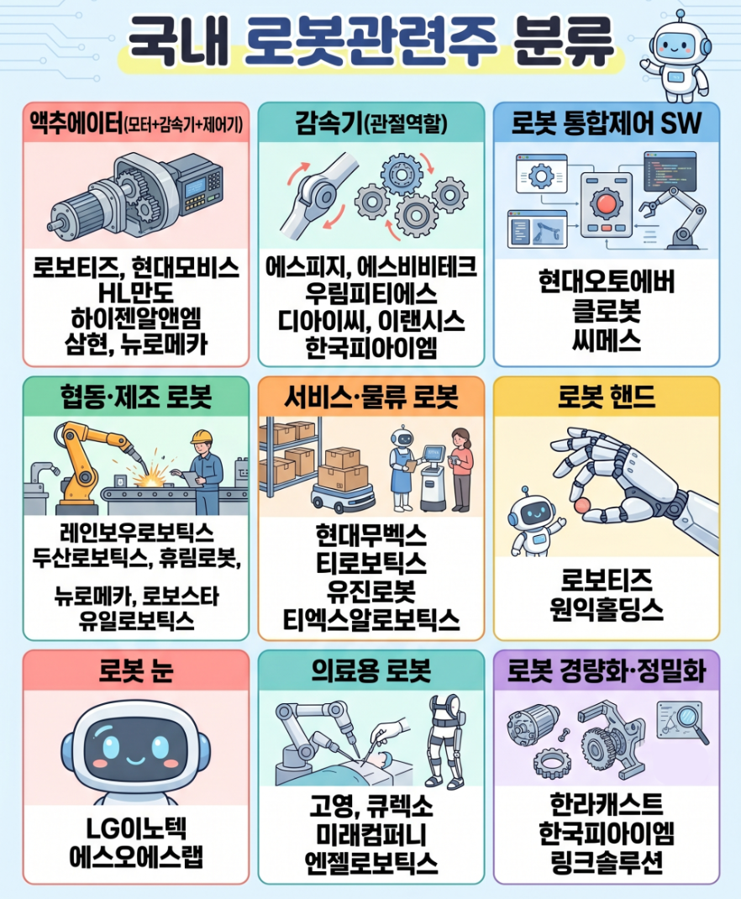

🏠 > [kostock](../../) > [stocks](../) > [테마학습](./) > `로봇`

<table>
  <tr>
    <td><a href="readme.md">Main</a></td>
    <td><a href="테마_반도체.md">반도체</a></td>
    <td><a href="테마_로봇.md">로봇</a></td>
    <td><a href="테마_관광.md">관광</a></td>
  </tr>
</table>

#### INDEX
- [지능형로봇/인공지능(AI)](#지능형로봇인공지능ai)
- 
- 

---
## 1️⃣ 최신테마주

 

[[TOP]](#index)

---
### ™️ 로봇 관련주

---
### 지능형로봇/인공지능(AI) 
> [[테마별 시세]](https://finance.naver.com/sise/sise_group_detail.naver?type=theme&no=505)

| 테마종목 | 지능형로봇/인공지능(AI) | [[테마별 시세]][테마-지능형로봇인공지능] |
|-----|-----|-----|
| | 로보스타  | [[종합정보]][종합-090360]  [[차트보기]][차트-090360]  [[종목분석]][종목-090360] |
| | 로보로보  | [[종합정보]][종합-215100]  [[차트보기]][차트-215100]  [[종목분석]][종목-215100] |
| 대장 | 레인보우로보틱스  | [[종합정보]][종합-277810]  [[차트보기]][차트-277810]  [[종목분석]][종목-277810] |
| | 클로봇    | [[종합정보]][종합-466100]  [[차트보기]][차트-466100]  [[종목분석]][종목-466100] |

[테마-지능형로봇인공지능]: https://finance.naver.com/sise/sise_group_detail.naver?type=theme&no=505

[종합-466100]: https://finance.naver.com/item/main.naver?code=466100
[차트-466100]: https://finance.naver.com/item/fchart.naver?code=466100
[종목-466100]: https://finance.naver.com/item/coinfo.naver?code=466100

[종합-090360]: https://finance.naver.com/item/main.naver?code=090360
[차트-090360]: https://finance.naver.com/item/fchart.naver?code=090360
[종목-090360]: https://finance.naver.com/item/coinfo.naver?code=090360

[종합-215100]: https://finance.naver.com/item/main.naver?code=215100
[차트-215100]: https://finance.naver.com/item/fchart.naver?code=215100
[종목-215100]: https://finance.naver.com/item/coinfo.naver?code=215100

[종합-277810]: https://finance.naver.com/item/main.naver?code=277810
[차트-277810]: https://finance.naver.com/item/fchart.naver?code=277810
[종목-277810]: https://finance.naver.com/item/coinfo.naver?code=277810

 

[[TOP]](#index)

---