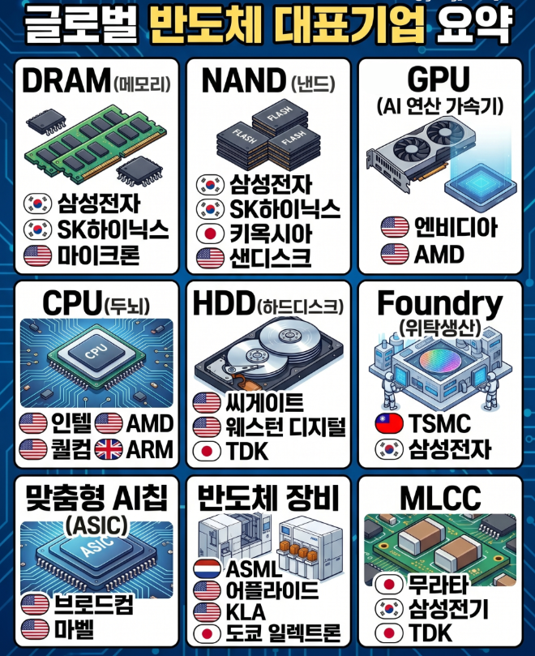
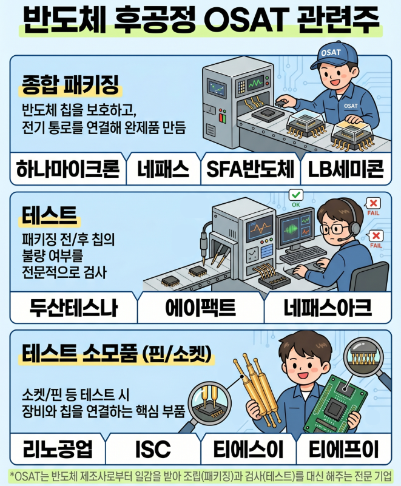
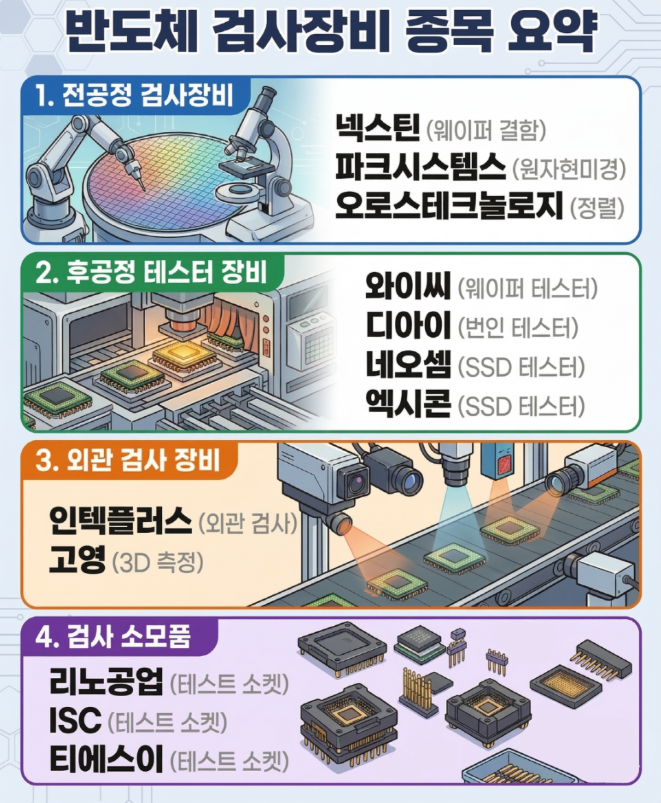
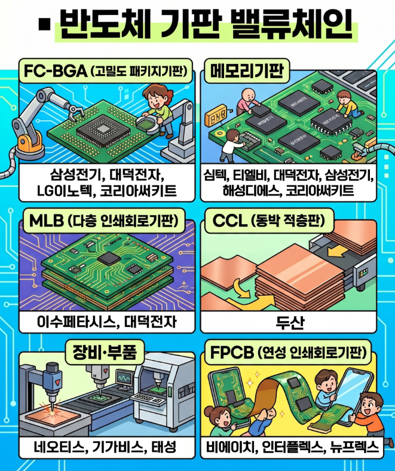
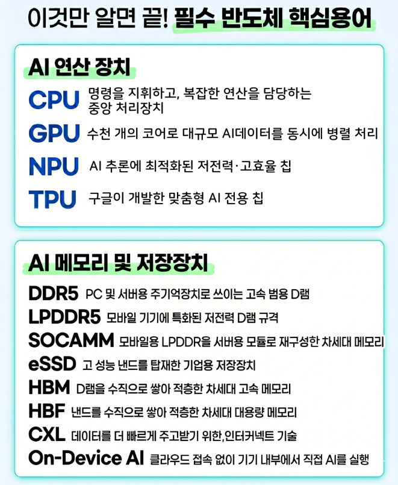
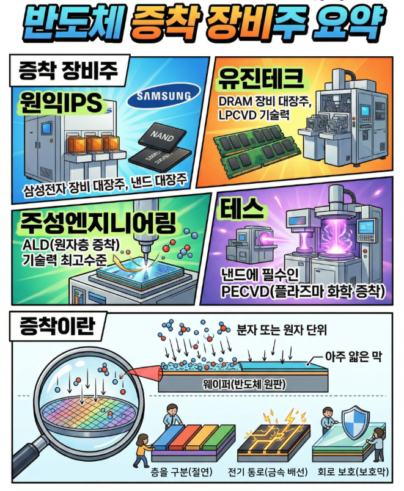
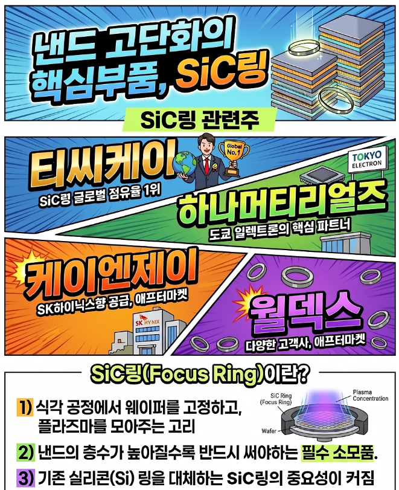
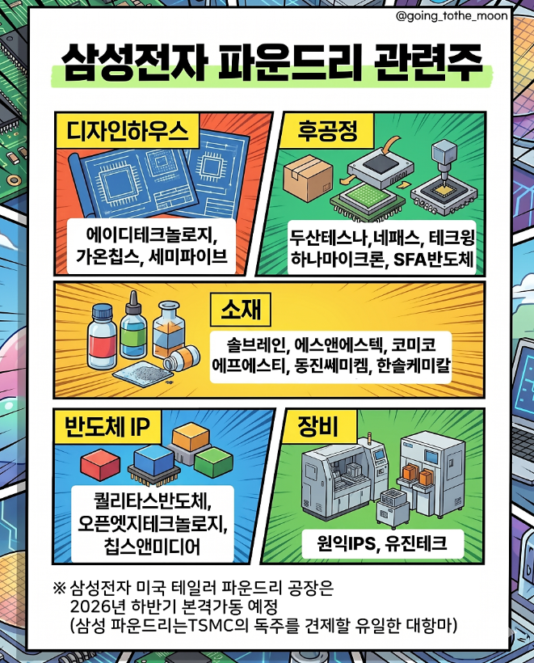
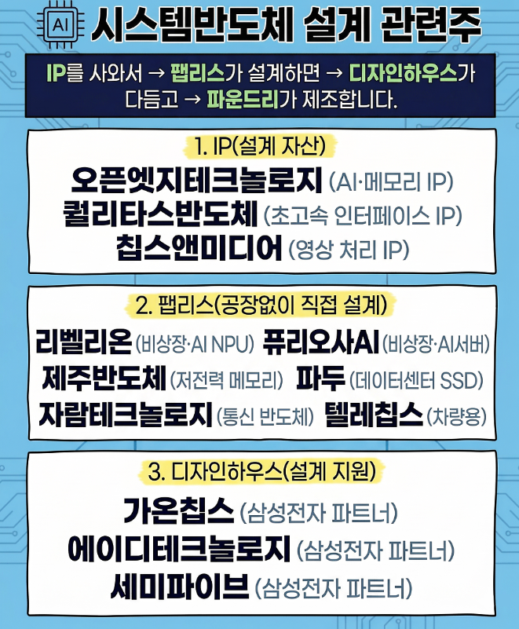

🏠 > [kostock](../../) > [stocks](../) > [테마학습](./) > `반도체`

<table>
  <tr>
    <td><a href="readme.md">Main</a></td>
    <td><a href="테마_반도체.md">반도체</a></td>
    <td><a href="테마_로봇.md">로봇</a></td>
    <td><a href="테마_관광.md">관광</a></td>
  </tr>
</table>

#### INDEX
- [글로벌 반도체 대표기업 관련주](#️-글로벌-반도체-대표기업-관련주)
- [반도체 후공정 OSAT 관련주](#반도체-후공정-osat-관련주)
- [반도체 검사장비 종목 요약](#반도체-검사장비-종목-요약)
- [반도체 기판 밸류체인](#반도체-기판-밸류체인)
- [반도체 핵심용어](#반도체-핵심용어)
- [반도체 증착 장비주](#반도체-증착-장비주)
- [낸드 고단화의 핵심부품, SiC링](#낸드-고단화의-핵심부품-sic링)
- [삼성전자 파운드리 관련주](#삼성전자-파운드리-관련주)
- [시스템반도체 설계 관련주](#시스템반도체-설계-관련주)

---
### ™️ 글로벌 반도체 대표기업 관련주

 

[[TOP]](#index)

---
### 반도체 후공정 OSAT 관련주

 

[[TOP]](#index)

---
### 반도체 검사장비 종목 요약

 

[[TOP]](#index)

---
### 반도체 기판 밸류체인

 

[[TOP]](#index)

---
### 반도체 핵심용어

 

[[TOP]](#index)

---
### 반도체 증착 장비주

 

[[TOP]](#index)

---
### 낸드 고단화의 핵심부품, SiC링

 

[[TOP]](#index)

---
### 삼성전자 파운드리 관련주

 

[[TOP]](#index)

---
### 시스템반도체 설계 관련주

 

[[TOP]](#index)

---