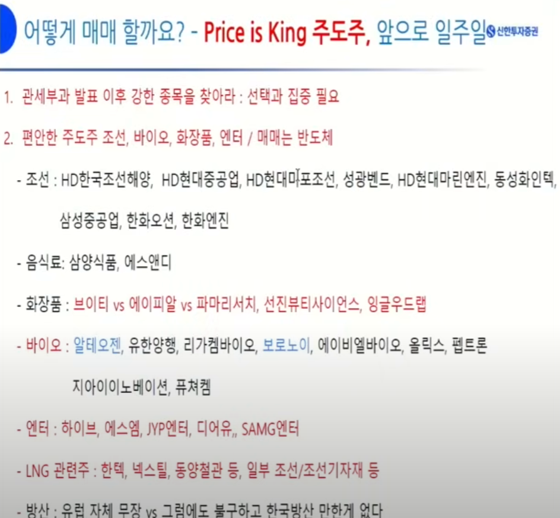
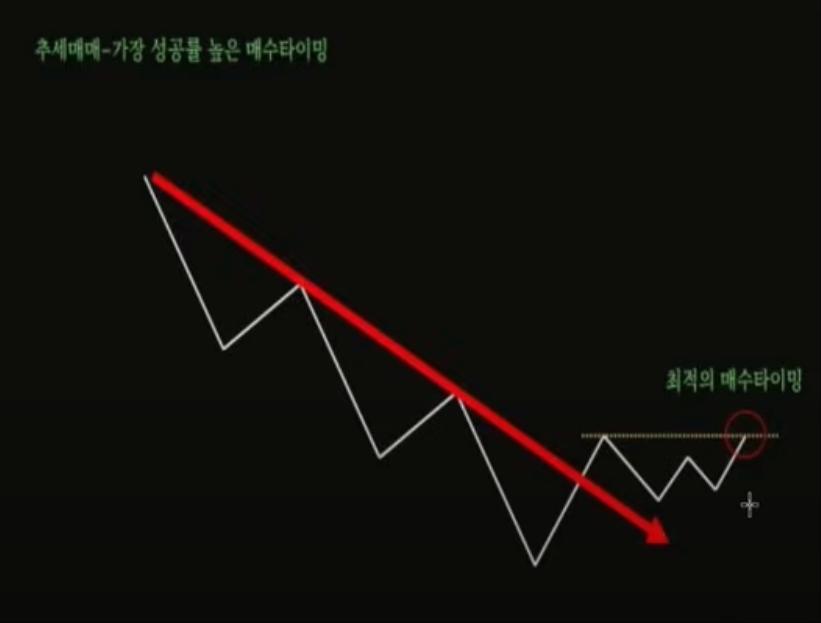
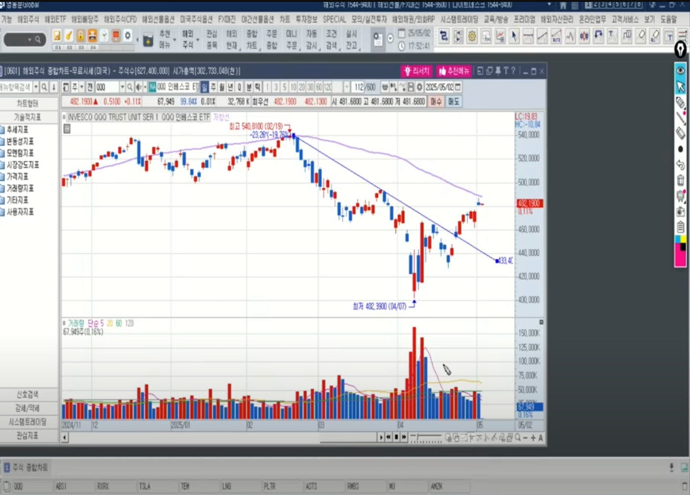
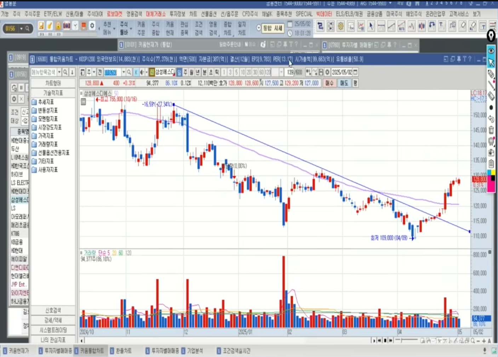
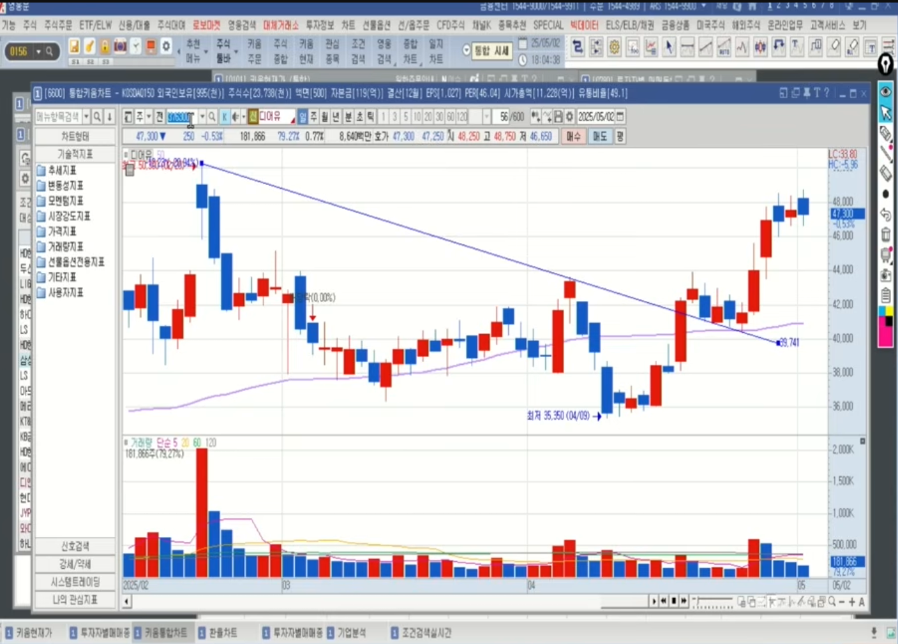
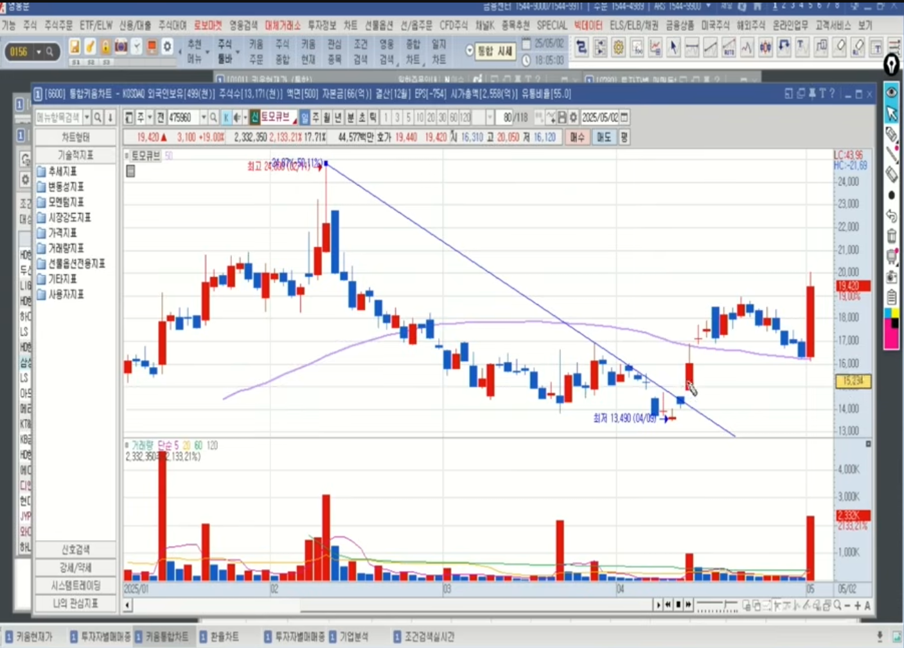
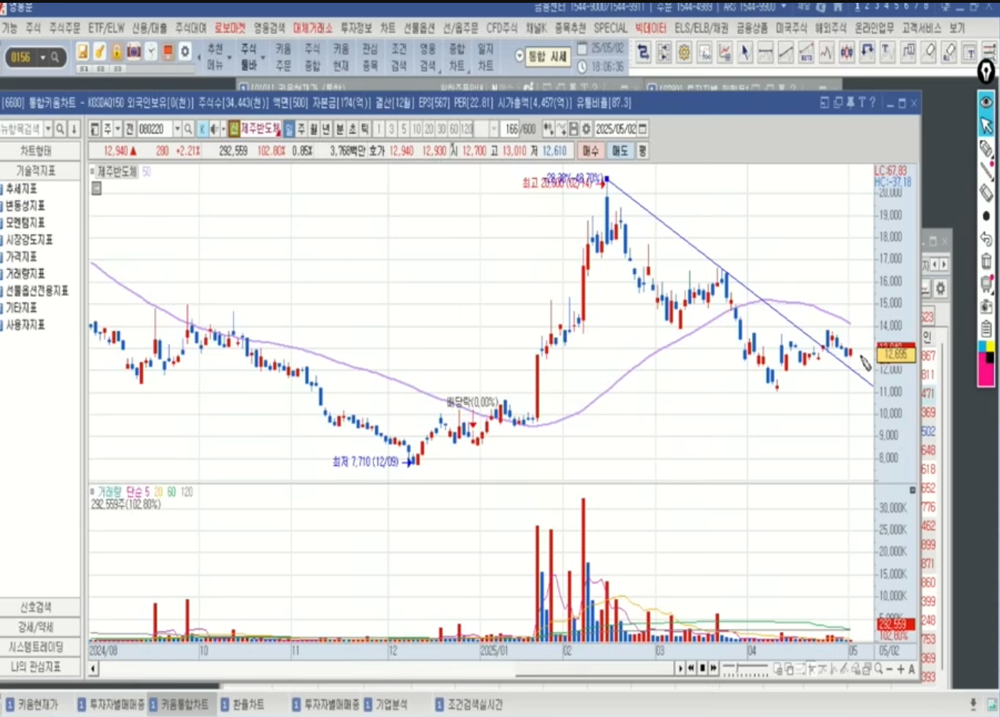
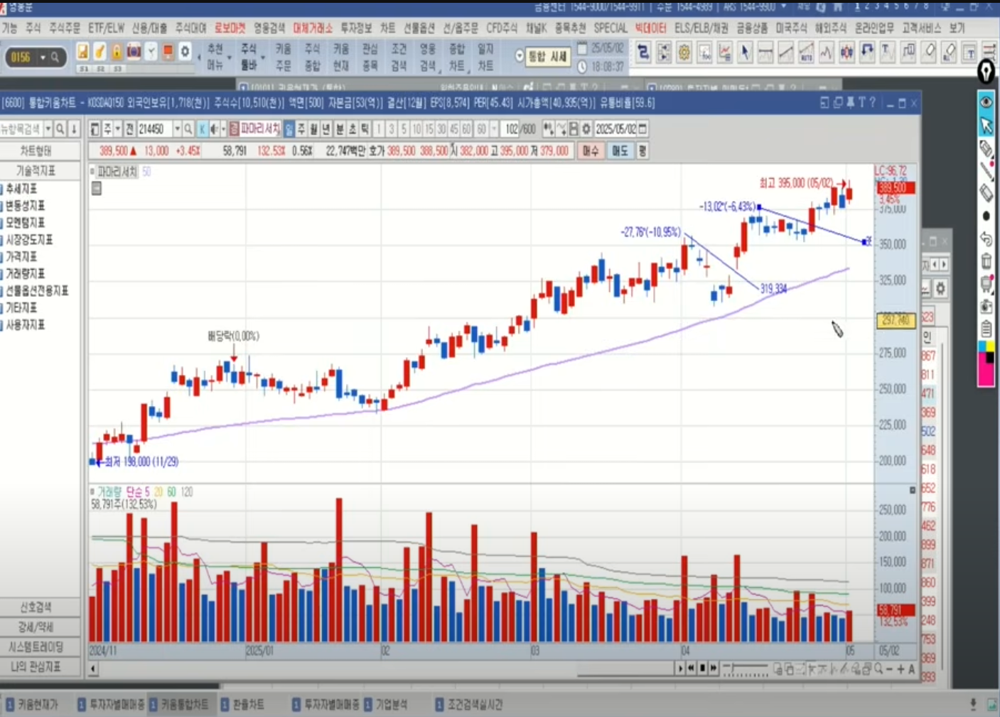
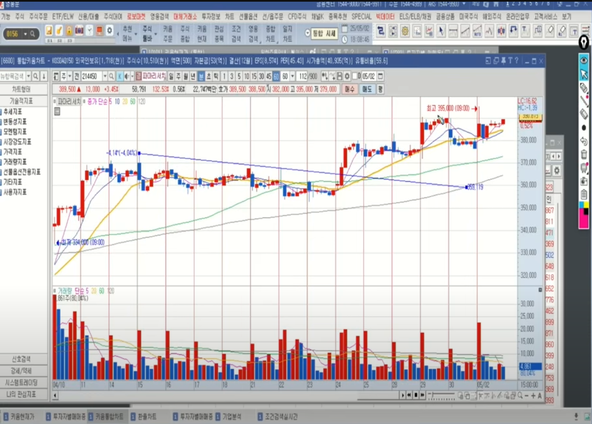

🏠 > [swing](./) > `추세추종 매매법`
<!-- 
https://www.youtube.com/watch?v=ruKNyD1vk_o 

- 0:00 신한투자증권 영업부 황유현 팀장 (2025년 5월 2일 오후 5시 촬영)
- 0:25 추세 추종 매매 전략 시작과 방법?
- 7:08 추세 추종 매매 전략의 기준과 접근 방법은?
- 12:28 하락 추세를 극복하는 종목 찾기 및 단기 매매 전략은?
- 16:31 추세와 손절매 기준 설정은?
- 22:17 반도체 섹터 분석 및 매매 전략은?
- 25:07 투자 성공을 위한 조언과 매매 기법 훈련은?

- 키워드: #추세추종매매 #기술적분석 #2주신고가 #주도주 #손절매 #리스크관리 #매매전략
-->

### INDEX

- [추세 추종 매매 전략 시작과 방법?](#추세-추종-매매-전략-시작과-방법)
- [추세 추종 매매 전략의 기준과 접근 방법은?](#추세-추종-매매-전략의-기준과-접근-방법은)
- [하락 추세를 극복하는 종목 찾기 및 단기 매매 전략은?](#하락-추세를-극복하는-종목-찾기-및-단기-매매-전략은)
- [추세와 손절매 기준 설정은?](#추세와-손절매-기준-설정은)
- [반도체 섹터 분석 및 매매 전략은?](#반도체-섹터-분석-및-매매-전략은)
- [투자 성공을 위한 조언과 매매 기법 훈련은?](#투자-성공을-위한-조언과-매매-기법-훈련은)

---
# 추세추종 매매법
> - [블로거](https://cafe.naver.com/815moneytalk)
> - [동영상](https://www.youtube.com/watch?v=ruKNyD1vk_o)

<!-- 0:00 신한투자증권 영업부 황유현 팀장 (2025년 5월 2일 오후 5시 촬영) -->

---
### 추세 추종 매매 전략 시작과 방법?

- 기본개념: 올라가는 것은 더 올라가고, 내려가는것은 더 떨어진다. 
  - Q. 동전을 던져 연속 7번이 앞면이 나왔다면 다음은 어디에 베팅을 할것인가?
  - A. 확률은 똑같이 1/2이지만, 기존 앞에서 연속해 온것이 반복된다고 보고 가는것이다.
  - 인생도 한번 성공을 해야 계속 성공을 하고, 시험도 100점 받아본 놈이 계속 100점을 맞는다.
- 가는말이 계속간다.
  - 무서워서 못산다는 사람?
  - 실제 승률은 30-40%가 안된다. 그럼 60-70%를 걸러내는 방법을 찾자.
  - 계좌에서 수익을 올려주는 것은 계속가는말이지, 밑에서 헤매고 있는 종목은 계속 헤맨다.
  - 즉, 50%,100% 수익을 내어주는 종목이 내 계좌를 끌어올려준다.

 

[[TOP]](#index)

---
### 추세 추종 매매 전략의 기준과 접근 방법은?

- Price is King 주도주
  - 프라이스s킹, 결국은 가격이 뷰를 만든다.
  - 가격이 올라가면 좋은 정보도 계속 나온다.

<!-- 
 
-->

- 전략기준
  - 하락추세의 기준을 잡고 돌파하면 관심을 갖는다.
  - 추세돌파하면 30%~50%정도 매수
  - 전고돌파하면 30%~50%정도 매수
  - 1년기준은 너무 길고, 3~4개월이 적당
  - 3걔월정도의 고점을 기준으로 추세선을 긋고 돌파하면 관심
  - 종가기준도 가능하지만 고가기준으로 한다.
  - 바닥보다 30~40% 높은 가격이지만, 분명 오른데는 내가 모르는 이유가 있다고 믿는다.
  - 무조건 50 이평선 위에 있는 종목을 찾는다.

 

[[TOP]](#index)

---
### 하락 추세를 극복하는 종목 찾기 및 단기 매매 전략은?

- 종목선정방법 
  - 메인 2주 신고가 종목중에서 찾는다.
  - 하락추세선을 극복했다는 것은 기간조정과 가격조정을 극복했다는 의미

- 종목선정기준
  - 50이평선 위에 있어야 한다.
  - 우상향 이어야 한다. 
  - 일봉상에서 찾기 힘들다면, 60분봉으로 찾는다.

 

[[TOP]](#index)

---
 

[[TOP]](#index)

---
### 추세와 손절매 기준 설정은?

- 손절방법
  - 차트를 보고 하지 않는다.
  - why? 계속 합리화를 하며 점점 물린다.
  - 내 비중의 2%가 물리면 무조건 손절한다.
- 주식매매를 하면서 내마음대로 할수 있는 것은 손실금액을 정하는 것이다.
- 25번이상 손절하더라도 반토막이 나지 않는다.
- 서비이벌만 하면 돈을 벌 수 있다. 
- 매수한 종목중 50%가 넘지 않을것이다.
- 하지만 극복하는 종목이 계자를 올려줄 것이다. 
 

[[TOP]](#index)

---
### 예시

 
 
 
 
 
 
 

 

[[TOP]](#index)

---